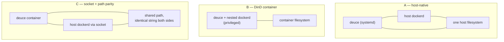

# Self-Hosted VM Deploy and Upgrade Path

## Summary

Ship Deuce's VM deployment as repo artifacts — a production compose file, an env template, and deploy docs — that anyone can run and that the maintainers run as user #1. Upgrading is pull, restart, restart sessions. The container topology is settled by a timeboxed spike rather than picked up front, because the constraint most likely to break it fails silently.

---

## Problem Frame

Deuce has no deployment. The build-and-publish half of the original dogfood plan shipped — a semver tag produces `ghcr.io/forgeutah/deuce:X.Y.Z` and a GitHub Release — but the deploy half never landed, and no deploy workflow has ever existed in the repo's history. Nobody has run Deuce on a VM. The only validated configuration is a local devcontainer.

That gap costs twice. The team can't dogfood a product whose entire thesis is *multiple people in one shared room*, so the premise stays theoretical. And the README's promise to end users — "one-command Docker compose for end users (not just dev)" — has no artifact behind it, so anyone who wants to try Deuce has to reconstruct a dev environment.

The published image compounds it. `Dockerfile` produces a `gcr.io/distroless/static-debian12` runtime containing exactly one file, `/deuce`. But the server shells out to three binaries that aren't in it: `devpod` for every workspace operation (`server/internal/workspace/manager.go`), `docker` for the SSH proxy, SFTP, container-user lookup, and prebuild (`server/internal/sshproxy/docker.go`, `server/internal/workspace/prebuild.go`), and `git` for the files tab (`server/internal/handler/files.go`). `docker run` against the published image boots, migrates, and serves the SPA — then fails on the first session create. The artifact that looks deployable isn't.

Underneath all of it sits a constraint that shapes every option. Deuce does not read workspace files through DevPod. It reads them directly off its own filesystem at `~/.devpod/agent/contexts/<context>/workspaces/<id>/content/` and runs `git` there with `cmd.Dir`, a deliberate design recorded in `docs/solutions/architecture-patterns/devpod-docker-workspace-bind-mount-2026-05-13.md`. Deuce and the Docker daemon it drives must therefore resolve the same path string to the same directory. The local devcontainer satisfies this with a genuine nested daemon — `.devcontainer/docker-compose.yml` runs `privileged: true` with the docker-in-docker feature, and its comment names the reason: to mount workspace paths into child containers "without host/container path mismatches."

---

## Key Decisions

- **Self-host is the shape; the maintainers are user #1.** The deploy path ships in-repo as artifacts an adopter runs, and the project's own instance uses those same artifacts rather than a private pipeline. A deploy path its authors don't exercise is how self-host docs rot, and this closes the standing README roadmap item instead of adding a parallel one.

- **A spike decides the topology, not this document.** Three shapes are viable (below). None has been run on a VM, and the way the wrong one fails — an empty files tab while the agent edits a different directory than the team is looking at — is quiet enough that discovering it in production is expensive. The spike is the first unit of work, with a written decision rule.

- **Workspaces stopping during an upgrade is acceptable.** Sessions live in Postgres and survive; workspace containers may be stopped and restarted by hand afterward. This is an explicit product call, and it is what lets the upgrade stay a container restart instead of an orchestration problem.

- **The reconciler already implements the upgrade's session behavior.** `server/internal/reconcile/reconciler.go` polls container state every ~10s and writes truth into the DB: container absent but on-disk DevPod metadata present becomes `stopped`; no on-disk state at all becomes `missing`. Post-upgrade session recovery needs no new product code. It does mean the deploy's persistence choices are load-bearing — losing DevPod's on-disk state downgrades every session from `stopped` to `missing`.

- **Tailscale Serve is the documented default, not one option among three.** Proxy mode already supports it, the tailnet is the trust boundary so there is no shared secret to manage, and it gives an adopter a safe configuration on day one rather than a decision they are not equipped to make. forge-proxy and exe.dev remain documented alternatives.

- **The prebuild cache-key fix is part of this effort, not a separate one.** It is the only requirement here that changes product code rather than deploy artifacts, and it is tempting to split out. It stays because it is what makes the upgrade story true: without it, upgrading Deuce leaves cached repos starting sessions from previously baked agent tooling, and an adopter debugging that from the outside has almost no chance. The deploy and the fix fail together, so they ship together.

- **Distroless is given up deliberately.** Whichever topology wins, the runtime needs real binaries on `PATH`. The image grows from ~40MB and loses the no-shell posture. That was the right default for an artifact that only served an SPA; it is the wrong default for a process whose job is driving other processes.

### Candidate topologies

The spike chooses among these. The distinguishing question is where the filesystem-namespace boundary falls relative to Deuce and the daemon it drives.

- **A — host-native.** Deuce runs as a systemd unit on the VM; Docker, DevPod, and git are host packages. Namespaces coincide by construction, nothing is privileged, and an upgrade restarts a small process while workspace containers keep running untouched. Costs: assumes a systemd/Debian-ish VM, and needs a raw binary artifact the release workflow deliberately does not publish today.
- **B — DinD container.** Mirrors the devcontainer: a privileged Deuce container running its own daemon. It is the only configuration anyone has seen work, and it is fully self-contained. Costs: privileged; a much larger image; overlayfs-on-overlayfs with a volume over the daemon's storage; and every upgrade necessarily stops every workspace, because restarting the container kills the nested daemon.
- **C — socket mount with path parity.** An unprivileged Deuce container with the host socket mounted and DevPod state bind-mounted at an *identical absolute path* inside and out, so the same string resolves to the same directory on both sides. Workspace containers are host siblings, so an upgrade leaves them running. Costs: parity is a discipline that can be broken silently, and the container's docker gid must match the host's.

The naive variant of C — socket mounted without path parity — is the shape most people reach for first and must not ship. DevPod writes content to a path inside the container while sibling containers bind-mount that same path from the host. Two different directories, one string.

---

## Key Flows

- F1. First-time self-host install
  - **Trigger:** An operator (adopter or maintainer) wants Deuce running on a fresh VM.
  - **Actors:** Operator; the VM; Tailscale.
  - **Steps:**
    1. Operator provisions a VM with Docker available and joins it to their tailnet.
    2. Operator copies `deploy/` from the repo (or a release), copies the env template, and fills in the handful of required values.
    3. Operator brings the stack up with a single documented command.
    4. Deuce runs migrations in-process, refuses to start if they fail, then binds and serves.
    5. Operator exposes it via Tailscale Serve and reaches it at the tailnet hostname; the first sign-in provisions their user from proxy identity headers.
  - **Outcome:** A working Deuce reachable by their team, authenticated, with no secret to rotate.
  - **Covered by:** R1, R2, R3, R11, R12, R13, R14, R17

- F2. Upgrade to a new version
  - **Trigger:** A new Deuce release is published and the operator wants it.
  - **Actors:** Operator; the reconciler.
  - **Steps:**
    1. Operator stops running workspace containers (or accepts that the upgrade stops them).
    2. Operator points the deployment at the new image tag and restarts.
    3. Migrations run in-process before the listener binds; a failure exits non-zero rather than serving a partially-migrated schema.
    4. On boot, the reconciler observes each session's workspace and writes `stopped` where on-disk DevPod state survived.
    5. Operator (or any team member) restarts the sessions they want back, using the existing controls.
  - **Outcome:** New version serving; sessions intact and restartable; no session shows `missing`.
  - **Covered by:** R7, R8, R9, R10, R15, R16

---

## Requirements

**Deploy artifacts**

- R1. A production deployment lives in the repo under `deploy/` and is what both adopters and maintainers use. It is not a private pipeline mirrored by separate docs.
- R2. The deployment stands up Deuce plus Postgres, with database data on a named volume that survives container replacement.
- R3. An env template ships alongside it, listing every variable an operator must set and defaulting the rest to safe values. It is distinct from the dev-oriented `.env.example` at the repo root.
- R4. The deployment names an explicit image tag rather than a floating one, so an upgrade is a deliberate edit and a rollback is the reverse edit.

**Runtime topology**

- R5. Deuce and the Docker daemon it drives resolve DevPod's content paths to the same directory. Whichever topology is chosen must satisfy this, and the deploy artifacts must make it hard to break by accident.
- R6. The runtime image carries `devpod`, `docker`, and `git` on `PATH`, pinned to known versions. (Not applicable if the spike selects the host-native topology, where these are host packages and the docs pin them instead.)

**Upgrade and state persistence**

- R7. An upgrade is a documented sequence an operator can perform without reading source: point at the new tag, restart, restart sessions.
- R8. State that must survive an upgrade is persisted explicitly, not incidentally: Postgres data, DevPod agent state and workspace content, the SSH host key, and — when configured — the devcontainer prebuild cache and the VS Code server cache.
- R9. After an upgrade, sessions whose workspace content survived report `stopped`, not `missing`, and are restartable through the existing controls.
- R10. Migrations run before the listener binds and a failure prevents serving. (Already true in `server/main.go`; stated so the deployment does not undermine it, e.g. by racing multiple app containers.)

**Security defaults**

- R11. The shipped configuration uses proxy auth mode with Tailscale Serve headers, not dev mode.
- R12. A bind-address setting is introduced so an operator can bind loopback only. The server currently binds all interfaces unconditionally, which makes CLAUDE.md's existing "dev mode is localhost-only" guidance impossible to follow.
- R13. The server refuses to start in dev auth mode when bound to a non-loopback address. Existing local and devcontainer setups must keep working unchanged.
- R14. Deploy docs state plainly that dev mode grants any reachable client the ability to act as any user, and that exposing a dev-mode instance is the single most damaging misconfiguration available.

**Release artifacts**

- R15. The devcontainer prebuild cache produces a usable image at all. The spike found it non-functional against DevPod v0.6.15: `devpod build --repository R --skip-push` prints `Successfully build image R:latest` and exits zero, but the tag carries no `devpod-` prefix for `bakedTag()` to parse **and no image is left on the daemon**. Every session silently falls back to a from-scratch build plus an over-SSH tooling install, logging one WARN. Verified with two repositories, one with a `devcontainer.json` and one without.
- R16. Once the cache populates, its key incorporates the inputs to Deuce's own baked layer rather than only DevPod's definition hash, so upgrading Deuce rebuilds the baked tooling instead of reusing a stale image. This was the originally-identified defect; the spike showed it is currently unreachable, since a cache that never populates cannot go stale. It remains real and becomes live the moment R15 is fixed.
- R17. The release publishes `linux/arm64` alongside `linux/amd64`. Common low-cost self-host VMs are ARM, and the binary is statically linked and cross-compiles.

**Documentation**

- R18. Deploy docs cover install, upgrade, rollback, the required VM prerequisites, and what to do when a session comes back `missing`.
- R19. The README's stale claim that the devcontainer "mounts the host Docker socket" is corrected — no such mount exists in the repo; the devcontainer runs a nested daemon.

**First boot**

Both of these were found by standing the deployment up on a real VM. Neither appears on a developer laptop, where the database has accumulated state over time.

- R20. A fresh deployment is usable by its first user without hand-editing the database. On first boot the `users` table is empty and no `team_members` rows exist, and the consequences cascade: every read returns `FORBIDDEN — not a team member`, session listing returns empty despite seeded sessions, newly created sessions get `members: []` because the creator row doesn't exist to be added, and the SSH proxy then rejects every key because it authorizes on session membership. The spike got past this by inserting a user and a membership by hand.
- R21. Configuration expresses "off" in a way that works. The config loader falls back to a field's built-in default when a variable is set-but-empty, so an env file cannot express an empty value at all. `DEUCE_SSH_LISTEN_ADDR=` does not disable the SSH proxy — verified across unset, empty, and explicit values, the listener came up on `:2222` in the first two cases — yet the SSH deployment checklist instructs operators to disable it exactly that way. `DEUCE_WS_ALLOWED_ORIGINS=` silently becomes the localhost dev default, which is the same trap on a security-relevant setting.

---

## Acceptance Examples

- AE1. **Covers R5.** Given a deployment on a fresh VM, when a session is created and its workspace reaches ready, then the files tab lists the repository's real contents and `git status` reflects the same working tree the agent sees. An empty or partial tree indicates the path-parity constraint is violated and the topology is wrong.
- AE2. **Covers R9, R8.** Given a running instance with two active sessions, when the operator upgrades to a new image tag and restarts, then within roughly one reconciler interval both sessions report `stopped`, and restarting either brings back the same workspace content rather than a fresh clone.
- AE3. **Covers R13.** Given `DEUCE_AUTH_MODE=dev` and a bind address that is not loopback, when the server starts, then it exits non-zero with a message naming both the auth mode and the bind address. Given the same dev mode bound to loopback, or the existing devcontainer configuration, then it starts normally.
- AE4. **Covers R15, R16.** Given a repo with a cached baked image and an unchanged `devcontainer.json`, when Deuce is upgraded to a version that bakes a different Pi version, then the next session start rebuilds the baked layer and the workspace runs the new Pi.
- AE5. **Covers R10.** Given an upgrade whose migration fails, when the new container starts, then it exits non-zero and never serves, leaving the operator with a failed start rather than a partially-migrated running instance.
- AE6. **Covers R17.** Given an ARM VM, when the operator follows the install docs unchanged, then the image pulls and runs without an architecture error or emulation.

---

## Success Criteria

- An operator who has never seen the codebase gets from a fresh VM to a reachable, authenticated Deuce by following the deploy doc alone, without reading Go source or asking a maintainer.
- The maintainers' own instance runs the artifacts in `deploy/`. If the adopter path breaks, the maintainers feel it.
- An upgrade takes a couple of minutes of operator attention: change a tag, restart, restart the sessions that matter.
- The spike produces a written decision naming the chosen topology and the evidence that settled it, so the next person to question the shape reads a page instead of re-running the experiment.

---

## Scope Boundaries

- No backups of any kind. Carried forward from the earlier dogfood decision and still accepted; revisit when the database holds something anyone would mourn.
- No zero-downtime, blue-green, or rolling deploys. A short interruption during restart is fine.
- No multi-node, Kubernetes, or managed-Postgres topology. One VM with an on-box database.
- No per-PR preview environments.
- No unattended or auto-upgrade. The operator decides when to move.
- No custom domain or TLS management beyond what the fronting proxy provides.
- No Terraform or other IaC for the VM itself. Provisioned by hand; only the app stack is described in-repo.
- No continuous deployment on merge to `main`. Deployment consumes published release tags.

---

## Dependencies / Assumptions

- The path-parity approach (topology C) is unproven here. It is a known pattern, but nothing in this repo has exercised it, and DevPod may record absolute paths in its own state that behave differently than expected. This is the spike's central risk.
- DevPod's on-disk layout under `~/.devpod/agent/contexts/<context>/workspaces/` is treated as stable enough to persist across upgrades. The existing content-directory env override is the escape hatch if a DevPod release moves it.
- Pi runs inside workspace containers, so restarting Deuce drops the JSONL channel to any in-flight agent run. Agent session continuity across server restarts is unbuilt and unchecked on the README roadmap; in-flight agent work is lost on upgrade regardless of topology.
- Adopters can join a VM to a tailnet. Reasonable for the target audience, and the alternatives are documented, but it is a real prerequisite the install flow depends on.
- The SSH proxy path requires the Deuce process to reach the Docker daemon that owns the workspace containers. This holds under all three candidate topologies but constrains any future split of Deuce from its daemon.
- Whether an operator can be expected to set the host's Docker group id in their env, or whether the deployment should discover it, is unresolved and depends on the topology chosen.

---

## Outstanding Questions

### Resolved

- The topology spike is complete and candidate C — the socket-mounted container with path parity — is adopted. Every check passed on an Ubuntu 24.04 VM: parity held, writes crossed the boundary in both directions, upgrades left workspace containers running untouched, the reconciler reported `stopped` rather than `missing`, and the SSH proxy landed in the container as the devcontainer's `remoteUser`. See `docs/solutions/architecture-patterns/deploy-deuce-as-a-container-sharing-the-host-daemon.md` for the evidence and for the two degradation symptoms that indicate parity or file ownership has been broken later.

### Deferred to Planning

- [Affects R3, R4] Whether the deployment pins a tag in the compose file, in the env file, or both, and how rollback is documented against that choice.
- [Affects R8] Exact persistence surface — which paths become volumes or bind mounts — since it follows directly from the topology the spike selects.
- [Affects R12, R13] Naming and default of the bind-address setting, and whether the dev-mode guard keys on the resolved bind address, an explicit opt-out, or both.
- [Affects R6] How `devpod` and `docker` CLI versions are pinned in the image, and how that pin is kept current.
- [Affects R17] Whether arm64 is built natively or via emulation in the release workflow, and the build-time cost of each.
- [Affects R18] Whether deploy docs live in `README.md`, a dedicated `docs/deploying.md`, or a `deploy/README.md` next to the artifacts.

---

## Sources / Research

- `docs/solutions/architecture-patterns/devpod-docker-workspace-bind-mount-2026-05-13.md` — establishes host-filesystem reads as the workspace data plane, which is what makes path parity load-bearing rather than incidental.
- `docs/brainstorms/2026-05-23-exe-dev-dogfood-deploy-requirements.md` and `docs/plans/2026-05-23-001-feat-exe-dev-dogfood-deploy-plan.md` — the earlier deploy effort, still `status: active`. Its build-and-publish slice shipped as `docs/plans/2026-05-26-001-feat-tag-triggered-release-plan.md`; its deploy-side units never landed and are superseded by this document.
- `.devcontainer/docker-compose.yml` — the only validated runtime configuration, and the source of the path-mismatch rationale.
- `server/internal/reconcile/reconciler.go` — the `stopped` versus `missing` distinction that defines what a successful upgrade preserves.
- `server/internal/workspace/prebuild.go` — `bakedTag()` and the existence check that together produce the stale-agent-tooling bug.
- `.github/workflows/release.yml` — current publish surface: amd64 only, image only, no raw binary.
