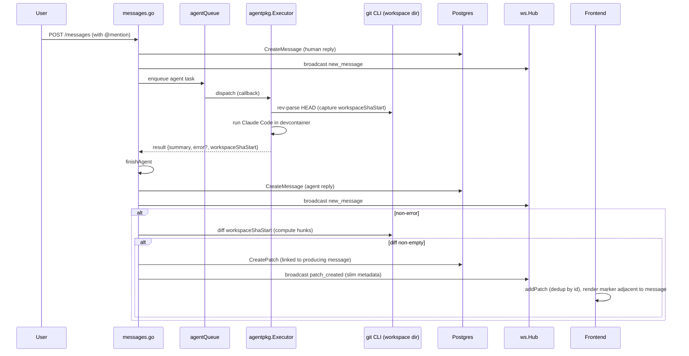

# feat: Patch stream primitive

## Summary

Introduce a `patches` table, sqlc queries, a per-session WebSocket event, and REST endpoints; emit patches at agent-completion time by capturing workspace HEAD when the agent task begins and computing the diff at turn end; render a minimum-viable patch marker in chat anchored to the agent reply that produced it. Backend lands first; frontend integration follows.

---

## Problem Frame

Sessions currently have no first-class representation of a code change. The downstream features the team wants (Changes view, hunk threads, PR derivation, plan-step linking) all consume the same underlying object — "a coherent change to the workspace, by this actor, at this point in time." Building each downstream feature against its own ad-hoc representation would fracture the team's mental model and force re-design later. Full motivation in [docs/brainstorms/2026-05-14-patch-stream-primitive-requirements.md](../brainstorms/2026-05-14-patch-stream-primitive-requirements.md).

Plan-time discovery worth flagging: the brainstorm assumed today's agents were the simulated/canned implementation described in `CLAUDE.md`. Phase 1 research found that the simulated handler has been replaced with a real Claude Code executor that already runs inside the devcontainer. The natural turn-end hook for patch emission is the existing agent-completion path, not a simulated stub. This plan wires emission into the real path; seed data becomes supplemental for development rather than the primary v0 producer.

---

## Requirements

R-IDs match origin. Some have plan-time extensions or refinements noted inline (R2, R11, R12) and traced back to Key Technical Decisions; the rest are carried unchanged.

**Storage and shape**
- R1. Patches stored in a dedicated table, not embedded in messages or activity items.
- R2. Each patch carries: identifier, session, workspace HEAD captured at turn start, origin type (agent / human / system), unified-diff hunks, timestamps. Plan extension: also `producing_message_id` (nullable) to anchor the chat marker to the producing reply, and derived `file_count` / `hunk_count` for cheap marker rendering (see Key Technical Decisions).
- R3. Each patch carries a nullable supersession link to a prior patch.
- R4. Each patch carries a nullable promotion flag (set when promoted to a git commit; null until then). Implementation note: stored as `committed_sha TEXT NULL` — null when unpromoted, the commit SHA itself when promoted. This satisfies R4's flag semantics (presence = promoted) and additionally records *which* commit, which the future PR-derivation brainstorm will need.
- R5. Hunks travel as standard unified-diff data; no severity/grouping/intent tags computed at patch time.

**Lifecycle**
- R6. A patch is created at turn end against the workspace HEAD captured at turn start. Empty change sets do not produce a patch.
- R7. The supersession link is producer-set; the system does not infer it.
- R8. Patches are append-only after write.

**Staleness**
- R9. Stale = HEAD has moved past the patch's parent and no supersession chain bridges them. Derivable; not stored.

**Broadcast**
- R10. New patches broadcast on the existing per-session WebSocket subscription as a new event type.
- R11. Broadcast payload contains enough information for the v0 chat marker to render and route. Plan refinement (see Key Technical Decisions): full hunks fetched on demand via REST rather than rehydrated from broadcast.

**Producers**
- R12. Real agent completion path is the v0 producer. Seed data includes representative patches sufficient to exercise rendering and broadcast.
- R13. The patch-emission helper is documented in code as the contract any future producer (autonomous agents, system-origin paths, human FS-watch) plugs into.

**Demonstration UI**
- R14. The chat surface renders a minimum marker when a patch lands: file count, hunk count, origin badge, supersession indicator. The full Changes view is out of scope.

**Origin actors:** A1 (Agent in-session), A2 (Human teammate — observer-only in v0), A3 (System — origin type only, no v0 producer), A4 (Downstream UI consumer), A5 (Future feature consumers — design hook only).
**Origin flows:** F1 (Per-turn agent emission), F2 (Re-prompt produces superseding patch), F3 (Stale patch detection — consumer-side derivation).
**Origin acceptance examples:** AE1 (R6, R10), AE2 (R6), AE3 (R3, R7), AE4 (R9), AE5 (R8), AE6 (R12).

---

## Scope Boundaries

Carried from origin Scope Boundaries unchanged. Each item below is a deliberate non-goal for this plan.

- The Changes view UI (idea #2 from upstream ideation) — separate brainstorm; consumes this primitive.
- Hunk-anchored threads (idea #4) — separate brainstorm; depends on this primitive plus a threading feature.
- Intent-only edits / re-prompt ergonomics (idea #3) — separate brainstorm; uses the supersession link but does not shape the primitive.
- PR header strip and PR derivation from a contiguous patch range (idea #5) — separate brainstorm; the deferred promotion flag (R4) is the v0 hook.
- Plan-step ↔ patch linking (idea #7) — separate brainstorm.
- Parity-by-build CI lint (idea #6) — separate brainstorm.
- Severity, grouping, intent tags computed at patch time — render-layer; defer until a consumer needs them.
- Time-travel scrubber, agent replay, cross-session patch indexing — speculative consumers; defer.
- Threading on messages — separate feature.
- Human FS-watch producer for local IDE edits — deferred to the intent-only-edits brainstorm.
- Producer code paths for the system origin type (git pulls, CI commits picked up later) — origin type exists in v0 so consumers don't need revision later, but no producer for them ships.

---

## Context & Research

### Relevant Code and Patterns

- End-to-end "add a sqlc-backed entity" walk: migration → query SQL → `make generate` → handler with snake↔camel re-mapping → route registration. Cleanest minimal example is the `activity_items` entity — see [server/internal/db/migrations/001_initial_schema.sql](../../server/internal/db/migrations/001_initial_schema.sql), [server/internal/db/queries/activities.sql](../../server/internal/db/queries/activities.sql), [server/internal/handler/activities.go](../../server/internal/handler/activities.go).
- WebSocket event broadcast: constants in [server/internal/ws/events.go](../../server/internal/ws/events.go), envelope helper `ws.NewServerMessage`, broadcast via `h.hub.BroadcastToSession(sessionID, msg, excludeClient)` from [server/internal/ws/hub.go](../../server/internal/ws/hub.go). Existing call-site templates: `new_message` and `agent_status` in [server/internal/handler/messages.go](../../server/internal/handler/messages.go).
- Real-agent completion path: `finishAgent` in [server/internal/handler/messages.go](../../server/internal/handler/messages.go) is the natural turn-end hook. It already persists the agent reply, broadcasts `new_message`, updates `session_agents.status`, broadcasts `agent_status`, and creates an `activity_items` row. Patch persistence + `patch_created` broadcast slot in here.
- Workspace path resolution: `workspaceContentPath` helper in [server/internal/handler/files.go](../../server/internal/handler/files.go) (governed by `DEVPOD_AGENT_CONTENT_DIR` env var). Reuse rather than re-derive — see Institutional Learnings below.
- Frontend WS dispatch: switch over `msg.type` in [src/hooks/use-websocket.ts](../../src/hooks/use-websocket.ts), one case per event type with snake↔camel normalization, then call typed Zustand action.
- Frontend ID-dedup discipline in [src/stores/session-store.ts](../../src/stores/session-store.ts): `addX` actions check `current.some(x => x.id === incoming.id)` to handle the REST/WS race.
- Seed convention: hardcoded UUIDs with deterministic prefixes (agents `00…`, users `10…`, teams `20…`, projects `30…`, sessions `40…`) in [server/internal/db/migrations/002_seed_data.sql](../../server/internal/db/migrations/002_seed_data.sql). Patches will use `50…`.
- shadcn/ui "new-york" style + Lucide icons + agent role colors from `Agent.color` already on the type. Tailwind v4 CSS-first config in [src/styles/globals.css](../../src/styles/globals.css).

### Institutional Learnings

- [docs/solutions/architecture-patterns/devpod-docker-workspace-bind-mount-2026-05-13.md](../solutions/architecture-patterns/devpod-docker-workspace-bind-mount-2026-05-13.md) — read DevPod docker workspaces from the host filesystem via the bind mount, not via `devpod ssh`. For git operations, use `exec.CommandContext("git", ...)` with `cmd.Dir = workspaceContentPath(...)`. Apply `filepath.EvalSymlinks` plus prefix check before reading file content (relevant only if patch endpoints later return before/after blobs — out of scope here, but the pattern matters for U4).

### External References

- None — local codebase patterns were sufficient and the topic is not high-risk enough to warrant external research.

---

## Key Technical Decisions

- **Producer is the existing real-agent completion path, not a simulated handler.** Brainstorm scoped real-agent integration as deferred under the assumption that today's agents were canned/simulated. Phase 1 research found the simulated handler has been replaced with a real Claude Code executor running in the devcontainer; the natural turn-end hook is already there. Wiring into it now means the primitive is real day-one. Rationale: lower total cost (no throwaway simulated emitter), real test surfaces, brainstorm Scope Boundary on "real-agent integration code" reinterpreted as "we are not modifying the executor itself, only adding a side-effect at its completion point."
- **Patches link explicitly to the producing message via a new `producing_message_id` column.** The brainstorm's R2 column list does not include this; this plan adds it as an extension. Without the explicit link, the chat marker has to render strictly by `created_at` and may visually drift from its producing reply. With the link, the marker can render adjacent to the agent message that produced it. The column is nullable to preserve A3 (system) and future A2 (human) origin paths that have no producing message.
- **Broadcast carries slim metadata; full hunks fetched on demand via REST.** Brainstorm R11 reads "enough to render and route without an additional fetch" strictly; in practice the WS send buffer is bounded (256-message capacity defined in [server/internal/ws/client.go](../../server/internal/ws/client.go); full-buffer drop logic in [server/internal/ws/hub.go](../../server/internal/ws/hub.go)) and large hunk payloads risk silent drops. Slim metadata (id, origin, file_count, hunk_count, parent_patch_id, workspace_sha, producing_message_id, created_at) covers what the v0 marker needs. The full hunks endpoint (`GET /api/sessions/{id}/patches/{patchId}`) serves the future Changes view.
- **Add derived `file_count` and `hunk_count` columns to the patches table.** Computed at write time so the marker render path doesn't have to parse JSONB on every render. Cheap to maintain; cleanly avoids the "parse JSONB to count files" cost on the hot path.
- **Workspace HEAD captured when the agent task begins execution** (inside the executor goroutine, just before the agent runs), not at message-send time. Queue delays could otherwise produce a stale "captured HEAD" if other work commits between message receipt and agent dispatch.
- **Origin types stored as a `TEXT NOT NULL` column with a `CHECK` constraint** for the agent / human / system enum. Matches Postgres-idiomatic enum-as-text-with-check used elsewhere in the schema (origin migration uses TEXT for status fields).
- **Empty-diff suppression at emission, not at storage.** R6 says "if the change set is empty, no patch is emitted." Enforced in the emission helper by a length check on the diff output before persistence — the table has no concept of "empty patch" rows.
- **Reuse `workspaceContentPath` from [server/internal/handler/files.go](../../server/internal/handler/files.go) for git operations**; do not introduce a parallel resolver. Honors the bind-mount learning's single-resolver discipline so `DEVPOD_AGENT_CONTENT_DIR` overrides land in one place.
- **`activity_update` is not double-broadcast for patches.** The existing `finishAgent` already creates an `activity_items` row but does not broadcast `activity_update` (the event type is declared in `events.go` but never emitted). The patch path adds its own `patch_created` broadcast and does not expand the activity contract.

---

## Open Questions

### Resolved During Planning

- **Where does emission integrate?** → `finishAgent` in [server/internal/handler/messages.go](../../server/internal/handler/messages.go), guarded by `!isError` so cancelled or failed turns produce no patch.
- **How is workspace HEAD captured?** → `git rev-parse HEAD` via `exec.CommandContext` with `cmd.Dir = workspaceContentPath(...)` at agent task start; SHA threaded through to the executor result and read at `finishAgent` time.
- **Diff format on the wire and in storage?** → Standard unified diff, parsed into a structured hunks shape (file path, old/new line ranges, hunk lines) and stored as JSONB. No rename detection in v0 — `git diff` defaults are sufficient.
- **Where do patches anchor in the chat?** → Adjacent to their producing message via `producing_message_id`. Frontend renders the chat as a single time-ordered list where each agent message may be followed by its patch marker.
- **What event name?** → `patch_created` (snake_case per existing convention).

### Deferred to Implementation

- Exact JSONB hunk shape — settle when writing the diff parser. Direction: `[{file, hunks: [{oldStart, oldLines, newStart, newLines, lines: [...]}]}]`.
- Whether `git diff` is invoked once per turn against the captured SHA or via `git status --porcelain` first then a targeted diff — implementer's call based on ergonomics; both produce the same hunks output.
- Exact wording / iconography of the chat marker (file/hunk counts, origin badge color, supersession glyph) — design call during U8.
- Whether the patches REST list endpoint paginates in v0 — defer until consumer demand exists; v0 returns the full session list ordered by `created_at DESC`.
- Goose binary availability — verify `which goose` succeeds in the devcontainer before running U1; not in `go.mod` but expected on PATH.

---

## High-Level Technical Design

> *This illustrates the intended approach and is directional guidance for review, not implementation specification. The implementing agent should treat it as context, not code to reproduce.*

**Note on supersession (F2 from origin).** The diagram above shows a single turn for clarity. Re-prompts produce a v2 patch by the same path; the producer (currently the executor wrapper) is responsible for setting `parent_patch_id` to the patch the user's reply was iterating on. v0 sets `parent_patch_id` from a hint passed alongside the agent task; the precise mechanism for "which prior patch was the user iterating on" is out of scope for this plan and lives in the future intent-only-edits brainstorm.

---

## Implementation Units

### U1. Patches table migration

**Goal:** Create the `patches` table with all columns, constraints, and indexes.

**Requirements:** R1, R2, R3, R4, R5

**Dependencies:** None.

**Files:**
- Create: `server/internal/db/migrations/006_create_patches.sql`

**Approach:**
- New goose migration following the additive convention used by 003/004/005.
- Columns: `id UUID PRIMARY KEY DEFAULT gen_random_uuid()`, `session_id UUID NOT NULL REFERENCES sessions(id) ON DELETE CASCADE`, `producing_message_id UUID NULL REFERENCES messages(id) ON DELETE SET NULL`, `parent_patch_id UUID NULL REFERENCES patches(id) ON DELETE SET NULL`, `origin_type TEXT NOT NULL CHECK (origin_type IN ('agent','human','system'))`, `workspace_sha TEXT NOT NULL`, `committed_sha TEXT NULL`, `hunks JSONB NOT NULL`, `file_count INT NOT NULL`, `hunk_count INT NOT NULL`, `created_at TIMESTAMPTZ NOT NULL DEFAULT now()`.
- Indexes: `(session_id, created_at DESC)` for the per-session list; `(parent_patch_id)` to walk supersession chains.
- `-- +goose Down`: `DROP TABLE IF EXISTS patches;`.

**Patterns to follow:**
- [server/internal/db/migrations/001_initial_schema.sql](../../server/internal/db/migrations/001_initial_schema.sql) for column conventions, `ON DELETE CASCADE`, composite `(session_id, created_at DESC)` index.

**Test scenarios:**
- Test expectation: none -- pure schema, no behavioral change. Verification covers it.

**Verification:**
- `cd server && make migrate` succeeds without error.
- `\d patches` in psql shows all columns, FK constraints, and indexes.
- `make migrate-down` rolls back cleanly.

---

### U2. sqlc queries for patches

**Goal:** Provide the Go query API for creating and reading patches.

**Requirements:** R1, R2, R3, R4, R8

**Dependencies:** U1.

**Files:**
- Create: `server/internal/db/queries/patches.sql`
- Generated (do not hand-edit): `server/internal/db/patches.sql.go`, `server/internal/db/models.go` (regenerated)

**Approach:**
- Three queries: `CreatePatch :one` (insert all columns, RETURNING `*`), `ListPatchesBySession :many` (filter by `session_id`, order by `created_at DESC`, optional limit param), `GetPatchByID :one` (lookup by id; returns `pgx.ErrNoRows` for missing).
- Nullable columns map to `pgtype.UUID` / `pgtype.Text` per existing convention (see how `Agent.DeletedAt` and `ActivityItem.AgentID` are generated).
- After SQL is written, run `cd server && make generate`.

**Patterns to follow:**
- [server/internal/db/queries/activities.sql](../../server/internal/db/queries/activities.sql) and [server/internal/db/queries/messages.sql](../../server/internal/db/queries/messages.sql) for query naming, return shape, `RETURNING *` discipline.
- [server/sqlc.yaml](../../server/sqlc.yaml) for generation config (no changes needed).

**Test scenarios:**
- Happy path: `CreatePatch` with all required fields plus `parent_patch_id = NULL` and `committed_sha = NULL` returns the inserted row with a generated `id` and `created_at`.
- Happy path: `CreatePatch` with `parent_patch_id` set to an existing patch ID returns the row with the link populated.
- Happy path: `ListPatchesBySession` returns patches for the session ordered newest-first; returns empty slice for a session with no patches.
- Edge case: `GetPatchByID` returns `pgx.ErrNoRows` for an unknown UUID.
- Integration: deleting a session cascades to delete its patches (FK behavior); deleting a producing message sets `producing_message_id` to NULL on the patch (FK behavior).
- **Covers AE5.** Inserting a patch with `parent_patch_id` set to an existing patch leaves the existing patch's row untouched (immutability check).

**Verification:**
- `make generate` produces the expected `patches.sql.go` with `CreatePatch`, `ListPatchesBySession`, `GetPatchByID` methods.
- `go test ./internal/db/...` passes (or the project's existing query test target).

---

### U3. WebSocket event type and REST handler scaffolding

**Goal:** Register the `patch_created` WS event constant and the patches REST handler with two endpoints.

**Requirements:** R10, R11

**Dependencies:** U2.

**Files:**
- Modify: `server/internal/ws/events.go` (add constant `TypePatchCreated = "patch_created"`)
- Create: `server/internal/handler/patches.go` (handler struct, `ListPatches`, `GetPatch`, `toPatchResponse`)
- Modify: `server/internal/server/server.go` (register `r.Get("/patches", h.ListPatches)` and `r.Get("/patches/{patchID}", h.GetPatch)` under the existing `/api/sessions/{sessionID}` route group; wire patches handler into the handler aggregator)

**Approach:**
- `patchResponse` struct with **camelCase JSON tags** matches the slim broadcast payload by default (id, sessionId, producingMessageId, parentPatchId, originType, workspaceSha, committedSha, fileCount, hunkCount, createdAt). `GetPatch` returns the same struct plus a `hunks` field carrying the decoded JSONB.
- `toPatchResponse(db.Patch)` maps `pgtype.UUID`/`pgtype.Text` to `*uuid.UUID` / `*string` and decodes `hunks []byte` into a `json.RawMessage` for transport.
- Use `writeJSON` and `writeError` helpers; return `INVALID_SESSION_ID` / `INVALID_PATCH_ID` / `PATCH_NOT_FOUND` codes per CLAUDE.md error shape.

**Patterns to follow:**
- [server/internal/handler/activities.go](../../server/internal/handler/activities.go) for the simplest list-by-session handler shape.
- [server/internal/handler/messages.go](../../server/internal/handler/messages.go) `messageResponse` struct for camelCase tag discipline and JSONB-to-`json.RawMessage` mapping.
- [server/internal/server/server.go](../../server/internal/server/server.go) lines 91–105 for route placement.

**Test scenarios:**
- Happy path: `GET /api/sessions/{id}/patches` returns a JSON array of `patchResponse` objects ordered newest-first.
- Happy path: `GET /api/sessions/{id}/patches/{patchID}` returns a single `patchResponse` with `hunks` field populated.
- Edge case: `GET .../patches` for a session with no patches returns `[]`, not `null`.
- Error path: invalid UUID in URL → 400 with `INVALID_SESSION_ID` or `INVALID_PATCH_ID`.
- Error path: unknown patch UUID → 404 with `PATCH_NOT_FOUND`.
- Edge case: `toPatchResponse` correctly maps `pgtype.UUID{Valid: false}` to `null` in JSON output (verify via marshaled bytes for `parentPatchId` and `producingMessageId`).

**Verification:**
- `curl http://localhost:8080/api/sessions/{seedSessionId}/patches` returns the expected JSON shape after seed data lands (U7).

---

### U4. Workspace git helper: HEAD capture and diff

**Goal:** Provide a small package that captures workspace HEAD and computes a unified diff against a captured SHA, both running against the host bind-mount path.

**Requirements:** R6, R9

**Dependencies:** None (standalone helper).

**Files:**
- Create: `server/internal/workspacegit/workspacegit.go` — exposes `CaptureHead(ctx, workspaceID) (sha string, err error)` and `DiffSince(ctx, workspaceID, sha) (hunks []FileHunks, fileCount, hunkCount int, err error)`.
- Create: `server/internal/workspacegit/workspacegit_test.go`

**Approach:**
- Use `exec.CommandContext("git", "rev-parse", "HEAD")` and `exec.CommandContext("git", "diff", "--no-color", "--unified=3", sha)` with `cmd.Dir` set via the existing `workspaceContentPath` helper exported (or moved if needed) from [server/internal/handler/files.go](../../server/internal/handler/files.go).
- Parse the unified-diff output into a `[]FileHunks` shape: `{ Path string, Hunks []Hunk }` where `Hunk` is `{ OldStart, OldLines, NewStart, NewLines int, Lines []string }`. A small parser is sufficient — no third-party dependency needed for v0.
- `WORKSPACE_NOT_FOUND` error class returned when the resolved path doesn't `os.Stat`; surfaces as 404 if reached from a handler later (not used in v0 emission since the emission caller already knows the workspace exists).

**Execution note:** Implement test-first — the unified-diff parser is the only nontrivial logic in this unit and benefits from a tight red/green loop.

**Patterns to follow:**
- [server/internal/handler/files.go](../../server/internal/handler/files.go) for `workspaceContentPath` and the `git status --porcelain` invocation pattern (same `cmd.Dir`, no SSH).

**Test scenarios:**
- Happy path: `CaptureHead` against a temp git repo with a known initial commit returns the expected SHA.
- Happy path: `DiffSince` after modifying one file returns one `FileHunks` entry with one hunk; `fileCount = 1`, `hunkCount = 1`.
- Happy path: `DiffSince` after modifying two files with two hunks each returns the expected counts.
- Edge case: `DiffSince` with no working-tree changes returns an empty slice and zero counts.
- Edge case: `DiffSince` correctly handles a hunk at the very start of a file (oldStart = 0 / 1 boundary handling depends on git's output).
- Edge case: `DiffSince` correctly handles a file added (no old lines) and a file deleted (no new lines).
- Error path: `CaptureHead` against a non-git directory returns an error.
- Error path: `CaptureHead` against a missing workspace path returns `WORKSPACE_NOT_FOUND`.

**Verification:**
- `go test ./internal/workspacegit/...` passes.
- Manual: from a real session, run a workspace edit and confirm the helper produces the expected hunks.

---

### U5. Patch emission integrated into agent completion

**Goal:** Capture workspace HEAD when the agent task begins; at agent completion, compute the diff, persist a patch (when non-empty), and broadcast the slim `patch_created` event.

**Requirements:** R6, R7, R10, R11, R12, R13

**Dependencies:** U2, U3, U4.

**Files:**
- Modify: `server/internal/handler/messages.go` (extend the agent-task callback path to capture HEAD before execution, thread the captured SHA through `agentpkg.Result`, emit a patch in `finishAgent` when non-error and diff non-empty, broadcast `patch_created`)
- Modify: `server/internal/agent/output.go` and `server/internal/agent/executor.go` (or equivalent — extend `Result` to carry `WorkspaceShaStart string`; capture it just before invoking Claude Code)
- Test: `server/internal/handler/messages_test.go` (add patch-emission scenarios) — create the file if it doesn't exist using existing handler test conventions.

**Approach:**
- In the executor: just before running Claude Code, call `workspacegit.CaptureHead(ctx, workspaceID)` and store the SHA on the result struct.
- In `finishAgent`: when `!isError`, call `workspacegit.DiffSince(ctx, workspaceID, result.WorkspaceShaStart)`. If `fileCount == 0`, skip patch emission (R6). Otherwise call `q.CreatePatch(...)` with: `session_id`, `producing_message_id` = the agent reply message just persisted, `parent_patch_id` = nullable hint passed in from the request (default null in v0; the intent-only-edits brainstorm will define how this is set), `origin_type = 'agent'`, `workspace_sha = result.WorkspaceShaStart`, `hunks` (marshaled), `file_count`, `hunk_count`. Then `ws.NewServerMessage(ws.TypePatchCreated, sessionID, slimPayload)` and `h.hub.BroadcastToSession(sessionID, msg, nil)`.
- The slim broadcast payload mirrors `patchResponse` minus `hunks`. Helper `toSlimPatchPayload(db.Patch) slimPatchPayload` lives next to `toPatchResponse` in `server/internal/handler/patches.go` and is called from `messages.go`.
- Document the emission helper as the producer contract (a paragraph above `emitPatch` or in a top-of-file comment) per R13.

**Patterns to follow:**
- [server/internal/handler/messages.go](../../server/internal/handler/messages.go) `finishAgent` for create-then-broadcast pattern; the existing `agent_status` and `new_message` broadcasts are the templates.
- The cancelled-turn path (`result.Error == "cancelled"`) is already guarded by `!isError` semantics in `finishAgent` — patch emission inherits that guard.

**Test scenarios:**
- **Covers AE1.** Happy path: an agent turn that writes one file produces one row in `patches`, sets `producing_message_id` to the agent reply, and broadcasts a `patch_created` envelope on the session subscription.
- **Covers AE2.** Edge case: an agent turn that returns a no-op (no file changes) produces no row and no broadcast.
- **Covers AE3.** Happy path: when `parent_patch_id` is supplied via the producer hint, the persisted row carries the link and the broadcast envelope includes it.
- Edge case: agent turn that fails (`isError = true`) produces no patch, even if the workspace has uncommitted changes from a prior turn.
- Edge case: `/stop` cancellation produces no patch (already covered by the `isError` guard; verify explicitly).
- Integration: a sequence of two agent turns, both producing patches, results in two `patches` rows ordered correctly by `created_at`, with each broadcast received by a subscribed test client.
- Error path: `workspacegit.DiffSince` returning an error logs and skips patch emission without failing the agent reply (the reply is already persisted before the diff runs).

**Verification:**
- Manual: trigger an @mention to an agent in a real session, confirm via psql that a `patches` row was created and via browser devtools that the WS frame arrived.
- `go test ./internal/handler/...` passes including the new patch-emission scenarios.

---

### U6. Seed patches

**Goal:** Provide representative patches in seed data — including a supersession chain — sufficient to exercise the rendering, broadcast, and stale-detection paths during development.

**Requirements:** R12

**Dependencies:** U1.

**Files:**
- Create: `server/internal/db/migrations/007_seed_patches.sql`

**Approach:**
- Goose migration with `INSERT` rows using deterministic UUIDs prefixed `50000000-...`.
- At least three patches against the existing seeded session (id `40000000-...`):
  - Patch v1: a small change to a single file (file_count=1, hunk_count=1), `parent_patch_id = NULL`.
  - Patch v2: supersedes v1, touches the same file with a refined hunk, `parent_patch_id = <v1>`.
  - Patch v3: independent change to a different file, `parent_patch_id = NULL`.
- `producing_message_id` values reference the existing seeded agent reply messages (look up the seeded UUIDs in [server/internal/db/migrations/002_seed_data.sql](../../server/internal/db/migrations/002_seed_data.sql)).
- `workspace_sha` values use plausible-looking 40-char hex strings (e.g., `abc1230000000000000000000000000000000000`).
- `hunks` JSONB literals follow the structured shape decided in U4. Keep them small and human-readable.
- `created_at` uses `now() - interval 'N minute'` so the order is stable and the seed reflects realistic timing.
- `-- +goose Down`: `DELETE FROM patches WHERE id IN (...)`.

**Patterns to follow:**
- [server/internal/db/migrations/002_seed_data.sql](../../server/internal/db/migrations/002_seed_data.sql) for seed conventions, deterministic UUIDs, and `now() - interval` timestamps.

**Test scenarios:**
- Test expectation: none -- data only. Verification covers it.

**Verification:**
- **Covers AE6.** After `make migrate`, `SELECT count(*) FROM patches WHERE session_id = '40000000-…'` returns at least 3.
- `SELECT id FROM patches WHERE parent_patch_id IS NOT NULL` returns the v2 patch.
- A fresh frontend load of the seeded session shows the three patch markers in chat at the expected positions.

---

### U7. Frontend types, API wrapper, store, and WS handler

**Goal:** Mirror the backend shape on the client; receive `patch_created` over WS; expose patches in the store with ID dedup; provide REST helpers.

**Requirements:** R10, R11

**Dependencies:** U3 (WS event constant + REST endpoints).

**Files:**
- Modify: `src/types/index.ts` (add `Patch`, `PatchOrigin`, `PatchHunkFile`, `PatchHunk` types matching the backend response + slim broadcast shape)
- Modify: `src/lib/api.ts` (add `patches.list(sessionId)`, `patches.get(sessionId, patchId)`)
- Modify: `src/stores/session-store.ts` (add `patches: Record<string, Patch[]>`, `setPatches`, `addPatch` with `id`-dedup matching the existing `addMessage` pattern; lazy-load on session activation)
- Modify: `src/hooks/use-websocket.ts` (handle `case "patch_created"`: normalize snake→camel for the slim payload, dispatch `addPatch`)

**Approach:**
- `Patch` type matches `patchResponse` from U3. The slim WS payload is a subset (no `hunks`); the type system can model this either as `Patch` with `hunks?: PatchHunkFile[]` or as `PatchSummary` and `Patch extends PatchSummary` with `hunks` required. Pick whichever is cleaner during implementation; informal preference is `hunks?: …` to keep one type.
- The WS payload uses the same slim shape; the lazy REST load on session-activation calls `patches.list` to backfill any patches that landed before subscription.
- Dedup discipline: `addPatch` returns early if `current.some(p => p.id === incoming.id)`.

**Patterns to follow:**
- [src/types/index.ts](../../src/types/index.ts) for type-naming and shared-type discipline.
- [src/lib/api.ts](../../src/lib/api.ts) for the `request<T>` wrapper and namespaced `api.x.y` shape.
- [src/stores/session-store.ts](../../src/stores/session-store.ts) `addMessage` and `setMessages` for the lazy-load + dedup pattern.
- [src/hooks/use-websocket.ts](../../src/hooks/use-websocket.ts) `case "new_message"` for the snake→camel normalization recipe.

**Test scenarios:**
- Happy path: `addPatch` appends a new patch to `patches[sessionId]`.
- Edge case: `addPatch` called twice with the same `id` results in one entry (dedup).
- Happy path: `setPatches` replaces the array for the given session.
- Happy path: WS handler receives a `patch_created` envelope with a snake_case payload, normalizes the keys, and calls `addPatch` with a camelCase `Patch`.
- Integration: a session activation triggers `patches.list`, populates the store via `setPatches`, and a subsequent `patch_created` WS event for the same patch ID is deduped (REST/WS race coverage).

**Verification:**
- `npx tsc --noEmit` passes.
- `npm run lint` passes.
- Manual: open a seeded session in the browser, confirm `patches[sessionId]` populates in the Zustand store devtools and a synthetic WS event (via dev server) updates it.

---

### U8. Chat marker component

**Goal:** Render a minimum-viable patch marker in chat, anchored to the producing agent message, showing file count, hunk count, origin, and a supersession indicator when applicable.

**Requirements:** R14

**Dependencies:** U7.

**Files:**
- Create: `src/components/chat/PatchMarker.tsx`
- Modify: `src/components/chat/ChatView.tsx` (interleave `<PatchMarker />` next to the message it belongs to, looked up via `producing_message_id`)
- Test: `src/components/chat/PatchMarker.test.tsx` (or wherever the project's component tests live; check for existing `*.test.tsx` convention before creating)

**Approach:**
- `PatchMarker` is a small read-only component: file/hunk counts, an origin badge (color from the producing agent's `Agent.color` for `origin = 'agent'`; neutral colors for `human` / `system`), an icon (Lucide `GitCommitHorizontal` or `FileDiff`), and a small "supersedes v…" caption when `parentPatchId != null`.
- In `ChatView`, render messages as today and after each agent message check `patches[sessionId]` for any whose `producingMessageId` equals the message id; render those markers immediately after.
- Style: dark-mode tokens from [src/styles/globals.css](../../src/styles/globals.css), shadcn/ui card or simple bordered div — keep it visually quiet so the marker reads as audit-log breadcrumb, not a hero element.
- Click behavior: out of scope (no Changes view to navigate to). Marker is purely informational in v0.

**Patterns to follow:**
- [src/components/chat/ChatView.tsx](../../src/components/chat/ChatView.tsx) for message rendering shape, `MessageBubble` placement, and how `expandableContent` toggles render today (for visual quietness reference).
- shadcn/ui "new-york" component conventions per [components.json](../../components.json).

**Test scenarios:**
- Happy path: renders given a patch with `originType: 'agent'`, `fileCount: 2`, `hunkCount: 5`, `parentPatchId: null` — shows "2 files, 5 hunks" (or the chosen wording), agent-color badge, no supersession caption.
- Happy path: renders supersession caption when `parentPatchId` is set.
- Edge case: renders neutral badge when `originType` is `'human'` or `'system'`.
- Integration: in `ChatView`, a patch with `producingMessageId = M1` renders adjacent to message M1 and not adjacent to message M2.
- Edge case: a patch whose `producingMessageId` does not match any loaded message renders at the chronological position determined by `createdAt` (fallback rendering, not orphaned).

**Verification:**
- `npm run dev` and `npm run build` succeed.
- Manual: open the seeded session, confirm three markers render at the expected positions (next to seeded agent replies), with the v2 marker showing the supersession caption.

---

## System-Wide Impact

- **Interaction graph:** patches join messages and activity items as session-scoped append-only logs. The agent-completion path now writes to one more table and emits one more WS event per non-empty turn. No cross-session interactions.
- **Error propagation:** patch emission is best-effort within the agent path — a diff or persistence failure is logged and does not fail the agent reply (which is already persisted by the time emission runs). This preserves the user-visible agent completion semantics; failed patches surface as a missing marker in chat plus a server log line.
- **State lifecycle risks:** the REST/WS race for patch arrival is handled by the same ID-dedup discipline used for messages and activities. The lazy `patches.list` on session-activation is the backfill path.
- **API surface parity:** patches endpoints follow the same `r.Route("/api/sessions/{sessionID}", …)` shape as messages and activities; the WS event uses the same per-session subscription model. No new subscription primitive.
- **Integration coverage:** the seam most worth integration-testing is the agent-completion → diff → persist → broadcast path (U5). Unit tests on U2 (queries) and U4 (git helper) prove the parts; U5's tests prove the wiring.
- **Unchanged invariants:** message persistence and broadcast in `finishAgent` are unchanged in semantics — the agent reply still lands and broadcasts whether or not the diff succeeds. Activity items continue to be created and remain REST-only (no `activity_update` broadcast added). The simulated/canned-response path described in CLAUDE.md no longer matches the code (separate doc-fix; out of scope here).

---

## Risks & Dependencies

| Risk | Mitigation |
|------|------------|
| WS send buffer (256-message capacity in [server/internal/ws/client.go](../../server/internal/ws/client.go), drop-on-full select-default in [server/internal/ws/hub.go](../../server/internal/ws/hub.go)) drops `patch_created` envelopes during bursty agent activity. | Slim broadcast payload (KTD #3) keeps frames small; subscribers backfill via `patches.list` on session activation. |
| `git diff` against a captured SHA produces unexpected output if the workspace SHA moved during the turn (e.g., the agent ran `git reset` mid-turn). | Treat the diff as authoritative for whatever the working tree shows now relative to `workspaceShaStart`. If this surfaces real issues in practice, escalate to the intent-only-edits brainstorm where the supersession model is defined. |
| `producing_message_id` becomes stale if the producing message is deleted (FK `ON DELETE SET NULL`). | Marker falls back to chronological positioning; treat orphaned markers as a render-layer concern. |
| Goose binary not on PATH in some dev environments. | Surface as a `make migrate` failure with the existing error; document `which goose` check in Open Questions → Deferred. |
| `agentpkg.Result` extension to carry `WorkspaceShaStart` ripples through any callers that construct `Result` directly. | Audit callers during U5; keep the field at the end of the struct so positional construction (if any) breaks visibly rather than silently. |
| Real-agent integration is implicit in this plan's producer choice; if the executor's lifecycle changes (e.g., a future autonomous-mode change), the HEAD-capture insertion point may need to move. | Document the emission helper as the producer contract (R13) in code so future executor refactors have a clear extension point. |

---

## Sources & References

- **Origin document:** [docs/brainstorms/2026-05-14-patch-stream-primitive-requirements.md](../brainstorms/2026-05-14-patch-stream-primitive-requirements.md)
- **Upstream ideation:** [docs/ideation/2026-05-14-changes-tab-vs-editor-ideation.md](../ideation/2026-05-14-changes-tab-vs-editor-ideation.md)
- **Bind-mount learning:** [docs/solutions/architecture-patterns/devpod-docker-workspace-bind-mount-2026-05-13.md](../solutions/architecture-patterns/devpod-docker-workspace-bind-mount-2026-05-13.md)
- **Strategy:** [STRATEGY.md](../../STRATEGY.md) (Track 3: Coding & Preview — agent-callable parity is a hard constraint)
- **Related code:** [server/internal/handler/messages.go](../../server/internal/handler/messages.go) (agent-completion insertion point), [server/internal/handler/files.go](../../server/internal/handler/files.go) (`workspaceContentPath`), [server/internal/ws/hub.go](../../server/internal/ws/hub.go) (broadcast mechanics), [src/stores/session-store.ts](../../src/stores/session-store.ts) (dedup discipline)
- **Related future brainstorms (consume this primitive):** Changes view (#2), hunk threads (#4), intent-only edits (#3), PR header strip (#5), plan-step linking (#7), parity-by-build CI lint (#6) — each named in origin Scope Boundaries.
