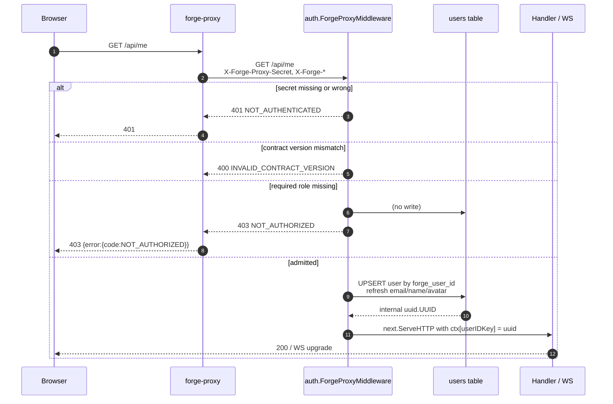

# feat: Forge Proxy Auth Mode

## Summary

Add an opt-in `forge-proxy` runtime mode that lets Deuce sit behind the [forge-proxy](https://github.com/forgeutah/forge-proxy) reverse proxy. When enabled, every request is authenticated by validating `X-Forge-Proxy-Secret` in constant time, identified by `X-Forge-User-Id`, and gated by a single configured role from `X-Forge-Roles`. Users are upserted into the local database keyed by the forge integer ID; missing-role users see a full-page "Not Authorized" view in the SPA. The existing `DEUCE_USER_ID` dev mode stays as the default so local development is unchanged.

---

## Problem Frame

Deuce currently has no real authentication: `auth.Middleware` in [server/internal/auth/context.go](server/internal/auth/context.go) injects a fixed user UUID from `DEUCE_USER_ID` for every request. That is acceptable for solo local development but blocks any shared or hosted deployment. Rather than build a full auth system (sessions, password hashing, OAuth, MFA), we want to defer identity entirely to forge-proxy — a private reverse proxy that already knows the Slack-verified identity of every caller. Deuce's job is reduced to: trust the headers, look up or create a matching internal user, and gate on a single configurable role.

---

## Requirements

- R1. A new env-driven mode (`DEUCE_AUTH_MODE=forge-proxy`) routes all incoming requests through forge-header validation before reaching handlers. Default stays `dev`.
- R2. Validate `X-Forge-Proxy-Secret` against a configured shared secret using a constant-time comparison; reject with `401` and no body details on mismatch or missing header.
- R3. Validate `X-Forge-Contract-Version` equals the configured pinned major version (default `1`); reject with `400` `INVALID_CONTRACT_VERSION` on mismatch.
- R4. Identify the caller by `X-Forge-User-Id` (BIGINT). Look up an internal user by `forge_user_id`; if absent, create one. On every authenticated request, refresh `email`, `name`, and `avatar` from the forge headers.
- R5. Gate access by a single configured required role (`DEUCE_REQUIRED_ROLE`). If the CSV in `X-Forge-Roles` does not contain that role, reject with `403` `NOT_AUTHORIZED`.
- R6. When proxy mode is configured without a secret or required role, the server fails to start with a clear error — fail-closed, never fail-open.
- R7. The frontend renders a full-page "Not Authorized" view in response to a `403 NOT_AUTHORIZED` from the first `/api/me` call, replacing the normal app shell. The view instructs the user to contact the system administrator.
- R8. The WebSocket upgrade endpoint (`/ws`) is gated by the same middleware — unauthorized users cannot establish a socket.

---

## Scope Boundaries

- No real auth providers: no password login, no OAuth, no session cookies, no JWT issuance.
- No multi-role-of policy (e.g. "any of these roles"); only a single required role is supported.
- No role → permission mapping inside Deuce; roles are opaque tags, the required-role check is binary admit/reject.
- No per-team or per-project authorization; this plan covers app-level admission only.
- No login/logout UI; sign-out flows belong to forge-proxy, not Deuce.
- No automated cleanup of orphaned forge users (revoked role, removed Slack workspace member).
- `X-Forge-Name` RFC 8187 percent-decoding is not implemented; the raw header value is stored as-is. React's default JSX text-node escaping is relied upon for safe display — **no render site may pass `currentUser.name` to `dangerouslySetInnerHTML`**. Non-ASCII users see the encoded form until a future iteration adds decoding.
- `X-Forge-Avatar` is validated **at middleware admission time** (before the insert call). If the scheme is not `http:` or `https:`, the middleware passes an empty string to the insert query. This is not a deferral — it ships in U3.
- No exemption endpoints (`/healthz`, `/readyz`); none exist today and adding one is out of scope.

### Deferred to Follow-Up Work

- RFC 8187 decoding of `X-Forge-Name`: separate iteration once Slack-verified non-ASCII names start arriving in practice.
- A first-class health/readiness probe that bypasses auth: when a hosted deployment needs it.
- **Stale-profile refresh.** Users' `name`, `email`, and `avatar` are captured on first sight and never refreshed. A future plan adds either a manual "force refresh" endpoint, an admin command, or a low-frequency refresh policy (e.g., refresh if last-seen > 30 days).
- **Mid-session WebSocket revocation.** An upgraded socket survives until disconnect even after the user's role is revoked in forge-proxy. v1 policy is "revocation effective next page reload"; the SPA WebSocket client (`src/hooks/use-websocket.ts`) is updated in U6 to stop reconnect attempts after a 403 upgrade rejection. A future plan adds in-hub periodic re-auth if tighter revocation is needed.
- **Dual-secret rotation.** v1 documents a brief 401 storm during rotation; if rotation cadence increases, add `FORGE_PROXY_SECRET_OLD` accepted during a configurable overlap window.
- Compounding a `docs/solutions/` learning for the forge header trust contract: after this ships, run `/ce-compound`.

---

## Context & Research

### Relevant Code and Patterns

- [server/internal/auth/context.go](server/internal/auth/context.go) — the existing `Middleware(defaultUserID)` and `GetUserID(ctx)` pair. New middleware must populate the same `userIDKey` context value so every handler keeps working with no edits.
- [server/internal/server/server.go](server/internal/server/server.go) — middleware order (Logger → Recoverer → RealIP → CORS → auth), CORS `AllowedHeaders` list at the top of `Router()`, and where `auth.Middleware(s.cfg.UserID)` is applied. The proxy variant plugs in at the same seam, selected by `cfg.AuthMode`.
- [server/internal/config/config.go](server/internal/config/config.go) — single flat `Config` struct using `caarlos0/env/v11` tags. Add new fields here, no nested grouping.
- [server/internal/handler/handler.go](server/internal/handler/handler.go) — `writeError(w, status, code, message)` helper with body shape `{"error":{"code":"...","message":"..."}}`. Existing codes are `SCREAMING_SNAKE_CASE`; the new ones (`NOT_AUTHORIZED`, `NOT_AUTHENTICATED`, `INVALID_CONTRACT_VERSION`, `INVALID_HEADERS`) do not collide with existing values.
- [server/internal/db/queries/users.sql](server/internal/db/queries/users.sql) — existing `GetUser` / `ListUsers` queries; sqlc maps generated methods onto `*Queries`. Run `make generate` after adding new ones.
- [server/internal/db/migrations/005_session_description.sql](server/internal/db/migrations/005_session_description.sql) — reference for the `-- +goose Up` / `-- +goose Down` shape for the new `006_*.sql` migration.
- [server/internal/db/models.go](server/internal/db/models.go) — `ActivityItem.AgentID` shows the existing nullable-column pattern (`pgtype.UUID`); the analogous mapping for nullable `BIGINT` is `pgtype.Int8`.
- [server/internal/handler/websocket.go](server/internal/handler/websocket.go) and [server/internal/ws/client.go](server/internal/ws/client.go) — the upgrade is a normal HTTP `GET` first, so it traverses the full middleware chain. Rejecting at middleware automatically prevents the socket from establishing.
- [src/lib/api.ts](src/lib/api.ts) — current error handling reads only `body?.error?.message` and throws a generic `Error`, discarding `code` and HTTP status. Refactor to a structured `ApiError` so the SPA can branch on `NOT_AUTHORIZED`.
- [src/app/App.tsx](src/app/App.tsx) — boot flow uses `useEffect` + `Promise.all([listTeams, listProjects, listSessions])`; there is no `api.getMe()` in the boot path today. The not-authorized branch hooks into this same `loadData()` try/catch.
- [src/stores/session-store.ts](src/stores/session-store.ts) — Zustand store; no `currentUser` field today. Add `currentUser: User | null` with `setCurrentUser`.

### Institutional Learnings

- No applicable entries. `docs/solutions/` was just bootstrapped (commit `6354f71`) and the only learning is about DevPod workspace bind mounts. After this feature ships, run `/ce-compound` so the next contributor finds: the header trust contract, the `forge_user_id BIGINT` FK choice, the upsert query shape, the CORS allow-list update, and the WebSocket-via-middleware rejection pattern.

### External References

- [forge-proxy](https://github.com/forgeutah/forge-proxy) — header contract definition (used directly in this plan).
- Go [`crypto/subtle.ConstantTimeCompare`](https://pkg.go.dev/crypto/subtle#ConstantTimeCompare) — the only sanctioned way to compare the secret without leaking timing information.

---

## Key Technical Decisions

- **Map forge integer ID → internal UUID via a new column, not a separate table.** Add `forge_user_id BIGINT UNIQUE NULL` on `users` and look up by it. Per forge-proxy docs ("Use this as the foreign key in your DB, not the email"). A separate `auth_identities` table would be premature for a single-provider system.
- **Insert on first sight only; do not refresh on subsequent requests.** `INSERT ... ON CONFLICT (forge_user_id) DO NOTHING` plus a separate lookup for the existing-user path. Profile fields (`email`, `name`, `avatar`) capture whatever the forge headers carried on the user's first authenticated request and stay there until manual intervention or a future "force refresh" step. This avoids the write hotspot of per-request upsert and keeps the steady-state path to a single indexed `SELECT`. Trade-off: a user who changes their Slack name or avatar will see stale data in Deuce until we add an explicit refresh mechanism.
- **Single env var (`DEUCE_AUTH_MODE`) toggles the middleware**, defaulting to `dev`. Other forge env vars (`FORGE_PROXY_SECRET`, `FORGE_REQUIRED_ROLE`, `FORGE_CONTRACT_VERSION`) are read regardless but only enforced when mode is `forge-proxy`. Switching modes is a config change + restart, never a per-request decision.
- **Fail closed at startup.** If `DEUCE_AUTH_MODE=forge-proxy` is set but `FORGE_PROXY_SECRET` or `FORGE_REQUIRED_ROLE` is empty, `main.go` errors out before the listener binds. Better to crash visibly than to admit everyone.
- **Constant-time secret comparison.** Use `crypto/subtle.ConstantTimeCompare` after a length precheck (the function requires equal-length slices). The length precheck itself is a one-bit timing oracle (correct length vs. not), but at network-attacker measurement precision and with a randomly generated ≥32-byte secret it is not exploitable. We accept that bit rather than pad to a fixed comparison length; revisit if the threat model ever includes co-located attackers.
- **Dev mode is localhost-only.** Dev middleware trusts `X-User-ID` from the client and falls back to `DEUCE_USER_ID` — safe only on a loopback bind. Proxy mode is the only supported configuration for any shared / non-loopback listener. The server emits a prominent WARN at startup when proxy mode is set but the bind looks non-loopback (warn, not fail, because container network namespacing legitimately uses `0.0.0.0`).
- **Auto-provision users on first sight.** Any `forge_user_id` that passes the secret + contract-version + role checks is created in the `users` table on first request, with no allow-list of forge IDs. The required-role check is the only admission gate. This is correct as long as the role is administered exclusively in forge-proxy / Slack and cannot be self-asserted via headers without the shared secret. An invite-only allow-list, if ever needed, is a future plan.
- **Pin `X-Forge-Contract-Version` to `1`.** Reject other versions with `400 INVALID_CONTRACT_VERSION`. Bumping requires an explicit code change so a proxy v2 can never silently flow under-validated payloads.
- **Reject malformed `X-Forge-User-Id` as `401 NOT_AUTHENTICATED`.** Not `400` — the distinction is whether the *user* could fix it; here the *proxy* is misbehaving and the right call is "we don't trust this caller", not "your request body is bad".
- **Add `X-Forge-*` to CORS `AllowedHeaders`.** The forge-proxy is server-to-server in production and CORS doesn't apply, but development tooling and future browser-mediated calls benefit from explicit allow-listing. Five-line change, no risk.
- **Frontend triggers Not Authorized off `api.getMe()` specifically.** It's the cheapest, most predictable endpoint and the first call in the bootstrap. A 403 there means "this user is not allowed in Deuce at all"; 403s on other endpoints (e.g. a session the user doesn't belong to) are domain authorization errors and stay as inline errors, not full-page takeovers.
- **Introduce Go tests for the new middleware only.** This is the first `*_test.go` in the repo. The middleware has small, pure-ish logic (header parsing, constant-time compare, role match, contract version) that is exactly what unit tests are for, and it's security-sensitive enough that "no tests" is a poor default. Scope: `server/internal/auth/forge_proxy_test.go` only. Other code is untouched test-wise.

---

## Open Questions

### Resolved During Planning

- *How do we map forge's int64 user ID to Deuce's UUID-keyed users?* Add `forge_user_id BIGINT UNIQUE NULL` and look up / upsert by it.
- *What happens in dev mode if forge headers arrive?* Ignored. Dev middleware reads `X-User-ID` or falls back to `DEUCE_USER_ID`; forge headers are not consulted.
- *Should we decode RFC 8187 names?* Not in this plan; deferred until a real non-ASCII user reports a problem. The encoded form is human-readable enough to ship.
- *Where does the proxy middleware get its DB handle?* Construct it inside `server.Router()` after `s.queries` is available, passing `s.queries`, `s.cfg.ForgeProxySecret`, `s.cfg.ForgeRequiredRole`, and `s.cfg.ForgeContractVersion`.
- *What if a forge email collides with a seed user's email?* In production the seed users from `002_seed_data.sql` should not be present. In mixed environments, the upsert will fail on the `email UNIQUE` constraint; document this and address only if it actually bites.
- *Should `/ws` be exempt?* No. The upgrade is a normal HTTP GET first; it goes through the middleware chain and a 403 prevents the upgrade cleanly.

### Deferred to Implementation

- Exact method signature for the upsert call site inside the middleware (sqlc-generated method takes `pgtype.Int8` and `pgtype.Text` — actual shapes confirmed at code-gen time).
- Precise styling of the Not Authorized view (which existing color tokens fit best, whether to include the user's email for context).
- Audit logging on 403: log `forge_user_id` and `email` for forensics. Sanitize before logging — strip CR/LF/NUL bytes and clamp each value to 256 chars. Use `slog` structured fields rather than format-string interpolation so the backend handles escaping. Never log the `X-Forge-Proxy-Secret` value (success or failure) — see U3 Approach.

---

## High-Level Technical Design

> *This illustrates the intended approach and is directional guidance for review, not implementation specification. The implementing agent should treat it as context, not code to reproduce.*



**Middleware decision flow** — order matters for both correctness and not leaking information:

| Step | Check | On failure |
|------|-------|------------|
| 1 | `X-Forge-Proxy-Secret` length + constant-time compare | `401 NOT_AUTHENTICATED` |
| 2 | `X-Forge-Contract-Version` parses + equals pinned major | `400 INVALID_CONTRACT_VERSION` |
| 3 | `X-Forge-User-Id` parses as int64 > 0 | `401 NOT_AUTHENTICATED` |
| 4 | `X-Forge-Roles` CSV contains required role | `403 NOT_AUTHORIZED` |
| 5 | Resolve user: lookup by `forge_user_id`, insert if missing, set `userIDKey` ctx value | `500 DB_ERROR` |
| 6 | Call `next.ServeHTTP` | — |

Secret check is first so we never spend DB calls or reveal validation behavior to unauthenticated callers.

---

## Implementation Units

### U1. Add `forge_user_id` column and user queries

**Goal:** Persist forge's stable integer ID on `users` and expose lookup/upsert queries.

**Requirements:** R4

**Dependencies:** None

**Files:**
- Create: `server/internal/db/migrations/006_user_forge_id.sql`
- Modify: `server/internal/db/queries/users.sql`
- Modify: `server/internal/db/users.sql.go` (regenerated by sqlc — do not edit by hand)
- Modify: `server/internal/db/models.go` (regenerated by sqlc)

**Approach:**
- Migration: `ALTER TABLE users ADD COLUMN forge_user_id BIGINT UNIQUE, ADD COLUMN forge_first_seen_at TIMESTAMPTZ;` Down drops both columns. No backfill — existing seed users keep `NULL` and are only reachable via dev mode. `forge_first_seen_at` is set on first-provision so a future "did anyone get provisioned during a compromise window?" query has a column to filter on.
- Add `LookupUserByForgeID :one` (`SELECT * FROM users WHERE forge_user_id = $1`) and `CreateUserByForgeID :one` with `INSERT INTO users (forge_user_id, name, email, avatar, status, forge_first_seen_at) VALUES ($1, $2, $3, $4, 'online', now()) ON CONFLICT (forge_user_id) DO NOTHING RETURNING *`. Insert-only — no `DO UPDATE` branch. Middleware looks up first and only inserts on miss.
- Run `cd server && make generate` to refresh sqlc output.

**Patterns to follow:**
- Migration shape: [server/internal/db/migrations/005_session_description.sql](server/internal/db/migrations/005_session_description.sql)
- Nullable column generation: `ActivityItem.AgentID` in [server/internal/db/models.go](server/internal/db/models.go) (will be the analogous `pgtype.Int8` for our nullable `BIGINT`).
- Existing `ON CONFLICT DO NOTHING` usage in [server/internal/db/queries/sessions.sql](server/internal/db/queries/sessions.sql); ours will be the first `DO UPDATE` in the codebase.

**Test scenarios:**
- Happy path: applying the migration adds `forge_user_id` as nullable; rolling back drops it cleanly with no data loss for other columns.
- Edge case: `make generate` produces `LookupUserByForgeID` and `UpsertUserByForgeID` methods on `*db.Queries` with `pgtype.Int8` parameter; build succeeds.
- Note: behavioral coverage of the upsert (insert-vs-update branches, refresh of email/name/avatar, email-collision failure) lives in U4 via the middleware tests, which exercise the queries end-to-end.

**Verification:**
- `make migrate` succeeds and `\d users` in psql shows the new column.
- `make migrate-down` reverts cleanly.
- `make generate` produces a clean diff; `go build ./...` passes from `server/`.

---

### U2. Config and startup validation for proxy mode

**Goal:** Surface proxy-mode configuration as env vars; refuse to start if the mode is enabled but its required secrets are missing.

**Requirements:** R1, R6

**Dependencies:** None (parallel with U1)

**Files:**
- Modify: `server/internal/config/config.go`
- Modify: `server/main.go`
- Modify: `CLAUDE.md` (Environment Variables section)
- Modify: `.env.example` (if present; create if it isn't part of the repo)

**Approach:**
- Add to `config.Config`: `AuthMode string` (default `"dev"`), `ForgeProxySecret string` (default `""`), `ForgeRequiredRole string` (default `""`), `ForgeContractVersion int` (default `1`), `WSAllowedOrigins string` (CSV, default `"localhost:4000,localhost:8080"`).
- In `main.go`, after `config.Load()` succeeds, if `cfg.AuthMode == "forge-proxy"` then return an error from `main` when `cfg.ForgeProxySecret == ""`, `cfg.ForgeRequiredRole == ""`, or `cfg.WSAllowedOrigins == ""`. Use a clear message like `forge-proxy mode requires FORGE_PROXY_SECRET, FORGE_REQUIRED_ROLE, and DEUCE_WS_ALLOWED_ORIGINS`.
- Also validate that `AuthMode` is one of the two known values (`dev`, `forge-proxy`); unknown values error out at startup rather than silently degrading.
- Reject `DEUCE_WS_ALLOWED_ORIGINS=*` explicitly — wildcard origins re-open cross-site WebSocket hijacking and we always require an explicit allow-list.
- Emit a startup WARN when `cfg.AuthMode == "dev"` and `PORT` would bind to anything other than loopback. (Detect by checking that the bind address resolves to `127.0.0.0/8` or `::1`. Optional; do not refuse to start, just log loudly.)
- Update the env-var doc table in [CLAUDE.md](CLAUDE.md).

**Patterns to follow:**
- Existing flat-struct env tags in [server/internal/config/config.go](server/internal/config/config.go); add fields, do not introduce nested structs.

**Test scenarios:**
- Happy path: `DEUCE_AUTH_MODE` unset → `cfg.AuthMode == "dev"`, server starts as today.
- Happy path: `DEUCE_AUTH_MODE=forge-proxy` with secret, role, and WS origins set → server starts.
- Error path: `DEUCE_AUTH_MODE=forge-proxy` with empty secret → server returns error before binding the listener.
- Error path: `DEUCE_AUTH_MODE=forge-proxy` with empty required role → same.
- Error path: `DEUCE_AUTH_MODE=forge-proxy` with empty `DEUCE_WS_ALLOWED_ORIGINS` → startup error.
- Error path: `DEUCE_AUTH_MODE=forge-proxy` with `DEUCE_WS_ALLOWED_ORIGINS=*` → startup error (wildcard rejected).
- Error path: `DEUCE_AUTH_MODE=mystery` → unknown-mode error.

**Verification:**
- Manual: start the server in each of the four startup scenarios above; confirm exit codes and stderr messages.
- `go build ./server/...` passes.

---

### U3. Forge-proxy auth middleware

**Goal:** A new chi middleware that validates forge headers, upserts the user, and populates the same `userIDKey` context value the existing handlers already read.

**Requirements:** R2, R3, R4, R5, R8

**Dependencies:** U1, U2

**Files:**
- Create: `server/internal/auth/forge_proxy.go`
- Modify: `server/internal/auth/context.go` (no change to the existing `Middleware` / `GetUserID`; the new file shares the package and the `userIDKey`)
- Modify: `server/internal/server/server.go` (middleware selection and CORS update)

**Approach:**

Header reading and decision flow:

- Define a small interface inside `server/internal/auth/forge_proxy.go` for the DB methods the middleware needs:
  ```
  type forgeUserStore interface {
      UpsertUserByForgeID(ctx, params) (db.User, error)
  }
  ```
  `*db.Queries` satisfies this implicitly. This keeps tests free of pgx/postgres while passing the real `*db.Queries` in production.
- Build `ForgeProxyMiddleware(store, secret, requiredRole, contractVersion)` returning a `func(http.Handler) http.Handler`. For every `X-Forge-*` header the middleware reads, use `r.Header.Values(name)` (not `Get()`) and reject any request where the slice length is `> 1`. Duplicate header instances are treated as `401 NOT_AUTHENTICATED` (for secret) or `400 INVALID_HEADERS` (for others) — never silently coalesced. This closes a header-smuggling vector between an edge proxy and forge-proxy.
- Per-request order (each step short-circuits on failure):
  1. Compare `X-Forge-Proxy-Secret` to the configured secret. First length-precheck; then `subtle.ConstantTimeCompare`. Reject with `401 NOT_AUTHENTICATED`.
  2. Parse `X-Forge-Contract-Version` as int and require equality with pinned version. Reject with `400 INVALID_CONTRACT_VERSION`.
  3. Parse `X-Forge-User-Id` as `int64 > 0`. Reject with `401 NOT_AUTHENTICATED`.
  4. Split `X-Forge-Roles` on commas, trim whitespace per element, check **equality** (not substring) against the required role. Reject with `403 NOT_AUTHORIZED`.
  5. Validate `X-Forge-Avatar`: if non-empty, must parse and have scheme `http` or `https`. Otherwise treat as empty.
  6. Resolve the user. First call `LookupUserByForgeID`. If a row exists, use it. If not, call `CreateUserByForgeID` (`INSERT ... ON CONFLICT (forge_user_id) DO NOTHING RETURNING *`) with `forge_user_id`, `name` (raw), `email`, `avatar` (validated). If the insert returns zero rows (a concurrent insert won the race), re-run `LookupUserByForgeID` once to pick up the winner's row. On first-provision, emit an info-level slog line including `forge_user_id`, `email`, and `current_timestamp` so a future "did anyone get provisioned during a secret-leak window?" query has an audit trail.
  7. Set the resulting UUID (as a string parseable by `uuid.Parse`) into the context using the package-private `userIDKey`.
  8. Call `next.ServeHTTP`.

  Note: profile fields (`name`, `email`, `avatar`) are captured on first sight and not refreshed on subsequent requests. Stale-profile follow-up belongs to a future plan.

Logging and error response policy:

- **Never log the raw `X-Forge-Proxy-Secret` value** on any path, success or failure. On a 401 from a bad secret, log only `auth.proxy: invalid secret` plus method/path — never echo the received secret or its length.
- On 403 (role mismatch), log `forge_user_id` and `email` for audit. Before logging, sanitize each header value: strip CR / LF / NUL bytes and clamp length to 256 chars. Emit via `slog` structured fields rather than `fmt.Sprintf` so the log backend handles escaping.
- On 500 from the upsert, log the real error server-side via `slog` (including `forge_user_id`, never headers, never secret) and return `writeError(w, 500, "DB_ERROR", "internal error")`. The body never echoes `err.Error()` — internal schema and SQL strings stay inside the process.
- Confirm `middleware.Logger` (chi default) does not record headers in this codebase's current config. Add an explicit comment in `server.go` near the middleware stack: *"`X-Forge-Proxy-Secret` must never be logged. If anyone introduces a logging middleware that dumps headers, add an explicit redaction for this header name."*

WebSocket origin policy:

- Replace the hardcoded `OriginPatterns: []string{"localhost:4000", "localhost:8080"}` in [server/internal/ws/client.go](server/internal/ws/client.go) and [server/internal/handler/terminal.go](server/internal/handler/terminal.go) with values sourced from `cfg.WSAllowedOrigins` (CSV split). Plumb the slice through `ws.ServeWS` / terminal upgrader construction. This is what makes browser WebSocket upgrades work from a hosted forge-proxy frontend without re-opening cross-site WebSocket hijacking. The 403 auth gate still runs first; this is the second layer.

Wiring and CORS:

- In `server.go`, pick the middleware by mode:
  ```
  if cfg.AuthMode == "forge-proxy" {
      r.Use(auth.ForgeProxyMiddleware(s.queries, cfg.ForgeProxySecret, cfg.ForgeRequiredRole, cfg.ForgeContractVersion))
  } else {
      r.Use(auth.Middleware(cfg.UserID))
  }
  ```
- Update CORS `AllowedHeaders` to include `X-Forge-Proxy-Secret`, `X-Forge-Contract-Version`, `X-Forge-User-Id`, `X-Forge-Email`, `X-Forge-Name`, `X-Forge-Avatar`, `X-Forge-Roles`, `X-Forge-Slack-User-Id`, `X-Forge-Slack-Team-Id`. Keep `X-User-ID` in the list for dev mode — in proxy mode the new middleware is mounted instead, so `X-User-ID` is ignored regardless of CORS.

**Execution note:** Implement this unit hand-in-hand with U4 (test-first for the middleware). The logic is small enough that the tests can drive the shape.

**Technical design:** *(directional, not specification)*

```go
// PSEUDO-CODE — actual code lands in U3 with real types/imports.
func ForgeProxyMiddleware(store forgeUserStore, secret, requiredRole string, contractVer int) func(http.Handler) http.Handler {
    secretBytes := []byte(secret)
    return func(next http.Handler) http.Handler {
        return http.HandlerFunc(func(w http.ResponseWriter, r *http.Request) {
            got := []byte(r.Header.Get("X-Forge-Proxy-Secret"))
            if len(got) != len(secretBytes) || subtle.ConstantTimeCompare(got, secretBytes) != 1 {
                writeError(w, 401, "NOT_AUTHENTICATED", "invalid proxy secret")
                return
            }
            if v, err := strconv.Atoi(r.Header.Get("X-Forge-Contract-Version")); err != nil || v != contractVer {
                writeError(w, 400, "INVALID_CONTRACT_VERSION", "...")
                return
            }
            // ... user id parse, role match, upsert, ctx set, next.ServeHTTP ...
        })
    }
}
```

**Patterns to follow:**
- Existing middleware in [server/internal/auth/context.go](server/internal/auth/context.go) for the closure-over-config shape and context-set idiom.
- `writeError` from [server/internal/handler/handler.go](server/internal/handler/handler.go) for response body shape.

**Test scenarios:** *(implemented in U4)* See below.

**Verification:**
- With `DEUCE_AUTH_MODE=forge-proxy`, `FORGE_PROXY_SECRET=test`, `FORGE_REQUIRED_ROLE=member`, hitting `/api/me` with the right headers returns the upserted user; the same call without headers returns `401`; with wrong role returns `403`; with wrong contract version returns `400`.
- WebSocket upgrade to `/ws` is rejected with `403` for a user without the required role.
- Existing dev-mode behavior (no env vars set) is unchanged — handlers see the same `DEUCE_USER_ID` UUID they always did.

---

### U4. Auth middleware unit tests (introduces test framework)

**Goal:** First Go test file in the repository. Cover the proxy middleware's branches with `httptest` plus a hand-rolled fake `forgeUserStore`.

**Requirements:** R2, R3, R4, R5, R6

**Dependencies:** U3

**Files:**
- Create: `server/internal/auth/forge_proxy_test.go`

**Approach:**
- Build a `fakeForgeStore` that records calls to `UpsertUserByForgeID` and returns canned `db.User` values, with hooks to force errors.
- Use `net/http/httptest.NewRecorder` and a tiny downstream handler that records whether it was invoked and what UUID it saw in context.
- Cover the decision table from the High-Level Technical Design.
- Add a `Makefile` target `make test` running `go test ./...` from `server/`. Document in `CLAUDE.md`.

**Execution note:** Test-first — write the failing cases for each branch before writing the corresponding middleware logic in U3.

**Patterns to follow:**
- There are no existing Go tests to mirror. Follow standard library idioms: subtests via `t.Run`, table-driven cases where helpful.

**Test scenarios:**
- Happy path: valid secret + version + user id + role → downstream handler is invoked with `userIDKey` set to the upserted UUID; `UpsertUserByForgeID` called once with the parsed forge id, email, name, avatar.
- Happy path (refresh): same `forge_user_id` arrives twice with different email/name/avatar; the second call sees the upsert invoked again with the new values.
- Error path: missing `X-Forge-Proxy-Secret` → `401 NOT_AUTHENTICATED`, downstream handler not invoked, no DB call.
- Error path: wrong secret of same length → `401`, no DB call. (Asserts the same code path as missing secret.)
- Error path: wrong secret of different length → `401`. (Asserts the length-check short-circuit does not panic on `subtle.ConstantTimeCompare` length mismatch.)
- Error path: two `X-Forge-Proxy-Secret` headers, one correct and one wrong → `401`, no DB call (duplicate-header rejection).
- Error path: two `X-Forge-User-Id` headers → `400`, no DB call.
- Error path: missing `X-Forge-Contract-Version` → `400 INVALID_CONTRACT_VERSION`, no DB call.
- Error path: non-integer `X-Forge-Contract-Version` → `400`.
- Error path: `X-Forge-Contract-Version=2` when pinned to `1` → `400`.
- Error path: missing or non-integer `X-Forge-User-Id` → `401 NOT_AUTHENTICATED`, no DB call.
- Error path: `X-Forge-Roles` missing → `403 NOT_AUTHORIZED`, no DB call.
- Error path: `X-Forge-Roles=admin,founder` and required role is `member` → `403`, no DB call.
- Happy path (edge case): `X-Forge-Roles=  member ,admin` with whitespace → admitted (CSV is trimmed).
- Edge case: `X-Forge-Roles=membership` and required role is `member` → `403` (substring match must not pass; CSV split + equality, not `strings.Contains`).
- Edge case: `X-Forge-Avatar=javascript:alert(1)` → request still admitted (role and secret pass), but the upsert call receives an empty avatar string (scheme rejected at the middleware).
- Edge case: `X-Forge-Avatar=https://example.com/a.png` → upsert receives the URL verbatim.
- Error path: lookup or insert returns a DB error → `500 DB_ERROR` with body message `"internal error"`, downstream handler not invoked, raw `err.Error()` not in response body.
- Edge case (concurrent first-arrival): two simultaneous requests for the same new `forge_user_id`. The fake store is configured to return zero rows on the first `CreateUserByForgeID` call (simulating the loser of the `ON CONFLICT DO NOTHING` race) then the winner's row on the follow-up `LookupUserByForgeID`. The middleware returns the same UUID to both callers and never returns 500.
- Happy path (first-provision audit): first request for a new `forge_user_id` produces an info-level slog line including `forge_user_id`, `email`, and a timestamp. Subsequent requests for the same user do not re-emit this line.
- Log-injection edge case: `X-Forge-Email: alice\r\nfoo=bar` on a 403 → the captured slog record's email field contains the sanitized value with no CR/LF; length is clamped.
- Integration: with proxy middleware mounted in front of a chi router whose downstream handler does `uuid.Parse(auth.GetUserID(ctx))`, parse succeeds without error. (Confirms the context value is a real UUID string, not raw bytes or an int64.)

**Verification:**
- `cd server && make test` passes with all cases.
- `go test -race ./server/...` passes (the middleware closes over a `[]byte` secret; sanity-check no shared mutable state).

---

### U5. Frontend API error type and current-user store

**Goal:** Make HTTP error `code` and status reachable from React render code, and stash the current user in the session store for downstream UI.

**Requirements:** R7

**Dependencies:** None for the API change; benefits from U3 being mergeable but not technically blocked.

**Files:**
- Modify: `src/lib/api.ts`
- Modify: `src/stores/session-store.ts`
- Modify: `src/types/index.ts` (add `currentUser` field type if not already present)

**Approach:**
- Add `class ApiError extends Error { status: number; code: string; }` exported from `src/lib/api.ts`.
- In the `request()` helper, when `!res.ok`, parse the body and throw `new ApiError(message, status, code)` instead of a generic `Error`. Preserve the existing fallback message when the body is missing.
- Existing call sites that do `catch (e) { setError(e.message) }` keep working — `ApiError extends Error` so `.message` still resolves.
- Add `currentUser: User | null` to the Zustand store with a `setCurrentUser(user)` action.

**Patterns to follow:**
- Existing field/action shape in [src/stores/session-store.ts](src/stores/session-store.ts); mirror how `teams` / `setTeams` are defined.
- Existing `User` type in `src/types/index.ts`.

**Test scenarios:**
- *(Frontend has no test suite today; this plan does not introduce one. Behavioral coverage is via U6's manual verification.)*
- Test expectation: none — behavior verified manually in U6.

**Verification:**
- `npx tsc --noEmit` and `npm run lint` pass.
- Throwing a fake `Response` with `{"error":{"code":"NOT_AUTHORIZED","message":"x"}}` from a stubbed `fetch` produces an `ApiError` whose `.code === "NOT_AUTHORIZED"` and `.status === 403`.
- Existing API call sites continue to function (e.g. message send still surfaces server `message` strings to the user).

---

### U6. Frontend Not Authorized view and boot wiring

**Goal:** Replace the app shell with a Not Authorized page when the very first authenticated call returns `403 NOT_AUTHORIZED`.

**Requirements:** R7

**Dependencies:** U5

**Files:**
- Create: `src/components/auth/NotAuthorizedView.tsx`
- Modify: `src/app/App.tsx`

**Approach:**
- `NotAuthorizedView`: centered full-page layout wrapped in `<main role="main">` with a single `<h1>` "Not Authorized" and a paragraph body "Your account doesn't have access to this Deuce workspace. Contact your system administrator." Followed by a "Try again" button that calls `loadData()` so a user who has just been granted the role can re-attempt without a hard refresh. **Static text only — do not render any header-derived data (email, name, avatar).** On mount, move keyboard focus to the heading via `useEffect` + `ref.focus()` (heading carries `tabIndex={-1}`) so screen-reader and keyboard users land at the page summary instead of in document head. Use `--color-foreground` for the heading and `--color-foreground-muted` (≥4.5:1 contrast on the dark background) for the body and button label — **not** `--color-foreground-subtle`, which fails WCAG AA contrast.
- In `App.tsx`'s `loadData()`:
  1. Call `api.getMe()` first (before the parallel `listTeams/listProjects/listSessions`).
  2. Store the result via `setCurrentUser`.
  3. On `ApiError` with `code === "NOT_AUTHORIZED"` (or `status === 403`), set a `notAuthorized` flag and short-circuit. Generic errors keep the existing "make sure the Go server is running" message.
  4. Add a fourth render branch above the existing three: `if (notAuthorized) return <NotAuthorizedView />;`
- Use design tokens already in [src/styles/globals.css](src/styles/globals.css) (`--color-background`, `--color-foreground`, `--color-foreground-subtle`, `--color-danger`).

**Patterns to follow:**
- The inline error block in [src/app/App.tsx](src/app/App.tsx) (the "make sure the Go server is running" branch) for layout shape and color usage.
- shadcn primitives in `src/components/ui/` (Button, etc.) — keep dependencies minimal; a single styled `<div>` is enough.

**Test scenarios:**
- Test expectation: none — verified manually below.
- Manual verification (see Verification):
  - Happy path: with a user whose `X-Forge-Roles` includes the required role, the SPA loads normally.
  - Not-authorized path: with a user whose roles do not include the required role, the SPA renders the `NotAuthorizedView` without firing other API calls or attempting WebSocket connection.
  - Error path: with the backend down entirely, the existing "make sure the Go server is running" error still surfaces.

**Verification:**
- Run `docker compose up -d`, `cd server && DEUCE_AUTH_MODE=forge-proxy FORGE_PROXY_SECRET=devsecret FORGE_REQUIRED_ROLE=member make dev`, then `npm run dev`.
- Hit the frontend through `curl http://localhost:8080/api/me -H "X-Forge-Proxy-Secret: devsecret" -H "X-Forge-Contract-Version: 1" -H "X-Forge-User-Id: 42" -H "X-Forge-Email: alice@example.com" -H "X-Forge-Name: Alice" -H "X-Forge-Avatar:" -H "X-Forge-Roles: member"` — `200` and a user row in `psql`.
- Same curl with `X-Forge-Roles: guest` returns `403 NOT_AUTHORIZED`.
- In a browser via a local forge-proxy (or a simple header-injecting reverse proxy stub), confirm the Not Authorized view renders and WebSocket connection never fires (check DevTools network).

---

## System-Wide Impact

- **Interaction graph:** new middleware sits in the chi chain in front of every `/api/*` and `/ws` route; the existing `Logger`, `Recoverer`, `RealIP`, and `CORS` middleware are untouched. Handlers continue to read user identity via the same `auth.GetUserID(ctx)` call.
- **Error propagation:** middleware-rejected requests never reach handlers; failures return JSON `{"error":{"code","message"}}` with the appropriate status. Frontend `request()` re-throws as `ApiError` carrying status + code; only `code === "NOT_AUTHORIZED"` at boot triggers the takeover view, other 403s flow through existing error handling as today.
- **State lifecycle risks:** upsert-on-every-request means each authenticated call writes to the `users` table; under load this is one indexed-upsert per request, acceptable for v1. If write contention shows up later, cache the lookup in the middleware behind a short TTL — out of scope here.
- **API surface parity:** WebSocket upgrade and REST API receive identical treatment because both traverse the same middleware chain. There is no separate auth path to keep in sync.
- **Integration coverage:** the U4 tests use `httptest` against the real `chi` mounting pattern, so middleware-to-handler context propagation is exercised end-to-end without a real DB. The real-DB upsert is exercised manually in U3/U6 verification rather than via tests.
- **Unchanged invariants:** existing `auth.Middleware`, `auth.GetUserID`, `userIDKey`, and every handler's `uuid.Parse(getUserID(r))` line are unchanged. Dev mode behavior (default `DEUCE_USER_ID` injection) is byte-identical. Existing seed users keep `forge_user_id = NULL`.

---

## Risks & Dependencies

| Risk | Mitigation |
|------|------------|
| Secret comparison leaks timing | `subtle.ConstantTimeCompare` plus equal-length precheck; tested with same-length and different-length wrong secrets. Length-precheck still leaks one bit but is unexploitable at network precision with a ≥32-byte random secret (see Key Technical Decisions). |
| **Secret leaks into request logs or panic dumps** | The middleware never logs the raw secret value (see U3 logging policy). `middleware.Logger` currently logs only method/path/status/duration — confirm at code time and add a comment near the middleware stack warning future contributors. If a logging middleware that dumps headers is ever introduced, an explicit redaction for `X-Forge-Proxy-Secret` must be added with it. |
| Proxy mode set but secret/role unconfigured admits everyone | Startup-time fail-closed validation in U2; tested with each of the startup scenarios. |
| **Dev mode bound to a non-loopback interface admits everyone** | Dev mode trusts the client-supplied `X-User-ID`. Key Technical Decisions makes the localhost-only constraint explicit. U2 emits a startup WARN when dev mode is set and the bind looks non-loopback. Documentation / Operational Notes carries the hosted-deployment checklist. |
| Email `UNIQUE` constraint blocks upsert when a forge user's email matches an existing row with a different `forge_user_id` | Documented; in practice dev seed users do not collide with real forge identities. If it does bite, follow up with email-only conflict handling in a separate plan. |
| **Concurrent first-arrival race on `forge_user_id`** | Two simultaneous requests for the same new forge id both run `CreateUserByForgeID`; `ON CONFLICT (forge_user_id) DO NOTHING` ensures only one row is created, and the loser's zero-row `RETURNING` triggers a follow-up `LookupUserByForgeID` to pick up the winner's row. Covered by a U4 test scenario for the loser path. |
| **Header smuggling via duplicate `X-Forge-*` headers** | All forge headers are read with `r.Header.Values(name)`; any slice with length `> 1` is rejected (`401` for secret, `400` for others). Covered by U4 tests for duplicate-secret and duplicate-user-id. |
| **Log injection via attacker-controlled header values** | All header values logged for audit are sanitized (strip CR/LF/NUL, clamp to 256 chars) and emitted as `slog` structured fields. Covered by a U4 log-injection test scenario. |
| **XSS / open-redirect via Slack-controlled name or avatar** | `X-Forge-Avatar` URL scheme is validated at upsert time (only `http:` / `https:`); other schemes stored empty. `X-Forge-Name` relies on React JSX text-node escaping; Scope Boundaries prohibits `dangerouslySetInnerHTML` for `currentUser.name`. NotAuthorizedView renders no header-derived data. |
| **WebSocket Origin allow-list incompatible with hosted deployments** | `OriginPatterns` is now sourced from `DEUCE_WS_ALLOWED_ORIGINS`. Wildcards (`*`) are rejected at startup to prevent cross-site WebSocket hijacking. Operators must set the public hostname(s) when running behind forge-proxy. |
| WebSocket auto-reconnect loops against a 403 | Browser will not mount `<AppContent />` once `NotAuthorizedView` is shown, so the `useWebSocket` hook is never instantiated. Confirmed by current `App.tsx` render flow. |
| Trusting headers from a non-proxy caller in proxy mode | Secret-first check rejects any direct caller without the shared secret in constant time. Combined with the bind-warning at startup (U2) and the hosted-deployment checklist (Operational Notes), the deuce server should only be reachable through forge-proxy. |
| First Go tests in the repo introduce a precedent | Scope kept tight (single `*_test.go` for the new middleware). No mocking library introduced; standard library only. Add `make test` to the Makefile for discoverability. |
| CORS regression from adding many `X-Forge-*` headers | The allowed-headers list is additive; nothing existing is removed. Verify with the dev-mode preflight after deploy. |

---

## Documentation / Operational Notes

- Update the **Environment Variables** table in [CLAUDE.md](CLAUDE.md) with the new vars and the two-mode toggle: `DEUCE_AUTH_MODE`, `FORGE_PROXY_SECRET`, `FORGE_REQUIRED_ROLE`, `FORGE_CONTRACT_VERSION`, `DEUCE_WS_ALLOWED_ORIGINS`.
- Add a `make test` target to [server/Makefile](server/Makefile) so `cd server && make test` runs the new test file.
- After the feature ships, run `/ce-compound` to capture: the header trust contract, the `forge_user_id` column choice, the upsert query shape (with retry-on-23505), the CORS allow-list change, the WebSocket-via-middleware rejection pattern, and the mode-aware `OriginPatterns` plumbing.

**Hosted deployment checklist** (run through this when enabling `forge-proxy` mode):

1. **Network binding.** Deuce listens only on loopback or a private overlay network — never a public interface. forge-proxy is the sole ingress.
2. **Secret strength and rotation.** `FORGE_PROXY_SECRET` is ≥ 32 random bytes (e.g. `openssl rand -hex 32`). Document the rotation procedure (forge-proxy and deuce rotate together; expect a brief window of mismatched secrets during the swap, which manifests as `401 NOT_AUTHENTICATED`).
3. **WebSocket Origin allow-list.** `DEUCE_WS_ALLOWED_ORIGINS` is set to the public hostname(s) of the forge-proxy frontend, never `*`.
4. **Explicit mode.** `DEUCE_AUTH_MODE=forge-proxy` is set explicitly in the production env file — never rely on the default.
5. **Log review.** Confirm no logging middleware dumps headers; verify `X-Forge-Proxy-Secret` does not appear in sampled log lines after a smoke test.
6. **Smoke test.** Curl the deuce server directly (bypassing the proxy) and confirm it rejects with `401` — proves the secret is not blank and that direct access is gated.

---

## Sources & References

- forge-proxy header contract: <https://github.com/forgeutah/forge-proxy>
- Go constant-time compare: <https://pkg.go.dev/crypto/subtle#ConstantTimeCompare>
- Current auth middleware: [server/internal/auth/context.go](server/internal/auth/context.go)
- Current config loader: [server/internal/config/config.go](server/internal/config/config.go)
- Current server wiring: [server/internal/server/server.go](server/internal/server/server.go)
- Current users schema and queries: [server/internal/db/migrations/001_initial_schema.sql](server/internal/db/migrations/001_initial_schema.sql), [server/internal/db/queries/users.sql](server/internal/db/queries/users.sql)
- Current frontend boot: [src/app/App.tsx](src/app/App.tsx), [src/lib/api.ts](src/lib/api.ts)
