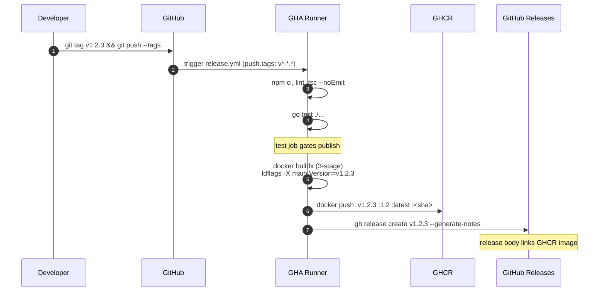

# Tag-triggered release workflow for Docker image and GitHub Release

## Summary

Add a GitHub Actions workflow that triggers on semver-shaped tag push (`v*.*.*`), builds a multi-stage Docker image with the Vite/React frontend embedded into the Go binary, pushes the image to GHCR with the exact semver plus a `latest` floating tag, and creates a matching GitHub Release with auto-generated notes. The published image is drop-in runnable: it serves the SPA, runs goose migrations on startup, and binds an HTTP listener — `docker run` against a Postgres is all it takes.

This plan stands alone — it does not deploy anywhere, does not depend on the exe.dev plan, and is intentionally a narrower replacement for the build-and-publish slice of `docs/plans/2026-05-23-001-feat-exe-dev-dogfood-deploy-plan.md`. That plan's deploy-side units (CORS env wiring, prod compose, SSH-deploy workflow, VM bootstrap) are out of scope here.

---

## Problem Frame

Deuce has no automated release artifacts today. There is no Dockerfile, no GitHub Actions workflow, and no way for a teammate to pull a known-good `ghcr.io/forgeutah/deuce:v0.1.0` image. Producing a versioned image and matching GitHub Release on every semver tag push is a small, high-leverage piece of plumbing: it gives Deuce a publish boundary independent of any deploy target, lets teammates pin to specific versions, and lays the groundwork for a future deploy without coupling to one.

---

## Requirements

- R1. Pushing a semver-shaped git tag (`v*.*.*`) automatically builds and publishes the artifacts. No manual `workflow_dispatch` required on the happy path.
- R2. Before publishing, the workflow runs ESLint, TypeScript typecheck (`tsc --noEmit`), and Go tests. Any failure aborts before any push or release-create step.
- R3. The Docker image is multi-stage: stage 1 builds the Vite frontend, stage 2 builds the Go binary with the frontend embedded via `go:embed`, stage 3 is `gcr.io/distroless/static-debian12:nonroot`. Final image targets under 50 MB.
- R4. The image is pushed to GHCR (`ghcr.io/forgeutah/deuce`) tagged with the exact semver from the git tag (`:v1.2.3`), a `:major.minor` floating tag (`:1.2`), `:latest` for non-prerelease tags only, and `:<full-sha>` for provenance.
- R5. The Go binary exposes a `Version` string set via `-ldflags="-X main.Version=<tag>"` at build time. Visible at runtime via a `GET /api/version` handler and a startup log line.
- R6. The published image is drop-in runnable against a fresh Postgres: serves the embedded SPA at `/`, runs `goose up` on startup, and exits non-zero if migrations fail (no partial-serving).
- R7. The workflow creates a GitHub Release for the tag with auto-generated release notes. The release body links to the GHCR image.
- R8. GHCR auth uses the built-in `GITHUB_TOKEN` with `packages: write`. Release creation uses the same token with `contents: write`. No PATs, no OIDC for v1.
- R9. Fork-PR-pushed tags (if such a thing reaches the workflow) do not publish. The workflow gates on `github.repository == 'forgeutah/deuce'`.

---

## Scope Boundaries

- **No deployment.** This workflow does not SSH anywhere, run `docker compose up`, configure forge-proxy, or touch any VM. The image lands on GHCR; what happens next is the operator's problem and lives in the exe.dev plan.
- **No CORS / auth env wiring at build time.** Runtime env (`DEUCE_AUTH_MODE`, `DEUCE_CORS_ALLOWED_ORIGINS`, etc.) is consumed at `docker run` time by the operator. Not the image's concern, not this plan's concern.
- **No multi-arch.** `linux/amd64` only for v1. A `CGO_ENABLED=0` static Go binary cross-compiles trivially, so adding `linux/arm64` later is a one-line change.
- **No raw-binary release assets.** The release body links the GHCR image; no `linux-amd64.tar.gz` attached.
- **No release-on-main-push.** Only semver tags publish. No nightly builds, no SHA-tagged main-branch images (that's the exe.dev plan's deploy workflow).
- **No changelog automation beyond `--generate-notes`.** GitHub's API generates notes from merged PRs since the prior tag.

### Deferred to Follow-Up Work

- **Richer changelog.** If auto-notes get noisy, swap in `git-cliff` + a generated `CHANGELOG.md` commit. Single workflow change.
- **SBOM / build provenance attestation.** `actions/attest-build-provenance` is a one-step add once v1 is shipping. Held out to keep v1 minimal.
- **`linux/arm64` builds.** Add `platforms: linux/amd64,linux/arm64` + `docker/setup-qemu-action@v3` when an arm64 consumer exists.
- **Raw-binary release assets.** `gh release upload <tag> bin/deuce-linux-amd64.tar.gz` step if/when there's demand.
- **Down-migration support.** Rolling back across a destructive migration is not handled. A `migrate-down` subcommand on the binary is the right shape if/when needed.

---

## Context & Research

### Relevant Code and Patterns

- `server/main.go` — pgxpool open + `server.New` + `http.Server` + graceful shutdown. Today: no `embed.FS`, no `Version` var, no migration step. This plan adds: `var Version = "dev"`, a `RunMigrations` call after pool ping, and a startup log line that includes `Version`.
- `server/internal/server/server.go` — chi v5 `Router()` with `/api/*` and `/ws*` mounts. The new static handler mounts at the end, after API/WS routes, before `return r`. Includes a new `/api/version` route.
- `server/go.mod` — Go 1.25.7, chi v5, pgx/v5. Adds `github.com/pressly/goose/v3`.
- `server/internal/db/migrations/` — 6 goose-formatted SQL migrations, already compatible with `goose.SetBaseFS`.
- `vite.config.ts` — default output `dist/`, no `base` override. Vite 8, React 19, TypeScript 6, Tailwind v4.
- `server/Makefile` — current `make build` is `go build -o bin/deuce .` with no flags. This plan adds an `embed-dist` target (mirror the Dockerfile's frontend-copy step locally) and a `release-build` target (mirrors the Dockerfile's `-ldflags` + static flags for local repro).
- `STRATEGY.md` — no release cadence, versioning, or distribution constraints. Greenfield.
- `docs/plans/2026-05-23-001-feat-exe-dev-dogfood-deploy-plan.md` — sister plan. Its U1 (embed), U2 (migrations), U4 (Dockerfile) overlap directly with this plan's U1 / U2 / U4. **This plan is the primary owner of that work**; if the exe.dev plan is revived, its U1/U2/U4 reference back here and its remaining units (CORS env, prod compose, deploy workflow, VM bootstrap) stay self-contained.

### Institutional Learnings

None applicable. `docs/solutions/` only contains the DevPod bind-mount learning. After this lands, capturing the tag-trigger semver pattern + GHCR-first-push visibility gotcha + `go:embed`-dist contract via `/ce-compound` is worth doing — first CI/release learning for the repo.

### External References

- [docker/metadata-action v6.1.0](https://github.com/docker/metadata-action) — v6 is current (May 2026), supersedes v5 referenced in the exe.dev plan.
- [docker/build-push-action v7.2.0](https://github.com/docker/build-push-action/releases)
- [docker docs — manage tags and labels with GitHub Actions](https://docs.docker.com/build/ci/github-actions/manage-tags-labels/)
- [`gh release create` CLI manual](https://cli.github.com/manual/gh_release_create)
- [GHA security hardening — SHA pinning policy](https://docs.github.com/en/actions/security-guides/security-hardening-for-github-actions)
- [pressly/goose v3 godoc](https://pkg.go.dev/github.com/pressly/goose/v3)
- [Go embed package](https://pkg.go.dev/embed)

---

## Key Technical Decisions

- **Tag trigger is `on: push: tags: ['v*.*.*']`, not `on: release: published`.** This workflow IS the producer of the release; `release: published` is for workflows that consume a release somebody else created (a human in the UI, a release-drafter). Filtering to `v*.*.*` (rather than `v*`) avoids firing on stray non-semver tags.
- **Image tags via `docker/metadata-action@v6` with `type=semver` patterns.** Produces `:v1.2.3`, `:1.2`, `:latest` (when `flavor.latest=auto` matches a non-prerelease semver tag), plus `:<full-sha>` via `type=sha,format=long`. Drop the `{{major}}` pattern until v1.0.0 ships to avoid an awkward `:0` tag pre-1.0. metadata-action also sets `org.opencontainers.image.{source,revision,version,title,created}` automatically — don't hand-set these in the Dockerfile.
- **`gh release create --generate-notes --verify-tag` over `softprops/action-gh-release`.** gh CLI is pre-installed on runners, ships with `GITHUB_TOKEN` already wired, needs no SHA-pinning, no Dependabot churn, and `--generate-notes` calls the same Releases-Notes API as softprops. `--verify-tag` guards against the rare case where the tag was deleted between push and run.
- **Multi-arch is amd64-only for v1.** `CGO_ENABLED=0` static Go on distroless-static cross-compiles trivially. QEMU arm64 emulation on amd64 runners ~triples build time for zero current consumer. One-line change later.
- **Migrations run in-process via `goose.SetBaseFS` + `goose.UpContext` from `main.go`, before the HTTP listener binds.** Single artifact, atomic with the binary version, fail-fast on bad migrations, no race between separate migrate step and app start. Mirrors the exe.dev plan's U2 decision verbatim — see that plan for the reversal-path note about extracting to a Compose `migrate` one-shot service if a multi-replica future arrives.
- **Forward-only migrations by convention.** Rolling back to a prior image tag does not down-migrate. Operators must not roll back across destructive migration boundaries (dropped column, narrowed type). Documented as a known constraint; a `migrate-down` subcommand is deferred.
- **`distroless/static-debian12:nonroot` runtime.** Correct for `CGO_ENABLED=0` static Go. Smaller than `alpine` (which adds musl + a shell — subtle DNS/TLS/timezone surprises) and `distroless/base-debian12` (which carries glibc bytes only CGO needs). First-party from Google Container Tools — no third-party registry dependency vs. `chainguard/static`.
- **Version metadata injection via `-ldflags="-X main.Version=${{ github.ref_name }}"`.** Sets a package-level `var Version = "dev"` to the semver at build time. Surfaced via `GET /api/version` (small new handler) and a startup log line. Locally reproducible via `make release-build VERSION=v0.0.0-local`.
- **GHA cache backend v2 with `scope=release`.** Separate scope from any future main-push deploy workflow (the exe.dev plan uses `scope=app`) so tag and main builds don't fight for the same cache entries. `type=gha,scope=release`, `mode=max`.
- **Concurrency: `group: release-${{ github.ref }}, cancel-in-progress: false`.** Per-tag group naturally serializes the unlikely case of two tags pushed in quick succession. Never cancel mid-push — a half-pushed GHCR manifest is recoverable but ugly.
- **Action pinning policy.** First-party `actions/*` and `docker/*` at major tag (`@v5`, `@v3`, `@v6`, `@v7`). No third-party actions — gh CLI replaces softprops. Add `.github/dependabot.yml` for `github-actions` weekly so even major-pinned actions surface minor-bump PRs.

---

## Open Questions

### Resolved During Planning

- **Tag pattern** — `v*.*.*` (semver only). Decided.
- **Release-creator** — `gh release create` CLI (replaces softprops; one fewer third-party SHA-pin to manage).
- **Multi-arch** — amd64 only for v1.
- **Frontend in image** — yes, embedded via `go:embed`. Required for drop-in runnability.
- **Migrations** — embedded `goose.UpContext` on startup. Required for drop-in runnability.
- **Image base** — `gcr.io/distroless/static-debian12:nonroot`.
- **`latest` floating tag** — yes, via `flavor.latest=auto`; non-prerelease only.

### Deferred to Implementation

- **`/api/version` response shape.** JSON `{"version":"v1.2.3"}` is the obvious minimum; implementer chooses whether to add commit SHA and build date alongside. No external consumer pins to a shape today.
- **First-tag release-notes diff base.** `gh release create --generate-notes` against the first-ever tag diffs from the initial commit, producing a very long body. Implementer decides whether to override with `--notes "Initial release"` for `v0.1.0` only.
- **GHCR package visibility on first push.** Defaults to private even on a public repo. Implementer flips it once after the first tag ships (UI toggle or `gh api`). Documented in U5 verification.

---

## High-Level Technical Design

> *This illustrates the intended release flow and is directional guidance for review, not implementation specification. The implementing agent should treat it as context, not code to reproduce.*



---

## Implementation Units

### U1. Serve embedded SPA from chi router

**Goal:** Add an `embed.FS` of the Vite `dist/` output and mount a catch-all static handler on the chi router that serves real files when they exist and falls back to `index.html` otherwise. Without this, the image is a Go-only artifact that doesn't serve the UI.

**Requirements:** R3, R6

**Dependencies:** none

**Files:**
- Create: `server/internal/web/web.go`
- Create: `server/internal/web/doc.go`
- Create: `server/internal/web/web_test.go`
- Create: `server/internal/web/dist/.gitkeep`
- Modify: `server/internal/server/server.go` (mount the static handler at the end of `Router()`, after API and WS routes, before `return r`)
- Modify: `.gitignore` (add `server/internal/web/dist/*` with `!server/internal/web/dist/.gitkeep` exception; add root-level `dist/` if not already excluded)
- Modify: `server/Makefile` (add `embed-dist` target)

**Approach:**
- New `server/internal/web/` package owns the `//go:embed all:dist` directive, the `fs.Sub(distFS, "dist")` unwrap, and the SPA handler. Use `all:` prefix so files starting with `_` aren't skipped.
- The handler:
  1. `path.Clean` the request path, strip leading `/`, empty → `"index.html"`.
  2. `fs.Stat` the requested file. If missing, rewrite `r.URL.Path = "/"` and serve via `http.FileServer(http.FS(sub))`.
  3. Set `Cache-Control: public, max-age=31536000, immutable` when the request path starts with `/assets/`; otherwise `Cache-Control: no-cache`.
- Register on chi as `r.Handle("/*", web.Handler())` at the bottom of `Router()`. API and WS routes are registered earlier and take precedence.
- The package exposes a single `Handler() http.Handler` function — no global state, no panics.
- **`doc.go` documents the dist contract:** *"Callers must populate `server/internal/web/dist/` before `go build`. The Dockerfile (U4) is the production populator; `make embed-dist` is the local equivalent (runs `npm run build` at repo root and copies `dist/` here). Without populated dist, `go build` fails with an embed error."*
- `server/Makefile` `embed-dist` target shells out to `(cd .. && npm run build) && rm -rf internal/web/dist && cp -r ../dist internal/web/dist` so `go test ./internal/web/...` and `make build` work locally without Docker.

**Patterns to follow:**
- Standard Go-embed-SPA-with-fallback idiom documented at [pkg.go.dev/embed](https://pkg.go.dev/embed) plus the `fs.Stat`-gated fallback pattern.

**Test scenarios:**
- Happy path: GET `/` returns 200, content-type `text/html`, body contains `<div id="root">`.
- Happy path: GET `/assets/<existing-hashed-file>.js` returns 200, content-type `application/javascript`, response header `Cache-Control` contains `immutable`.
- Edge case: GET `/some/unknown/deep/path` returns 200 with `index.html` body and `Cache-Control: no-cache` (SPA fallback).
- Edge case: GET `/assets/does-not-exist.js` returns 404, NOT the SPA shell (asserts the `fs.Stat` gate).
- Edge case: GET `/index.html` returns 200 with `Cache-Control: no-cache`.
- Integration: with the static handler registered on a chi router that already has an `/api/whatever` route, a GET to `/api/whatever` reaches the API handler (not the static fallback). Verify by registering both routes in the test and asserting the response body is the API handler's output, not `index.html`.
- Smoke: the embedded `fs.FS` contains at least `index.html` (asserts the embed directive is wired correctly).

**Verification:**
- `make embed-dist && go test ./internal/web/...` passes.
- `make embed-dist && go run ./server` against a Postgres returns the SPA at `http://localhost:8080/` and 404s for `/assets/missing.js`.

---

### U2. Run goose migrations in-process at startup

**Goal:** Replace the assumed-out-of-band `make migrate` step with an embedded, in-process `goose.UpContext` call from `main.go` that runs after the DB pool ping and before the HTTP listener binds. Without this, the published image is not drop-in runnable against a fresh Postgres.

**Requirements:** R6

**Dependencies:** none (independent of U1)

**Files:**
- Create: `server/internal/db/migrate.go`
- Create: `server/internal/db/migrate_test.go`
- Modify: `server/main.go` (insert the migration call after the pool ping, before `srv.Router()`)
- Modify: `server/go.mod` and `server/go.sum` (add `github.com/pressly/goose/v3`)

**Approach:**
- `server/internal/db/migrate.go` owns `//go:embed migrations/*.sql` and exposes `RunMigrations(ctx context.Context, db *sql.DB) error`. Body:
  1. `goose.SetBaseFS(embeddedFS)`
  2. `goose.SetDialect("postgres")`
  3. `goose.UpContext(ctx, db, "migrations")`
- The pgx pool used by app handlers stays as `*pgxpool.Pool`. For goose, convert via `stdlib.OpenDBFromPool(pool)` (pgx stdlib adapter — implementer confirms the exact symbol against `github.com/jackc/pgx/v5/stdlib` godoc at write time; if awkward, opening a parallel `sql.Open("pgx", databaseURL)` for migrations only is acceptable). The migration `*sql.DB` is closed immediately after `RunMigrations` returns.
- In `main.go`, wrap the call in a wait-for-Postgres retry loop (5 attempts, exponential backoff with jitter, hard ceiling of 60 s via `context.WithTimeout`). The retry loop pings `pool.Ping(ctx)` first; only after the ping succeeds does migration run. On migration failure: `log.Fatalf("migrations failed: %v", err)` so the container exits non-zero (no partial-serving).
- **Forward-only by convention** (see Key Technical Decisions). `RunMigrations` calls `Up`, never `Down`. The package does not expose `RunMigrationsDown`.

**Patterns to follow:**
- The canonical `goose.SetBaseFS` library-invocation pattern from [pressly/goose v3 godoc](https://pkg.go.dev/github.com/pressly/goose/v3).

**Test scenarios:**
- Happy path: against a freshly-created test DB, `RunMigrations` returns nil and `SELECT count(*) FROM goose_db_version` returns at least one row per embedded migration. Don't hard-code the count — the forge-proxy branch already added a 7th migration and more will land.
- Idempotency: a second call to `RunMigrations` on the same DB is a no-op (returns nil, `goose_db_version` count unchanged).
- Smoke: every `.sql` filename in `server/internal/db/migrations/` is present in the embedded `fs.FS`. Asserts the embed directive captures the whole directory.
- Error path: when a deliberately broken migration is injected via a test-only `goose.SetBaseFS` override or a parallel test fixture, `RunMigrations` returns a non-nil error and the DB is not left in a partially-applied state (verify by querying for the broken migration's target table — must not exist).
- Integration: in a small integration harness, boot the app against an empty test Postgres, observe that the HTTP listener does NOT come up if `RunMigrations` fails (process exits non-zero).

**Verification:**
- `go test ./internal/db/...` passes against a real Postgres test container.
- Local end-to-end: `docker compose -f docker-compose.yml up -d postgres`, then `make embed-dist && go run ./server` against an empty DB. App boots and `psql` shows the expected schema. Re-running is a no-op.

---

### U3. Inject build-time version into binary

**Goal:** Surface the git tag in the published binary via `-ldflags`. Add a `var Version = "dev"` package-level declaration, expose it through `GET /api/version`, log it on startup, and add a `release-build` Makefile target that mirrors the Dockerfile's flags for local reproducibility.

**Requirements:** R5

**Dependencies:** none (independent of U1, U2)

**Files:**
- Modify: `server/main.go` (add `var Version = "dev"`, log it on startup)
- Modify: `server/internal/server/server.go` (mount `/api/version` route; pass `Version` in)
- Create: `server/internal/handler/version.go`
- Create: `server/internal/handler/version_test.go`
- Modify: `server/Makefile` (add `release-build` target)

**Approach:**
- In `server/main.go`, at package level: `var Version = "dev"`. After config load and before pool open, `log.Printf("deuce version=%s", Version)`.
- New `server/internal/handler/version.go` exposes `Version(version string) http.HandlerFunc` returning `{"version": "<version>"}` as JSON with `Content-Type: application/json`. Closure captures the version string; no global.
- `server/internal/server/server.go` accepts the version string in its `New(...)` constructor and mounts `r.Get("/api/version", handler.Version(s.version))`. Default to `"dev"` if not passed (preserves existing test ergonomics).
- `server/Makefile` `release-build` target:
  ```
  release-build:
  	@: $${VERSION?VERSION env var is required}
  	CGO_ENABLED=0 GOOS=linux go build \
  	  -trimpath \
  	  -ldflags="-s -w -X main.Version=$(VERSION)" \
  	  -o bin/deuce .
  ```
  Use this locally to reproduce the Dockerfile's binary exactly (same flags, same `Version` set). Document in a comment that `embed-dist` should run first.
- The Dockerfile in U4 sets `-X main.Version=$VERSION` via `ARG VERSION` passed from the GHA workflow (U5).

**Patterns to follow:**
- Standard Go ldflags version-injection idiom — `var Version = "dev"` at package level, `-ldflags="-X main.Version=$(VERSION)"` at build time. Used by every major Go CLI (kubectl, gh, hugo).

**Test scenarios:**
- Happy path: `Version("v1.2.3")` HTTP handler called with a synthetic request returns `200 OK`, `Content-Type: application/json`, body `{"version":"v1.2.3"}`.
- Edge case: `Version("dev")` returns `{"version":"dev"}` — the dev default works without ldflags.
- Edge case: `Version("")` returns `{"version":""}` and does NOT panic — explicit empty input is valid.
- Smoke: `main.Version` defaults to the string `"dev"` (asserts the package-level default isn't accidentally `""` or removed).

**Verification:**
- `go test ./internal/handler/... ./internal/server/...` passes.
- Local: `make embed-dist && make release-build VERSION=v0.0.0-test && ./bin/deuce` logs `deuce version=v0.0.0-test` on startup, and `curl http://localhost:8080/api/version` returns `{"version":"v0.0.0-test"}`.
- Default: `make embed-dist && make build && ./bin/deuce` logs `deuce version=dev`.

---

### U4. Multi-stage Dockerfile + .dockerignore

**Goal:** Produce a deployable Docker image with the Vite build embedded into the Go binary and the version injected via ldflags, sized small enough for fast pulls, running as non-root on `gcr.io/distroless/static-debian12:nonroot`.

**Requirements:** R3, R4

**Dependencies:** U1 (the `server/internal/web/` package + `dist/` placeholder), U2 (the embedded-migrations binary), U3 (the `Version` var the build args inject into)

**Files:**
- Create: `Dockerfile`
- Create: `.dockerignore`

**Approach:**
- Three stages:
  1. `node:22-bookworm-slim AS frontend` — `WORKDIR /app`, `COPY package*.json ./`, `RUN npm ci`, `COPY . .`, `RUN npm run build`. Output at `/app/dist`.
  2. `golang:1.25-bookworm AS backend` — `WORKDIR /src`, `ARG VERSION=dev`, `COPY server/go.mod server/go.sum ./server/`, `RUN cd server && go mod download`, `COPY server ./server`, `COPY --from=frontend /app/dist ./server/internal/web/dist`, `RUN cd server && CGO_ENABLED=0 GOOS=linux go build -trimpath -ldflags="-s -w -X main.Version=${VERSION}" -o /out/deuce .`.
  3. `gcr.io/distroless/static-debian12:nonroot` — `COPY --from=backend /out/deuce /deuce`, `EXPOSE 8080`, `USER 65532:65532`, `ENTRYPOINT ["/deuce"]`. No shell, no package manager.
- `.dockerignore` excludes: `.git`, `node_modules`, `dist`, `server/tmp`, `server/bin`, `.devcontainer`, `docs`, `*.md`, `.env*` (everywhere), `.github`, `.claude`.
- Build context is the **repo root** so both `server/` and the frontend sources (`package.json`, `src/`, `vite.config.ts`, `index.html`, `public/`) are reachable.
- Image OCI labels are NOT hand-set in the Dockerfile — `docker/metadata-action@v6` in U5 sets `org.opencontainers.image.source`, `.revision`, `.version`, `.title`, `.created` automatically and feeds them via `--label` flags on the buildx invocation. GHCR uses `.source` for repo auto-linkage.

**Test scenarios:**
- Test expectation: none — Dockerfile is configuration. Behavior validated by the verification below.

**Verification:**
- `docker build -t deuce:dev --build-arg VERSION=v0.0.0-test .` succeeds on a clean clone in under 5 minutes (cold cache).
- `docker image inspect deuce:dev | jq '.[0].Size'` reports under 50 MB.
- `docker run --rm deuce:dev` exits non-zero with a recognizable retry-timeout error when no Postgres is reachable (proves the migration-on-startup gating from U2).
- With a real Postgres reachable, `docker run --rm -p 8080:8080 -e DATABASE_URL=... deuce:dev` serves the SPA at `/` and returns `{"version":"v0.0.0-test"}` at `/api/version`.
- Image runs as UID 65532 (verify with `docker inspect`).

---

### U5. Tag-triggered release workflow

**Goal:** Add `.github/workflows/release.yml` triggered by semver tag push that runs CI gates, builds and pushes the multi-stage image to GHCR with semver-derived tags, and creates a matching GitHub Release with auto-generated notes. Add `.github/dependabot.yml` for action hygiene.

**Requirements:** R1, R2, R4, R7, R8, R9

**Dependencies:** U4 (Dockerfile must exist for the workflow to build it). U3 supplies the `VERSION` build-arg target. U1/U2 are baked into the image but not directly referenced by the workflow.

**Files:**
- Create: `.github/workflows/release.yml`
- Create: `.github/dependabot.yml`

**Approach:**

Workflow shape (directional, not literal):

- **Triggers:** `on: push: { tags: ['v*.*.*'] }`. Plus an optional `workflow_dispatch:` block for re-running against an existing tag during development. No `pull_request:` — this workflow only fires on tags.
- **Top-level `permissions:`** — `contents: write` (for `gh release create`), `packages: write` (for GHCR push), `id-token: none`. Least privilege.
- **Concurrency:** `group: release-${{ github.ref }}`, `cancel-in-progress: false`. Per-tag serialization; never cancel mid-push.
- **Repo guard:** every job conditioned on `github.repository == 'forgeutah/deuce'` so forks don't try to publish.
- **Jobs:**
  1. `test` — checkout (`actions/checkout@v5`), setup-node (`actions/setup-node@v5`, npm cache), setup-go (`actions/setup-go@v6`, `go-version-file: server/go.mod`), `npm ci`, `npm run lint`, `npx tsc --noEmit`, `cd server && go test ./...`. Hard gate before `build_and_release`.
  2. `build_and_release` (needs: `test`) — checkout (`fetch-depth: 0` so future changelog tooling has tag history), `docker/setup-buildx-action@v3`, login to GHCR via `docker/login-action@v3` with `${{ secrets.GITHUB_TOKEN }}`, `docker/metadata-action@v6` with:
     ```yaml
     images: ghcr.io/forgeutah/deuce
     tags: |
       type=semver,pattern={{version}}
       type=semver,pattern={{major}}.{{minor}}
       type=sha,format=long
     flavor: |
       latest=auto
     ```
     Then `docker/build-push-action@v7` with `context: .`, `push: true`, `platforms: linux/amd64`, `build-args: VERSION=${{ github.ref_name }}`, `cache-from: type=gha,scope=release`, `cache-to: type=gha,mode=max,scope=release`, `tags: ${{ steps.meta.outputs.tags }}`, `labels: ${{ steps.meta.outputs.labels }}`.
     Finally:
     ```yaml
     - name: Create GitHub Release
       env:
         GH_TOKEN: ${{ secrets.GITHUB_TOKEN }}
       run: |
         gh release create "${{ github.ref_name }}" \
           --generate-notes \
           --verify-tag \
           --title "${{ github.ref_name }}" \
           --notes-file <(printf '%s\n\n%s\n' \
             "Container image: \`ghcr.io/forgeutah/deuce:${{ github.ref_name }}\`" \
             "$(gh api /repos/$GITHUB_REPOSITORY/releases/generate-notes -f tag_name=${{ github.ref_name }} --jq .body)")
     ```
     Note: the gh CLI does not accept stdin for `--notes-file` natively across all shells; if the bash process-substitution syntax above is fragile on GHA runners, fall back to a two-step approach — `gh api .../generate-notes` to a temp file, prepend the image link, then `gh release create --notes-file <tempfile>`.
- **Drop the `{{major}}` semver tag pattern until v1.0.0** to avoid an awkward `:0` tag pre-1.0. Re-enable in the workflow file once v1 ships.
- **`.github/dependabot.yml`** configures `package-ecosystem: github-actions` weekly, so even major-tag-pinned `actions/*` and `docker/*` get visibility on minor/patch updates. No third-party actions exist in this workflow (gh CLI replaces softprops), so SHA-pin enforcement is moot for now — keep the dependabot config so the policy holds when third-party actions enter later.

**Patterns to follow:**
- 2026 GHA conventions: SHA-pinning third-party actions (none here yet), top-level `permissions:` scoped to job needs, `concurrency:` per-tag, `docker/build-push-action@v7` + GHA cache backend v2 (`type=gha,scope=...`), `gh release create` for releases.

**Test scenarios:**
- Test expectation: none — the workflow itself is configuration. Behavior verified via the verification scenarios below across real CI runs.

**Verification:**
- **R2 gate:** pushing a tag from a branch with a deliberately broken `go test` (or `npm run lint`) fails the `test` job; the `build_and_release` job does not run; no image is pushed and no release is created.
- **R1, R4, R7 happy path:** pushing tag `v0.1.0` on the default branch results in (a) `ghcr.io/forgeutah/deuce:v0.1.0` pulled successfully via `docker pull`, (b) tags `v0.1.0`, `0.1`, `latest`, and the SHA-tag all resolve to the same digest, (c) a GitHub Release `v0.1.0` exists with auto-generated notes and the GHCR image link in the body.
- **R5 round-trip:** `docker pull ghcr.io/forgeutah/deuce:v0.1.0 && docker run --rm ... ghcr.io/forgeutah/deuce:v0.1.0` returns `{"version":"v0.1.0"}` at `/api/version`.
- **R9 fork-PR guard:** a fork PR that includes the workflow does NOT publish even if it triggers — the repo-name conditional skips both jobs. (Verified by examining a fork-PR run on a synthetic test fork, or by reading the conditional and trusting GHA semantics.)
- **First-push GHCR visibility caveat:** after the first successful push, navigate to `https://github.com/forgeutah/deuce/pkgs/container/deuce` and flip visibility to public. Document this one-time step in the runbook section of the eventual `docs/release.md` (out of scope for this plan).
- **Prerelease tag behavior:** pushing `v0.1.0-rc.1` produces image tags `v0.1.0-rc.1` and `0.1-rc.1` but does NOT update `:latest`, and the GitHub Release is created as a pre-release (`gh release create --prerelease` should be added when `github.ref_name` matches `*-*`). Implementer adds this small refinement; if simpler to ship without, deferred is fine.

---

## System-Wide Impact

- **Repo root gains:** `Dockerfile`, `.dockerignore`, `.github/workflows/release.yml`, `.github/dependabot.yml`.
- **`server/` gains:** `internal/web/` package (embed), `internal/db/migrate.go` (goose), `internal/handler/version.go`, a `Version` package var in `main.go`, and a `RunMigrations` call in startup.
- **`server/Makefile` gains:** `embed-dist`, `release-build` targets. Existing `build`, `dev`, `migrate`, `generate`, `tidy` targets unchanged.
- **`server/go.mod` gains:** `github.com/pressly/goose/v3` and its transitive deps. No other dep changes.
- **No changes to** existing API routes, frontend code, schema, WebSocket behavior, or daily `npm run dev` + `make dev` workflow.
- **New implicit external consumer:** the GHCR image. Anyone running `docker pull ghcr.io/forgeutah/deuce:v0.1.0` becomes a consumer of the public image surface. Tag mutations or repushes would be visible. Treat published tags as immutable by convention.
- **Coordination with the exe.dev plan:** if/when that plan is revived, its U1, U2, U4 reference back to this plan rather than duplicating the work. Its U3 (CORS env), U5 (compose), U6 (deploy workflow), U7 (VM bootstrap) remain orthogonal and self-contained. Mark this in the exe.dev plan when it next gets edited.

---

## Risks & Mitigations

| Risk | Likelihood | Impact | Mitigation |
|---|---|---|---|
| GHCR package created private on first push, image looks "missing" to external pulls | High | Low | Documented in U5 verification — one-time UI toggle after first tag |
| `--generate-notes` on the first-ever tag produces a very long body diffing from initial commit | Medium | Low | Implementer overrides with `--notes "Initial release"` for `v0.1.0` only if it's too noisy |
| Embed dir empty in local Go-only builds (`go test ./...` without frontend) breaks `go build` | Medium | Low | U1 adds `.gitkeep` + `embed-dist` Makefile target + `doc.go` contract |
| Migration failure on first real-Postgres tag build | Low | Medium | U2 retry loop + fail-fast `log.Fatalf` keeps the container from serving partially. Discovered before any deploy because the image won't `docker run` clean |
| Concurrent tag pushes race the GHCR manifest | Low | Low | `concurrency: { group: release-${{ github.ref }} }` serializes per-tag |
| Major-tag-pinned action (`actions/checkout@v5`, etc.) introduces a breaking change in a minor bump | Low | Medium | Dependabot weekly PRs surface minor bumps for review; failures show up as a tag-build break, not a deploy regression |
| Prerelease tag accidentally tagged as `:latest` | Low | Medium | `flavor.latest=auto` in metadata-action correctly skips prereleases. Verified in U5 prerelease scenario |
| Vite or Go major-version bump in `node:22` / `golang:1.25` base images breaks the build | Low | Low | Pin major versions in the Dockerfile (`node:22`, `golang:1.25`); Renovate / manual review for major bumps |

---

## Verification Strategy

End-to-end happy path (after all units land):

1. Create branch `release-test`, commit a no-op change, push, open PR, merge.
2. `git tag v0.0.1-test && git push origin v0.0.1-test`.
3. GHA workflow runs: `test` passes, `build_and_release` builds and pushes, `gh release create` creates the release.
4. `docker pull ghcr.io/forgeutah/deuce:v0.0.1-test && docker run --rm -p 8080:8080 -e DATABASE_URL=... ghcr.io/forgeutah/deuce:v0.0.1-test` — image boots, migrations run, `/api/version` returns `{"version":"v0.0.1-test"}`, `/` serves the SPA.
5. Visit `https://github.com/forgeutah/deuce/releases/tag/v0.0.1-test` — auto-generated notes, GHCR image link in body. (Prerelease badge because `-test` suffix.)
6. `:latest` tag NOT updated (prerelease semver). Confirm with `docker pull ghcr.io/forgeutah/deuce:latest` resolves to a different digest, or doesn't exist yet.
7. After confirming, delete the test tag and release: `gh release delete v0.0.1-test --yes && git push --delete origin v0.0.1-test`. Keep the GHCR image around (it's small) or `gh api -X DELETE /orgs/forgeutah/packages/container/deuce/versions/<id>` to clean up.

If verification fails at step 3 due to GHCR private-by-default, do the one-time visibility flip and retry from step 2 with a fresh tag.
