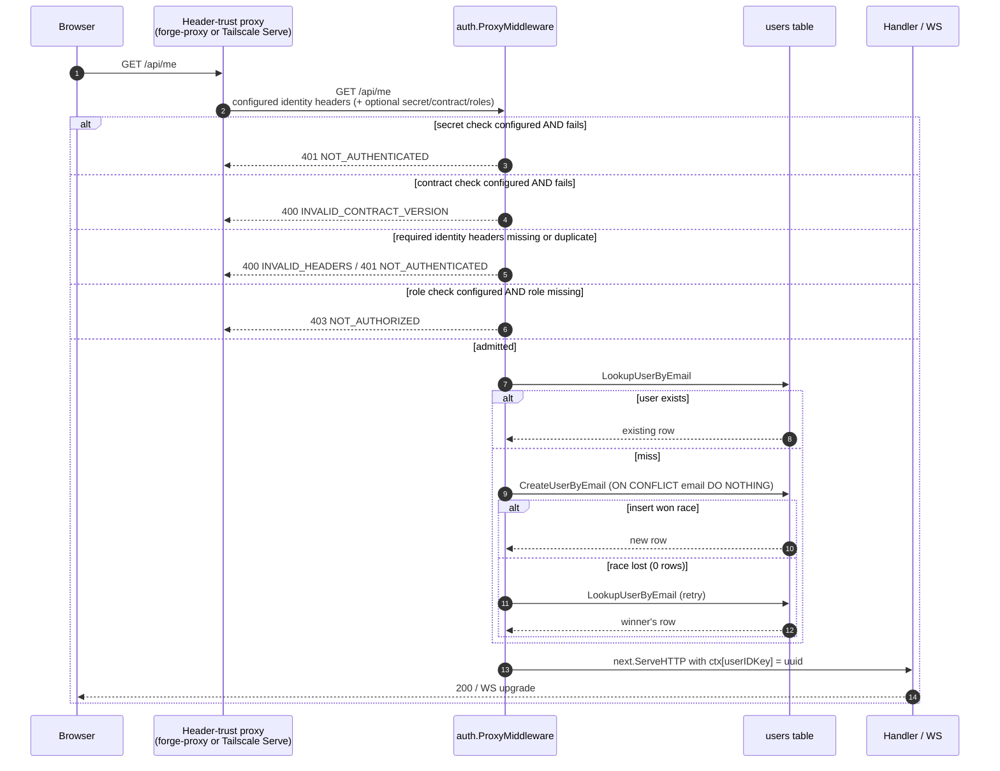

# feat: Unified Proxy Auth Mode (Tailscale Serve + forge-proxy)

## Summary

Collapse Deuce's vendor-specific `forge-proxy` auth mode into a unified `proxy` mode whose header names are env-configurable, so the same middleware supports forge-proxy, [Tailscale Serve](https://tailscale.com/docs/features/tailscale-serve), and any future header-trust reverse proxy. The optional checks — shared-secret comparison, contract-version pin, required-role gate — fire only when their configuration is supplied; forge-proxy turns all three on, Tailscale Serve turns only required-role on (sourced from `Tailscale-App-Capabilities`). Email replaces the int64 `forge_user_id` as the canonical user identifier; the `forge_user_id` / `forge_first_seen_at` columns are dropped. This is a breaking change to env vars and the DB schema, taken now because Deuce is early alpha with no production users to migrate.

---

## Problem Frame

The current `forge-proxy` middleware in [server/internal/auth/forge_proxy.go](server/internal/auth/forge_proxy.go) is hardcoded to forge-proxy's specific header names (`X-Forge-Proxy-Secret`, `X-Forge-User-Id`, `X-Forge-Roles`, …), its int64 user-ID identifier, and the assumption that secret + contract-version + role checks are all mandatory. Tailscale Serve is the next ingress we want to support: it passes `Tailscale-User-Login` (email), `Tailscale-User-Name`, `Tailscale-User-Profile-Pic`, and an optional `Tailscale-App-Capabilities` JSON header — but no shared secret (the tailnet is the trust boundary, the same way loopback is in dev mode), and no contract-version concept.

Rather than ship a second parallel middleware that duplicates the upsert / context-injection / duplicate-header-rejection / log-sanitization logic, generalize the existing one. The substance of "trust headers from a private ingress, look up or create a user, populate the user-id context key" is identical across both providers; only the header names and which checks fire differ.

---

## Requirements

- R1. `DEUCE_AUTH_MODE=proxy` selects a single configurable middleware. The existing `forge-proxy` value is removed; `dev` remains the default.
- R2. Header names for **email**, **name**, **avatar**, and **roles** are env-configurable. There are no defaults — operators wire each header to whatever their proxy emits.
- R3. **Email** and **name** headers are required. Missing or duplicate occurrences reject with `400 INVALID_HEADERS` (duplicates) or `401 NOT_AUTHENTICATED` (missing).
- R4. **Avatar** header is optional. When absent or scheme-invalid (not `http`/`https`), the upsert receives an empty string.
- R5. **Shared secret check** fires only when `DEUCE_PROXY_HEADER_SECRET` and `DEUCE_PROXY_SECRET` are both set. Validation uses `crypto/subtle.ConstantTimeCompare` after a length precheck. Failure → `401 NOT_AUTHENTICATED`.
- R6. **Contract-version check** fires only when `DEUCE_PROXY_HEADER_CONTRACT_VERSION` is set. Validates equality against `DEUCE_PROXY_CONTRACT_VERSION`. Failure → `400 INVALID_CONTRACT_VERSION`.
- R7. **Required-role check** fires only when `DEUCE_PROXY_HEADER_ROLES` is set. The roles header parses as CSV or JSON-array per `DEUCE_PROXY_ROLES_FORMAT` (`csv` | `json-array`). The configured `DEUCE_PROXY_REQUIRED_ROLE` must appear as an exact-equality member of the parsed list. Failure → `403 NOT_AUTHORIZED`.
- R8. The user is identified by **email**. Middleware looks up `users` by email, inserts on miss (`ON CONFLICT (email) DO NOTHING RETURNING *`), and re-looks-up on race-loss. Profile fields (`name`, `avatar`) are captured on first sight and not refreshed on subsequent requests — same posture as the prior forge-proxy plan.
- R9. Startup validation refuses to bind when `DEUCE_AUTH_MODE=proxy` is set with inconsistent config: required headers missing, secret-header without secret value, contract-header without contract value, roles-header without required role, invalid roles format, or wildcard WebSocket origins. All errors aggregate into a single message listing missing/invalid fields.
- R10. The `forge_user_id` and `forge_first_seen_at` columns are dropped from `users`. All queries, sqlc generated code, and generated joined-`SELECT u.*` projections (teams, sessions) regenerate cleanly.
- R11. The frontend behavior is unchanged: a `403 NOT_AUTHORIZED` on `/api/me` still triggers `NotAuthorizedView`. The HTTP error contract (`{"error":{"code":"...","message":"..."}}`) is preserved.
- R12. The hosted-deployment checklist in [CLAUDE.md](CLAUDE.md) is rewritten for the unified mode, with Tailscale Serve and forge-proxy example env configurations.

---

## Scope Boundaries

- **No new auth providers beyond header-trust.** No OAuth, no password login, no JWT issuance.
- **No multi-role policy.** Single required role only, matching the existing forge-proxy semantics.
- **No per-team or per-project authorization** inside Deuce. Header-trust is app-level admission only.
- **No backwards-compatibility shims for `forge-proxy` env vars.** `FORGE_PROXY_SECRET`, `FORGE_REQUIRED_ROLE`, `FORGE_CONTRACT_VERSION`, `DEUCE_AUTH_MODE=forge-proxy` are removed outright. Operators rename to the new names. There are no aliases, no deprecation warnings.
- **No data migration for existing `forge_user_id` rows.** Early alpha; no production users. The column is dropped, not preserved.
- **No JSON-path syntax for roles.** `DEUCE_PROXY_ROLES_FORMAT=json-array` expects a plain JSON array of strings (e.g. `["cap1","cap2"]`). Tailscale's full app-capability object form (`{"yourdomain.com/cap":[{}]}`) is not supported in this iteration; operators using complex capability objects must configure Tailscale Serve to emit a simpler shape or wait for a follow-up.
- **No stale-profile refresh.** Carried forward from the forge-proxy plan: name/avatar captured on first sight, never updated.
- **No new tests beyond updating the existing middleware suite.** Frontend behavior is byte-identical from the SPA's perspective; no new SPA tests needed.
- **No exemption endpoints.** `/healthz` does not exist today; adding one stays out of scope.

### Deferred to Follow-Up Work

- **Tailscale app-capability object parsing.** Support `{"yourdomain.com/cap/deuce/admin":[{"role":"admin"}]}` shape if a real Tailscale deployment needs richer permission grants.
- **Mid-session WebSocket revocation.** Same v1 policy as the forge-proxy plan: revocation effective next page reload.
- **Stale-profile refresh.** A future plan adds a force-refresh endpoint or last-seen-driven refresh policy.
- **Compounding a `docs/solutions/` learning** for the unified proxy header trust contract. Run `/ce-compound` after this ships.
- **Optional secret rotation overlap window** (`DEUCE_PROXY_SECRET_OLD`). Defer until rotation cadence makes the brief 401 window painful.

---

## Context & Research

### Relevant Code and Patterns

- [server/internal/auth/forge_proxy.go](server/internal/auth/forge_proxy.go) — the entire existing middleware (~290 lines). This plan rewrites it in place. Key pieces to preserve verbatim: the `singleHeader` / `singleHeaderOr` duplicate-header rejection (L218-235), `sanitizeForLog` (L268-281), `validatedAvatar` (L253-263), `writeAuthError` (L283-292), race-loser re-lookup pattern (L161-172), and the `userIDKey` ctx-injection at L209.
- [server/internal/auth/context.go](server/internal/auth/context.go) — `userIDKey` and `GetUserID(ctx)` are unchanged. The new middleware writes to the same key.
- [server/internal/auth/forge_proxy_test.go](server/internal/auth/forge_proxy_test.go) — 629-line test file, the de-facto bar for middleware testing. The `fakeStore` interface (L37-72), `captureLogs` helper (L103-109), `validHeaders` baseline (L113-123), `invoke` entrypoint (L128-137), and `assertNotAuthed` helper (L139-158) all transfer to the new test file with renaming.
- [server/internal/config/config.go](server/internal/config/config.go) — flat `Config` struct, `caarlos0/env/v11` tags, `Validate()` aggregates missing fields into a single error (L52-81). The `WSAllowedOriginList` CSV-trim-drop-empty helper (L37-46) is the pattern for the new roles-header parser.
- [server/internal/config/config_test.go](server/internal/config/config_test.go) — existing config validation tests; mirror the substring-list assertion pattern in `TestValidate_ForgeProxyAllMissingErrorLists` (L96-110).
- [server/internal/server/server.go](server/internal/server/server.go) — CORS `AllowedHeaders` block (L54-59) currently lists seven `X-Forge-*` headers plus two unused `X-Forge-Slack-*`. The new wiring removes all of these and replaces them with the configured header set computed at startup. Middleware selection at L69-73 branches on `cfg.AuthMode == config.AuthModeForgeProxy`; the new branch is `AuthModeProxy`.
- [server/internal/db/queries/users.sql](server/internal/db/queries/users.sql) — current `LookupUserByForgeID` / `CreateUserByForgeID` pair (L7-14). The new pair is `LookupUserByEmail` / `CreateUserByEmail` keyed on the existing `email UNIQUE NOT NULL` column.
- [server/internal/db/migrations/001_initial_schema.sql](server/internal/db/migrations/001_initial_schema.sql) — `users.email` is already `UNIQUE NOT NULL` with `created_at TIMESTAMPTZ NOT NULL DEFAULT now()`. No new column is needed; `created_at` covers the "first seen at" audit need that `forge_first_seen_at` was added for.
- [server/internal/db/migrations/006_user_forge_id.sql](server/internal/db/migrations/006_user_forge_id.sql) — the migration that added the columns being dropped. The new `007_*.sql` migration drops them; its Down re-adds them in the same shape as 006's Up.
- [server/internal/db/users.sql.go](server/internal/db/users.sql.go), [server/internal/db/models.go](server/internal/db/models.go), [server/internal/db/teams.sql.go](server/internal/db/teams.sql.go), [server/internal/db/sessions.sql.go](server/internal/db/sessions.sql.go) — sqlc regenerates these after dropping the columns. `teams.sql.go` and `sessions.sql.go` reference the columns in joined `SELECT u.*` projections; regeneration removes them.
- [server/internal/handler/handler.go](server/internal/handler/handler.go) — `writeError(w, status, code, message)` helper, unchanged.
- [server/internal/handler/websocket.go](server/internal/handler/websocket.go), [server/internal/handler/terminal.go](server/internal/handler/terminal.go), [server/internal/ws/client.go](server/internal/ws/client.go) — WebSocket origin allow-list plumbing already lands `cfg.WSAllowedOrigins` through the handler constructor. No changes needed for this plan.
- [src/lib/api.ts](src/lib/api.ts) (L6-21, L34-41), [src/components/auth/NotAuthorizedView.tsx](src/components/auth/NotAuthorizedView.tsx), [src/app/App.tsx](src/app/App.tsx) (L4, L18, L37, L94-95) — the frontend `ApiError` + `NotAuthorizedView` flow is unchanged; this plan preserves the `NOT_AUTHORIZED` 403 contract from the middleware.
- [CLAUDE.md](CLAUDE.md) — Environment Variables block (L81-99) and Hosted deployment checklist (L100-110) are the source of truth for documented env vars. Both get rewritten as part of this plan.

### Institutional Learnings

`docs/solutions/` has one entry (DevPod workspace bind mounts) — not applicable. After this ships, run `/ce-compound` to capture: generalizing a vendor-specific proxy middleware into a configurable one, email-as-canonical-ID with `ON CONFLICT (email)`, optional-check pattern (only enforce when the corresponding env var is configured), and dropping a recently-added BIGINT FK column.

### External References

- [Tailscale Serve documentation](https://tailscale.com/docs/features/tailscale-serve) — identity header contract (`Tailscale-User-Login`, `Tailscale-User-Name`, `Tailscale-User-Profile-Pic`), the "bind to localhost" guidance, the `--accept-app-caps` flag enabling `Tailscale-App-Capabilities`, and the non-tailnet exclusion (Funnel and tagged-device requests omit identity headers — they arrive with no headers and our middleware rejects them as `401`).
- [Tailscale app capabilities](https://tailscale.com/docs/features/access-control/grants/grants-app-capabilities) — the `Tailscale-App-Capabilities` header is JSON-serialized when forwarded. This plan supports the plain-string-array form; richer capability-object forms defer.
- [forge-proxy](https://github.com/forgeutah/forge-proxy) — header contract for the forge-proxy provider; unchanged semantics under the new middleware.
- Go [`crypto/subtle.ConstantTimeCompare`](https://pkg.go.dev/crypto/subtle#ConstantTimeCompare) — secret comparison.

---

## Key Technical Decisions

- **One middleware, optional checks gated by config.** A single `ProxyMiddleware` reads the configured header set. The secret check, contract-version check, and role check each fire only when their backing env var is non-empty. This is enforced at `Config.Validate()` time so the runtime path is straight-line: if `config.SecretHeader != ""`, run the secret check; otherwise skip it. No per-request branching on "is this forge-proxy or Tailscale" — the configuration determines behavior.
- **Email as the user lookup key.** Both providers emit an email-shaped identifier (`X-Forge-Email`, `Tailscale-User-Login`). The trade-off is explicit: if a user's email changes upstream, they get re-provisioned as a new Deuce account. We accept this for v1; the dominant case in practice is stable emails. `forge-proxy`'s recommendation to key on the int64 ID was correct in theory but adds a column-per-provider that Tailscale can't satisfy from headers alone.
- **Drop `forge_user_id` and `forge_first_seen_at` in this work.** Early alpha, no users to migrate. `users.created_at` already covers the audit need that `forge_first_seen_at` was added for. Leaving the columns dormant would rot the schema and confuse future contributors.
- **Header names have no defaults.** Every operator wires headers to their specific proxy; defaults invite copy-paste errors where a proxy switch leaves a stale header name working as a partial validation. Required headers without an env var → startup error.
- **Roles header format is an enum, not a path expression.** `csv` and `json-array` cover both real-world providers in scope. A JSON-path mini-language would be premature.
- **Constant-time secret comparison and length precheck stay byte-equivalent to the existing forge_proxy.go.** This is sensitive code; the refactor changes header names but not the comparison logic.
- **Duplicate-header rejection stays mandatory** for every configured header, regardless of mode. Header smuggling is a generic risk; treating it as forge-proxy-specific would be a regression.
- **Log-injection sanitization stays mandatory.** `sanitizeForLog` (CR/LF/NUL strip + 256-byte clamp) applies to every header value logged for audit, regardless of provider.
- **CORS `AllowedHeaders` is computed from config at startup.** Hardcoding the X-Forge-* set was a forge-proxy-ism; the unified mode emits the configured header names plus the always-present `X-User-ID` (dev only, ignored in proxy mode) and standard headers. In production CORS doesn't apply (forge-proxy and Tailscale Serve are server-to-server), but dev tooling benefits from explicit allow-listing.
- **Frontend contract unchanged.** The `NOT_AUTHORIZED` 403 code on `/api/me` remains the sole trigger for `NotAuthorizedView`. Every other status/code combination flows through the existing `ApiError` path. No SPA changes in this plan.

---

## Open Questions

### Resolved During Planning

- *Should `tailscale` be a separate mode from `proxy`?* No. Single configurable middleware; the user explicitly affirmed the unified approach.
- *Use email or add a `tailscale_login` / `proxy_user_id` column?* Use email. The user explicitly affirmed dropping the identifier column entirely.
- *Keep `forge-proxy` env vars as aliases?* No. Early alpha; clean rename. The user explicitly affirmed no backwards-compat.
- *Where does the JSON roles parser live?* In the middleware file, hand-rolled with `encoding/json` to unmarshal into `[]string`. No new dependency.
- *Does the WebSocket origin allow-list change?* No — its plumbing is already provider-agnostic.

### Deferred to Implementation

- Exact env-var prefix collision check at startup (e.g. if `DEUCE_PROXY_HEADER_EMAIL` and `DEUCE_PROXY_HEADER_NAME` map to the same header name, behavior is ambiguous). Resolve when writing `Config.Validate()`.
- Whether the configured-headers CORS list should include or exclude `X-User-ID` when in proxy mode. Default: include for backwards-compat with any dev tooling that injects it; the proxy middleware ignores it regardless.

---

## High-Level Technical Design

> *This illustrates the intended approach and is directional guidance for review, not implementation specification. The implementing agent should treat it as context, not code to reproduce.*



**Per-request decision flow** — order matters: cheapest / most-attack-surface-relevant checks first, DB last.

| Step | Check | Fires when | On failure |
|------|-------|------------|------------|
| 1 | Configured secret header present + constant-time compare | `SecretHeader != ""` | `401 NOT_AUTHENTICATED` |
| 2 | Configured contract-version header parses + equals pinned value | `ContractVersionHeader != ""` | `400 INVALID_CONTRACT_VERSION` |
| 3 | Email header present (and not duplicate) | always | `400 INVALID_HEADERS` (dup) / `401 NOT_AUTHENTICATED` (missing) |
| 4 | Name header present (and not duplicate) | always | `400 INVALID_HEADERS` (dup) / `401 NOT_AUTHENTICATED` (missing) |
| 5 | Avatar header (if present) scheme is http/https | always (optional) | silent: pass empty avatar to upsert |
| 6 | Configured roles header parses (CSV or JSON-array) + contains required role | `RolesHeader != ""` | `403 NOT_AUTHORIZED` |
| 7 | Resolve user: lookup by email, insert on miss, re-lookup on race | always | `500 DB_ERROR` |
| 8 | Set `userIDKey`, call `next.ServeHTTP` | always | — |

**Configuration shape (env vars):**

```
DEUCE_AUTH_MODE=proxy

# Required identity headers — no defaults
DEUCE_PROXY_HEADER_EMAIL=...
DEUCE_PROXY_HEADER_NAME=...

# Optional identity header
DEUCE_PROXY_HEADER_AVATAR=...

# Optional shared-secret gate (forge-proxy turns this on; Tailscale leaves it empty)
DEUCE_PROXY_HEADER_SECRET=...
DEUCE_PROXY_SECRET=...

# Optional contract-version pin (forge-proxy turns this on; Tailscale leaves it empty)
DEUCE_PROXY_HEADER_CONTRACT_VERSION=...
DEUCE_PROXY_CONTRACT_VERSION=1

# Optional required-role gate
DEUCE_PROXY_HEADER_ROLES=...
DEUCE_PROXY_ROLES_FORMAT=csv     # csv | json-array
DEUCE_PROXY_REQUIRED_ROLE=...
```

**Example: forge-proxy operator env**

```
DEUCE_AUTH_MODE=proxy
DEUCE_PROXY_HEADER_EMAIL=X-Forge-Email
DEUCE_PROXY_HEADER_NAME=X-Forge-Name
DEUCE_PROXY_HEADER_AVATAR=X-Forge-Avatar
DEUCE_PROXY_HEADER_SECRET=X-Forge-Proxy-Secret
DEUCE_PROXY_SECRET=<32+ random bytes>
DEUCE_PROXY_HEADER_CONTRACT_VERSION=X-Forge-Contract-Version
DEUCE_PROXY_CONTRACT_VERSION=1
DEUCE_PROXY_HEADER_ROLES=X-Forge-Roles
DEUCE_PROXY_ROLES_FORMAT=csv
DEUCE_PROXY_REQUIRED_ROLE=member
```

**Example: Tailscale Serve operator env**

```
DEUCE_AUTH_MODE=proxy
DEUCE_PROXY_HEADER_EMAIL=Tailscale-User-Login
DEUCE_PROXY_HEADER_NAME=Tailscale-User-Name
DEUCE_PROXY_HEADER_AVATAR=Tailscale-User-Profile-Pic
DEUCE_PROXY_HEADER_ROLES=Tailscale-App-Capabilities
DEUCE_PROXY_ROLES_FORMAT=json-array
DEUCE_PROXY_REQUIRED_ROLE=example.com/cap/deuce/access
# (no secret, no contract version — tailnet is the trust boundary)
```

---

## Implementation Units

### U1. Drop `forge_user_id` schema and add email-based user queries

**Goal:** Remove `forge_user_id` / `forge_first_seen_at` from `users` and expose `LookupUserByEmail` / `CreateUserByEmail` so the middleware can key on email instead.

**Requirements:** R8, R10

**Dependencies:** None

**Files:**
- Create: `server/internal/db/migrations/007_drop_user_forge_id.sql`
- Modify: `server/internal/db/queries/users.sql`
- Modify (regenerated by sqlc — do not hand-edit): `server/internal/db/users.sql.go`, `server/internal/db/models.go`, `server/internal/db/teams.sql.go`, `server/internal/db/sessions.sql.go`

**Approach:**
- Migration `007_drop_user_forge_id.sql`: Up does `ALTER TABLE users DROP COLUMN forge_first_seen_at, DROP COLUMN forge_user_id;`. Down re-adds them in the same shape as `006_user_forge_id.sql`'s Up (`ADD COLUMN forge_user_id BIGINT UNIQUE, ADD COLUMN forge_first_seen_at TIMESTAMPTZ`), preserving rollback-to-prior-state for local dev.
- In `server/internal/db/queries/users.sql`, **replace** `LookupUserByForgeID` and `CreateUserByForgeID` with:
  - `LookupUserByEmail :one` — `SELECT * FROM users WHERE email = $1`
  - `CreateUserByEmail :one` — `INSERT INTO users (email, name, avatar, status) VALUES ($1, $2, $3, 'online') ON CONFLICT (email) DO NOTHING RETURNING *`
- The old forge queries are deleted, not deprecated. Their generated code is the only caller, and the middleware that uses them gets rewritten in U3.
- Run `cd server && make generate`. Verify that `teams.sql.go` and `sessions.sql.go` regenerate without `ForgeUserID` / `ForgeFirstSeenAt` in their joined-`u.*` projections. `models.go` no longer has those fields on `User`.

**Patterns to follow:**
- Migration shape: [server/internal/db/migrations/006_user_forge_id.sql](server/internal/db/migrations/006_user_forge_id.sql) — symmetric Up/Down with multi-column `ADD`/`DROP`.
- Query shape: existing `LookupUserByForgeID` / `CreateUserByForgeID` at [server/internal/db/queries/users.sql](server/internal/db/queries/users.sql) L7-14. Same `:one` cardinality, same `ON CONFLICT ... DO NOTHING RETURNING *` race-resolution shape.

**Test scenarios:**
- Test expectation: none — schema and codegen change with no behavioral logic. Behavioral coverage of the email-based upsert (insert vs. lookup, race-loser path) lives in U4's middleware tests, which exercise the queries end-to-end against the fake store.

**Verification:**
- `cd server && make migrate` applies migration 007 cleanly; `\d users` in psql shows `forge_user_id` and `forge_first_seen_at` absent.
- `make migrate-down` reverts 007 and re-adds the columns; running it again reverts 006.
- `make generate` produces a clean diff; `go build ./...` from `server/` passes.
- `git grep ForgeUserID server/` returns zero results outside of the about-to-be-rewritten middleware (U3).

---

### U2. Unified proxy config and validation

**Goal:** Replace the forge-specific config fields with the unified `DEUCE_PROXY_*` set; enforce consistency at startup so misconfigured modes refuse to bind.

**Requirements:** R1, R2, R5, R6, R7, R9

**Dependencies:** None (parallel with U1)

**Files:**
- Modify: `server/internal/config/config.go`
- Modify: `server/internal/config/config_test.go`
- Modify: `server/main.go` (rename references from `AuthModeForgeProxy` to `AuthModeProxy` in WARN messaging and any forge-specific logs)
- Modify: `CLAUDE.md` (Environment Variables block + Hosted deployment checklist)

**Approach:**
- In `config.go`:
  - Rename constant `AuthModeForgeProxy = "forge-proxy"` to `AuthModeProxy = "proxy"`. Delete the old constant.
  - Remove fields: `ForgeProxySecret`, `ForgeRequiredRole`, `ForgeContractVersion`.
  - Add fields with empty defaults (presence drives feature activation):
    ```
    ProxyHeaderEmail           string `env:"DEUCE_PROXY_HEADER_EMAIL" envDefault:""`
    ProxyHeaderName            string `env:"DEUCE_PROXY_HEADER_NAME" envDefault:""`
    ProxyHeaderAvatar          string `env:"DEUCE_PROXY_HEADER_AVATAR" envDefault:""`
    ProxyHeaderSecret          string `env:"DEUCE_PROXY_HEADER_SECRET" envDefault:""`
    ProxySecret                string `env:"DEUCE_PROXY_SECRET" envDefault:""`
    ProxyHeaderContractVersion string `env:"DEUCE_PROXY_HEADER_CONTRACT_VERSION" envDefault:""`
    ProxyContractVersion       int    `env:"DEUCE_PROXY_CONTRACT_VERSION" envDefault:"0"`
    ProxyHeaderRoles           string `env:"DEUCE_PROXY_HEADER_ROLES" envDefault:""`
    ProxyRolesFormat           string `env:"DEUCE_PROXY_ROLES_FORMAT" envDefault:""`
    ProxyRequiredRole          string `env:"DEUCE_PROXY_REQUIRED_ROLE" envDefault:""`
    ```
- `Config.Validate()` adds a `case AuthModeProxy` branch. Required when mode is `proxy`:
  - `ProxyHeaderEmail`, `ProxyHeaderName` must be non-empty.
  - If `ProxyHeaderSecret != ""` → `ProxySecret` must also be non-empty (and vice-versa: setting a secret without a header is also rejected to avoid silent no-op).
  - If `ProxyHeaderContractVersion != ""` → `ProxyContractVersion` must be `> 0` (and vice-versa).
  - If `ProxyHeaderRoles != ""` → `ProxyRolesFormat` ∈ `{"csv","json-array"}` AND `ProxyRequiredRole` non-empty (and vice-versa for the role / format being set without the header).
  - Two configured headers cannot map to the same header name (would be ambiguous). Collect non-empty header config values; reject on duplicates with a message that names the colliding env vars.
  - `DEUCE_WS_ALLOWED_ORIGINS` required and non-wildcard (existing rule, unchanged).
- Aggregate every missing/invalid field into a single `fmt.Errorf("proxy mode requires %s", strings.Join(...))` error, matching the existing aggregation pattern at L65-77.
- Reject the literal value `forge-proxy` as `DEUCE_AUTH_MODE` with a clear migration hint: *"DEUCE_AUTH_MODE=forge-proxy is no longer supported; use DEUCE_AUTH_MODE=proxy with DEUCE_PROXY_HEADER_* env vars instead."* This catches the operator's first run after upgrade and tells them what to do.
- Update `server/main.go` localhost-binding WARN to reference `AuthModeProxy` instead of `AuthModeForgeProxy`.
- Rewrite `CLAUDE.md` Environment Variables block: list each new var with one-line purpose and whether it's required/optional/feature-flag. Add forge-proxy and Tailscale Serve example env blocks under the Hosted deployment checklist. Remove the old `FORGE_*` rows entirely.

**Patterns to follow:**
- Existing flat-struct env tags in [server/internal/config/config.go](server/internal/config/config.go); add fields, no nested structs.
- Existing aggregation in `Validate()` at L65-77: build `var missing []string`, append, single `strings.Join`.

**Test scenarios:**
- Happy path: `DEUCE_AUTH_MODE` unset → `cfg.AuthMode == "dev"`, server starts as today.
- Happy path: full forge-proxy-style config (all headers + secret + contract + CSV roles) → `Validate()` returns nil.
- Happy path: Tailscale-style config (headers + JSON roles + required role, no secret, no contract) → `Validate()` returns nil.
- Error path: `DEUCE_AUTH_MODE=proxy` with no header env vars set → aggregate error listing `DEUCE_PROXY_HEADER_EMAIL`, `DEUCE_PROXY_HEADER_NAME`, `DEUCE_WS_ALLOWED_ORIGINS`.
- Error path: secret header set but secret value empty → error names both `DEUCE_PROXY_HEADER_SECRET` and `DEUCE_PROXY_SECRET`.
- Error path: secret value set but secret header empty → symmetric error.
- Error path: contract header set but version `0` → error names `DEUCE_PROXY_CONTRACT_VERSION`.
- Error path: roles header set but format unset → error names `DEUCE_PROXY_ROLES_FORMAT` and `DEUCE_PROXY_REQUIRED_ROLE`.
- Error path: roles header set with format `xml` → error names invalid format with the allowed values.
- Error path: `DEUCE_PROXY_HEADER_EMAIL` and `DEUCE_PROXY_HEADER_NAME` both set to the same value → error names the two env vars and the colliding header.
- Error path: `DEUCE_AUTH_MODE=forge-proxy` → error with migration hint.
- Error path: `DEUCE_AUTH_MODE=mystery` → unknown-mode error (existing test, retargeted).
- Error path: `DEUCE_WS_ALLOWED_ORIGINS=*` in proxy mode → wildcard-rejected error (existing test, retargeted to new mode constant).

**Verification:**
- `cd server && make test` passes (extends `config_test.go`).
- Manual: start the server with each example env block above; confirm it starts. Set `DEUCE_AUTH_MODE=proxy` with no other vars; confirm a single aggregated error to stderr with every missing field listed.
- `go build ./server/...` passes.

---

### U3. Replace `forge_proxy.go` with unified `ProxyMiddleware`

**Goal:** Rewrite the auth middleware to take a configured header set, fire optional checks based on which headers are configured, and look up users by email.

**Requirements:** R1, R2, R3, R4, R5, R6, R7, R8, R11

**Dependencies:** U1, U2

**Files:**
- Delete: `server/internal/auth/forge_proxy.go` (replaced by the new file)
- Create: `server/internal/auth/proxy.go`
- Modify: `server/internal/server/server.go` (middleware selection + CORS allow-list computed from config)
- Modify: `server/internal/auth/context.go` — no functional change; the file stays and the new middleware writes to the same `userIDKey`.

**Approach:**

**Public surface:**
- A `ProxyConfig` struct gathers everything the middleware needs at construction: the configured header names, the optional secret value, the optional contract version (int), the optional required role and roles format. The middleware is constructed once at server startup from `cfg`.
- A `ProxyUserStore` interface declares the two queries (`LookupUserByEmail`, `CreateUserByEmail`) — `*db.Queries` satisfies it implicitly. Tests inject a fake.
- Constructor signature:
  ```go
  func ProxyMiddleware(store ProxyUserStore, pc ProxyConfig) func(http.Handler) http.Handler
  ```
  The constructor pre-computes `[]byte(pc.Secret)` once so per-request work avoids reallocation.

**Per-request flow:** mirrors the existing forge_proxy.go almost exactly, with the header *names* swapped for `pc.EmailHeader` / `pc.NameHeader` / etc., and each check guarded by `if pc.SecretHeader != "" { … }` and so on. Order matches the decision-flow table in High-Level Technical Design. Critical pieces lifted from the existing file:

- `singleHeader` / `singleHeaderOr` helpers — verbatim copy.
- `validatedAvatar` (http/https only) — verbatim copy.
- `sanitizeForLog` (strip CR/LF/NUL, clamp 256 bytes) — verbatim copy.
- `writeAuthError` — verbatim copy.
- Race-loser re-lookup after `CreateUserByEmail` returns zero rows — verbatim shape, retargeted to email.
- Email-collision detection (Postgres `23505` on `users_email_key`) — relevant again here, since email is the conflict key. A `users_email_key` collision now means "two callers raced to provision the same email" rather than "a forge user collided with a seed user," but the response is unchanged: log warning, return `409 EMAIL_CONFLICT`. (After the race-loser re-lookup logic, this should only fire if the constraint is `users_email_key` AND the row isn't found on re-lookup — an inconsistent state worth a 409 rather than a silent retry.)

**Roles parsing:** a small `parseRoles(header, format string) ([]string, error)` helper:
- `format == "csv"` → split on `,`, trim each element, drop empties.
- `format == "json-array"` → `json.Unmarshal([]byte(header), &out)` into `[]string`. Reject any other JSON shape with a parse error → `403 NOT_AUTHORIZED` (we treat malformed roles as "this caller does not have the required role" rather than `400`, matching the forge-proxy disposition of role-failure as authorization rather than request-validation).

**Duplicate-header rejection:** every configured header read uses `r.Header.Values(name)` and rejects on `len > 1`. `400 INVALID_HEADERS` for non-secret duplicates, `401 NOT_AUTHENTICATED` for duplicate secret (matches existing forge_proxy.go semantics).

**Server wiring:**
- In `server/internal/server/server.go`, replace the `if s.cfg.AuthMode == config.AuthModeForgeProxy` branch with `if s.cfg.AuthMode == config.AuthModeProxy`; construct `ProxyConfig` from `s.cfg` fields; pass into `auth.ProxyMiddleware`.
- Compute the CORS `AllowedHeaders` list at startup: start from `{"Accept", "Content-Type", "X-User-ID"}` and append the non-empty configured `Proxy*Header` values. Remove all the hardcoded `X-Forge-*` entries.
- Preserve the "never log the secret" comment block (L65-68) and update it to reference `cfg.ProxyHeaderSecret` instead of the literal `X-Forge-Proxy-Secret`.

**Logging policy:**
- Never log the raw secret value, success or failure.
- On `403 NOT_AUTHORIZED`, log `email` (sanitized) and `required_role` via `slog` structured fields.
- On `500 DB_ERROR`, log the real error server-side; the response body says only `"internal error"`. Carry forward verbatim from existing middleware.

**Test scenarios:** *(implemented in U4)*. See below.

**Verification:**
- With the forge-proxy-style env block in U2 example: `curl http://localhost:8080/api/me -H "X-Forge-Proxy-Secret: <secret>" -H "X-Forge-Contract-Version: 1" -H "X-Forge-Email: alice@example.com" -H "X-Forge-Name: Alice" -H "X-Forge-Roles: member"` returns `200`; row appears in `psql` with `email='alice@example.com'`.
- Same `curl` without the secret returns `401`.
- Same `curl` with `X-Forge-Roles: guest` returns `403 NOT_AUTHORIZED`.
- Switching to the Tailscale-style env block and curl with `Tailscale-User-Login`/`Tailscale-User-Name`/`Tailscale-App-Capabilities: ["example.com/cap/deuce/access"]` returns `200`; same call with `Tailscale-App-Capabilities: ["other"]` returns `403`.
- Existing dev-mode behavior (mode unset) is unchanged — handlers see the same `DEUCE_USER_ID` UUID they always did.
- WebSocket upgrade to `/ws` is rejected with `403` for an authenticated user without the required role.

---

### U4. Update middleware unit tests for the unified shape

**Goal:** Port the existing `forge_proxy_test.go` to cover the new `ProxyMiddleware`, adding the optional-check matrix and the JSON roles parser.

**Requirements:** R3, R4, R5, R6, R7, R8, R9

**Dependencies:** U3

**Files:**
- Delete: `server/internal/auth/forge_proxy_test.go`
- Create: `server/internal/auth/proxy_test.go`

**Approach:**
- The helpers (`fakeStore`, `recordingHandler`, `captureLogs`, `validHeaders`, `invoke`, `assertNotAuthed`) port over with email replacing the int64 forge ID and the fake store's interface methods renamed to `LookupUserByEmail` / `CreateUserByEmail`.
- `validHeaders()` now takes a `ProxyConfig` argument so tests can build baselines for forge-style and Tailscale-style configs without duplicating per-test setup.
- Test sections (delimited by `--- … ---` comments):
  - **Identity headers** (email/name/avatar): missing, duplicate, malformed avatar scheme, valid baseline.
  - **Optional secret check**: with secret configured (missing, wrong-same-length, wrong-different-length, duplicate, valid); with secret unconfigured (header presence ignored).
  - **Optional contract version**: with version configured (missing, non-int, wrong version, valid); with version unconfigured (header presence ignored).
  - **Optional roles**: CSV happy path (whitespace tolerance, exact-match, substring-rejection); JSON-array happy path (valid array, contains required, missing required); malformed-JSON → 403; with roles unconfigured (header presence ignored).
  - **User resolution**: lookup hit, lookup miss → create, race-loser re-lookup, email-collision 409, lookup error → 500, create error → 500.
  - **Audit logging**: first-provision info line emitted once with sanitized email; 403 logs the sanitized email and required_role; log-injection (CR/LF in header value) is stripped before emission.
  - **Integration**: with `chi` mounted, the downstream handler parses `auth.GetUserID(ctx)` as a UUID without error.
- Cover both forge-style config and Tailscale-style config in at least one happy-path test each, to prove the optional-check guards work.
- Keep the file under 800 lines by parameterizing the "secret-configured vs not" and "roles-configured vs not" baselines.

**Execution note:** Implement tests in lockstep with the U3 rewrite — when porting a test, port the corresponding middleware logic at the same time. The existing forge_proxy_test.go is the source of truth for which branches need coverage; this unit doesn't add new behavior, it covers behavior preserved or extended in U3.

**Patterns to follow:**
- The existing test file at [server/internal/auth/forge_proxy_test.go](server/internal/auth/forge_proxy_test.go): named `TestX_Y` functions grouped by section comment, hand-rolled fakes (no mocking library), standard library only, `httptest` for request construction.

**Test scenarios:**
- Happy path (forge-style config): valid secret + version + email + name + roles → downstream invoked with `userIDKey` set to upserted UUID; `CreateUserByEmail` called once with email/name/avatar.
- Happy path (Tailscale-style config): valid Tailscale-User-Login + Tailscale-User-Name + Tailscale-App-Capabilities containing required role → downstream invoked; `CreateUserByEmail` called once.
- Happy path (subsequent request): same email seen twice; second call hits the lookup path and does not call `CreateUserByEmail` again.
- Identity header missing (email): → `401 NOT_AUTHENTICATED`, no DB call.
- Identity header missing (name): → `401 NOT_AUTHENTICATED`.
- Identity header duplicate (email × 2): → `400 INVALID_HEADERS`.
- Identity header duplicate (name × 2): → `400 INVALID_HEADERS`.
- Optional secret configured + missing: → `401 NOT_AUTHENTICATED`, no DB call.
- Optional secret configured + wrong same-length: → `401`, no DB call.
- Optional secret configured + wrong different-length: → `401` (does not panic on `subtle.ConstantTimeCompare` length mismatch).
- Optional secret configured + duplicate: → `401`, no DB call.
- Optional secret *not* configured + caller still sends a `X-Forge-Proxy-Secret` header: → admitted (secret check is unconfigured, header is ignored).
- Optional contract configured + missing header: → `400 INVALID_CONTRACT_VERSION`.
- Optional contract configured + non-int value: → `400`.
- Optional contract configured + wrong version: → `400`.
- Optional contract *not* configured + caller sends a contract header: → admitted.
- Roles CSV configured + missing header: → `403 NOT_AUTHORIZED`, no DB call.
- Roles CSV configured + value `member,admin` and required `admin`: → admitted.
- Roles CSV configured + value `  member , admin ` (whitespace) + required `member`: → admitted.
- Roles CSV configured + value `membership` + required `member`: → `403` (substring must not match).
- Roles CSV configured + duplicate header: → `400 INVALID_HEADERS`.
- Roles JSON-array configured + value `["admin","member"]` + required `member`: → admitted.
- Roles JSON-array configured + value `["other"]` + required `member`: → `403`.
- Roles JSON-array configured + malformed JSON: → `403` (we treat parse failure as "no required role").
- Roles JSON-array configured + valid JSON but not an array (e.g. `{"k":1}`): → `403`.
- Roles *not* configured + caller sends a roles header: → admitted (no check fires).
- Avatar header `javascript:alert(1)`: → admitted, `CreateUserByEmail` receives empty avatar.
- Avatar header `https://example.com/a.png`: → upsert receives URL verbatim.
- Avatar header missing: → admitted, upsert receives empty avatar.
- User resolution: lookup returns existing row → downstream invoked, no `Create` call.
- User resolution: lookup miss + create returns row → downstream invoked, audit log emits `auth.proxy: provisioned user` once.
- User resolution: lookup miss + create returns zero rows (race-loser) + re-lookup returns winner row → downstream invoked, no error.
- User resolution: lookup miss + create returns `users_email_key` 23505 error → `409 EMAIL_CONFLICT`, response body does not echo SQL.
- User resolution: lookup miss + create returns generic DB error → `500 DB_ERROR`, body says only `"internal error"`.
- User resolution: lookup itself returns generic DB error → `500 DB_ERROR`, body sanitized.
- Audit: 403 role-mismatch log line contains `email` (sanitized) and `required_role`; no `secret` field.
- Audit: log-injection — header `Tailscale-User-Login: alice\r\nfoo=bar` on a 403 → captured slog record's email field has no CR/LF.
- Integration: with proxy middleware mounted in front of a chi router whose downstream handler calls `uuid.Parse(auth.GetUserID(ctx))`, parse succeeds.

**Verification:**
- `cd server && make test` passes with all cases.
- `go test -race ./server/...` passes.
- Test file is the only `*_test.go` file under `server/internal/auth/` (the old forge_proxy_test.go was deleted, not amended).

---

### U5. Server wiring, CORS allow-list, and docs

**Goal:** Wire the new middleware in `server.go`, recompute CORS `AllowedHeaders` from config, rewrite the CLAUDE.md env-var and deployment-checklist sections.

**Requirements:** R1, R2, R11, R12

**Dependencies:** U2, U3

**Files:**
- Modify: `server/internal/server/server.go` (already touched by U3; this unit consolidates the CORS change)
- Modify: `CLAUDE.md`
- Modify: `.env.example` (create if absent — operators benefit from a worked example)

**Approach:**
- In `server.Router()`, build the CORS `AllowedHeaders` slice at the top of the function:
  ```
  allowedHeaders := []string{"Accept", "Content-Type", "X-User-ID"}
  for _, h := range []string{
      s.cfg.ProxyHeaderEmail, s.cfg.ProxyHeaderName, s.cfg.ProxyHeaderAvatar,
      s.cfg.ProxyHeaderSecret, s.cfg.ProxyHeaderContractVersion, s.cfg.ProxyHeaderRoles,
  } {
      if h != "" {
          allowedHeaders = append(allowedHeaders, h)
      }
  }
  ```
  Pass into `cors.Handler(cors.Options{… AllowedHeaders: allowedHeaders …})`. Remove the hardcoded `X-Forge-*` and `X-Forge-Slack-*` entries.
- Update the "X-Forge-Proxy-Secret must never appear in logs" comment block to a generalized version: *"The configured secret header (`cfg.ProxyHeaderSecret`) must never appear in logs. chi's middleware.Logger records method/path/status/duration only — if anyone introduces a logging middleware that dumps headers, add explicit redaction for `cfg.ProxyHeaderSecret`."*
- Rewrite the **Environment Variables** block in `CLAUDE.md`:
  - Remove: `FORGE_PROXY_SECRET`, `FORGE_REQUIRED_ROLE`, `FORGE_CONTRACT_VERSION`, the `DEUCE_AUTH_MODE=forge-proxy` row.
  - Add: each `DEUCE_PROXY_*` env var with a one-line purpose, with `(required when mode=proxy)` / `(optional)` / `(required when DEUCE_PROXY_HEADER_X is set)` tags.
- Rewrite the **Hosted deployment checklist** block:
  - Generalize the language from "forge-proxy" to "the configured header-trust proxy."
  - Provide two worked example blocks (forge-proxy and Tailscale Serve) inline.
  - Carry forward the "bind to non-public interface", "≥32 random bytes for secret", "no wildcard origins" rules verbatim, retargeted to the new env-var names.
- Create `.env.example` at the repo root with the dev-mode defaults uncommented and both proxy-mode example blocks commented out. (If a `.env.example` already exists, update it in place.)

**Patterns to follow:**
- Existing CORS allow-list construction at [server/internal/server/server.go](server/internal/server/server.go) L51-63.
- Existing CLAUDE.md table shape at [CLAUDE.md](CLAUDE.md) L81-99.

**Test scenarios:**
- Test expectation: none — pure wiring and documentation. Behavioral coverage of the middleware mount is provided by U3 verification (curl smoke tests) and by U4 unit tests for the middleware itself.

**Verification:**
- `go build ./server/...` passes.
- `curl -I -X OPTIONS http://localhost:8080/api/me -H "Origin: http://localhost:4000" -H "Access-Control-Request-Headers: X-Forge-Proxy-Secret"` returns `204` with `Access-Control-Allow-Headers` including `X-Forge-Proxy-Secret` (when the forge-style env block is active).
- Same preflight with the Tailscale-style env block active and `Access-Control-Request-Headers: Tailscale-User-Login` returns `204` with the header in the response.
- `CLAUDE.md` no longer contains the strings `FORGE_PROXY_SECRET`, `FORGE_REQUIRED_ROLE`, or `forge-proxy` outside historical context.
- `.env.example` documents both providers with copy-pasteable blocks.

---

## System-Wide Impact

- **Interaction graph:** the middleware sits in the same chi position as the existing `forge_proxy.go` — in front of every `/api/*` and `/ws` route, after `Logger` / `Recoverer` / `RealIP` / `CORS`. Handlers continue to read user identity via `auth.GetUserID(ctx)`; nothing downstream changes.
- **Error propagation:** the JSON error shape (`{"error":{"code":"...","message":"..."}}`) is identical. The HTTP status code → error code mapping is preserved: `401 NOT_AUTHENTICATED`, `400 INVALID_CONTRACT_VERSION`, `400 INVALID_HEADERS`, `403 NOT_AUTHORIZED`, `500 DB_ERROR`, `409 EMAIL_CONFLICT`. Frontend `ApiError` parsing continues to work without modification.
- **DB write pattern:** lookup-first, insert-on-miss, re-lookup-on-race. Same shape as the forge-proxy plan; only the key column changes (email instead of forge_user_id). The `users_email_key` unique constraint is the conflict point — exists today in the initial schema, no migration required for it.
- **API surface parity:** WebSocket upgrade and REST API traverse the same middleware chain. WebSocket origin allow-list is unchanged from the forge-proxy plan.
- **Unchanged invariants:** `auth.Middleware` (dev mode), `auth.GetUserID`, `userIDKey`, every handler's `uuid.Parse(auth.GetUserID(ctx))` line, the `NotAuthorizedView` SPA component, and the `ApiError` class are all unchanged. Dev mode behavior (default `DEUCE_USER_ID` injection) is byte-identical.
- **Breaking surface (DB):** the `users.forge_user_id` and `users.forge_first_seen_at` columns disappear. Any code that referenced them (currently only the sqlc-generated `User` struct and the two query methods) regenerates without them. No external system (CI, other services, dashboards) references these columns.
- **Breaking surface (env):** `DEUCE_AUTH_MODE=forge-proxy`, `FORGE_PROXY_SECRET`, `FORGE_REQUIRED_ROLE`, `FORGE_CONTRACT_VERSION` are all removed. The first server start after upgrade with the old env values will fail with a clear migration message (per U2). No silent fallback.

---

## Risks & Dependencies

| Risk | Mitigation |
|------|------------|
| **Optional-check misconfiguration silently disables a check** | `Config.Validate()` rejects asymmetric pairs (header-without-value, value-without-header) at startup. Operator gets a clear error before bind. Covered by U2 tests. |
| **Operator copy-pastes a forge-style env block under a Tailscale deployment** | Each header check is independently configured; setting a `DEUCE_PROXY_HEADER_SECRET` that Tailscale never sends would cause every request to 401. Documented in the CLAUDE.md examples and visible immediately. |
| **Email-change re-provisioning loses a user's session history** | Accepted trade-off for v1; documented in Key Technical Decisions. Future plan can add `forge_user_id`-style stable-ID columns per provider if this bites. |
| **Race on first-provision of the same email by two simultaneous requests** | `ON CONFLICT (email) DO NOTHING` plus re-lookup-on-zero-rows, identical to the existing forge_proxy.go race-resolution pattern. Covered by a U4 test scenario. |
| **`users_email_key` collision now blocks legitimate first-provision** | Different semantics from the forge-proxy plan: email collision is now "race resolution" not "two users sharing an email." Re-lookup after `DO NOTHING` is the canonical path; a `23505` after re-lookup-fails returns `409 EMAIL_CONFLICT` for operator investigation. |
| **JSON-array roles parser crashes on hostile input** | `encoding/json.Unmarshal` is safe against arbitrary input. Non-array shapes (objects, scalars, malformed) are treated as `403 NOT_AUTHORIZED` rather than `500`. Covered by U4 tests. |
| **Secret comparison timing leak** | Length precheck then `subtle.ConstantTimeCompare`, identical to existing implementation. Same trade-off documented: one-bit length leak is unexploitable at network precision with a ≥32-byte secret. |
| **Header smuggling via duplicate headers** | Every configured header is read with `r.Header.Values()`; duplicates reject before processing. Covered by U4 tests for each header. |
| **Log injection via attacker-controlled header values** | `sanitizeForLog` (strip CR/LF/NUL, clamp 256 bytes) applies to every logged header value. Covered by U4 tests. |
| **Tailscale-User-Profile-Pic with `javascript:` scheme** | `validatedAvatar` (http/https only) is unchanged from forge_proxy.go and runs regardless of provider. Covered by U4 tests. |
| **First server start after upgrade with old `FORGE_*` env vars** | `Config.Validate()` rejects `DEUCE_AUTH_MODE=forge-proxy` with a migration hint pointing at `DEUCE_PROXY_*`. The operator sees the error before the listener binds. |
| **CORS allow-list missing the configured header at runtime** | `AllowedHeaders` is computed from the same env vars the middleware reads; they cannot diverge. Verified with preflight curl in U5. |
| **Funnel or tagged-device traffic reaching a Tailscale-mode Deuce** | Tailscale Serve omits identity headers for those request types per its docs; our middleware rejects them as `401` (missing required headers). Documented in External References. Deployment checklist instructs operators to avoid Funnel for Deuce. |

---

## Documentation / Operational Notes

- **CLAUDE.md** Environment Variables block and Hosted deployment checklist are rewritten as part of U5. See U5 Approach for the specific content.
- **`.env.example`** at the repo root gets created/updated with three commented-out example blocks: dev mode (which is the default and uncommented), forge-proxy via unified `proxy` mode, and Tailscale Serve via unified `proxy` mode.
- **After this ships, run `/ce-compound`** to capture: the optional-check-by-config pattern, email-as-canonical-ID with `ON CONFLICT (email)`, generalizing a vendor-specific middleware to configurable headers, the CSV/JSON dual-format roles parsing, and the dropped-column migration pattern.

**Hosted deployment checklist** (unified proxy mode — run through this when enabling):

1. **Network binding.** Deuce listens only on loopback or a private overlay network — never a public interface. The configured proxy (forge-proxy daemon or `tailscale serve`) is the sole ingress. Tailscale's own docs reinforce "have the service listen on localhost" for header-based auth.
2. **Secret strength** (if `DEUCE_PROXY_HEADER_SECRET` is set). `DEUCE_PROXY_SECRET` is ≥32 random bytes (e.g. `openssl rand -hex 32`). Rotation manifests as a brief 401 window; coordinate with the proxy.
3. **WebSocket Origin allow-list.** `DEUCE_WS_ALLOWED_ORIGINS` is set to the public hostname(s) of the proxy frontend, never `*`.
4. **Explicit mode.** `DEUCE_AUTH_MODE=proxy` is set explicitly in the production env file — never rely on the default.
5. **Header configuration matches the proxy.** The configured `DEUCE_PROXY_HEADER_*` values match the headers the proxy actually emits. Smoke-test by curling the deuce server directly (bypassing the proxy) and confirming it rejects — proves the secret check (if configured) gates access and that direct access isn't admitted.
6. **No header dumping in logs.** Confirm no logging middleware dumps headers; the configured secret header must never appear in sampled log lines.
7. **Tailscale Serve only.** Funnel and tagged-device traffic are explicitly out of scope — those request types arrive without identity headers and would be rejected as `401`.

---

## Sources & References

- Tailscale Serve headers: <https://tailscale.com/docs/features/tailscale-serve>
- Tailscale app capabilities: <https://tailscale.com/docs/features/access-control/grants/grants-app-capabilities>
- forge-proxy header contract: <https://github.com/forgeutah/forge-proxy>
- Go constant-time compare: <https://pkg.go.dev/crypto/subtle#ConstantTimeCompare>
- Prior forge-proxy plan (superseded by this work): [docs/plans/2026-05-22-001-feat-forge-proxy-auth-mode-plan.md](docs/plans/2026-05-22-001-feat-forge-proxy-auth-mode-plan.md)
- Current middleware: [server/internal/auth/forge_proxy.go](server/internal/auth/forge_proxy.go)
- Current middleware tests: [server/internal/auth/forge_proxy_test.go](server/internal/auth/forge_proxy_test.go)
- Current config: [server/internal/config/config.go](server/internal/config/config.go)
- Current server wiring: [server/internal/server/server.go](server/internal/server/server.go)
- Current users schema: [server/internal/db/migrations/001_initial_schema.sql](server/internal/db/migrations/001_initial_schema.sql), [server/internal/db/migrations/006_user_forge_id.sql](server/internal/db/migrations/006_user_forge_id.sql)
- Current users queries: [server/internal/db/queries/users.sql](server/internal/db/queries/users.sql)
- Current frontend not-authorized flow: [src/components/auth/NotAuthorizedView.tsx](src/components/auth/NotAuthorizedView.tsx), [src/app/App.tsx](src/app/App.tsx), [src/lib/api.ts](src/lib/api.ts)
- Project guidance: [CLAUDE.md](CLAUDE.md)
