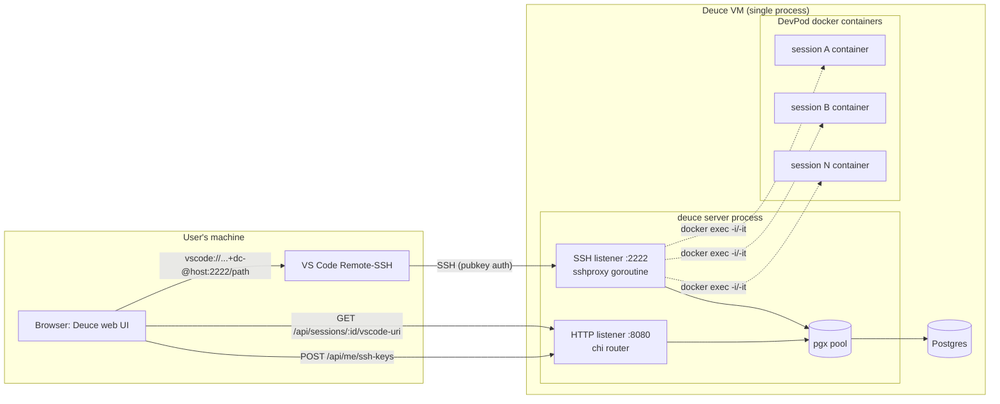
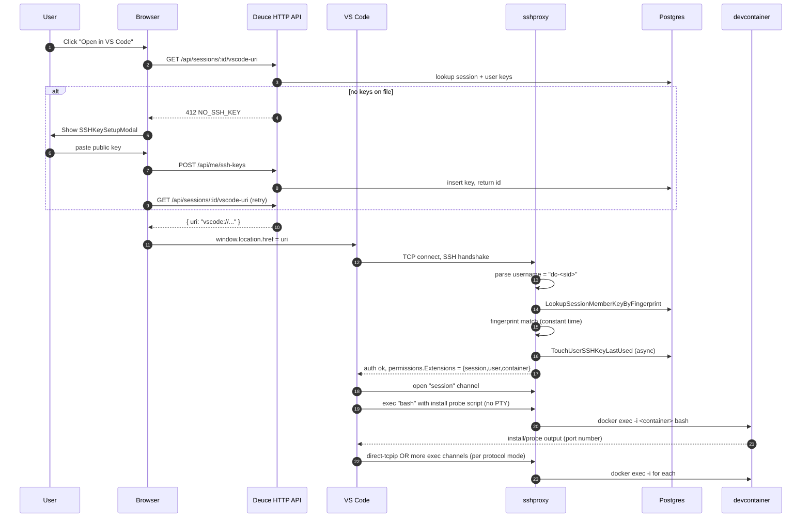
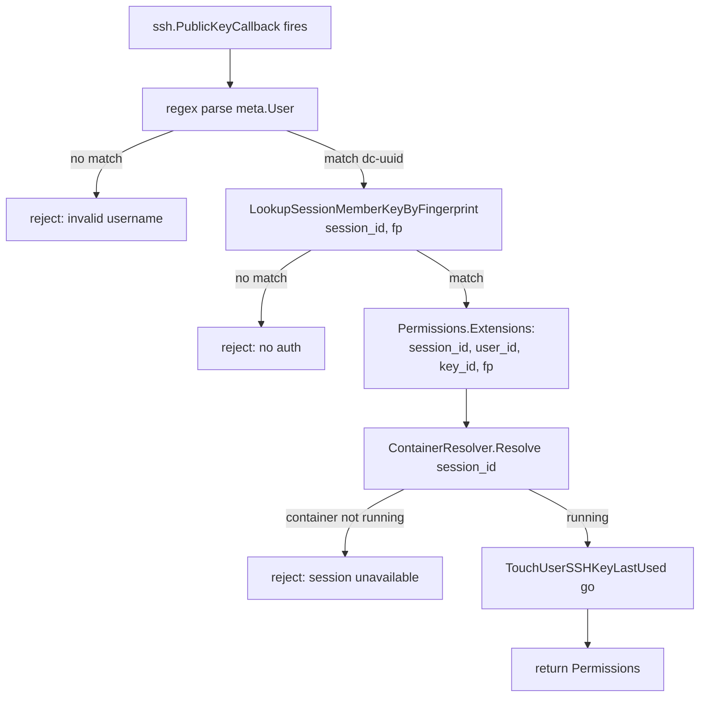

# feat: Open in VS Code via embedded Go SSH proxy

## Summary

Add an "Open in VS Code" button to each Deuce session that opens the session's DevPod devcontainer in VS Code Remote-SSH with **zero client-side configuration**. The mechanism is a Go SSH proxy embedded as a goroutine inside the existing `deuce` server process, listening on a separate port. VS Code connects as `dc-<session-id>@<proxy-host>`, the proxy validates the connection against the owning user's stored SSH public key, and routes each SSH channel into the target Docker container via `docker exec`. First-time users without an SSH key on file are caught by a setup modal that runs at click-time, not at signup.

The Go SSH layer lives in `server/internal/sshproxy/` and calls `db.Queries` and `workspace.Manager` directly. The package is internal to Deuce; extraction to a standalone binary or external package can happen later by moving files, not by pre-introducing abstraction.

---

## Problem Frame

Today, the only way to work in a Deuce session's devcontainer is through the in-browser terminal panel. That terminal is fine for shell tasks but does not give users a real IDE — no LSP, no debugger, no rich editing. Users have asked for "Open in VS Code" because their existing editing muscle is in VS Code Remote-SSH.

The constraints that make this non-trivial:

1. **Devcontainers are not modifiable by Deuce.** They are configured by the code repositories the user is working in. Installing sshd inside every devcontainer is off the table.
2. **Users should configure nothing on their machines.** No `~/.ssh/config` edits, no NSS modules, no host-level setup. The flow must be: click button → VS Code opens → it just works.
3. **Auth must reuse Deuce's user model.** Public keys live on the Deuce user profile. No per-container authorized_keys files.
4. **The VM already runs sshd on port 22 for admin access.** Our proxy cannot collide with it.
5. **Multiple concurrent connections per container are expected.** VS Code opens several SSH channels (install probe, exec server, terminals).

The acceptance shape: a user clicks "Open in VS Code" on a session, and within a few seconds VS Code is connected to the right devcontainer with the user's own identity.

---

## Requirements

| ID  | Requirement                                                                                                                                                  |
| --- | ------------------------------------------------------------------------------------------------------------------------------------------------------------ |
| R1  | A button on the session view triggers VS Code Remote-SSH into the session's devcontainer with no per-launch user action beyond clicking.                     |
| R2  | Users without an SSH public key on file are caught by a setup modal **at click time** that explains why, lets them paste a key, and proceeds on save.        |
| R3  | The Go SSH proxy runs as a goroutine inside the existing `deuce` server process on a configurable port (default `:2222`), sharing the DB pool and config.    |
| R4  | The SSH proxy authenticates connections by parsing `dc-<session-id>` from the username, resolving the owning user, and validating the offered public key.    |
| R5  | The SSH proxy supports the full VS Code Remote-SSH surface: non-PTY `exec`, PTY `shell`, `env`, `pty-req`, `window-change`, `signal`, and SFTP subsystem.    |
| R6  | The SSH proxy package is internal to Deuce in v1 and calls `db.Queries` / `workspace.Manager` directly. Reusability via abstraction is deferred to follow-up. |
| R7  | The user can manage multiple SSH keys (label, fingerprint, created-at, last-used-at) from a settings dialog.                                                  |
| R8  | The proxy never logs full public keys; only SHA256 fingerprints are logged.                                                                                  |
| R9  | The proxy gracefully drains in-flight SSH sessions on shutdown and cleans up child `docker exec` processes when SSH channels close.                          |
| R10 | The `~/.vscode-server` install lives in the devcontainer's own filesystem. Persistence is whatever the devcontainer offers (typically the container's lifetime). A full re-download on container recreate is accepted v1 behavior; cross-container caching is out of scope. |
| R11 | The proxy refuses agent forwarding, password auth, keyboard-interactive auth, GSSAPI, and `direct-tcpip` channels.                                           |
| R12 | The proxy applies a strict username regex and a `MaxAuthTries=3` cap, and exposes connection accounting suitable for structured logging.                     |
| R13 | The `Open in VS Code` button is suppressed on mobile browsers (the URI handoff doesn't work).                                                                 |
| R14 | The proxy applies a pre-handshake deadline (default 10s) and a per-source-IP concurrent-handshake cap (default 8) before invoking `ssh.NewServerConn`.        |
| R15 | After a successful `POST /api/me/ssh-keys`, the response payload includes the new key's `label`, `fingerprint`, and `createdAt` so the frontend can render an immediate inline confirmation. No background events, no expiry; revocation is by explicit DELETE. |

---

## Key Technical Decisions

| Decision                              | Choice                                                                                                                                                                         | Why                                                                                                                                                          |
| ------------------------------------- | ------------------------------------------------------------------------------------------------------------------------------------------------------------------------------- | ------------------------------------------------------------------------------------------------------------------------------------------------------------ |
| SSH library                           | `golang.org/x/crypto/ssh` directly, not `gliderlabs/ssh`                                                                                                                       | Need precise channel/request dispatch for VS Code's specific probe sequence and to inject the resolved session/user into `Permissions.Extensions`.            |
| Deployment shape                      | Embedded goroutine in `deuce` server process                                                                                                                                    | Single process to ops, shares DB pool and config loader, mirrors the WebSocket hub and agent queue goroutine patterns already in `server/main.go`.            |
| Username scheme                       | `dc-<session-uuid>` (stable, resolved at connect time)                                                                                                                          | Survives container recreation, URIs in browser history stay valid, no leak of Docker internals.                                                              |
| Container exec mechanism              | Direct `docker exec -i` (no `-t` for SFTP/non-PTY exec; with `-t` only for `shell` after `pty-req`)                                                                              | Consistent with the rest of the codebase's shell-out style. Avoids adding the heavyweight `docker/client` SDK to `go.mod`. PTY allocation via `creack/pty`.   |
| Container resolution                  | `docker ps --filter label=devpod.workspace=<id> --format {{.Names}}` via existing `workspace.Manager` shell-out style                                                          | DevPod's docker provider labels every container with the workspace ID. No coupling to DevPod's internal naming convention.                                    |
| SFTP strategy                         | Proxy to in-container `/usr/lib/openssh/sftp-server` via `docker exec -i`, with documented requirement; Go SFTP shim deferred to follow-up.                                    | VS Code does NOT use SFTP for the server install (it uses `bash`+`tar`+`curl` over `exec`). SFTP is only needed for binary file ops. Coder/Gitpod require it. |
| Auth coupling                          | `sshproxy` calls `db.Queries` and `workspace.Manager` directly. No `KeyResolver` / `ContainerResolver` interface seam in v1.                                                    | One implementation, no second consumer in sight; abstraction can be added later by extracting types when a real second consumer arrives.                       |
| Public key storage                    | Multiple keys per user via a `user_ssh_keys` table (label, fingerprint UNIQUE, public_key, created_at, last_used_at)                                                            | Standard pattern (GitHub, GitLab, Gitpod). Unique index on fingerprint doubles as O(1) auth lookup.                                                          |
| Library vs binary                      | Internal package (`server/internal/sshproxy/`) only; standalone binary deferred to follow-up if separation-of-attack-surface need arises.                                       | Keeps scope tight. Future extraction is a file-move + small wiring change, not an architectural commitment to make now.                                       |
| `.vscode-server` persistence          | None — the install lives in the devcontainer's existing filesystem and is destroyed with the container.                                                                          | No coordination with DevPod's volume system; first-connect latency (~120MB) is the trade. Per-user / per-image-tag named volumes can be added later if download latency proves painful in real use. |
| Host key                              | ed25519, generated on first boot, persisted at `~/.deuce/ssh_host_ed25519_key` (overridable via `DEUCE_SSH_HOST_KEY_PATH`), perms `0600`.                                       | Avoids `known_hosts` churn. `ssh.MarshalPrivateKey` writes modern OpenSSH PEM.                                                                                |
| URI port handling (**verify early**)  | Use `vscode://vscode-remote/ssh-remote+dc-<session-id>@<host>:<port>/<path>` directly. Fallback: surface a "Copy SSH config snippet" in the setup modal if URI port fails.       | Open VS Code issue (#8764) is contested; modern VS Code reportedly accepts port-in-URI. Verify on day 1 of integration testing before broader implementation.  |
| Username validation                   | Strict regex `^dc-[0-9a-f]{8}-[0-9a-f]{4}-[0-9a-f]{4}-[0-9a-f]{4}-[0-9a-f]{12}$` before any DB lookup                                                                            | Defeats username-confusion timing attacks; rejects garbage early; no DB load on bad usernames.                                                               |
| Algorithm posture                     | Server only offers ed25519 host key. KEX limited to `curve25519-sha256`. Ciphers: `chacha20-poly1305@openssh.com`, `aes256-gcm@openssh.com`.                                    | Eliminates downgrade-to-RSA paths; modern VS Code clients support these defaults.                                                                            |
| Panic isolation                       | Every long-lived goroutine in `sshproxy` (accept loop, per-connection handler, per-channel handler, io.Copy fan-out) wraps work in `defer recover()`; recovered panics log structured `{event:"ssh_panic", session_id, fp}` and close only the affected scope. | A panic inside a session must not kill the HTTP listener that shares the process. Mirrors the chi recovery middleware posture for the HTTP side.              |
| DB pool sharing                       | Single shared `pgxpool.Pool` in v1. Auth callback uses `context.WithTimeout(ctx, 2s)`. No per-connection DB-call semaphore — `MaxAuthTries=3` already caps the worst-case auth-burst at three queries. | Avoids doubling pool config complexity. Add a semaphore or pool split only if metrics show real contention in production. |
| Listener degradation                  | If SSH host-key load or `net.Listen` fails: log error, set in-process `SSHDisabled=true`, continue HTTP-only. `GetSessionVSCodeURI` returns `503 SSH_UNAVAILABLE`.              | A bad host-key file or port-in-use should not 502 the whole product. HTTP is the load-bearing surface.                                                          |
| Public hostname env var                | Use `DEUCE_PUBLIC_HOSTNAME` (generic, future-reusable) as the source of the public hostname embedded in the `vscode://` URI. SSH-specific config keeps the `DEUCE_SSH_*` prefix. | The hostname is not VS-Code-specific; future webhook URLs, magic-link emails, etc., will need it. Avoids a second rename later.                                |
| Key revocation                         | Revocation takes effect on next SSH auth attempt — no real-time disconnect of active sessions. Active VS Code connections stay open until they close naturally or the user disconnects. | Real-time revocation (LISTEN/NOTIFY, periodic poll, etc.) is premature complexity for v1. `MaxAuthTries=3` caps post-revocation reuse to three rejected attempts; deleted keys cannot authenticate new connections. |
| Container name validation              | `workspace.Manager.ContainerName` rejects names not matching `^[a-zA-Z0-9][a-zA-Z0-9_.-]{0,254}$` (Docker's own naming rules) before returning.                                  | Defense-in-depth: prevents a future Docker output-format change or a label-injection attack from producing a malicious argv passed to `docker exec`.            |

---

## High-Level Technical Design

### System architecture



The HTTP and SSH listeners share the same process, the same `pgxpool.Pool`, and the same `config.Config`. Both shut down on the same SIGTERM with a shared 10s drain.

### Connection lifecycle (VS Code Remote-SSH first connect)



### Auth callback decision flow



Note: all reject paths return the same `ssh.ErrNoAuth`-equivalent — no distinction in error class so timing/text cannot leak which step failed.

### Package layout (Output Structure)

The plan introduces one new Go package and a small number of new frontend files:

```
server/
  internal/
    sshproxy/                       # new package
      server.go                     # Server struct, New, ListenAndServe, Shutdown
      config.go                     # Config (resolved subset of app config)
      hostkey.go                    # loadOrGenerateHostKey (ed25519)
      auth.go                       # PublicKeyCallback, username parsing, MaxAuthTries
      session.go                    # session channel handler (exec/shell/env/pty)
      docker.go                     # docker exec command builders + PTY plumbing
      sftp.go                       # SFTP subsystem proxy via docker exec
      logging.go                    # structured-log helpers, fingerprint redaction
      metrics.go                    # connection/session counters (Prometheus-shaped)
      server_test.go                # in-memory listener integration tests
      auth_test.go                  # PublicKeyCallback test matrix
    db/
      migrations/
        008_user_ssh_keys.sql       # new
      queries/
        user_ssh_keys.sql           # new
        sessions.sql                # modified — add LookupSessionByID
    handler/
      ssh_keys.go                   # new — /api/me/ssh-keys CRUD
      sessions.go                   # modified — GetSessionVSCodeURI endpoint
    workspace/
      manager.go                    # modified — ContainerName(ctx, workspaceID)
src/
  components/
    settings/
      SSHKeysDialog.tsx             # new — manage keys
    session/
      SSHKeySetupModal.tsx          # new — action-time setup
    layout/
      CenterPanel.tsx               # modified — Open in VS Code button
      SessionSidebar.tsx            # modified — gear entry to SSH keys
  lib/
    api.ts                          # modified — ssh-keys + vscode-uri wrappers
  types/
    index.ts                        # modified — SSHKey type
```

---

## Implementation Units

### U1. Add `user_ssh_keys` table and sqlc queries

- **Goal:** Persistent storage for per-user SSH public keys with O(1) fingerprint lookup.
- **Requirements:** R4, R7, R8, R12
- **Dependencies:** none
- **Files:**
  - `server/internal/db/migrations/008_user_ssh_keys.sql` (new)
  - `server/internal/db/queries/user_ssh_keys.sql` (new)
  - `server/internal/db/user_ssh_keys.sql.go` (sqlc-regenerated)
  - `server/internal/db/models.go` (sqlc-regenerated)
- **Approach:**
  - Migration creates table with columns: `id UUID PK`, `user_id UUID FK→users(id) ON DELETE CASCADE`, `label TEXT NOT NULL DEFAULT '' CHECK (length(label) <= 255)`, `public_key TEXT NOT NULL CHECK (length(public_key) BETWEEN 1 AND 8192)` (full OpenSSH-format line), `fingerprint TEXT NOT NULL CHECK (fingerprint ~ '^SHA256:[A-Za-z0-9+/]{43}=?$')`, `created_at TIMESTAMPTZ NOT NULL DEFAULT now()`, `last_used_at TIMESTAMPTZ` (nullable). **No expiry column** — keys are valid until explicitly deleted.
  - `CREATE UNIQUE INDEX idx_user_ssh_keys_user_fp ON user_ssh_keys(user_id, fingerprint)` — **per-user** uniqueness only. Allows two users to genuinely share a public key (corporate yubikeys, shared team keys) and prevents the 409 path from leaking key existence across tenants. The composite leftmost prefix also serves list-by-user, so no separate `user_id`-only index is needed.
  - sqlc queries:
    - `ListUserSSHKeys :many`, `GetUserSSHKey :one`, `CreateUserSSHKey :one`, `DeleteUserSSHKey :exec` — all scoped to `user_id` for the `/me/ssh-keys` CRUD endpoints.
    - `LookupSessionMemberKeyByFingerprint :one` — joins `user_ssh_keys` against `session_members` so any session-member's key matches. Used by the SSH proxy auth callback. Returns `(key_id, user_id)`.
    - `TouchUserSSHKeyLastUsed :exec` (sampled: only updates when `last_used_at IS NULL OR last_used_at < now() - interval '1 minute'`).
  - `DeleteUserSSHKey` simply removes the row. Revocation propagates on next SSH auth attempt — no real-time disconnect of active sessions.
- **Patterns to follow:** mirror `server/internal/db/queries/users.sql` for naming and `-- name: ... :one|:many|:exec` syntax. Migration mirrors `001_initial_schema.sql:1-9` style.
- **Test scenarios:**
  - Inserting a key with `(user_id, fingerprint)` already present fails with the unique-constraint error.
  - Two **different** users registering the same fingerprint both succeed (no global uniqueness).
  - `public_key` larger than 8192 bytes is rejected by the CHECK constraint.
  - `fingerprint` not matching the SHA256 regex is rejected by the CHECK constraint.
  - `LookupSessionMemberKeyByFingerprint` returns `(key_id, user_id)` when the fingerprint matches any session-member's key; returns `pgx.ErrNoRows` otherwise.
  - `LookupSessionMemberKeyByFingerprint` returns `pgx.ErrNoRows` when the key owner is in the team but has NOT joined the session (session_members membership is required, not team membership).
  - `TouchUserSSHKeyLastUsed` updates the timestamp on first call; second call within 60s is a no-op (sampling check).
  - `DeleteUserSSHKey` removes only the requested key, scoped to the owning user.
  - Cascade delete: removing a user removes their keys (assertion against the FK).
- **Verification:** `cd server && make migrate && make generate` succeeds; new sqlc methods compile; `make test` passes the new query-level tests.

### U2. *(Deferred to follow-up work — see Scope Boundaries)*

The `sessions.workspace_id` column refactor is forward-looking work that hardens against a future "rename session" feature. Sessions cannot be renamed today, so the SSH proxy can use `session.Name` directly as the workspace ID — preserving the existing repo-wide convention. Deferred. U-ID retained to keep stable references in subsequent units.

### U3. REST API: `/api/me/ssh-keys` CRUD + frontend client

- **Goal:** Users can list, add (paste), and delete their SSH keys.
- **Requirements:** R2, R7
- **Dependencies:** U1
- **Files:**
  - `server/internal/handler/ssh_keys.go` (new)
  - `server/internal/server/server.go` (modified — register subroute, refactor `/me` into a chi `Route`)
  - `src/lib/api.ts` (modified — `listMySSHKeys`, `createMySSHKey`, `deleteMySSHKey`)
  - `src/types/index.ts` (modified — `SSHKey` type with camelCase fields)
  - `server/internal/handler/ssh_keys_test.go` (new)
- **Approach:**
  - Routes registered under `r.Route("/me", ...)`: `GET /ssh-keys`, `POST /ssh-keys`, `DELETE /ssh-keys/{keyID}`.
  - Response struct uses camelCase JSON tags (`id`, `label`, `fingerprint`, `createdAt`, `lastUsedAt`). Never return raw `public_key` in the list response — frontend doesn't need it; only fingerprint/label/timestamps. Return `publicKey` only on the create response so the user can confirm what was stored.
  - Create handler: parses request `{ label, publicKey }`, validates with `ssh.ParseAuthorizedKey`, computes `ssh.FingerprintSHA256`, inserts via `CreateUserSSHKey`. On unique-constraint violation (same user, same key), returns `409 KEY_ALREADY_EXISTS`. The 201 response carries the full new key (id, label, fingerprint, createdAt) so the frontend can render an inline "Key added: `<label>` (SHA256:…)" confirmation immediately (R15). No background events, no notifications table.
  - Delete handler: scopes by `user_id` to prevent cross-user deletion (any path-keyed mismatch returns 404, not 403, to avoid leaking key existence). Removes the row; revocation takes effect on the next SSH auth attempt — no active-session disconnect.
  - Error codes used: `INVALID_BODY`, `INVALID_KEY_FORMAT`, `KEY_TOO_LONG`, `KEY_ALREADY_EXISTS`, `KEY_NOT_FOUND`, `DB_ERROR`.
- **Patterns to follow:** mirror `server/internal/handler/users.go` (GetMe/UpdateMe). Use `writeJSON` / `writeError` from `handler/handler.go`. Use the existing `chi.URLParam` + `uuid.Parse` pattern.
- **Test scenarios:**
  - POST with valid `ssh-ed25519 AAAA...` returns 201 with the new key's id, label, fingerprint, and createdAt (the inline-confirmation payload).
  - POST with `not a key` returns 400 `INVALID_KEY_FORMAT`.
  - POST with a duplicate fingerprint for the same user returns 409 `KEY_ALREADY_EXISTS`.
  - POST with the same fingerprint by a **different** user succeeds (both rows exist, isolated by `user_id`).
  - POST with a key larger than 8192 bytes returns 400 `KEY_TOO_LONG`.
  - GET returns only the calling user's keys, sorted by `createdAt` desc.
  - GET never returns the full `publicKey` field — only fingerprint, label, timestamps.
  - DELETE returns 204 on success; the key is gone from subsequent `LookupSessionMemberKeyByFingerprint` calls.
  - DELETE on another user's key returns 404 (not 403) — no key-existence leak.
  - DELETE of a non-UUID returns 400 `INVALID_KEY_ID`.
  - Integration: create → list shows the new key → delete → list shows it gone.
- **Verification:** `npx tsc --noEmit` passes with the new types; `curl -X POST .../me/ssh-keys` flow works end-to-end against a dev server.

### U4. REST API: `GET /api/sessions/:id/vscode-uri`

- **Goal:** Single endpoint the frontend hits to construct the `vscode://` URI, gated on key presence.
- **Requirements:** R1, R2
- **Dependencies:** U1
- **Files:**
  - `server/internal/handler/sessions.go` (modified — add `GetSessionVSCodeURI`)
  - `server/internal/server/server.go` (modified — register `/sessions/{sessionID}/vscode-uri`)
  - `src/lib/api.ts` (modified — `getSessionVSCodeURI`)
- **Approach:**
  - Returns `{ uri: "vscode://vscode-remote/ssh-remote+dc-<sid>@<host>:<port>/<path>" }`.
  - Host comes from `cfg.PublicHostname` (env `DEUCE_PUBLIC_HOSTNAME`) if set, else from `r.Host` (the public hostname the request arrived on). Port from `cfg.SSHListenAddr` (default 2222).
  - Workspace path: `/workspaces/<session.Name>` (the DevPod-docker convention — `session.Name` is the workspace ID per the existing repo invariant; verified during U5 / U15 integration).
  - If the calling user has zero SSH keys on file, returns `412 NO_SSH_KEY` — the frontend uses this to open the setup modal.
  - If the SSH listener failed to start (per the listener-degradation KTD), returns `503 SSH_UNAVAILABLE`.
  - **Authorization posture:** the URI endpoint requires only an authenticated user (mirrors existing `GetSession` behavior). Deuce's intended access model is team-level — anyone on the team should be able to open team sessions in VS Code. The URI itself contains only the session UUID, public hostname, and port; the real access gate is the SSH proxy's public-key auth (U7).
- **Patterns to follow:** mirror `GetSession` in `server/internal/handler/sessions.go`. Use `getUserID(r)` + `uuid.Parse`.
- **Test scenarios:**
  - User with at least one key on file gets a 200 + URI; URI contains the session UUID, the configured host, and the configured port.
  - User with no keys gets 412 `NO_SSH_KEY`.
  - Non-member of the session gets 404 `SESSION_NOT_FOUND` (do not reveal existence).
  - Hostname env var override: `DEUCE_PUBLIC_HOSTNAME=foo.example.com` shows in URI; absent, host header is used.
  - Invalid session UUID returns 400 `INVALID_SESSION_ID`.
  - When the SSH listener is disabled (host-key load failure simulated), returns 503 `SSH_UNAVAILABLE`.
- **Verification:** hitting the endpoint as a real authed user returns a syntactically valid `vscode://` URI that parses cleanly in a URL parser.

### U5. `workspace.Manager.ContainerName(ctx, workspaceID)` resolver

- **Goal:** Given a DevPod workspace ID, return the running Docker container's name for `docker exec` targeting.
- **Requirements:** R5
- **Dependencies:** none
- **Files:**
  - `server/internal/workspace/manager.go` (modified)
  - `server/internal/workspace/manager_test.go` (new — with a mock `exec.Cmd` runner or skip when `docker` is unavailable)
- **Approach:**
  - Shell out: `docker ps --filter "label=devpod.workspace=<workspaceID>" --format "{{.Names}}"`. Read stdout, trim whitespace, return the first line.
  - **Validate the returned name** against Docker's own naming regex `^[a-zA-Z0-9][a-zA-Z0-9_.-]{0,254}$` before returning. Names that fail this check return `workspace.ErrInvalidContainerName`. Defense-in-depth: prevents a future Docker output-format change or a label-injection attack from producing a malicious argv.
  - If no container is found, return a typed error `workspace.ErrContainerNotRunning`.
  - If multiple containers match (shouldn't happen, but defensive), log a warning and return the first.
  - Respect `context.Context` cancellation by using `exec.CommandContext`.
- **Patterns to follow:** mirror `manager.go`'s existing shell-out style (`exec.CommandContext`, `CombinedOutput`, error wrapping with `%w`). Mirror the timeout convention used in adjacent methods.
- **Test scenarios:**
  - Returns the container name when one exists with the matching label.
  - Returns `ErrContainerNotRunning` when no container matches.
  - Returns `ErrInvalidContainerName` when `docker ps` output is `--privileged`, `-v/:/host`, a name with shell metacharacters, or a leading dash (mocked via a fake exec runner).
  - Cancels the underlying `docker ps` when the context is cancelled.
  - Trims trailing newline from `docker ps` output.
  - Integration (manual): a freshly-created Deuce session resolves to a real container name visible in `docker ps`.
- **Verification:** invoking the resolver from a debug REPL against a live DevPod workspace returns a name matching `docker ps` output.

### U6. `sshproxy` package skeleton: Server, Config, host key

- **Goal:** Package boundary and lifecycle primitives that other units fill in.
- **Requirements:** R3, R6
- **Dependencies:** none
- **Files:**
  - `server/internal/sshproxy/server.go` (new)
  - `server/internal/sshproxy/config.go` (new)
  - `server/internal/sshproxy/hostkey.go` (new)
  - `server/internal/sshproxy/server_test.go` (new)
  - `server/go.mod`, `server/go.sum` (modified — add `golang.org/x/crypto/ssh`)
- **Approach:**
  - `Server` struct holds `cfg sshproxy.Config`, `signer ssh.Signer`, `queries *db.Queries`, `workspaces *workspace.Manager`, `wg sync.WaitGroup`, `done chan struct{}`, `inFlightPerIP map[string]int` (mutex-protected).
  - `New(cfg sshproxy.Config, queries *db.Queries, workspaces *workspace.Manager) (*Server, error)` — loads or generates host key, validates config, validates parent-dir mode (refuses to start if the existing host-key file is permissive or if the parent dir is wider than `0700`).
  - `ListenAndServe(addr string) error` — accept loop with per-source-IP cap check (default 8 concurrent handshakes), `c.SetDeadline(time.Now().Add(cfg.HandshakeTimeout))` (default 10s) on the raw `net.Conn` cleared after `NewServerConn` returns. Wraps the accept loop in `defer recover()`; wraps each per-connection handler goroutine in `defer recover()` so a panic only kills that connection.
  - `Shutdown(ctx context.Context) error` — closes the listener, sends `disconnect` with reason "server shutting down" to each active connection with a 5s grace, waits for active connections with a context-bounded drain (mirror `agent/queue.go` shutdown pattern).
  - `loadOrGenerateHostKey(path string) (ssh.Signer, error)` — `os.ReadFile`; on `os.IsNotExist`, `ed25519.GenerateKey` + `ssh.MarshalPrivateKey` + atomic write (`O_EXCL`, mode `0600`). Parent dir via `os.MkdirAll(dir, 0o700)` followed by an explicit `os.Chmod(dir, 0o700)` (because `MkdirAll` respects `umask`).
  - No interface seam — auth callbacks call `s.queries.LookupSessionMemberKeyByFingerprint(ctx, sid, fp)` directly; channel handlers call `s.workspaces.ContainerName(ctx, workspaceID)` directly.
- **Patterns to follow:** graceful-shutdown shape from `server/internal/agent/queue.go` `Shutdown`; long-running goroutine + WaitGroup model from `server/internal/server/server.go:94` (`hub.Run`).
- **Test scenarios:**
  - First boot generates a host key file with mode `0600` at the configured path.
  - With `umask 0` set in the test, the parent directory ends up exactly `0700` (regression for the explicit `Chmod` after `MkdirAll`).
  - Second boot loads the existing key and produces the same fingerprint.
  - Refusing to start when the host key file exists with permissive mode (e.g., `0644`).
  - Pre-handshake client that connects and sends no bytes is disconnected after `HandshakeTimeout`; goroutine count returns to baseline within 1s.
  - 9th simultaneous handshake from the same source IP is rejected immediately with `Close()`; the first 8 proceed normally.
  - Synthetic panic from a stubbed connection handler: the listener survives and a second connection succeeds (panic-isolation regression).
  - `Shutdown(ctx)` closes the listener, waits for in-flight connections, returns when all done OR when ctx cancels (whichever first).
  - `ListenAndServe` returns immediately when the listener is closed externally.
  - `New` with a missing host-key path that fails to write (parent dir read-only) returns an error; the caller (`main.go`) is expected to log and set `SSHDisabled=true`.
- **Verification:** `go test ./internal/sshproxy/...` passes; manually running `nc 127.0.0.1 2222` in a test deployment produces the `SSH-2.0-Deuce_<ver>` banner.

### U7. SSH server: connection accept + `PublicKeyCallback`

- **Goal:** Authenticate connections by parsing username, resolving the session/user, and validating the offered key. Inject identity into `Permissions.Extensions`.
- **Requirements:** R4, R8, R11, R12
- **Dependencies:** U6, U1
- **Files:**
  - `server/internal/sshproxy/auth.go` (new)
  - `server/internal/sshproxy/auth_test.go` (new)
  - `server/internal/sshproxy/logging.go` (new — fingerprint redaction helpers)
- **Approach:**
  - `ssh.ServerConfig.PublicKeyCallback`:
    1. Validate `meta.User()` against `^dc-[0-9a-f]{8}-[0-9a-f]{4}-[0-9a-f]{4}-[0-9a-f]{4}-[0-9a-f]{12}$`.
    2. Parse the session UUID.
    3. Compute `ssh.FingerprintSHA256(key)`.
    4. Call `s.queries.LookupSessionMemberKeyByFingerprint(ctx, sessionID, fp)` directly — matches any session-member's key. Returns `(key_id, user_id)` of the matched key.
    5. Call `s.workspaces.ContainerName(ctx, session.Name)` — failure here returns `ErrNoAuth` so the connection is refused at auth time, not after VS Code is already chatty.
    6. On success, return `&ssh.Permissions{Extensions: map[string]string{"session-id": sid, "user-id": uid, "key-id": kid, "fp": fp}}`. **Always build from the current call's key** (per the `crypto/ssh` "last key wins" semantic — never cache from an earlier call). SECURITY: this struct must never be logged in full; only `fp` is safe to log.
  - Set `MaxAuthTries = 3`, `NoClientAuth = false`, `PasswordCallback = nil`, `KeyboardInteractiveCallback = nil`, `BannerCallback` returns a generic notice (no version, no host info).
  - `Config.KeyExchanges = []string{"curve25519-sha256", "curve25519-sha256@libssh.org"}`. `Config.Ciphers = []string{"chacha20-poly1305@openssh.com", "aes256-gcm@openssh.com"}`. `Config.MACs = []string{"hmac-sha2-256-etm@openssh.com", "hmac-sha2-512-etm@openssh.com"}`.
  - `AuthLogCallback` logs structured events: `{event: "ssh_auth", session_id, fp, method, success, src_ip}`. Never log full keys.
  - `DeuceKeyResolver` implementation calls `LookupSessionMemberKeyByFingerprint(sessionID, fp)` directly (the JOIN-based query handles the session-membership check in one round-trip). Returns `pgx.ErrNoRows` as "not authorized" (mapped to `ssh.ErrNoAuth`).
- **Patterns to follow:** `auth.ProxyConfig` interface design (`server/internal/auth/proxy.go:33-55`); writeError-equivalent constant codes; constant-time string comparison is unnecessary since `ssh.KeysEqual` is already constant-time at the byte level via the underlying `Marshal` compare.
- **Test scenarios:**
  - Username `dc-<valid-uuid>` with matching key from a session-member → returns Permissions with `session-id`, `user-id`, `key-id`, `fp` populated (generic keys, no `deuce-` prefix).
  - Username `dc-<valid-uuid>` whose key belongs to a user in the same team but NOT in `session_members` → returns `ErrNoAuth` (session-member scope is enforced).
  - Username `dc-<valid-uuid>` with no matching key → returns `ErrNoAuth`.
  - Username `dc-<valid-uuid>` whose `ContainerResolver.Resolve` returns `ErrContainerNotRunning` → returns `ErrNoAuth` (Docker daemon down or container destroyed).
  - Username `root`, `admin`, `dc-bogus`, empty → returns `ErrNoAuth` without any DB lookup (verified by mock-store call count = 0).
  - Username with valid UUID for a non-existent session → returns `ErrNoAuth`; mock store called once.
  - Username with embedded NULL byte (`dc-00000000-0000-0000-0000-000000000000\x00admin`) → rejected without DB lookup.
  - Username with Unicode UUID-lookalikes (full-width digits) → rejected without DB lookup.
  - Username with trailing whitespace or overlong UTF-8 encodings of hex digits → rejected without DB lookup.
  - Multiple key offerings: only the final accepted key's `Permissions` are returned (last-call invariant).
  - `MaxAuthTries=3` is enforced — fourth attempt is rejected at the protocol level.
  - `BannerCallback` returns a generic banner that does not include the deuce version or hostname.
  - `AuthLogCallback` produces a structured log line containing the fingerprint, never the public key.
- **Verification:** `ssh -i ~/.ssh/test_key -p 2222 dc-<sid>@127.0.0.1 echo hi` succeeds when the key is registered; same command with an unregistered key fails with "Permission denied (publickey)".

### U8. SSH server: session channel handler (`exec`, `shell`, `env`, `pty-req`, `window-change`, `signal`)

- **Goal:** Pipe each SSH `session` channel into a `docker exec` invocation against the resolved container, handling VS Code's specific request patterns.
- **Requirements:** R5, R9
- **Dependencies:** U6, U7, U5
- **Files:**
  - `server/internal/sshproxy/session.go` (new)
  - `server/internal/sshproxy/docker.go` (new)
  - `server/internal/sshproxy/deuce_resolver.go` (modified — `ContainerResolver` impl)
  - `server/internal/sshproxy/session_test.go` (new)
- **Approach:**
  - **Channel-open allowlist** is exactly `{"session"}`. `direct-tcpip`, `direct-streamlocal@openssh.com`, `x11`, `auth-agent@openssh.com`, and all others are rejected with `ssh.Prohibited` at the channel-open stage (in U6's accept loop, but exercised here too).
  - **Per-connection channel cap:** `MaxChannelsPerConn=8` enforced via a semaphore on the `ServerConn`. The 9th channel-open returns `ssh.ResourceShortage`. **Lifetime channel counter** at 64 also rejects with `ResourceShortage`. Process-wide cap on concurrent `docker exec` children at 256 (return `ResourceShortage` on `NewChannel` when over).
  - On `session` channel open: build a channel-scoped context derived from the connection context. Spawn a goroutine that consumes requests, wrapped in `defer recover()` so a panic here only kills the channel.
  - **Session-channel request-type allowlist** is `{pty-req, env, shell, exec, subsystem, window-change, signal}`. Unknown types and `auth-agent-req@openssh.com` get `req.Reply(false, nil)` and are otherwise ignored.
  - **Buffer `pty-req` and `env` requests** until `shell`, `exec`, or `subsystem` arrives — these are the trigger that starts the docker exec.
  - On `exec`: `docker exec -i <container> /bin/sh -c <command>` (no `-t`, even if pty-req was buffered — but if pty-req IS buffered, use `-t` and allocate via `creack/pty`. VS Code's install probe never sets pty-req, so this naturally chooses non-PTY for probes.) Stdin/stdout/stderr piped from/to the channel (stderr uses the channel's `Stderr()` extended-data path when no PTY).
  - On `shell`: always PTY. `docker exec -it <container> /bin/bash -l`. PTY via `creack/pty.Start(cmd)`. Stdin/stdout merged through the master fd.
  - On `subsystem` with name `sftp`: hand off to `sftp.go` (U9).
  - On `subsystem` with any other name: reject.
  - On `window-change` (after start, when a PTY exists): `pty.Setsize(ptmx, &pty.Winsize{Rows, Cols, X, Y})`. No reply.
  - On `signal`: translate to `\x03` etc. into the PTY when PTY is active; for non-PTY exec, log and drop (no clean way to forward signals through `docker exec`).
  - On channel close OR connection EOF: close the PTY master (sends SIGHUP), `syscall.Kill(-cmd.Process.Pid, syscall.SIGTERM)` to nuke the host-side `docker exec`, give a 5s grace, then SIGKILL; reap with `cmd.Wait()`; send `exit-status` reply back to the channel.
  - Forward `env` requests via an **allowlist**: `VSCODE_*` (prefix), `LANG`, `LC_*` (prefix), `TERM`, `HOME`, `USER`, `SHELL`. Set on `cmd.Env` before `Start()`. Reject everything else with no reply (silent drop) — VS Code only relies on the allowlisted set; rejecting unknown vars (`LD_PRELOAD`, `LD_LIBRARY_PATH`, `PYTHONPATH`, etc.) closes the env-injection escape vector for hostile key holders.
- **Patterns to follow:** PTY/exec lifecycle from `server/internal/terminal/manager.go:68`; `creack/pty` is already a direct dep.
- **Test scenarios:**
  - Non-PTY `exec "echo hi"` returns "hi\n" on stdout and exit-status 0.
  - PTY `shell` produces a live `bash` prompt and accepts `exit` to close cleanly.
  - `pty-req` before `exec`: PTY is allocated for the exec invocation.
  - `pty-req` before `shell`: PTY is allocated.
  - `window-change` after start: changes the PTY size (assertable via `stty size` in a shell session).
  - SSH channel closes mid-exec: `docker exec` child is killed within 5 seconds; no zombie processes (verified via post-test `ps`).
  - Unknown subsystem name returns `req.Reply(false, nil)` and the channel survives.
  - Multiple concurrent channels on one connection each get their own `docker exec` and don't interfere (e.g., one terminal + one install-probe exec).
  - `direct-tcpip`, `x11`, `auth-agent@openssh.com`, `direct-streamlocal@openssh.com` channel-open types are all rejected with `ssh.Prohibited`.
  - 9th simultaneous channel-open on the same connection returns `ssh.ResourceShortage`; channels 1–8 continue working normally.
  - `auth-agent-req@openssh.com` session-request returns `req.Reply(false, nil)` and the channel survives.
  - `env LD_PRELOAD=/tmp/x.so` request is rejected (dropped) — `cmd.Env` does not contain `LD_PRELOAD` when the docker exec starts. Same for `PATH`, `LD_LIBRARY_PATH`, `PYTHONPATH`.
  - Allowlisted `env` requests (`LANG`, `VSCODE_IPC_HOOK`, `TERM`) propagate to `cmd.Env` correctly.
  - Synthetic panic inside an `exec` handler: the channel closes cleanly, peer channels on the same connection survive, listener survives (panic-isolation regression).
  - Covers R5: shell, exec, env, pty-req, window-change, signal — at least one assertion per request type.
- **Verification:** end-to-end: `ssh -p 2222 dc-<sid>@127.0.0.1 ls /workspaces` lists workspace contents; same command with `-tt` produces a PTY shell.

### U9. SSH server: SFTP subsystem proxy

- **Goal:** Support VS Code's SFTP operations (binary file ops, scp-via-exec, optional server-upload-fallback) by proxying to in-container `sftp-server`.
- **Requirements:** R5
- **Dependencies:** U8
- **Files:**
  - `server/internal/sshproxy/sftp.go` (new)
  - `server/internal/sshproxy/sftp_test.go` (new)
- **Approach:**
  - On `subsystem sftp` request: invoke `docker exec -i <container> /usr/lib/openssh/sftp-server -e` (or `/usr/libexec/openssh/sftp-server` — probe order at startup).
  - **Critical:** `-i` not `-it` (no TTY — SFTP is binary framing; a PTY would CRLF-translate and corrupt the first few packets).
  - Wire: `cmd.Stdin = sshChannel`, `cmd.Stdout = sshChannel`, `cmd.Stderr = io.Discard` (or a structured log writer).
  - On channel close: kill the host-side `docker exec`; `cmd.Wait()` for reaping.
  - Document the in-container `openssh-sftp-server` requirement in `docs/solutions/` and in the env-var docs. Long-term followup: ship a Go SFTP shim (`pkg/sftp`) that translates ops onto the DevPod bind-mounted workspace path. Out of scope for v1.
- **Patterns to follow:** same exec-lifecycle pattern as U8 (`exec.CommandContext`, `Setpgid`, cleanup on channel close).
- **Test scenarios:**
  - SFTP `LIST /workspaces/<session>` returns the directory entries (manual integration with `sftp -P 2222 dc-<sid>@127.0.0.1`).
  - SFTP `PUT` a binary file then `GET` returns byte-identical contents.
  - Channel close during a transfer kills the in-container `sftp-server`.
  - Container without `sftp-server` installed: subsystem request returns success but the child exits immediately; this surfaces to VS Code as an SFTP error. Add a startup probe later (deferred).
- **Verification:** `sftp -P 2222 dc-<sid>@127.0.0.1` connects and a `put`/`get` roundtrip succeeds against a devcontainer with `openssh-sftp-server` installed.

### U10. SSH server: graceful shutdown + connection accounting

- **Goal:** Clean drain on SIGTERM. Track active sessions for observability and for drain-before-destroy in session teardown.
- **Requirements:** R9, R12
- **Dependencies:** U6, U8
- **Files:**
  - `server/internal/sshproxy/server.go` (modified)
  - `server/internal/sshproxy/metrics.go` (new — counter/gauge helpers)
- **Approach:**
  - `Server` tracks `activeConns sync.Map` keyed by a per-conn UUID, storing `Permissions.Extensions` for observability and future drain-before-destroy hooks.
  - Expose `ActiveSessionCount(sessionID uuid.UUID) int` so a future session-teardown path can drain before destroying.
  - `Shutdown(ctx)`:
    1. Close the listener (refuse new connections).
    2. For each active connection, send `disconnect` with reason "server shutting down" and a brief grace period (e.g., 5s).
    3. Wait on the `WaitGroup` with `select { case <-done: case <-ctx.Done() }`.
  - **Accept-loop overload protection:** when the global `goroutines_ssh` gauge exceeds a configurable threshold (default 4000), the accept loop sends `disconnect` "server overloaded" to new connections without entering the handshake.
  - Metrics primitives (no Prometheus dep yet — wire as private counters in v1, expose later): `connections_total{result}`, `sessions_active`, `channels_open_total{type}`, `auth_attempts_total{result}`, `goroutines_ssh` gauge. Tests assert the counters increment.
  - **No real-time revocation:** active connections survive a key delete. Revocation takes effect on the next auth attempt by that key. This is a deliberate v1 simplification (see Risks).
- **Patterns to follow:** `agent/queue.go:107-132` shutdown shape.
- **Test scenarios:**
  - Active connection survives a normal disconnect with a clean `exit-status` reply.
  - `Shutdown(ctx)` returns within ctx deadline even when a connection refuses to close.
  - `ActiveSessionCount(sid)` returns 0 when no connections, N when N channels are open targeting that session.
  - After a key is deleted, an existing connection authenticated by that key remains open until it closes naturally; a new auth attempt with the same key returns `ErrNoAuth`.
  - Overload gauge: when `goroutines_ssh > 4000`, the next accept disconnects with "server overloaded"; below threshold, connections proceed normally.
  - Counter values increment on connect/disconnect/auth-failure.
- **Verification:** integration test that opens a connection, calls `Shutdown(2s)`, and confirms the connection's `ssh.ClientConn.Wait()` returns within the window.

### U11. Server bootstrap: wire sshproxy alongside HTTP listener

- **Goal:** Start the SSH listener in `server/main.go` next to the HTTP listener, share config and DB pool, share graceful shutdown.
- **Requirements:** R3
- **Dependencies:** U6, U7, U8, U9, U10
- **Files:**
  - `server/main.go` (modified)
  - `server/internal/config/config.go` (modified — add `SSHListenAddr`, `SSHHostKeyPath`, `VSCodeURIHostname` fields + `Validate()` entries)
  - `server/internal/server/server.go` (modified — minor wiring if Server struct needs to know its sshproxy peer for the `ActiveSessionCount` check during session teardown; otherwise no change)
  - `.env.example` (modified — document new vars)
- **Approach:**
  - Add to `config.Config`:
    - `SSHListenAddr string \`env:"DEUCE_SSH_LISTEN_ADDR" envDefault:":2222"\`` (empty disables the SSH listener entirely)
    - `SSHHostKeyPath string \`env:"DEUCE_SSH_HOST_KEY_PATH" envDefault:""\`` (empty means `<HOME>/.deuce/ssh_host_ed25519_key`)
    - `SSHHandshakeTimeout time.Duration \`env:"DEUCE_SSH_HANDSHAKE_TIMEOUT" envDefault:"10s"\``
    - `SSHMaxHandshakesPerIP int \`env:"DEUCE_SSH_MAX_HANDSHAKES_PER_IP" envDefault:"8"\``
    - `SSHMaxChannelsPerConn int \`env:"DEUCE_SSH_MAX_CHANNELS_PER_CONN" envDefault:"8"\``
    - `PublicHostname string \`env:"DEUCE_PUBLIC_HOSTNAME" envDefault:""\`` — empty falls back to request `Host` header in dev mode only; **required in proxy mode** (`config.Validate` returns an error when `DEUCE_AUTH_MODE=proxy` and `DEUCE_PUBLIC_HOSTNAME` is unset). The required-in-proxy-mode check prevents Host-header spoofing from injecting a malicious `vscode://` URI through unsanitized reverse proxies.
  - In `main.go` after `srv := server.New(...)` and before `httpServer.ListenAndServe`:
    - Build `sshSrv, err := sshproxy.New(sshproxy.Config{...}, deuceKeyResolver, deuceContainerResolver)`.
    - On error or when `cfg.SSHListenAddr == ""`: log a warning, set `srv.SSHDisabled = true`, **continue HTTP-only**. Do not exit fatally — HTTP is the load-bearing surface.
    - Otherwise: `go func() { if err := sshSrv.ListenAndServe(cfg.SSHListenAddr); err != nil && !errors.Is(err, net.ErrClosed) { slog.Error("ssh server failed", "error", err); srv.SSHDisabled = true } }()`. A runtime listener crash flips the same flag instead of killing the process.
  - The `handler.Handler` reads `srv.SSHDisabled` (or an injected `func() bool`) and U4's `GetSessionVSCodeURI` returns `503 SSH_UNAVAILABLE` when true.
  - In the shutdown branch, call `sshSrv.Shutdown(shutdownCtx)` alongside `httpServer.Shutdown(shutdownCtx)` (both run concurrently under the same 10s context).
  - `Validate()`: warn if `DEUCE_SSH_LISTEN_ADDR` is the same port as `PORT`. No hard symmetry pairs needed — defaults work.
- **Patterns to follow:** mirror the existing HTTP goroutine pattern at `server/main.go:117-123`; mirror the config `Validate()` aggregation style.
- **Test scenarios:**
  - Server boots; both ports (`:8080` and `:2222`) are listening (assertable via `net.DialTimeout`).
  - SIGTERM closes both listeners and exits within 10s; HTTP shutdown is not blocked by SSH drain.
  - Config validation rejects `DEUCE_SSH_LISTEN_ADDR=:8080` when `PORT=8080`.
  - Missing `DEUCE_SSH_HOST_KEY_PATH` falls back to `~/.deuce/ssh_host_ed25519_key` and creates the parent directory at exactly mode `0700`.
  - SSH host-key load failure: process keeps serving HTTP, `/api/sessions/:id/vscode-uri` returns 503 `SSH_UNAVAILABLE`.
  - SSH port already in use: same degraded mode (HTTP-only + 503 from the URI endpoint).
  - `DEUCE_SSH_LISTEN_ADDR=` (empty): SSH disabled by config; no host-key generation attempted; URI endpoint 503s.
  - `DEUCE_PUBLIC_HOSTNAME=foo.example.com` propagates to the URI endpoint output.
  - `DEUCE_AUTH_MODE=proxy` with `DEUCE_PUBLIC_HOSTNAME=` (unset) fails `config.Validate` with a clear error pointing at the missing var.
- **Verification:** `make dev` shows both `chi router listening on :8080` and `ssh proxy listening on :2222` log lines; `ssh -p 2222 -v 127.0.0.1` shows the deuce banner.

### U12. Frontend: SSH Keys settings dialog

- **Goal:** Users can add, view, and delete their SSH keys from a settings UI.
- **Requirements:** R7
- **Dependencies:** U3
- **Files:**
  - `src/components/settings/SSHKeysDialog.tsx` (new)
  - `src/components/layout/SessionSidebar.tsx` (modified — add a "SSH Keys" entry to the existing gear menu)
- **Approach:**
  - Mirror `AgentSettingsDialog.tsx` shape: `Dialog` + `ScrollArea` listing keys with `label`, truncated fingerprint, `createdAt`, `lastUsedAt`, per-row `Trash` button.
  - "Add key" inline form: `Input` for label, `Textarea` for public key, `Button` "Add". On submit, call `createMySSHKey`; surface validation errors as inline error states (use the existing `ApiError.code` mapping).
  - OS-detected helper text: if `navigator.userAgent` contains "Mac" or "Linux", show `cat ~/.ssh/id_ed25519.pub`; if "Windows", show `type %USERPROFILE%\.ssh\id_ed25519.pub`. Unknown UA falls back to showing both commands. Below: `Don't have one? ssh-keygen -t ed25519 -C "you@deuce"`.
  - Copy-command button next to the helper.
  - **Delete confirmation:** mirror `AgentSettingsDialog.tsx:196-225` — first Trash click swaps the row into a Trash+X confirm pair (Trash confirms, X cancels). No modal dialog for delete confirm.
- **Patterns to follow:** existing dialog UI conventions in `src/components/settings/AgentSettingsDialog.tsx`; design tokens (`text-foreground`, `bg-background-subtle`, `border-border-muted`) per CLAUDE.md dark-mode-only convention; `lucide-react` icons (`Key`, `Trash`, `Plus`, `Copy`).
- **Test scenarios:** UI test scope only — manual verification is sufficient for v1.
  - Empty state: "No SSH keys yet" with a CTA to add one.
  - Adding a key updates the list without a page refresh.
  - Deleting a key removes it with a confirmation step.
  - Pasting a malformed key shows an inline error from the backend.
  - Copy-command button copies the OS-appropriate command and shows transient "Copied!" feedback (label change for 2s + `aria-live` announcement for screen readers).
- **Verification:** open the dialog in a dev browser, add a key, see it appear; verify fingerprint matches `ssh-keygen -lf id_ed25519.pub` output.

### U13. Frontend: SSH key setup modal (action-time)

- **Goal:** When a user clicks "Open in VS Code" without a key on file, capture one inline and proceed to launch.
- **Requirements:** R1, R2
- **Dependencies:** U3, U4
- **Files:**
  - `src/components/session/SSHKeySetupModal.tsx` (new)
- **Approach:**
  - Triggered from `CenterPanel`'s VS Code button when the `/api/sessions/:id/vscode-uri` call returns `412 NO_SSH_KEY`.
  - Single-screen modal: heading "Add an SSH key to open this in VS Code", explanation paragraph, label + textarea (same shape as the settings dialog's add-key form), OS-detected helper, "Add and open VS Code" primary action, "Cancel" secondary.
  - On submit: POST the key, then immediately retry `getSessionVSCodeURI`, then `window.location.href = uri`. Close the modal on success.
  - **Submitting state:** while POST + retry GET + navigation are in flight, disable the "Add and open VS Code" button, swap its label to "Adding key…", and `aria-busy=true`. Pattern mirrors `AgentSettingsDialog.tsx`'s `setLoading(true)/finally { setLoading(false) }`. Repeated clicks during this window are no-ops — prevents the 409 double-submit race.
  - **Focus management:** on modal open, focus the label input (the user's first edit point). On close (cancel or success), restore focus to the originating "Open in VS Code" button. shadcn `Dialog` handles the focus trap during modal lifetime; the initial-focus target and restore-on-close are explicit `onOpenAutoFocus` / `onCloseAutoFocus` overrides.
  - On submit error: keep modal open with inline error.
  - Reuse the same `KeyForm` subcomponent as `SSHKeysDialog` (extract if it makes sense; otherwise duplicate the 30-line form per the "three similar lines is better than a premature abstraction" rule).
- **Patterns to follow:** any existing modal pattern in `src/components/`; `Dialog` from shadcn/ui; the WelcomeView pattern (`docs/solutions/architecture-patterns/unified-header-trust-proxy-auth.md`) for "one-time setup gating an action".
- **Test scenarios:** Manual verification:
  - Click "Open in VS Code" with no key → modal opens; paste key; click submit; VS Code launches.
  - Submit a malformed key → error appears in modal; modal stays open.
  - Cancel closes the modal; no key is created.
  - After successful add, immediately re-clicking the button (in the same session) does not re-show the modal.
- **Verification:** manual flow in a dev browser.

### U14. Frontend: "Open in VS Code" button in session header

- **Goal:** Visible, scoped to the active session, fires the URI or opens the setup modal.
- **Requirements:** R1, R13
- **Dependencies:** U4, U13
- **Files:**
  - `src/components/layout/CenterPanel.tsx` (modified)
- **Approach:**
  - Add a button next to the Logs icon in the right-aligned utility area of the tab bar (lines 102–121 in `CenterPanel.tsx`). Icon: `Code` from lucide-react.
  - On click: call `getSessionVSCodeURI`. If 200, `window.location.href = uri`. If 412 `NO_SSH_KEY`, open `SSHKeySetupModal`. Any other error: surface a toast.
  - **In-flight state:** while the GET is pending, disable the button, swap the `Code` icon for `Loader2` (animate-spin), set `aria-busy=true`. Re-enable on response. Repeated clicks during the in-flight window are no-ops — exactly one URI fires.
  - **Error display:** `503 SSH_UNAVAILABLE` shows a distinct toast: "VS Code remote access isn't available. Contact your administrator." All other errors show a generic "Couldn't open VS Code. Try again." toast. Use the project's existing toast primitive (shadcn `sonner` or equivalent — establish in this unit if no primitive exists yet).
  - **Mobile suppression:** check `navigator.userAgent` for mobile patterns (per R13, the criterion is "mobile browser", not "narrow viewport" — a narrowed desktop window should still show the button). Hide the button only when the UA indicates a mobile device.
  - Disable the button when `session.workspaceStatus !== 'ready'` with a tooltip "Container not ready".
- **Patterns to follow:** the Logs icon's right-aligned positioning at `ml-auto` in `CenterPanel.tsx`; use the existing `Button` with `variant="ghost"` + `size="icon"`.
- **Test scenarios:** Manual verification:
  - Button visible on a ready session; clicking with a key on file opens VS Code (or shows the OS handler prompt).
  - Button shows the setup modal when no key is on file.
  - Button disabled when `workspaceStatus` is not `ready`; tooltip explains.
  - Button hidden on a viewport-narrowed browser.
  - Insiders detection (stretch): show a small dropdown menu to choose stable vs Insiders; v1 ships Stable only.
- **Verification:** end-to-end in a dev browser against a dev DevPod workspace — clicking the button opens VS Code and VS Code connects to the container.

### U15. *(No-op for v1 — see Scope Boundaries)*

The `~/.vscode-server` install lives in the devcontainer's existing filesystem; no DevPod volume work is needed. R10 explicitly accepts a 120MB re-download on every container recreate. Promote back to active if first-connect latency becomes a real user complaint. U-ID retained.

### U16. Documentation: env vars, deployment checklist, solutions entry

- **Goal:** Codify operational knowledge so future operators can deploy this safely.
- **Requirements:** R3, R8, R11
- **Dependencies:** U6, U11
- **Files:**
  - `CLAUDE.md` (modified — extend "Environment Variables" block, add an "SSH proxy" subsection to "Hosted deployment checklist")
  - `.env.example` (modified)
  - `docs/solutions/architecture-patterns/embedded-ssh-proxy-pattern-2026-05-26.md` (new, post-implementation)
- **Approach:**
  - Document new env vars: `DEUCE_SSH_LISTEN_ADDR`, `DEUCE_SSH_HOST_KEY_PATH`, `DEUCE_SSH_HANDSHAKE_TIMEOUT`, `DEUCE_SSH_MAX_HANDSHAKES_PER_IP`, `DEUCE_SSH_MAX_CHANNELS_PER_CONN`, `DEUCE_PUBLIC_HOSTNAME`. Setting `DEUCE_SSH_LISTEN_ADDR=` (empty) disables the SSH listener entirely; HTTP keeps serving and the URI endpoint 503s.
  - Hosted-deployment checklist additions:
    1. SSH host key is generated on first boot; persist `<HOME>/.deuce/` across deploys (volume mount or named volume in container deployments). The host-key directory **must not** be shared with other containers — a shared `/root/.deuce/` would expose the private key to neighbours.
    2. The SSH listener must be reachable by user VS Code installations. If port 22 is taken by the VM's admin sshd, deploy Deuce on a dedicated hostname/IP routed to port 2222 (or pre-route via load balancer if port-in-URI proves unreliable).
    3. Confirm `docker exec` permissions for the deuce process user (must be in the `docker` group on the host, or have an equivalent privileged path).
    4. Logs: SSH auth attempts include the public-key SHA256 fingerprint, never the full key. Recommended retention: same tier as HTTP access logs (≤90 days unless compliance requires more). If a logging middleware is added later, ensure SSH-side payloads are also redacted.
    5. After a user is deleted (cascade-removes their keys), any of their **in-flight** SSH channels keep running until the channel closes (no per-request DB re-check). Acceptable for v1; reserve a future periodic re-auth hook if it becomes a concern.
  - **Terminal vs Open-in-VS-Code divergence:** the browser terminal panel uses `devpod ssh` (proxies via VM sshd → DevPod's in-container shim → user shell), while the SSH proxy uses `docker exec`. They differ in environment (no `SSH_*` vars in `docker exec`), UID (devpod-ssh runs as the devcontainer user; `docker exec` defaults to the image's `USER`), and shell startup (login vs interactive). Document the divergence so users aren't surprised that "my git config worked in the terminal but not in VS Code."
  - Devcontainer compatibility note: devcontainers used with "Open in VS Code" must include `bash`, `tar`, `curl` or `wget`, `openssh-sftp-server`, and a glibc-compatible base image (musl/Alpine requires `gcompat`).
- **Patterns to follow:** mirror the recent unified-proxy-auth doc shape; mirror `CLAUDE.md`'s existing "Hosted deployment checklist (proxy mode)" subsection.
- **Test scenarios:** N/A — documentation unit. Reviewer reads and confirms each statement matches the implemented behavior.
- **Verification:** a teammate reading CLAUDE.md alone can stand up a working SSH proxy on a fresh VM.

---

## Scope Boundaries

### In scope (v1)

- Embedded Go SSH proxy goroutine inside `deuce` server process.
- Public key auth, parsed `dc-<session-uuid>` usernames.
- VS Code Remote-SSH support: exec, shell, env, pty-req, window-change, signal, SFTP-via-docker-exec.
- Per-user multi-key management UI (settings dialog + action-time setup modal).
- `/api/me/ssh-keys` CRUD and `/api/sessions/:id/vscode-uri`.
- `docker exec` routing; per-user `.vscode-server` volume.
- ed25519 host key, modern crypto posture, fingerprint-only logging.

### Deferred to follow-up work

- **Gated re-auth before `POST /me/ssh-keys`**: a TOTP/proxy-re-login challenge before adding a key would close the "HTTP session compromise → persistent SSH access" gap. v1 mitigates with the 90-day expiry + notification; full re-auth is deferred until the auth surface (proxy mode vs dev mode) is uniform enough to support a challenge step cleanly.
- **Background / cross-session notifications**: v1 confirms key adds inline in the POST response only. A persistent notifications system (cross-session alerts, email-on-key-add, etc.) is out of scope until there's product demand.
- **`sessions.workspace_id` column (originally U2)**: forward-looking refactor to decouple workspace ID from `session.Name`. Sessions can't be renamed today, so v1 keeps the existing `workspace_id == session.Name` convention. Promote back when a rename feature is added.
- **Per-user `~/.vscode-server` volume mount (originally U15)**: persistent caching of the vscode-server install across container recreations. v1 accepts the 120MB re-download. Promote back if first-connect latency becomes a real user complaint; possible designs include per-(user, image-tag) named volumes to avoid cross-image contamination.
- **Periodic re-auth during long-lived SSH sessions**: today the auth check happens once at connect time; a deleted user's in-flight channels keep running. Acceptable for v1; revisit if customer scale increases.
- **`/metrics` endpoint**: counters and gauges are private to the package in v1. Expose when a second consumer wants them.
- **DB pool separation for SSH vs HTTP**: shared pool with a per-connection semaphore is the v1 posture. Split pools only if metrics show auth bursts impacting HTTP p99.
- **Standalone `deuce-sshd` binary**: ship if and when ops want to isolate the SSH attack surface from the HTTP server. The `sshproxy` package already supports this — just needs a thin `cmd/deuce-sshd/main.go` wrapper.
- **Go SFTP shim (`pkg/sftp`) against the bind-mounted workspace path**: removes the in-container `sftp-server` requirement. Add when we see customer devcontainers without it.
- **Cursor / Zed / JetBrains Gateway support**: the SSH proxy is editor-agnostic at the protocol layer; UI buttons for non-VS-Code editors can ship later.
- **VS Code Insiders dropdown**: detect installed channel or let user choose stable vs `vscode-insiders://`. Ship Stable-only for v1.
- **Time-limited keys / per-session ephemeral tokens**: useful for short-lived "share my session for 1 hour" flows. Not needed for the core flow.
- **Pre-baked vscode-server in container images**: matrix problem with VS Code commit hashes; documented as out-of-scope for now.
- **In-product SSH key generation (browser WebCrypto)**: the implementation cost and security perception are not worth the savings; we point users to `ssh-keygen` instead.
- **Drain-before-destroy for session teardown**: requires session-teardown code path changes. `sshproxy.ActiveSessionCount(sid)` is shipped so this can be wired later without re-touching the SSH package.
- **Prometheus metrics endpoint**: counters/gauges are private in v1; expose `/metrics` later when ops asks.
- **Rate limiting (per-IP token bucket)**: `MaxAuthTries=3` per connection is shipped; a global per-IP bucket is a v2 addition.

### Out of scope (not on the roadmap)

- VS Code Dev Tunnels alternative — explicitly chose SSH for self-host/privacy/editor-agnostic reasons.
- Modifying devcontainer images — devcontainers are user-controlled.
- Client-side SSH config injection or a custom VS Code extension — explicitly excluded by the goal of zero client config.
- Per-container authorized_keys files — explicitly excluded.

---

## Open Questions

### Resolved as decisions (see Key Technical Decisions)

- All six call-out forks resolved via user-confirmed defaults in Phase 0.7.

### Verify early during implementation

- **DevPod docker label key.** Before U5 implementation begins, run `docker inspect <existing devpod container>` against a live workspace to confirm the actual label key (e.g., `devpod.workspace`, `devpod.sh/workspace`, `sh.devpod.workspace`). Document the verified key in U5 Approach. A wrong key produces silent SSH auth failures for every user — there is no fast telemetry on this path because the resolver returns `ErrContainerNotRunning` which maps to `ErrNoAuth`.
- **VS Code URI port handling (R1).** Test on day 1 of U14: does `vscode://vscode-remote/ssh-remote+dc-<sid>@host:2222/path` work in current VS Code (Stable 1.95+)? Test cross-platform (macOS, Linux, Windows) and cross-browser (Chrome, Firefox, Safari). Outcome shapes the contingency:
  - **If it works everywhere:** ship as designed.
  - **If it works on some platforms only:** add a "having trouble? copy this SSH config snippet" affordance to the setup modal as a fallback (a single `Host deuce-*` block to paste into `~/.ssh/config`).
  - **If it fails universally:** plan a follow-up to (a) bind on port 22 of a dedicated subdomain via reverse-NAT / iptables redirect, or (b) ship the `~/.ssh/config` snippet UI as a one-time first-use requirement and update R1 accordingly.

### Deferred to implementation

- The exact DevPod-docker label key for `ContainerName` resolution (`devpod.workspace` or similar). Will verify against `docker inspect` on a live workspace during U5.
- The exact `~/.vscode-server` UID-alignment fix inside the devcontainer (postCreateCommand vs entrypoint). Will determine during U15.
- Whether DevPod's `--mount` flag or provider-level `mounts:` config is the right seam for U15.

---

## Risks & Dependencies

### Risks

| Risk                                                                                                        | Severity | Mitigation                                                                                                                                                                                                                                                                                                                  |
| ----------------------------------------------------------------------------------------------------------- | -------- | --------------------------------------------------------------------------------------------------------------------------------------------------------------------------------------------------------------------------------------------------------------------------------------------------------------------------- |
| `vscode://` URI port handling fails on some platforms (issue #8764 history)                                 | High     | Verify on day 1 of U14; fallback to a "copy this SSH config snippet" affordance in the setup modal. Worst case, plan a follow-up to bind on port 22.                                                                                                                                                                          |
| SSH attack surface widens — SSH server in the same process as the HTTP API                                  | High     | Modern algorithm posture; ed25519 only; `MaxAuthTries=3`; refuse password/keyboard-interactive/GSSAPI/agent-forward; strict username regex; fingerprint-only logging; auth and routing fully decoupled from HTTP user context (no shared session token); document running as a non-root user (no port 22 → no caps required). |
| `docker exec` zombie/child-cleanup bugs leak processes                                                      | Medium   | Per-channel `exec.CommandContext` derived from channel context; `Setpgid: true`; explicit SIGTERM → 5s → SIGKILL on channel close; `cmd.Wait()` always called; integration test asserts no orphan PIDs.                                                                                                                       |
| First-time vscode-server install is slow (~120MB) when the per-user volume is empty                         | Low      | Documented expected latency on first session; per-user volume reuse across sessions; deferred pre-bake follow-up.                                                                                                                                                                                                              |
| Devcontainer images without `openssh-sftp-server` cause partial SFTP failures                               | Medium   | Document in CLAUDE.md and in the SSH key setup modal's help text. Add a session-create-time probe in a follow-up. Go SFTP shim is the long-term answer.                                                                                                                                                                       |
| SSH session count > graceful-shutdown timeout (10s) means SIGTERM cuts active connections mid-stream        | Low      | VS Code Remote-SSH auto-reconnects after up to ~20s. Acceptable cost. Consider raising the SSH-side shutdown to 30s if user complaints land.                                                                                                                                                                                  |
| Browsers cannot launch `vscode://` reliably (Safari prompt every time; mobile not at all)                   | Low      | Hide button on mobile (R13); document Safari's per-launch prompt as a known UX gap.                                                                                                                                                                                                                                            |
| Username regex misses a session-UUID format change                                                          | Low      | Centralize regex in `auth.go` with a unit-test matrix that includes Go's `uuid.UUID.String()` output canonical form.                                                                                                                                                                                                          |
| DevPod-docker label key changes upstream                                                                    | Low      | Single shell-out point in `workspace.Manager.ContainerName`; integration test asserts the resolver against a live workspace; pin DevPod version in `make` if needed.                                                                                                                                                          |
| User can rename a session and break `workspace_id` ↔ container linkage                                      | Low      | U2 introduces `workspace_id` column as the load-bearing identifier; `Name` becomes display-only for routing purposes; existing handlers continue to use `Name` since they were already coupled to it.                                                                                                                          |
| Adding an SSH key creates persistent access that outlives the HTTP-session compromise that added it         | High     | (a) Inline confirmation in the create response (R15) makes a rogue addition visible to the legitimate user the next time they view the SSH Keys dialog. (b) Revoke triggers `pg_notify` → live SSH connections close (U10). (c) Future: gated re-auth challenge before POST `/me/ssh-keys` (deferred to follow-up). v1 accepts that an attacker with HTTP-session access can add a key that persists until the legitimate user notices and revokes it. |
| Per-connection channel flood spawns unbounded `docker exec` children (resource exhaustion)                   | High     | `MaxChannelsPerConn=8` semaphore (U8), lifetime channel counter at 64, process-wide `docker exec` cap at 256. Excess channels rejected with `ssh.ResourceShortage`. Accept-loop refusal when `goroutines_ssh > 4000` (U10).                                                                                                       |
| Panic in a session goroutine kills the deuce process                                                         | High     | Mandatory `defer recover()` boundary on accept loop, per-connection handler, per-channel handler, io.Copy fan-outs, and the `LISTEN` consumer goroutine. Recovered panics log `{event:"ssh_panic"}` and close only the affected scope. U6/U8 test scenarios inject panics and assert the listener survives.                       |
| Auth-callback timing oracle distinguishes username-invalid / session-missing / key-missing via response latency | Low | Accepted as low-impact: SSH public-key auth doesn't suffer the timing oracle that password auth does — an attacker must already possess a valid public key for the callback to do meaningful DB work. Revisit only if a real attack pattern is observed. |
| Slowloris / pre-handshake DoS exhausts goroutines and fds                                                    | Medium   | `HandshakeTimeout=10s` on the raw `net.Conn` before `NewServerConn` (U6). Per-source-IP cap of 8 concurrent handshakes (U6). 9th connection from same IP is `Close()`d immediately.                                                                                                                                              |
| Global fingerprint uniqueness leaks key registration across tenants                                          | Medium   | U1 uses `UNIQUE(user_id, fingerprint)` rather than a global unique index; same fingerprint can be registered by multiple users; 409 only fires within a single user's keys.                                                                                                                                                       |
| Docker daemon down → confusing "auth ok, exec broken" UX                                                     | Medium   | `ContainerResolver.Resolve` is called inside `PublicKeyCallback` (U7); container-not-found returns `ErrNoAuth` so the connection is refused at auth time with a clear server-side log entry rather than failing mid-channel.                                                                                                       |
| Revoked SSH key keeps an existing VS Code session alive until it closes naturally                            | Medium   | Accepted as v1 behavior: revocation propagates on next auth attempt; existing connections stay open. `MaxAuthTries=3` caps post-revocation reuse to three rejected handshakes. Real-time revocation (LISTEN/NOTIFY, polling) deferred to follow-up only if a real incident demands it. |
| Shared `pgxpool.Pool` between HTTP and SSH could let an auth burst starve HTTP                               | Medium   | Per-connection DB-call semaphore (1 in-flight) in `PublicKeyCallback` (U7). `MaxAuthTries=3` caps auth loops. Pool separation deferred to v2 if metrics demand it.                                                                                                                                                                  |
| Shared-filesystem container deployments leak the SSH host key                                                | Medium   | Host key file written with `0o600` and parent dir explicitly `Chmod 0o700` after `MkdirAll` (U6). Operational note (U16) requires the host-key directory not live on a volume shared with other containers.                                                                                                                       |
| Malicious container name (label injection or Docker output-format change) reaches `docker exec` argv         | Low      | `ContainerResolver.Resolve` validates names against `^[a-zA-Z0-9][a-zA-Z0-9_.-]{0,254}$` (U5). Defense-in-depth; current Go `exec.Command` is already shell-free.                                                                                                                                                                  |
| `auth-agent-req@openssh.com` session-request enables agent forwarding from a hostile client                  | Low      | Session-channel request-type allowlist excludes it (U8). Channel-open allowlist is `{"session"}` only, so the `auth-agent@openssh.com` channel-open type is also rejected.                                                                                                                                                          |

### Dependencies

- `golang.org/x/crypto/ssh` — new in `server/go.mod`.
- `github.com/creack/pty/v2` — already in `server/go.mod`.
- No new frontend dependencies.

---

## System-Wide Impact

| Area                       | Impact                                                                                                                                                                                                                                                                                                                                                                                                                                  |
| -------------------------- | ----------------------------------------------------------------------------------------------------------------------------------------------------------------------------------------------------------------------------------------------------------------------------------------------------------------------------------------------------------------------------------------------------------------------------------------- |
| Operations                 | New listener and host key file to manage. New port to open in firewall. New devcontainer compatibility requirements to document for users. Slight increase in process memory footprint. Three new env vars (`DEUCE_SSH_LISTEN_ADDR`, `DEUCE_SSH_HOST_KEY_PATH`, `DEUCE_PUBLIC_HOSTNAME`) plus four tuning knobs (`DEUCE_SSH_HANDSHAKE_TIMEOUT`, `DEUCE_SSH_MAX_HANDSHAKES_PER_IP`, `DEUCE_SSH_MAX_CHANNELS_PER_CONN`).             |
| Security                   | New attack surface (SSH server) on a new port; modern algorithm posture, fingerprint-only logging, strict username validation, refuse-by-omission for unwanted auth methods, timing equalization on reject paths, handshake/per-IP caps, channel caps. Key-add notification + 90-day default expiry limit blast radius from HTTP-session compromise. Net-new audit signal source for security teams.                                          |
| Database                   | One new migration: `008_user_ssh_keys.sql` (per-user fingerprint uniqueness, CHECK constraints, no expiry). Safe under the bootstrap-order guarantee (migrations run before HTTP listener binds). Rollback drops the table cleanly. |
| API contract               | Three new endpoints under `/me/ssh-keys`; one new endpoint under `/sessions/:id/vscode-uri`. No existing endpoint behaviour changes. New error codes: `INVALID_KEY_FORMAT`, `KEY_TOO_LONG`, `KEY_ALREADY_EXISTS`, `KEY_NOT_FOUND`, `NO_SSH_KEY`, `SSH_UNAVAILABLE`.                                                                                                                                                                          |
| Frontend                   | One new dialog, one new modal, one button in the session view, three new API wrappers in `api.ts`, one new type. No store schema change.                                                                                                                                                                                                                                                                                                  |
| Auth surfaces              | Existing HTTP-header proxy auth unchanged. SSH adds a parallel public-key auth surface that resolves the same `users` row by `user_id` → independent enforcement. The two auth paths do not share session tokens.                                                                                                                                                                                                                          |
| Failure-mode propagation   | **Postgres down:** new SSH auth callbacks fail; in-flight `docker exec` children unaffected. **Docker daemon down:** SSH auth probes via `ContainerResolver.Resolve` and refuses at auth time (clear log + disconnect) rather than failing mid-channel. **SSH listener crash / host-key load failure:** HTTP keeps serving; `/api/sessions/:id/vscode-uri` returns 503. **Panic inside session goroutine:** contained by `defer recover()`. |
| Cross-listener state coupling | HTTP-side DELETE on `/me/ssh-keys` removes the row; SSH-side enforcement is "lookup at next auth attempt". No cross-listener IPC is needed in v1 — DB is the synchronization point. Future drain-before-destroy hook (`ActiveSessionCount`) is reserved for when session-teardown wires up. |
| Resource boundaries        | Per-connection: `MaxChannelsPerConn=8`, lifetime channel counter=64. Process-wide: `docker exec` cap=256, accept-loop refusal at `goroutines_ssh > 4000`. Memory back-of-envelope at 100 concurrent SSH users × 5 channels: ~25MB + ~2000 goroutines from the SSH side. |
| Boundary integrity         | `sshproxy` is a Deuce-internal package — calls `db.Queries` and `workspace.Manager` directly. Future extraction (separate binary, separate repo) is a file-move + small wiring change; no interface seam pre-introduced. |
| Bootstrap ordering         | config validate → migrations → DB pool → `server.New` → `sshproxy.New` (load host key, build resolvers) → start HTTP goroutine → start SSH goroutine → wait. Both listener failures are non-fatal individually; only catastrophic failures (DB pool, migrations) exit. SIGTERM triggers `sshSrv.Shutdown` and `httpSrv.Shutdown` concurrently under the same 10s context.                                                                  |
| Observability              | Private counters and slog-structured logs in v1. Recommended fields: `session_id`, `user_id`, `key_id`, `fp`, `src_ip`, `event`, `duration_ms`. `/metrics` HTTP endpoint deferred to v2; tracking issue captures the trigger ("once a second consumer wants them").                                                                                                                                                                       |
| Terminal vs VS Code parity | The existing browser terminal uses `devpod ssh` (via the VM's sshd → DevPod's in-container shim → user shell). The new SSH proxy uses `docker exec`. **Divergent on:** environment (no `SSH_*` vars in `docker exec`), UID (devpod ssh runs as the devcontainer user; `docker exec` defaults to the image's `USER`), shell startup (login vs interactive). Documented in U16. Convergence is a v2 cleanup.                                  |
| Session teardown           | Future drain-before-destroy hook reserved via `sshproxy.ActiveSessionCount` and `sshproxy.DisconnectSession`. Not auto-wired in v1; session-archive handlers should call `DisconnectSession` explicitly when adopted.                                                                                                                                                                                                                    |
| WebSocket / hub            | No interaction. SSH is fully independent from WS event flow.                                                                                                                                                                                                                                                                                                                                                                              |
| Workspace package          | Adds `ContainerName(ctx, workspaceID)` method with name validation. Existing callers unchanged.                                                                                                                                                                                                                                                                                                                                            |

---

## Documentation & Operational Notes

- **README / quickstart:** Add a "VS Code Remote-SSH" section once shipping that says: "Click the VS Code icon in any session header to open it in VS Code Remote-SSH." Add the SSH key setup step as a screenshot.
- **CLAUDE.md updates:** env var docs, hosted deployment SSH-proxy subsection, devcontainer compatibility note.
- **Solutions doc (post-implementation):** capture (a) the host-key persistence approach, (b) the `docker exec` PTY cleanup pattern, (c) the second-listener integration into the chi+pgx server. These were flagged as greenfield areas by the learnings researcher.
- **Logs:** emit one structured line per auth attempt and one per session open/close; never log full public keys. Recommended fields: `session_id`, `user_id`, `key_id`, `fp` (SHA256), `src_ip`, `event`, `duration_ms` (for close events).
- **Rollback plan:** if v1 has critical bugs, set `DEUCE_SSH_LISTEN_ADDR=` to disable the listener at boot (config validation should treat empty as "do not start"). The HTTP server keeps running.

---

## Sources & Research

- VS Code Remote-SSH and `vscode://` URI handling: <https://code.visualstudio.com/docs/remote/ssh>, <https://github.com/microsoft/vscode-remote-release/issues/8764>, <https://github.com/microsoft/vscode-remote-release/issues/9713>
- `golang.org/x/crypto/ssh` package and last-key-wins semantic: <https://pkg.go.dev/golang.org/x/crypto/ssh>, <https://github.com/golang/go/issues/70779>, <https://github.com/golang/go/issues/20094>
- VS Code probe / install script reverse engineering: <https://gist.github.com/b01/0a16b6645ab7921b0910603dfb85e4fb>, <https://github.com/microsoft/vscode-remote-release/issues/3054>
- `pkg/sftp` server-side usage: <https://pkg.go.dev/github.com/pkg/sftp>, <https://github.com/pkg/sftp/blob/master/examples/request-server/main.go>
- Production Go SSH server references: <https://github.com/tailscale/tailscale/blob/main/ssh/tailssh/tailssh.go>, <https://github.com/tg123/sshpiper>, <https://github.com/gliderlabs/ssh/blob/master/_examples/ssh-docker/docker.go>, <https://containerssh.io/development/containerssh/internal-architecture/>
- Comparable systems: <https://github.com/gitpod-io/gitpod/blob/main/install/installer/docs/workspace-ssh-access.md>, <https://coder.com/docs/user-guides/devcontainers/working-with-dev-containers>, <https://devpod.sh/docs/how-it-works/overview>, <https://www.daytona.io/docs/en/ssh-access/>
- VS Code reconnect timeout and lifecycle: <https://github.com/microsoft/vscode-remote-release/issues/10987>, <https://github.com/microsoft/vscode-remote-release/issues/11648>
- Mozilla OpenSSH hardening guidelines: <https://infosec.mozilla.org/guidelines/openssh>
- Internal — DevPod docker workspace layout: `docs/solutions/architecture-patterns/devpod-docker-workspace-bind-mount-2026-05-13.md`
- Internal — unified header-trust proxy auth (trust-boundary precedent): `docs/solutions/architecture-patterns/unified-header-trust-proxy-auth.md`
