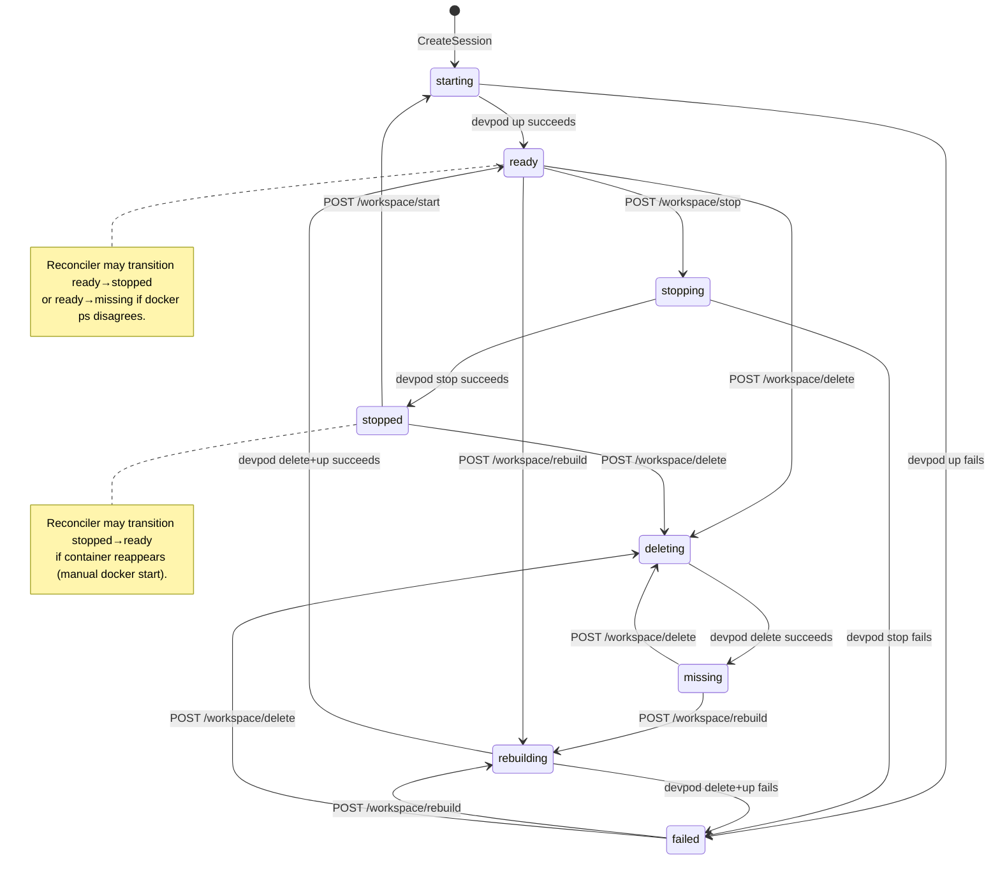
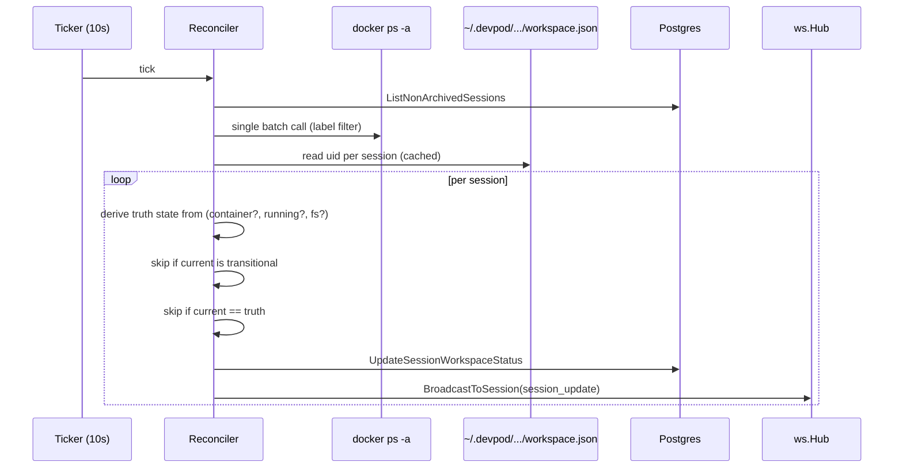

# feat: Session devpod state reconciliation and controls

## Summary

Add a `docker ps`-based reconciler goroutine that keeps `sessions.workspace_status` honest within ~10 seconds of any state change, expand the status enum to eight values (retiring `suspended`), expose four lifecycle endpoints — Start / Stop / Rebuild / Delete — under `/api/sessions/{id}/workspace/`, and update the frontend to fade and disable Chat / Terminal / Files tabs when a session's container isn't live, surfacing the appropriate recovery button.

## Problem Frame

`workspace_status` is written only at session creation by the `startWorkspace` goroutine in [server/internal/handler/sessions.go:464](server/internal/handler/sessions.go#L464) and never reconciled. When containers stop for any reason — host reboot, manual `docker stop`, OOM kill, devpod cleanup — the DB continues to report `ready`, the sidebar dot stays green, and the user discovers the lie only when the terminal won't connect. The repo has no lifecycle controls beyond create — no way to stop, restart, or rebuild a session's devpod through the UI.

This plan delivers the brainstorm's full scope in one PR: reconciler + state model + four controls + UI gating. Authorization on the new endpoints is intentionally left mirroring the existing read-side handlers (no membership check yet) — a separate concern that will be addressed repo-wide later.

## Key Technical Decisions

- **Reconciler modeled on `sshproxy.Server`, not the fire-and-forget `startWorkspace` shape.** The reconciler is a long-lived service with `Run(ctx context.Context)` and `Shutdown(ctx) error`, owns a `sync.WaitGroup` and a `done` channel, and rides the same shutdown context as HTTP and SSH. The fire-and-forget pattern at [server/internal/handler/sessions.go:264](server/internal/handler/sessions.go#L264) is appropriate for one-shot per-request work; a perpetually-running sweeper needs lifecycle coordination so server shutdown drains it cleanly. (see origin: `docs/brainstorms/2026-05-28-session-devpod-state-and-controls-requirements.md`)
- **Single `docker ps -a` call per tick, not per-session `devpod status`.** `devpod status` shells out at 1-3s per workspace; with N sessions that's unworkable. One `docker ps -a --filter label=dev.containers.id --format '{{.Label "dev.containers.id"}} {{.State}}'` call returns running and stopped containers in sub-100ms regardless of N. The reconciler is docker-provider-only by this choice; non-docker providers are deferred. (see origin)
- **Workspace.json presence distinguishes `stopped` from `missing`.** Container in the running set → `ready`. Container in the all set but not running → `stopped`. No container at all but `~/.devpod/contexts/default/workspaces/<id>/workspace.json` exists → still `stopped` (devpod knows about it, will restart on `up`). Neither container nor on-disk metadata → `missing` (requires Rebuild to recover).
- **Reconciler never touches transitional rows.** Sessions in `starting | stopping | rebuilding | deleting` are owned by the handler goroutine for the lifetime of that operation. The reconciler reads these states and skips them — observation only, no write. This holds R5 from the brainstorm.
- **Boot-time recovery flips orphaned transitional states to `failed`.** If the server is killed mid-rebuild, a row can sit in `rebuilding` indefinitely. On startup, a single SQL statement flips any row in a transitional state to `failed` before the reconciler starts ticking. Mirrors the existing `ResetStaleAgentStatuses` call at [server/internal/server/server.go:96](server/internal/server/server.go#L96).
- **`workspace_status` stays a `TEXT` column.** The current schema is plain `TEXT NOT NULL DEFAULT 'ready'` with no constraint. The migration adds an explicit CHECK constraint listing all eight valid values as defense-in-depth, and runs an `UPDATE` to map any `suspended` rows to `stopped`. No Postgres ENUM type involved — much simpler than the staged retirement pattern that would be needed for a real enum.
- **Lifecycle handlers return 200 with the body in transitional state.** No 202 Accepted precedent exists in this codebase; `CreateSession` returns 201 with `workspace_status='starting'` and the goroutine flips it later. The four new endpoints mirror that: write the transitional state synchronously, return 200 with the updated session body, then run the devpod command in a background goroutine that writes the terminal state and broadcasts.
- **Authorization on new endpoints mirrors existing read-side handlers — no membership check.** `GetSession`, `UpdateSession`, and `GetSessionVSCodeURI` all skip membership verification today; adding gating only to the four new endpoints would create asymmetric behavior. Repo-wide authz is deferred.
- **Reconciler accepts a small interface, not `*workspace.Manager` directly.** Defines a `containerLister` interface with `ListContainers(ctx) ([]ContainerInfo, error)`. Production wires `workspace.Manager`'s new `BulkContainerStatus` method; tests stub it. Mirrors the `resolveContainerHook` pattern at [server/internal/sshproxy/server.go:30](server/internal/sshproxy/server.go#L30), the only existing test seam for shell-outs in this repo.
- **Sweeper writes (and broadcasts) only when state actually changed.** Reading current `workspace_status` from each row and comparing to the resolved value before issuing an UPDATE avoids hammering the websocket fan-out, which triggers a full `listSessions()` refetch on every `session_update` event (see [src/hooks/use-websocket.ts:151](src/hooks/use-websocket.ts#L151)). Honors R3 from the brainstorm.

## High-Level Technical Design

### State machine



### Reconciler tick (directional)



### Reconciler lifecycle (directional)

```text
main.go
  ctx, cancel := signal.NotifyContext(...)
  defer cancel()
  ...
  mgr := workspace.NewManager(...)
  recon := reconcile.NewReconciler(queries, hub, mgr, 10*time.Second)
  go recon.Run(ctx)
  ...
  // on SIGTERM
  shutdownCtx, _ := context.WithTimeout(context.Background(), 10*time.Second)
  recon.Shutdown(shutdownCtx)
  sshSrv.Shutdown(shutdownCtx)
  httpSrv.Shutdown(shutdownCtx)
```

Directional only — exact method names and struct boundaries land at implementation time.

---

## Implementation Units

### U1. Expand workspace_status enum and retire `suspended`

- **Goal.** Update the DB schema so `workspace_status` accepts all eight values the rest of the plan depends on, with a CHECK constraint enforcing the set.
- **Requirements:** R7, R8, R9 (origin).
- **Dependencies:** None.
- **Files:**
  - `server/internal/db/migrations/009_workspace_status_enum.sql` (new)
  - `server/internal/db/migrations/002_seed_data.sql` (modify — flip the lone `'suspended'` seed row)
- **Approach.**
  - `-- +goose Up` section: `UPDATE sessions SET workspace_status = 'stopped' WHERE workspace_status = 'suspended';` then `ALTER TABLE sessions ADD CONSTRAINT workspace_status_check CHECK (workspace_status IN ('starting','ready','stopping','stopped','rebuilding','deleting','missing','failed'));`
  - `-- +goose Down`: drop the CHECK constraint, revert any post-migration `stopped` rows back to `suspended` only if they were created by this migration is not knowable; instead leave them as `stopped` (the column is forward-only by repo convention per [server/internal/db/migrate.go:28](server/internal/db/migrate.go#L28)). Note this in the Down section as a comment.
  - The seed file at [server/internal/db/migrations/002_seed_data.sql:44](server/internal/db/migrations/002_seed_data.sql#L44) carries `'suspended'`; update the literal to `'stopped'` so a fresh-from-scratch dev DB doesn't violate the new CHECK at seed time.
- **Patterns to follow.** Migration shape from [server/internal/db/migrations/008_user_ssh_keys.sql](server/internal/db/migrations/008_user_ssh_keys.sql); CHECK constraint shape from the SSH-key fingerprint CHECK in that same file.
- **Test scenarios.**
  - Apply migration on a database holding a `'suspended'` row → row is `'stopped'` and constraint accepts every value in the eight-value set.
  - Attempt `INSERT ... workspace_status = 'bogus'` → fails with check_violation.
  - `make migrate && make migrate-down` round-trips without errors.
- **Verification.** `make migrate` succeeds; `psql ... -c "SELECT workspace_status, count(*) FROM sessions GROUP BY 1"` shows zero `suspended` rows.

### U2. Add SQL queries for sweeper and boot recovery

- **Goal.** Add the two queries the reconciler needs: a sweeper enumeration and a boot-time stale-transitional reset.
- **Requirements:** R1, R2, R5.
- **Dependencies:** U1.
- **Files:**
  - `server/internal/db/queries/sessions.sql` (modify)
  - `server/internal/db/sessions.sql.go` (regenerated by `make generate`)
- **Approach.** Two new sqlc queries:
  - `ListNonArchivedSessions :many` — `SELECT * FROM sessions WHERE status != 'archived'` ordered by id for deterministic test fixtures.
  - `ResetStaleWorkspaceTransitions :exec` — `UPDATE sessions SET workspace_status = 'failed' WHERE workspace_status IN ('starting','stopping','rebuilding','deleting');` Intentionally includes `starting` so a session interrupted mid-create also surfaces as `failed`, consistent with the precedent at [server/internal/server/server.go:96](server/internal/server/server.go#L96) for stale agent statuses.
- **Patterns to follow.** `ListSessionsForUser :many` at [server/internal/db/queries/sessions.sql:1](server/internal/db/queries/sessions.sql#L1); `:exec` shape from the existing `UpdateSessionLastActivity` and `MarkSessionRead` at the same file.
- **Test scenarios.** Coverage lives in U4's reconciler tests against a real `*pgxpool.Pool`; no separate unit test for the generated code.
  - Test expectation: none — sqlc-generated code is verified by the units that consume it.
- **Verification.** `cd server && make generate` succeeds and produces compilable Go.

### U3. Bulk container status method on workspace.Manager

- **Goal.** Give the reconciler a single docker call returning the state of every session's container, plus an interface boundary the tests can stub.
- **Requirements:** R2.
- **Dependencies:** None (independent of U1/U2).
- **Files:**
  - `server/internal/workspace/manager.go` (modify — add `BulkContainerStatus` method and `ContainerState` type)
  - `server/internal/workspace/bulk_status_test.go` (new — exercises the parsing of fake `docker ps` output via a swappable command runner)
- **Approach.**
  - New exported type `ContainerState string` with constants `ContainerRunning`, `ContainerStopped`, `ContainerAbsent`.
  - New method `(*Manager).BulkContainerStatus(ctx) (map[string]ContainerState, error)` — runs one `docker ps -a --filter label=dev.containers.id --format '{{.Label "dev.containers.id"}}\t{{.State}}'`, parses tab-separated lines, returns a map keyed by uid.
  - Refactor: introduce a private `commandRunner` field on `Manager` defaulting to `exec.CommandContext`, so tests can swap in a fake. Mirrors the `resolveContainerHook` pattern at [server/internal/sshproxy/server.go:30](server/internal/sshproxy/server.go#L30). All existing methods continue to use the field through a thin wrapper.
  - `ContainerAbsent` is the implied state — uids not present in the docker output are treated as absent by the reconciler; the method itself only returns the entries docker reported.
- **Technical design (directional).**
  ```text
  type ContainerState string
  const (
      ContainerRunning ContainerState = "running"
      ContainerStopped ContainerState = "stopped"
  )

  func (m *Manager) BulkContainerStatus(ctx) (map[string]ContainerState, error) {
      // out, err := m.runner(ctx, "docker", "ps", "-a",
      //   "--filter", "label=dev.containers.id",
      //   "--format", "{{.Label \"dev.containers.id\"}}\t{{.State}}").Output()
      // parse lines, map docker's State ("running" | "exited" | "created" | "paused" | "dead")
      // into our two-state ContainerState (running iff State == "running", else stopped)
  }
  ```
  Directional only.
- **Patterns to follow.** Command shape mirrors [server/internal/workspace/manager.go:220](server/internal/workspace/manager.go#L220) but with a different filter and format. Validation of returned identifiers should reuse `validContainerName` defense-in-depth if the method ever returns container names; for label values only (uids), no regex check is needed.
- **Test scenarios.**
  - Happy path: runner returns three lines for three uids, two running and one exited → map shows two running and one stopped.
  - Empty output (no matching containers) → empty map, nil error.
  - Runner returns non-zero exit → error wraps stderr.
  - Malformed line (no tab) → skipped with a warn log, other lines still parsed.
  - Duplicate uid in output (multi-container devpod oddity) → log warn, keep the most-recent entry.
- **Verification.** `go test ./internal/workspace/...` passes; `BulkContainerStatus` produces a correct map under the fake runner.

### U4. Reconciler package and server lifecycle wiring

- **Goal.** A ticker-driven goroutine that runs the reconciliation loop with proper shutdown coordination, plus the boot-time stale-transitional reset.
- **Requirements:** R1, R2, R3, R4, R5, R6.
- **Dependencies:** U2 (queries), U3 (BulkContainerStatus).
- **Files:**
  - `server/internal/reconcile/reconciler.go` (new)
  - `server/internal/reconcile/reconciler_test.go` (new)
  - `server/internal/server/server.go` (modify — hoist `*workspace.Manager` to a `Server` field; add `ResetStaleWorkspaceTransitions` call alongside the existing `ResetStaleAgentStatuses`; expose a `StartReconciler(ctx)` method)
  - `server/main.go` (modify — construct reconciler, start its goroutine, call `Shutdown` from the drain block at lines 178-195)
- **Approach.**
  - New package `reconcile` with `Reconciler` struct holding queries, hub, a `containerLister` interface (satisfied by `*workspace.Manager`'s `BulkContainerStatus`), a `workspaceUIDReader` interface (satisfied by a new exported `Manager.WorkspaceUID(workspaceID) (uid string, exists bool, err error)` wrapping the private `readWorkspaceUID`), tick interval, WaitGroup, and a `closed` flag.
  - `Run(ctx)`: ticker loop, on each tick call `tick(ctx)`; exits when `<-ctx.Done()` fires.
  - `Shutdown(ctx)`: marks closed, waits on WaitGroup, returns when in-flight tick completes or ctx times out.
  - `tick(ctx)`: list non-archived sessions, single `BulkContainerStatus` call, per-session derive truth, skip transitional + unchanged, update + broadcast otherwise. Errors from docker are logged at warn and the tick aborts without writes (R6 — transient failures must not cause false `missing` flips).
  - Boot-time reset is **not** in the reconciler — it's a one-shot call alongside `ResetStaleAgentStatuses` at [server/internal/server/server.go:96](server/internal/server/server.go#L96), runs synchronously before HTTP starts serving.
  - Hoist `wm := workspace.NewManager(...)` from inside `Router()` ([server/internal/server/server.go:81](server/internal/server/server.go#L81)) to a `Server` field initialized in `New()` so both the handler and the reconciler share one instance.
- **Technical design (directional).**
  ```text
  type containerLister interface {
      BulkContainerStatus(ctx context.Context) (map[string]workspace.ContainerState, error)
  }

  type workspaceUIDReader interface {
      WorkspaceUID(workspaceID string) (uid string, exists bool, err error)
  }

  type Reconciler struct {
      queries  *db.Queries
      hub      *ws.Hub
      lister   containerLister
      uids     workspaceUIDReader
      interval time.Duration
      wg       sync.WaitGroup
      mu       sync.Mutex
      closed   bool
  }
  ```
  Truth derivation per session:
  ```text
  uid, hasMeta, _ := r.uids.WorkspaceUID(session.Name)
  state, hasContainer := containers[uid]
  switch {
  case hasContainer && state == ContainerRunning: truth = "ready"
  case hasContainer && state == ContainerStopped: truth = "stopped"
  case hasMeta:                                    truth = "stopped"   // devpod knows about it
  default:                                         truth = "missing"
  }
  ```
- **Patterns to follow.** Service-lifetime shape from [server/internal/sshproxy/server.go:60-373](server/internal/sshproxy/server.go#L60); shutdown drain shape from [server/main.go:103-117](server/main.go#L103); broadcast pattern from [server/internal/handler/sessions.go:499](server/internal/handler/sessions.go#L499). Ticker + ctx.Done select is a standard Go shape — no need for an external scheduler.
- **Test scenarios.**
  - Happy reconciliation: 3 sessions, all in `ready`. Container lister returns 3 running. No update issued, no broadcast.
  - Drift detection: container is `running` but row says `stopped` → UPDATE + broadcast issued.
  - Drift detection reverse: row says `ready`, container exited → UPDATE to `stopped` + broadcast.
  - Missing container, workspace metadata exists → `stopped`, not `missing`.
  - Missing container AND workspace metadata absent → `missing`.
  - Transitional state skipped: row says `rebuilding`, container missing → no UPDATE issued.
  - Docker error: `BulkContainerStatus` returns an error → no writes, warn logged, tick returns nil to keep the loop alive.
  - Shutdown mid-tick: cancel ctx during a tick → `Run` exits, `Shutdown` waits on WaitGroup and returns.
  - Boot reset (covered in server_test.go, not reconciler_test): rows in every transitional state become `failed`; rows in terminal states are untouched.
- **Verification.** `go test ./internal/reconcile/...` passes. Manual: start server with three sessions in DB, manually `docker stop` one container; within 10s the sidebar dot turns grey and a `session_update` event arrives.

### U5. HTTP endpoints for Start / Stop / Rebuild / Delete

- **Goal.** Four POST endpoints under `/api/sessions/{sessionID}/workspace/` that fire devpod commands in background goroutines.
- **Requirements:** R10, R11, R12, R13, R14, R15.
- **Dependencies:** U1 (status enum), U2 (no, this unit doesn't need the sweeper queries — just `UpdateSessionWorkspaceStatus` which already exists).
- **Files:**
  - `server/internal/handler/workspace.go` (new — the four handlers and shared helpers)
  - `server/internal/handler/workspace_test.go` (new)
  - `server/internal/server/server.go` (modify — register the four routes)
- **Approach.**
  - Each handler:
    1. Parses `sessionID` from path (`uuid.Parse(chi.URLParam(r, "sessionID"))`), 400 `INVALID_SESSION_ID` on failure.
    2. Parses user ID from `getUserID(r)`, 400 `INVALID_USER` on failure. (No membership check — see KTDs.)
    3. Loads session via `h.queries.GetSession`, 404 `SESSION_NOT_FOUND` on failure.
    4. Validates current `workspace_status` is not already transitional; 409 `WORKSPACE_BUSY` with the in-flight action named otherwise (R15).
    5. Calls `h.queries.UpdateSessionWorkspaceStatus` with the transitional value, broadcasts a `session_update` event, returns 200 with the updated session body via `buildSessionResponse`.
    6. Spawns `go h.runWorkspaceAction(sessionID, workspaceID, action)` to execute the devpod call and write the terminal state.
  - Shared helper `runWorkspaceAction(sessionID, workspaceID, action workspaceAction)` consolidates the after-the-fact UPDATE + broadcast pattern. `action` is an internal enum: `actionStart | actionStop | actionRebuild | actionDelete`.
  - Action mapping:
    - **Start** → transitional `starting`; reads `session.RepoUrl` from the loaded session row and passes it as the second arg to `h.workspaces.Create(ctx, workspaceID, repoURL, logFn)` (existing method, reused — devpod up is idempotent against stopped containers); on success writes `ready`, on failure writes `failed`. If `session.RepoUrl == ""` (legacy session created without a repo URL — `startWorkspace` at [server/internal/handler/sessions.go:263](server/internal/handler/sessions.go#L263) gates creation on `req.RepoURL != ""` so this should not occur on healthy data, but the handler should reject with 400 `MISSING_REPO_URL` rather than fire `devpod up` with an empty argv).
    - **Stop** → transitional `stopping`; runs `h.workspaces.Stop(ctx, workspaceID)`; on success writes `stopped`, on failure writes `failed`.
    - **Rebuild** → transitional `rebuilding`; runs `h.workspaces.Delete(ctx, workspaceID)` then `h.workspaces.Create(ctx, workspaceID, session.RepoUrl, logFn)` (same `session.RepoUrl` plumbing as Start); on success writes `ready`, on either failure writes `failed`. Streams log output via the existing `workspace_log` WS event using the same `logFn` shape as `startWorkspace`.
    - **Delete** → transitional `deleting`; runs `h.workspaces.Delete(ctx, workspaceID)`; on success writes `missing`, on failure writes `failed`.
  - Route registration inside the existing `r.Route("/{sessionID}", ...)` block at [server/internal/server/server.go:131-146](server/internal/server/server.go#L131-L146): four `r.Post("/workspace/start", h.StartWorkspace)` style entries, matching the precedent set by `r.Post("/agents/stop", h.StopAgent)`.
- **Patterns to follow.** Handler skeleton mirrors `CreateSession` at [server/internal/handler/sessions.go:180](server/internal/handler/sessions.go#L180), specifically the "respond synchronously with transitional state, then `go ...`" shape. `buildSessionResponse` at the same file is reused for the response body. `startWorkspace` at [server/internal/handler/sessions.go:464](server/internal/handler/sessions.go#L464) is the reference for the background-goroutine + broadcast shape. The `exec.Cmd.Wait` pipe-pump caveat from [docs/solutions/architecture-patterns/embedded-ssh-proxy-for-vscode-remote.md](docs/solutions/architecture-patterns/embedded-ssh-proxy-for-vscode-remote.md) is relevant if these handlers ever capture stderr beyond the existing `CombinedOutput` calls in `Manager.Stop` and `Manager.Delete`; the current plan keeps that capture inside `workspace.Manager` and does not add new pipe streaming in these handlers.
- **Test scenarios.**
  - **Covers AE3.** Stop on a session in `rebuilding` → 409 `WORKSPACE_BUSY` with the in-flight action surfaced in the error payload; no devpod call made.
  - Start on `stopped` session → 200 with body in `starting`; goroutine runs `Create`; final status is `ready` and the WS broadcast fires.
  - Stop on `ready` session → 200 with body in `stopping`; goroutine runs `Stop`; final status is `stopped`.
  - Rebuild on `failed` session → 200 with body in `rebuilding`; goroutine runs `Delete` then `Create`; `workspace_log` events stream during the run; final status is `ready` on success.
  - **Covers AE4.** Delete on a session with chat history → 200 with body in `deleting`; goroutine runs `Delete`; final status is `missing`; session row, messages, and members are still present in the DB.
  - Devpod command fails (mock `Manager` returning error) → terminal state is `failed`; WS broadcast still fires.
  - Unknown sessionID → 404; no devpod call.
  - Concurrent same-action requests: two Start calls land while session is in `starting` → first returns 200, second returns 409 `WORKSPACE_BUSY`.
- **Verification.** `go test ./internal/handler/...` passes; manual curl against the dev server triggers each transition and the sidebar dot updates within the round trip.

### U6. Frontend types, API client, and websocket plumbing

- **Goal.** Update the `WorkspaceStatus` type, add four API wrappers, and wire the existing WS handler so it does not regress on the expanded enum.
- **Requirements:** R10-R13, R16 (status mapping is consumed in U7).
- **Dependencies:** U5 (endpoints must exist for the API wrappers to point at).
- **Files:**
  - `src/types/index.ts` (modify — expand the `WorkspaceStatus` union)
  - `src/lib/api.ts` (modify — add `startWorkspace`, `stopWorkspace`, `rebuildWorkspace`, `deleteWorkspace`)
  - `src/hooks/use-websocket.ts` (modify — confirm the existing `session_update` refetch handles the new states; add coalescing if measurement shows refetch storms)
  - `src/stores/session-store.ts` (modify — extend the `updateWorkspaceStatus` action's TypeScript signature to the new union)
- **Approach.**
  - `WorkspaceStatus` becomes `"starting" | "ready" | "stopping" | "stopped" | "rebuilding" | "deleting" | "missing" | "failed"`. The retired `"suspended"` value is removed; every `workspaceStatus: "suspended"` literal in mock data at [src/mocks/data/seed.ts](src/mocks/data/seed.ts) (lines 250 and 264) is updated to `"stopped"` to match.
  - Each API wrapper mirrors the `stopAgent` pattern at [src/lib/api.ts:150](src/lib/api.ts#L150):
    ```ts
    startWorkspace: (sessionId: string) =>
      request<SessionResponse>(`/sessions/${sessionId}/workspace/start`, { method: "POST" }),
    ```
    Returning the typed `SessionResponse` so the caller can optimistically update the store.
  - `session-store.ts` — the existing `updateWorkspaceStatus` action's type widens automatically when the union widens. No structural changes.
  - `use-websocket.ts` — current path refetches the full list on `session_update`. Keep as-is for v1; if the reconciler produces visible refetch storms during testing, add a 100-200ms debounce mirroring the file-refresh debounce at [src/hooks/use-websocket.ts:17-34](src/hooks/use-websocket.ts#L17-L34). Deferred to implementation observation.
- **Patterns to follow.** API client style: terse arrow methods, generic `request<T>` helper. Mock data update mirrors prior enum-value changes.
- **Test scenarios.** Frontend has no test suite per [CLAUDE.md](CLAUDE.md). Manual verification only.
  - Test expectation: none — frontend verification is visual, performed in U7.
- **Verification.** `npx tsc --noEmit` passes (no leftover references to `"suspended"`); `npm run build` succeeds.

### U7. Frontend UI: status dots, recovery card, workspace menu, delete confirm

- **Goal.** Wire the expanded state model into the UI: sidebar dots, tab fade/disable, recovery buttons, workspace menu, and Delete confirm modal.
- **Requirements:** R16, R17, R18, R19, R20.
- **Dependencies:** U6 (types and API wrappers).
- **Files:**
  - `src/components/layout/SessionSidebar.tsx` (modify — extend the status-dot map at lines 104-109)
  - `src/components/layout/CenterPanel.tsx` (modify — extend `isBuilding` / `workspaceReady` flags to cover the new states; gate tab clicks; surface workspace menu)
  - `src/components/terminal/TerminalView.tsx` (modify — wire the existing stub Retry button at line 144 to the Rebuild action; add new empty states for `stopped` / `missing` / `stopping` / `rebuilding` / `deleting`)
  - `src/components/files/FilesView.tsx` (modify — same treatment as TerminalView)
  - `src/components/workspace/RecoveryCard.tsx` (new — the card surface that hosts Start / Rebuild buttons + last error message for `failed` state)
  - `src/components/workspace/WorkspaceMenu.tsx` (new — DropdownMenu surface that lets healthy sessions be Stopped / Rebuilt / Deleted)
  - `src/components/workspace/DeleteWorkspaceDialog.tsx` (new — Dialog-based confirm modal for Delete only)
- **Approach.**
  - **Status dot map** extends the existing `Record<WorkspaceStatus, string>` at [src/components/layout/SessionSidebar.tsx:104-109](src/components/layout/SessionSidebar.tsx#L104-L109) per R16:
    ```text
    ready                                  → bg-success
    starting | stopping | rebuilding | deleting → bg-warning animate-pulse-dot
    stopped                                → bg-neutral-7
    missing | failed                       → bg-danger
    ```
  - **Tab fade and gating** — define `isWorkspaceLive = workspaceStatus === "ready" || workspaceStatus === "starting"` in CenterPanel. When false, the Tabs trigger row gets `opacity-50 pointer-events-none` and the tab content area is replaced by `<RecoveryCard session={activeSession} />`. The existing "starting → spinner" early returns inside TerminalView and FilesView are subsumed by RecoveryCard.
  - **RecoveryCard** picks its content from `workspaceStatus`:
    - `stopped` → "Workspace is stopped. Resume to continue." + `Start` button.
    - `missing` → "Workspace no longer exists. Rebuild to create a fresh container." + `Rebuild` button.
    - `failed` → "Workspace is in a failed state." + last log line (passed via prop or fetched separately — deferred to implementation) + `Rebuild` button.
    - `stopping | rebuilding | deleting` → spinner + appropriate verb + disabled buttons. While Rebuild is mid-flight, log lines streamed via the existing `workspace_log` WS event scroll in a log panel inside the card.
  - **WorkspaceMenu** is a DropdownMenu (using the existing `dropdown-menu.tsx`) anchored near the session header in CenterPanel, exposing Stop / Rebuild / Delete. Items are disabled based on the current `workspaceStatus` (e.g., Stop disabled when not `ready`).
  - **DeleteWorkspaceDialog** uses the existing `Dialog` primitive (no `AlertDialog` in the repo; pattern mirrors `SSHKeysDialog.tsx`). Labels: "Permanently delete workspace?" / "The devpod container and any in-container work will be removed. Session, chat history, and messages are kept." / "Delete workspace" (danger button) + "Cancel".
  - Per the brainstorm KTD, Stop and Rebuild fire **immediately on click** — no modal.
- **Patterns to follow.** Tabs treatment: existing `opacity-` patterns elsewhere in `SessionSidebar.tsx` (the `status === "paused"` / `status === "archived"` opacity at lines 127-128). Dialog usage: `src/components/settings/SSHKeysDialog.tsx`. DropdownMenu: existing usages in the layout components (search for `DropdownMenu` to find them). Optimistic store updates: the existing `updateWorkspaceStatus` action wired so a click can flip the dot immediately while the request is in flight.
- **Test scenarios.** Visual verification only — no frontend test suite.
  - **Covers AE5.** With the dev server running and a session in `ready`, run `docker stop <session-container>`. Within ~10s the sidebar dot turns grey, the Terminal tab fades and becomes non-clickable, and a Start button appears in the recovery card. Clicking Start brings the container back; the dot returns to green.
  - With a session in `ready`, open the workspace menu and click Stop. The dot pulses yellow, then turns grey. Click Start in the recovery card — dot returns to green.
  - With a session in `ready`, open the workspace menu and click Rebuild. Log lines stream into the recovery card during the rebuild; dot ends green.
  - With a session in `ready`, open the workspace menu and click Delete. Confirm modal appears naming the consequences. Clicking Cancel dismisses the modal with no DB or container changes. Clicking Delete fires the action; dot ends red-muted and the recovery card shows Rebuild.
  - With a session in `failed`, the recovery card shows the last log line (if available) and a Rebuild button.
- **Verification.** Manual: run all five scenarios above against the dev server. `npm run lint` passes; `npx tsc --noEmit` passes.

---

## System-Wide Impact

- **Server lifecycle.** `*workspace.Manager` moves from a `Router()`-local to a `Server`-field. Any downstream consumer of `Server` gains access to the same instance.
- **WebSocket event volume.** The reconciler broadcasts `session_update` only on state changes (KTD-driven). In steady state — zero drift — the WS hub sees zero new events from the reconciler. During mass drift (server reboot, docker daemon restart), the reconciler may emit one event per affected session within ~10s. Frontend handles `session_update` by refetching the full session list; if observation shows visible refetch storms, debounce per U6's deferred note.
- **DB write volume.** Same shape as broadcasts — writes only on state changes. Idle steady state issues zero writes per tick.
- **Boot-time work.** `ResetStaleWorkspaceTransitions` runs once on server start. Cost is bounded by the number of rows in transitional states at boot, which should be zero or very small.
- **Devpod CLI invocations.** Four new code paths invoke `devpod up`, `devpod stop`, `devpod delete`. These already work elsewhere in the codebase ([server/internal/handler/sessions.go:476](server/internal/handler/sessions.go#L476) for `Create`). No new external dependencies.

---

## Risks & Mitigations

- **Risk: docker daemon flaps cause false `missing` flips.** Mitigation: R6 in the brainstorm — sweeper errors log at warn and do not mutate. Implemented in U4's tick error handling. Tested by the "docker error" scenario in U4.
- **Risk: WS refetch storms when the reconciler detects mass drift.** Mitigation: KTD limits writes to state changes only; if visible storms occur, U6 defers a debounce. Frontend already has a debounce primitive at [src/hooks/use-websocket.ts:17-34](src/hooks/use-websocket.ts#L17-L34).
- **Risk: `exec.Cmd.Wait` pipe-pump bug from [docs/solutions/architecture-patterns/embedded-ssh-proxy-for-vscode-remote.md](docs/solutions/architecture-patterns/embedded-ssh-proxy-for-vscode-remote.md) hits the rebuild log streaming.** Mitigation: U5's Rebuild reuses the existing `Manager.Create` log-streaming code path at [server/internal/workspace/manager.go:91](server/internal/workspace/manager.go#L91), which already handles long output correctly via `Scanner` + explicit `cmd.Wait`. If a new pipe-pump path is introduced, mirror the fix from commit `0650ab6`.
- **Risk: race between reconciler and lifecycle handler writing at the same instant.** Mitigation: the reconciler skips transitional states. The window of concurrent write is closed by the handler setting the transitional state *before* the reconciler can read it on the next tick, and the reconciler not writing during transitional states. If the reconciler reads a row mid-handler-flip (handler has set `stopping` but the reconciler reads the prior `ready`), the worst case is the reconciler writes one stale `stopped` over the handler's `stopping` — and the handler's terminal write will correct it on the next step. Acceptable in v1; documented here.
- **Risk: `suspended` row in seed data violates the new CHECK constraint on fresh DBs.** Mitigation: U1 explicitly updates [server/internal/db/migrations/002_seed_data.sql:44](server/internal/db/migrations/002_seed_data.sql#L44) to `'stopped'`.

---

## Scope Boundaries

- Non-docker devpod providers (k8s, AWS) — sweeper is docker-only by design.
- Authorization (membership / role gating) on the new endpoints — deferred per user direction; tracked as a follow-up.
- Auto-restart on drift — explicitly out.
- Idle-session auto-stop — out.
- Preserving in-container work across Rebuild — out.
- Horizontally scaled server with multiple reconcilers — out (single reconciler per process).
- Frontend test suite — repo has none; this plan does not introduce one.

### Deferred to Follow-Up Work

- Session-membership authorization on `/api/sessions/{id}/workspace/*` AND on the existing `/api/sessions/{id}` mutating routes. The new endpoints intentionally match today's behavior; closing the gap is a separate PR.
- WS refetch debounce on `session_update` if measurement shows it's needed.
- Granular `failed` state — today's single `failed` value plus the most recent log line is enough for v1.

---

## Open Questions

### Resolve before planning
None — all blocking questions from the origin doc were resolved in dialogue.

### Deferred to implementation
- Exact reconciler interval is 10s per the brainstorm; revisit if docker daemon load is observable.
- `workspace_log` retention strategy (in-memory ring buffer vs. activity-table persistence) for displaying the "last log line" in the recovery card's `failed` state. Deferred until U7 actually wires the prop.
- Exact CSS for tab fade vs. disable (`pointer-events-none` is the plan; design polish is the implementer's call).

---

## Sources & Research

- Origin: [docs/brainstorms/2026-05-28-session-devpod-state-and-controls-requirements.md](docs/brainstorms/2026-05-28-session-devpod-state-and-controls-requirements.md)
- Existing service-lifetime precedent: [server/internal/sshproxy/server.go:60-373](server/internal/sshproxy/server.go#L60)
- Existing fire-and-forget goroutine + WS broadcast precedent: [server/internal/handler/sessions.go:262-503](server/internal/handler/sessions.go#L262)
- Existing boot-time stale-state reset precedent: [server/internal/server/server.go:96-99](server/internal/server/server.go#L96)
- Existing `docker ps` label resolution: [server/internal/workspace/manager.go:208-245](server/internal/workspace/manager.go#L208)
- Container-name validation regex: [server/internal/workspace/manager.go:29](server/internal/workspace/manager.go#L29)
- Devpod docker-provider learnings: [docs/solutions/architecture-patterns/embedded-ssh-proxy-for-vscode-remote.md](docs/solutions/architecture-patterns/embedded-ssh-proxy-for-vscode-remote.md), [docs/solutions/architecture-patterns/devpod-docker-workspace-bind-mount-2026-05-13.md](docs/solutions/architecture-patterns/devpod-docker-workspace-bind-mount-2026-05-13.md)
