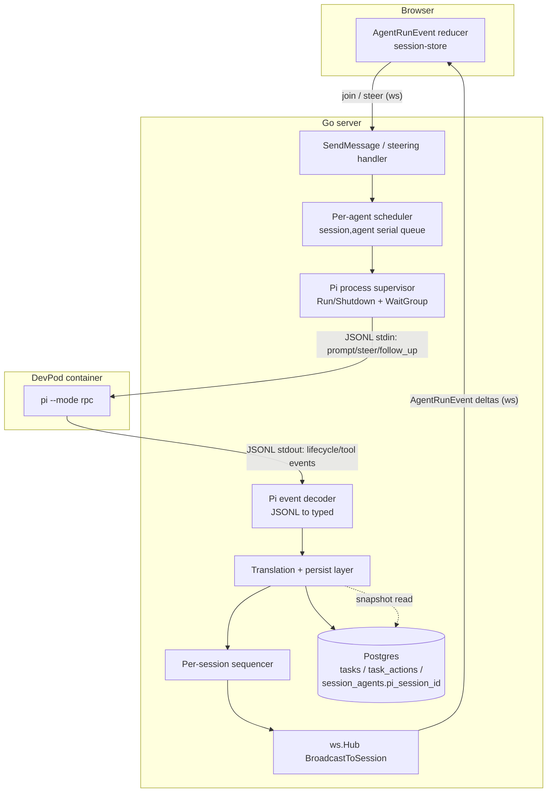
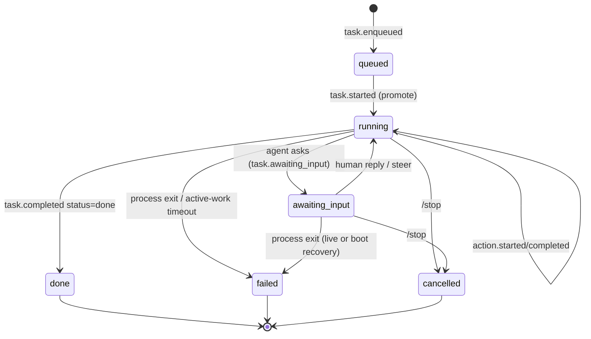
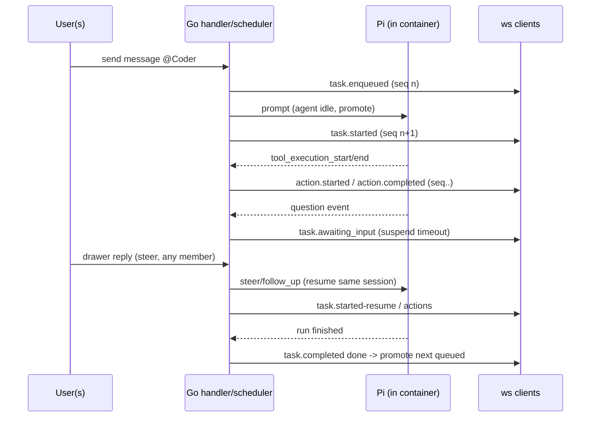

# feat: Pi harness integration for Super Threads

## Summary

Replace the `claude -p` one-shot agent harness with [Pi](https://pi.dev/) running in `--mode rpc` inside each session's DevPod container, driven by Go over a persistent JSONL stdin/stdout channel. Pi's lifecycle and tool events are translated into a new, sequenced, append-only `AgentRunEvent` WebSocket stream that drives the Super Threads UI: a live per-action log, a per-agent serial queue, steerable sessions with an `awaiting input` state, and a reconnect snapshot.

---

## Problem Frame

Today `server/internal/agent/executor.go` shells `claude -p --output-format stream-json` into each DevPod container per request. Two properties of that shape break the Super Threads experience (see origin: docs/brainstorms/2026-06-03-pi-harness-integration-requirements.md):

- It is fire-and-forget — a user `@mentions` an agent and waits, with no honest progress signal, until one final message lands. Coarse `agent_output` events are forwarded but the model is request-in / response-out.
- It has no back-channel — when the agent needs a decision, or a user wants to redirect it mid-run, there is nowhere for that exchange to go.

Pi's RPC mode is a persistent, steerable session (`prompt` / `steer` / `follow_up`, steering modes) with a fully-specified incremental event stream — exactly the missing real-time signal and back-channel. The brainstorm settled the harness (Pi), the topology (Topology A: Go drives Pi over RPC, Pi in-container), the interaction model (live steerable, `awaiting input`), the queue model (per-agent serial), and the event contract (`AgentRunEvent` with monotonic `seq` + snapshot). This plan defines how to build it on Deuce's existing chi/pgx/sqlc/`coder/websocket` stack.

The research surfaced that several pieces are net-new capability rather than modifications: the WS hub has no sequencing/snapshot today, `ClientMessage` cannot carry payloads, no task/thread/run tables exist, and the queue is keyed per-session with a single cancel func that concurrent agents would clobber.

---

## High-Level Technical Design

### Component topology



### Task lifecycle state machine



Note: the active-work timeout clock is suspended while a task is `awaiting_input` (KTD8), and a `/stop` during `awaiting_input` must tear down the suspended timer so it cannot fire later (U8). Every terminal transition — `done`, `failed` (including live process death from either `running` or `awaiting_input`), and `cancelled` — flows through the scheduler's single per-`(session,agent)` critical section, which marks the task terminal and atomically promotes the next queued task in one transition (R13, KTD12). A live process death during `awaiting_input` is owned by the scheduler, not deferred to boot recovery.

### Mention → run → question → resume sequence



---

## Key Technical Decisions

- KTD1. Topology A — Pi runs in-container, launched in `--mode rpc` through `workspace.Manager.ExecInWorkspace` (`devpod ssh --command`), so Pi's read/write/edit/bash act natively on the repo with no `docker exec` tool-routing layer (see origin). Tool execution fidelity is the reason; it reuses the proven exec path in `server/internal/workspace/manager.go`.

- KTD2. Use Pi's RPC interface, not the typed TS SDK — the backend is Go and adding a Node runtime was rejected. The decoder hand-models Pi's documented event schema and must **tolerate unknown event variants** (skip + log, never hard-fail), mirroring the resilience built into the current `output.go` because the JSON format drifts.

- KTD3. The Pi runtime is a long-lived service modeled on `sshproxy.Server` and the reconciler: `Run(ctx)` + `Shutdown(ctx) error` + `sync.WaitGroup`, riding `main.go`'s shared shutdown context — not the fire-and-forget `startWorkspace` goroutine. This is the repo's explicit recent convention for perpetually-running components.

- KTD4. Subprocess hygiene for the JSONL pump: launch with `Setpgid: true` and stop with `SIGTERM → 5s → SIGKILL` to avoid orphaned in-container children (R5); reap with `cmd.Process.Wait()` rather than `cmd.Wait()` so the stdout pipe is not closed under the reader mid-stream (the documented truncation bug in `docs/solutions/architecture-patterns/embedded-ssh-proxy-for-vscode-remote.md`). Pre-check container reachability before launch so a docker-down condition is a clean rejection, not a mid-stream failure.

- KTD5. One persistent Pi process and one queue lane per `(sessionId, agentId)`. The current `agent.Queue` keys by `SessionID` only and stores a single cancel func per session — concurrent agents (Coder + Reviewer) would clobber each other. Re-key the queue and cancel registry to the composite key; cancellation is per-task.

- KTD6. `AgentRunEvent`s are append-only, per-session monotonic-`seq` deltas, applied client-side by `seq`, broadcast over the existing `ws.Hub` (but **not** through `session_update`, which triggers a full session-list refetch on the client — fan-out amplification fatal for a high-frequency stream). `seq` is **DB-allocated, not broadcast-allocated**: a durable per-session counter (`session_event_seq` row) is bumped in the **same transaction** that persists the task/action state change, and the broadcast carries that committed value. The hub is a dumb transport for an already-numbered event — it does not stamp `seq` (stamping inside `BroadcastToSession` would wrongly number the existing `new_message`/`agent_status` events too). Invariants: **persist-first, broadcast-second**; the counter survives restart because it is durable; client gap-detection (any observed `seq` gap → immediate snapshot refetch) is the **declared, mandatory** recovery both for the rare persist-committed-but-broadcast-dropped crash window *and* for the routine case where `BroadcastToSession` drops to a client whose 256-entry send buffer overflowed during an action burst (R10). The in-tx counter bump serializes event persistence per session, giving a total order without a separate sequencer goroutine — so the in-tx critical section is kept **minimal** (seq bump + row write only; no Pi I/O and no avoidable large-JSONB serialization inside the lock window), since that per-session lock is the throughput ceiling for concurrent agents (KTD6b).

- KTD6a. **Persist-failure teardown.** A persist failure aborts the broadcast and fails the task (no logged-and-skipped hole). Because the live Pi process would otherwise keep emitting events for a now-terminal task, the scheduler-driven `failed` transition (KTD12) also signals the supervisor to tear down that `(session, agent)` Pi process — the same teardown path as `/stop` — so no live, file-mutating agent outlives its failed task.

- KTD7. Persist task and action state in new tables (`tasks`, `task_actions`); store the Pi session id in a new `session_agents.pi_session_id` column alongside the now-unused `claude_session_id` (non-destructive migration, no data rewrite). No task/thread/run tables exist today — this is greenfield.

- KTD8. The active-work timeout is a Go wall-clock budget around active execution, **suspended** while a task is `awaiting_input`. Waiting on a human must not trip the timeout (R22). A separate, longer **awaiting-input ceiling** applies so an unanswered question cannot wedge an agent forever: a task left in `awaiting_input` past that ceiling auto-fails through the scheduler's terminal path (KTD12), freeing the Pi process and the queue lane. (The idle reaper in KTD13 does not cover this — an `awaiting_input` task is not idle in the scheduler's view.)

- KTD9. Steering requires the client to send a payload, which `ClientMessage` cannot do today — extend the envelope in `server/internal/ws/events.go` and `ReadPump` in `client.go`. A drawer reply feeds the live run via `steer`/`follow_up` when the agent has an active run, and enqueues a new task when idle (R15, R19). Steers from multiple members targeting one live run are serialized in arrival order (R18).

- KTD10. Boot recovery flips tasks stuck in `running`/`awaiting input` to `failed` on startup, mirroring `ResetStaleAgentStatuses` (`server/internal/server/server.go`), run synchronously before serving.

- KTD11. The `claude -p` path is retired behind a runtime toggle, not deleted in this plan. `DEUCE_AGENT_HARNESS=pi|claude` (default `pi`) selects the harness at construction in `server.go`; the executor stays constructible for one release as insurance against Pi behaving differently in production than in the U1 spike (the decoder's unknown-tolerance, KTD2, guards additive drift but not a *missing* expected event such as the question signal). Actual deletion of `executor.go`/`output.go` moves to follow-up work with a **concrete promotion gate** — remove the `claude` path once Pi has handled a stated threshold of production sessions without escalation (the gate is recorded in Deferred to Follow-Up Work so the cleanup has a trigger, not an open-ended deferral). The `claude` fallback retains the old broken single-cancel-per-session queue, so it is an emergency-rollback escape hatch, not a path to run concurrent multi-agent sessions on. Per-invocation API key via process env (never persisted to the container fs) is preserved.

- KTD12. The scheduler (U7) is the **single owner** of every terminal task transition (`done`, `failed`, `cancelled`) and of promotion. The supervisor (U2) only emits a typed "process exited (key, reason)" signal and never touches task rows or broadcasts; the translation layer (U6) persists/broadcasts **Pi-sourced** events only. A supervisor exit signal for an in-flight task is handled by the scheduler identically to a Pi terminal event — mark `failed`, broadcast `task.completed status=failed`, promote next — through the same critical section. This removes the ambiguity of "mark in-flight task failed" being named across U2/U6/U7/U9. The transition is **idempotent**: Pi can emit `task.completed` *and* the process can then exit (EOF), delivering two terminal signals for one task; inside the critical section, if the task is already terminal the second signal is a no-op (no re-mark, no second promote, no double broadcast). To preserve the single-owner contract, `task.completed` is **broadcast by the scheduler after promotion completes** (not by U6 before handoff), so there is never an observable idle-with-queued window (AE4).

- KTD13. Pi process lifetime spans many sequential tasks for an agent, so it is not 1:1 with a task. On relaunch after process death, the supervisor re-attaches to the persisted `pi_session_id` to preserve continuity (R4) — the direct analog of the retired `--resume`; the resume path must tolerate a stale id (container recreate cleared Pi's in-container session) and fall back to a fresh `prompt` rather than hard-failing. Idle Pi processes are reaped on an idle timeout (replacing the queue's old 10-minute `workerIdleTimeout`), preserving `pi_session_id` for later re-attach. Whether Pi can re-attach to a session id after process death — and whether re-attach **replays** in-flight events — is a U1 spike question (U1(d)). Because re-attach may re-emit already-persisted actions, action persistence is **idempotent by the U1 correlation key** (insert-or-ignore on `(task_id, call_id)`) and the client reducer dedupes actions by id (U6, U10) — a replayed tool event creates no duplicate row and no duplicate card.

- KTD15. **Mid-run "agent asks the user" is implemented via a Pi ask-user extension, not a native event** (verified in U1: Pi has no generic question event). A small Pi extension exposes an ask/select/confirm tool to the agent; when the agent calls it, Pi emits `extension_ui_request` on stdout and blocks until the client sends `extension_ui_response` with the matching `id` on stdin. That request drives the `awaiting_input` transition; the user's reply resolves it by sending `extension_ui_response` (not a `steer`). Native `steer`/`follow_up` remains the mechanism for *unsolicited* mid-run redirection (R17) and needs no extension. So `awaiting_input` is entered only by an `extension_ui_request`; a free-form drawer reply while merely `running` (agent hasn't asked) is a `steer`/`follow_up`.

- KTD14. **Session-membership authorization is required on every new surface.** The WS hub's `Subscribe`/join is client-driven with no membership check today (`OnJoin`/`SetupWSCallbacks` is dead code), so without an explicit gate any authenticated user could `join` an arbitrary session to receive `AgentRunEvent`s (prompts, diffs, tool output, pending questions) or send a steer into a live agent run they are not part of. Both the new client→server steer path (U5/U8) and the new `GET /sessions/{id}/agent-runs` snapshot (U9) must check `(userID, sessionID)` membership before acting, via a single `IsSessionMember` query reused at all three sites. ("Anyone in the session can steer", R18, means any *member* — membership is the trust boundary and must be enforced in code, not assumed.)

---

## Requirements

Carried from origin (docs/brainstorms/2026-06-03-pi-harness-integration-requirements.md), grouped by concern. R-IDs match the origin document.

### Harness and process lifecycle

- R1. Pi runs in-container in `--mode rpc` via the existing `devpod ssh --command` path; file/bash tools act on the in-container repo with no separate routing layer.
- R2. The runtime maintains one persistent Pi RPC process per active agent, driven by JSONL (`prompt`, `steer`, `follow_up`, steering-mode control).
- R3. Pi is provisioned into the container on workspace setup, mirroring the Claude install path; absence is surfaced to the session, not failed silently.
- R4. Session continuity uses Pi's native session model in place of `--resume`; steer/follow-up continues the same Pi session.
- R5. Process exit, crash, or container restart is detected; the runtime cleans up, marks in-flight tasks `failed`, and leaks no orphaned subprocesses.

### Event stream and contract

- R6. The runtime translates Pi events into `task.enqueued`, `task.started`, `action.started`, `action.completed`, `task.completed`, each carrying `sessionId`, `taskId`, `agentId`, and monotonic `seq`.
- R7. The steerable lifecycle adds an awaiting-input event carrying the agent's question, plus its resolution when a reply resumes the run.
- R8. Pi tool calls map to the action-log vocabulary (Read, Grep, Edit, Write, Bash, Think); `action.started` drives the live tool line, `action.completed` carries diff/output.
- R9. A reconnect/late-join snapshot returns each agent's task list including actions already taken for in-flight tasks, current lifecycle state (incl. `awaiting input` + pending question), and latest `seq`; clients apply only events with `seq >` snapshot.
- R10. Events are append-only and per-session ordered; `seq` enables gap detection on reconnect.

### Queue and scheduling

- R11. One running task per `(sessionId, agentId)`; distinct agents run concurrently.
- R12. A new `@mention` of a busy agent enqueues a `queued` task; position `#N` is derived by walking the agent's task list.
- R13. On completion the scheduler atomically marks the finished task `done` and promotes the next queued task (emitting its `task.started`) in one transition.
- R14. The server scheduler is the source of truth for order and promotion; clients may render an optimistic `queued` card reconciled by the server event.

### Interaction model

- R15. While a run is active, a drawer reply is delivered as steer/follow-up; it posts to the channel for shared visibility but creates no new task card.
- R16. When the agent pauses with a question the task enters `awaiting input`; the next reply from any member resumes that run.
- R17. A member may interject to steer a `running` task without the agent having asked.
- R18. Steers/replies from multiple members on one live run are serialized in arrival order and shown in the shared thread.
- R19. A reply to an idle agent (no active run) enqueues a new task via the normal path.

### Lifecycle states and failure

- R20. Lifecycle is `queued → running ⇄ awaiting input → done`, with `failed` and `cancelled` terminal from `running` or `awaiting input`.
- R21. `/stop` (and the stop control) cancels the running task for the targeted agent, marks it `cancelled`, and promotes the next queued task.
- R22. The active-work timeout does not run while a task is `awaiting input`.
- R23. Tasks and threads persist and are shared in real time; they survive reload via the R9 snapshot.

---

## Output Structure

New backend package for the Pi runtime (the rest of the work modifies existing files):

```text
server/internal/agent/
  pirun/                 # new: Pi RPC runtime
    supervisor.go        # process lifecycle (Run/Shutdown/WaitGroup), launch, signals, pump
    decoder.go           # JSONL -> typed Pi events, tolerant of unknown variants
    protocol.go          # Pi command + event struct definitions
    supervisor_test.go
    decoder_test.go
  scheduler.go           # new: per-(session,agent) serial queue (replaces queue.go semantics)
  scheduler_test.go
  pi-ask-user-extension/ # new: minimal Pi TS extension exposing an "ask the user" tool (U12)
```

The per-unit `**Files:**` sections remain authoritative; the implementer may adjust this layout.

---

## Implementation Units

### Phase 0 — De-risk

### U1. Verification spike: long-lived Pi RPC over `devpod ssh`

- Goal: Prove the two load-bearing assumptions before building the supervisor (see origin Dependencies / Assumptions).
- Requirements: R1, R2, R4, R7
- Dependencies: none
- Files: throwaway spike (no shipped code); capture findings in the PR description and, if durable, `docs/solutions/`.
- Approach: Install Pi in a devcontainer; from Go (or a manual harness), hold a single `pi --mode rpc` session open over `devpod ssh --command` and confirm:
  - (a) JSONL events stream incrementally without buffering or idle-disconnect over a multi-minute session;
  - (b) a mid-run agent question surfaces as a **discrete event** distinct from run completion, and a follow-up `steer`/`follow_up` resumes the same session;
  - (c) tool start/end events carry a **stable, correlatable call id** so `action.started`/`action.completed` can be paired (U6 depends on this);
  - (d) after the Pi process is killed and relaunched, it can **re-attach to a prior session id** (the `pi_session_id` continuity model in KTD13) — or, if it cannot, document that a relaunch starts a fresh session.
  Record the exact Pi event names/shapes (including the correlation key) for `protocol.go`.
- Execution note: This is exploratory verification, not shippable code. If assumption (a) fails, escalate before proceeding — the bind-mount escape hatch (`docs/solutions/architecture-patterns/devpod-docker-workspace-bind-mount-2026-05-13.md`) does not carry the RPC stream and the topology would need revisiting.
- Test expectation: none -- spike; the finding is the deliverable.
- Verification: A written confirmation (or refutation) of assumptions (a)–(d) plus a captured sample of Pi's real event stream including a question/await event and a correlatable tool-call id. A failure of (c) or (d) is as load-bearing as (a)/(b) and must be escalated before U2/U6 proceed.

#### Spike results (verified 2026-06-04, Pi CLI `@earendil-works/pi-coding-agent`)

- (a) Transport — **CONFIRMED.** A long-lived `pi --mode rpc` process (stand-in tested via bash) over `devpod ssh --command` streams stdout incrementally (1s heartbeats arrived at 1s intervals) and accepts stdin mid-flight (steers echoed at their 3s send cadence) with no buffering or idle-disconnect. **Caveat for U2:** connection-setup latency batches writes sent before the tunnel is up — the supervisor must establish the process and confirm readiness (e.g. a `get_state` round-trip) before sending the first `prompt`/`steer`.
- (c) Tool-call correlation — **CONFIRMED.** `tool_execution_start` / `tool_execution_update` / `tool_execution_end` all carry `toolCallId`; U6 pairs actions on it (and dedupes on `(task_id, toolCallId)` per KTD13).
- (b) Discrete question/await event — **CORRECTED (design impact).** Pi has **no generic "agent is waiting" event**. The agent loop runs to `agent_end`; mid-run human input is only surfaced when an **extension** calls a UI dialog (`ctx.ui.input/select/confirm/editor`), which emits `extension_ui_request` on stdout and **blocks** until the client sends `extension_ui_response` on stdin with the matching `id`. So the awaiting-input model (R7/R16/AE3/U8) is achievable and gives a discrete, correlatable, blocking request — but it requires a Pi extension that exposes an "ask the user" tool to the agent; it does not come for free from core Pi. (Resolution tracked in Open Questions; affects KTD8/U3/U8.)
- (d) Session re-attach — **CONFIRMED (refined).** `get_state` returns `sessionId` as a UUID; `--session <path|id>` resumes by file path or partial UUID at launch, and `switch_session {sessionPath}` re-attaches at runtime; `--no-session` is ephemeral. There is no auto-resume — the supervisor persists the sessionId/sessionFile (`pi_session_id` in KTD13/R4) and re-attaches explicitly.
- Protocol shape for U3 — **two stdout envelopes:** command replies are `{"type":"response","command":...,"success":...,"data":...}`; lifecycle events are `{"type":"agent_start|turn_start|message_start|message_update|message_end|turn_end|agent_end|tool_execution_start|tool_execution_update|tool_execution_end|queue_update|...}`. Streaming text is `message_update` with `assistantMessageEvent.type` in `{text_delta, thinking_delta, toolcall_delta, ...}`. Steering: `set_steering_mode {mode:"one-at-a-time"}` (default already `one-at-a-time`), `follow_up`, `abort` for cancel.
- Provider — default is **google**; running Claude requires `--provider anthropic --model <id>` and `ANTHROPIC_API_KEY` (still needed to capture a live golden event stream and to confirm `extension_ui_request` end-to-end).

### Phase 1 — Pi runtime

### U2. Pi provisioning + RPC process supervisor

- Goal: A long-lived, supervised Pi RPC process per `(sessionId, agentId)`, launched in-container, with clean shutdown and no orphans.
- Requirements: R1, R2, R3, R5
- Dependencies: U1
- Files: `server/internal/agent/pirun/supervisor.go`, `server/internal/agent/pirun/supervisor_test.go`, `server/internal/workspace/manager.go` (add a Pi install path mirroring `InstallTools`/`ClaudePathPrefix`).
- Approach: Model on `sshproxy.Server` (KTD3): `Run(ctx)`, `Shutdown(ctx) error`, `sync.WaitGroup`, a per-key process registry. Launch `pi --mode rpc` via `ExecInWorkspace` with the API key passed through process env only (KTD11). Hold stdin (commands) and stdout (events) pipes; reap with `cmd.Process.Wait()` not `cmd.Wait()` (KTD4); `Setpgid: true` + `SIGTERM→5s→SIGKILL` on stop. Pre-check container reachability before launch. Surface missing-Pi as a session-visible condition (R3). Provide a test seam (interface) for the launch/exec so tests don't shell out, following the `resolveContainerHook`/`commandRunner` precedent.
- Ownership boundary (KTD12): the supervisor emits a typed "process exited (key, reason)" signal on EOF/crash and removes the registry entry — it **does not** write task rows or broadcast. The scheduler (U7) consumes that signal and drives the `failed` transition + promotion.
- Continuity + reaping (KTD13): on relaunch for a key with a stored `pi_session_id`, re-attach via `--session <id>` at launch or `switch_session {sessionPath}` at runtime (verified in U1; `sessionId` is the UUID from `get_state`), tolerating a stale id with a fresh-`prompt` fallback. Reap idle processes on an idle timeout, preserving `pi_session_id` for later re-attach.
- Readiness handshake (U1 caveat): after launch, do a `get_state` round-trip to confirm the process is up before sending the first `prompt`/`steer` — connection-setup latency can otherwise batch early writes.
- API key handling (S4): pass `ANTHROPIC_API_KEY` only via `cmd.Env` (never written to a file, never in argv); do not log the full env slice. Document the residual risk that Pi's in-container `bash` tool can read `/proc/self/environ` — accepted under Topology A (Pi runs as a trusted in-container agent), noted in Risks.
- Patterns to follow: `server/internal/sshproxy/` lifecycle; `server/internal/workspace/manager.go` `commandRunner` seam and `InstallTools`.
- Test scenarios:
  - Happy path: supervisor launches a process for a key, exposes a send-command + receive-events channel, and tears it down on `Shutdown` (stub exec seam).
  - Edge: two distinct `(session,agent)` keys get independent processes; same key reused returns the existing process.
  - Error: launch when container unreachable returns a clean error and no registry entry.
  - Error: process exits unexpectedly → supervisor detects EOF, removes the registry entry, and emits an exit signal (no task-row write, no broadcast — KTD12).
  - Edge: relaunch for a key with a stored `pi_session_id` re-attaches to that session (stubbed); a stale id falls back to a fresh prompt rather than erroring.
  - Edge: an idle process past the idle timeout is reaped, and its `pi_session_id` is preserved.
  - Integration: `Shutdown(ctx)` signals all processes (SIGTERM then SIGKILL on timeout), drains the WaitGroup, and returns before the deadline; no goroutine/process leak (verify pumps EOF, not truncated).
- Verification: With a stubbed exec seam, processes start/stop deterministically, Shutdown drains cleanly, and an injected mid-stream exit is reported rather than hanging.

### U3. Pi event decoder

- Goal: Parse Pi's JSONL stdout into typed Go events, resilient to schema drift.
- Requirements: R6, R7, R8
- Dependencies: U1
- Files: `server/internal/agent/pirun/decoder.go`, `server/internal/agent/pirun/protocol.go`, `server/internal/agent/pirun/decoder_test.go`.
- Approach: Define command structs (`prompt`, `steer`, `follow_up`, `set_steering_mode`, `switch_session`, `abort`, `get_state`, `extension_ui_response`) and decode the **two stdout envelope shapes verified in U1**: command replies `{"type":"response","command","success","data"}` and lifecycle events `{"type":"agent_start|turn_start|message_start|message_update|message_end|turn_end|agent_end|tool_execution_start|tool_execution_update|tool_execution_end|queue_update|extension_ui_request|...}`. Map to internal events: run start/end (`agent_start`/`agent_end`), tool start/end via `toolCallId` (tool name normalized to Read/Grep/Edit/Write/Bash/Think + arg/note/diff/output from `tool_execution_*`), streaming text (`message_update` → `assistantMessageEvent.type` `text_delta`/`thinking_delta`), and the **`extension_ui_request`** event (carrying its `id`) → the internal awaiting-input event (R7, mechanism per KTD15). Unknown event types are logged and skipped, never fatal (KTD2). Use a large scanner buffer like the existing parsers.
- Patterns to follow: `server/internal/agent/output.go` parsing style and unknown-tolerance.
- Test scenarios:
  - Happy path: a recorded Pi event stream decodes into the expected ordered internal events.
  - Edge: tool name outside the known set maps to a sensible default and does not panic.
  - Edge: an unknown top-level event type is skipped with a log, decoding continues.
  - Error: a malformed/partial JSON line is skipped without aborting the stream.
  - Covers F2 / AE3: an `extension_ui_request` decodes to the awaiting-input internal event carrying the request `id` + prompt, distinct from `agent_end`.
  - Edge: a `response` envelope (command reply) and an event envelope are routed to different internal handlers (the two shapes are not conflated).
- Verification: Golden-file decode of the U1 sample produces the documented internal event sequence including the await event.

### U12. Pi ask-user extension (awaiting-input mechanism)

- Goal: A Pi extension that gives the agent an "ask the user" tool, so a mid-run question surfaces as a discrete, blocking, correlatable request (the mechanism KTD15 / R7 depend on — Pi has no native question event, verified in U1).
- Requirements: R7, R16
- Dependencies: U1
- Files: a Pi extension package provisioned into the container alongside Pi (TypeScript, loaded via Pi's extension system); provisioned by the same path as U2's Pi install.
- Approach: The extension registers a tool (e.g. ask/select/confirm) the model can call when it needs a decision; the tool calls `ctx.ui.input/select/confirm`, which makes Pi emit `extension_ui_request` (carrying an `id`, the prompt, and request kind) on stdout and block until the client replies with `extension_ui_response` (matching `id`) on stdin. Agent system prompts are updated so agents prefer this tool over guessing when blocked. This is the one place the plan touches Pi's TypeScript extension surface; it is intentionally minimal (no broader plugin ecosystem — that stays deferred per Scope Boundaries).
- Patterns to follow: Pi's extension/`ctx.ui` API (pin exact signatures from the installed Pi version during U1/this unit); the existing agent `system_prompt` field on the `agents` row for the prompt nudge.
- Test scenarios:
  - Happy path: the agent invokes the ask tool → an `extension_ui_request` with an `id` is emitted and the run blocks.
  - Covers AE3: sending `extension_ui_response` with the matching `id` unblocks the run and it continues.
  - Edge: an `extension_ui_response` with a non-matching/stale `id` is rejected/ignored without corrupting the run.
  - Error: the extension fails to load → surfaced as a session-visible condition, agents fall back to non-blocking behavior (no hard crash).
- Verification: In a live `pi --mode rpc` run (needs the model key), the ask tool produces a blocking `extension_ui_request` that resumes only on the matching `extension_ui_response`.

### Phase 2 — Persistence and event contract

### U4. Task/thread persistence schema + Pi session id

- Goal: Durable, shared task and action state, and a home for Pi session ids.
- Requirements: R23, R4, R9
- Dependencies: none
- Files: `server/internal/db/migrations/NNN_pi_tasks.sql`, `server/internal/db/queries/tasks.sql`, `server/internal/db/queries/agents.sql` (add Pi session id get/set), then `make generate` (regenerates `server/internal/db/models.go` + query Go).
- Approach: Three additions plus a column.
  - `tasks` (`id`, `session_id`, `agent_id`, `requested_by`, `anchor_message_id`, `prompt`, `state`, `seq` BIGINT, `pending_question`, `reply`, `work` JSONB, `created_at`, `updated_at`).
  - `task_actions` (`id`, `task_id`, `seq` BIGINT, `tool`, `arg`, `note`, `text`, `stat`, `diff` JSONB, `out` JSONB, `status`, `created_at`) — **a separate table unconditionally** (not JSONB-on-task). The deciding factor is concurrent-append safety, not volume: appending to a JSONB array is a read-modify-write that loses writes under the concurrent broadcasts U5 tests; separate rows never contend. (`diff`/`out`/`work` JSONB within a single row are write-once and fine.)
  - `session_event_seq` (`session_id` PK, `next_seq` BIGINT) — the durable per-session `seq` allocator backing KTD6. Bumped (`UPDATE … RETURNING next_seq`) in the same transaction as each task/action write; survives restart. A dedicated table (rather than `MAX(seq)+1 FOR UPDATE` over `tasks`/`task_actions`) is chosen because `seq` is one monotonic namespace shared across **both** tables in a single allocation step, which a per-table max cannot provide.
  - `session_agents.pi_session_id TEXT NOT NULL DEFAULT ''` (KTD7); leave `claude_session_id` in place. The empty string is the "not yet established" sentinel — resume logic tests `<> ''`, matching the `claude_session_id` convention.
- FKs and cascades (explicit, per the existing convention where `session_id` cascades but `author_id`/`agent_id`-style refs are deliberately bare UUIDs): `tasks.session_id … REFERENCES sessions(id) ON DELETE CASCADE`; `task_actions.task_id … REFERENCES tasks(id) ON DELETE CASCADE`; `anchor_message_id … REFERENCES messages(id) ON DELETE SET NULL` (a deleted anchor must not delete the task or block message deletion); `requested_by` left as a bare UUID (or `ON DELETE SET NULL`) so user soft-delete neither orphans nor blocks tasks.
- Indexes: `UNIQUE (session_id, seq)` on the event-carrying rows is impractical across two tables, so monotonicity is guaranteed by the single in-tx allocator instead; add `(session_id, agent_id, state)` on `tasks` for snapshot + queue-position walks (R12) and `(task_id, seq)` on `task_actions` for ordered snapshot reads.
- Forward-only goose migration with a Down; the `pi_session_id` backfill to `''` is cheap (one row per session/agent pair). Queries: create/update task state, **append action idempotently** (insert-or-ignore on `(task_id, call_id)` so a re-attach replay does not duplicate, per KTD13), resolve action (incl. force-resolve still-open actions on terminal), allocate-next-seq, **snapshot read that unions `tasks` + `task_actions` ordered by `seq`** for a session, `IsSessionMember(sessionID, userID)` for the authz checks in KTD14, get/set `pi_session_id`. The `(task_id, call_id)` uniqueness for idempotent append needs a unique index on `task_actions`.
- Retention/privacy: task/action content (prompt, reply, action output/diff, pending question) is durable free-text covered by **session-cascade deletion only** — no separate retention policy in v1; the FKs above ensure no task/action survives its parent session.
- Patterns to follow: `server/internal/db/migrations/004_*`/`009_*`, sqlc directives in `server/internal/db/queries/*.sql`, the `GetClaudeSessionID`/`UpdateClaudeSessionID` pair, and the bare-UUID convention on `messages.author_id`/`activity_items.agent_id`.
- Test scenarios: Test expectation: none -- schema + generated queries; behavior is exercised in U6/U9 integration tests. (Verify `make generate` produces compiling code and migration applies + rolls back.)
- Verification: `make migrate` then `make migrate-down` succeed; `make generate` yields compiling models; new queries are callable.

### U5. WS contract: AgentRunEvent family + steering envelope

- Goal: Define the bidirectional WS contract — the sequenced, append-only `AgentRunEvent` family (server→client) and the steer-carrying client envelope (client→server) — without yet assigning `seq` in the hub.
- Requirements: R6, R7, R10, R14, R15, R17
- Dependencies: none
- Files: `server/internal/ws/events.go` (new server event constants + payload structs; extend `ClientMessage` to carry a steer payload), `server/internal/ws/client.go` (`ReadPump` handling for the new client type), `src/types/index.ts` (mirror the event + payload types).
- Approach: Add server event constants (`task_enqueued`, `task_started`, `task_awaiting_input`, `action_started`, `action_completed`, `task_completed`) with camelCase JSON payloads matching origin's `AgentRunEvent` shape, each carrying a `seq` field. **The hub does not allocate or stamp `seq`** — `seq` is set by the persist transaction (U4/U6, KTD6) and the event arrives at `BroadcastToSession` already numbered; stamping inside the generic broadcast would wrongly number the existing `new_message`/`agent_status` events. Keep the `AgentRunEvent` family strictly off the `session_update` path (KTD6). Extend `ClientMessage` (today type+sessionId only) so a reply can carry text targeted at `(session, agent)`; `ReadPump` dispatches it to the steer-routing path (U8). This bundles all WS-contract changes in one reviewable unit and unblocks the frontend (U10) before the steering behavior lands. **Authorization (KTD14):** before dispatching a steer — and on the `join` case that subscribes a client to the heavy `AgentRunEvent` stream — `ReadPump` checks `IsSessionMember(c.UserID, msg.SessionID)` and rejects non-members (the hub's `Subscribe` has no membership gate today). **Input bound (S5):** validate the steer text against an explicit max length (separate from the WS frame `maxMsgSize` of 8192) before forwarding it to Pi's stdin.
- Patterns to follow: existing `NewServerMessage`/event constants and `ClientMessage`/`ReadPump` dispatch in `server/internal/ws/`; camelCase tag convention in `server/internal/handler/messages.go`.
- Test scenarios:
  - Happy path: each `AgentRunEvent` payload round-trips through `NewServerMessage` with its `seq` field intact and a camelCase shape matching the TS type.
  - Edge: an extended `ClientMessage` carrying a steer payload decodes in `ReadPump` and dispatches to the routing seam; a legacy type+sessionId message still decodes (backward compatible).
  - Error: a `join` or steer for a session the user is not a member of is rejected (no subscription, no dispatch) — the membership gate, KTD14.
  - Edge: a steer payload over the max steer-text length is rejected before reaching Pi stdin; a realistic payload within the limit passes.
  - Integration: an `AgentRunEvent` broadcast does not trigger any `session_update`-style payload.
- Verification: Contract types compile on both ends (`go build`, `npx tsc --noEmit`); the client envelope accepts steer payloads without breaking existing `join`/`leave`/`mark_read`.

### U6. Translation + persist + broadcast layer

- Goal: Turn decoded Pi events into persisted state and sequenced `AgentRunEvent` broadcasts.
- Requirements: R6, R7, R8, R13, R23
- Dependencies: U3, U4, U5
- Files: `server/internal/handler/agent_run.go` (new; translation glue) or a method set on the runtime, wiring the decoder output → DB writes (U4 queries) → broadcast (U5).
- Approach: For each internal event from U3, run **one minimal transaction** (seq bump + row write only, no Pi I/O inside the lock — KTD6b) that bumps `session_event_seq` and writes the state change (create/update task, **idempotent** append of an action keyed by the correlatable call id from U1/U3 so a re-attach replay does not duplicate, resolve action, store `pi_session_id` from run-start per R4) stamped with that committed `seq`; **only after commit** broadcast the matching `AgentRunEvent` carrying that `seq` (KTD6 persist-first/broadcast-second invariant). Map run-start→`task.started`, tool start/end→`action.started`/`action.completed`, question→`task.awaiting_input`. For a terminal Pi event, this layer persists `reply` + `work` and **force-resolves any still-open `action.started` rows to a terminal status in the same transaction** (so a dropped end-event never strands a spinning action in the snapshot), then hands the terminal transition to the scheduler — which performs done+promote and **emits the `task.completed` broadcast after promotion** (KTD12), so this layer does not itself broadcast `task.completed`. This layer translates **Pi-sourced events only**; process-death failure is the scheduler's (KTD12).
- Failure posture: a persist failure **aborts the broadcast and fails the task** (does not log-and-continue with a hole, KTD6a). The persist-committed-but-broadcast-dropped window is recovered by client gap-detection → snapshot (R10), which is declared mandatory in U10 — this layer does not retry the broadcast.
- Patterns to follow: the `streamFn`/`finishAgent` broadcast pattern in `server/internal/handler/messages.go`, replacing coarse `agent_output` with structured events; `pgx` transaction usage already in the codebase.
- Test scenarios:
  - Happy path: a decoded run (start → 2 tool calls → complete) persists one task with two resolved actions, each event committed before broadcast, and broadcasts the matching 5 events in gapless `seq` order.
  - Covers AE3: a question event persists `pending_question`, sets state `awaiting input`, and broadcasts `task_awaiting_input`.
  - Edge: two agents interleaving in one session produce a single gapless `seq` series (in-tx allocator serializes per session).
  - Edge: on `task.completed`, a still-open `action.started` (its end-event never arrived) is force-resolved to terminal — the snapshot shows no orphaned in-flight action.
  - Error: a persist failure aborts the broadcast, fails the task, and signals the supervisor to tear down that key's Pi process (KTD6a) — no broadcast of an uncommitted `seq`, no live process outliving its failed task.
  - Edge: a replayed action event (same `(task_id, call_id)`) after re-attach is a no-op — no duplicate row, no duplicate broadcast.
  - Integration: replaying the U1/U3 golden stream yields the expected DB rows and broadcast sequence; after a simulated restart, the next allocated `seq` exceeds every persisted `seq`.
- Verification: Golden stream → asserted DB state + ordered broadcast list; restart test proves `seq` durability.

### Phase 3 — Scheduler

### U7. Per-agent serial scheduler

- Goal: Replace the per-session queue with a per-`(session,agent)` serial scheduler supporting concurrent agents, per-task cancel, and atomic promotion.
- Requirements: R5, R11, R12, R13, R14, R20, R21
- Dependencies: U2, U6
- Files: `server/internal/agent/scheduler.go`, `server/internal/agent/scheduler_test.go` (supersedes `server/internal/agent/queue.go`).
- Approach: Re-key lanes and cancel registry to `(sessionId, agentId)` (KTD5). One running task per key; `@mention` of a busy agent enqueues `queued` with derived position (R12). The scheduler is the **single owner of every terminal transition** (KTD12): `done`, `cancelled` (`/stop`), and `failed` — the last driven both by Pi terminal events and by the **supervisor's process-exit signal (U2)** and by a **persist failure (KTD6a)**, all handled identically. Each terminal transition runs in one per-key critical section that marks the task terminal, promotes the next queued task, and **then** emits both the promoted task's `task.started` and the finished task's `task.completed` (R13) — never an observable idle-with-queued window. The transition is **idempotent**: a second terminal signal for an already-terminal task (e.g. Pi `task.completed` immediately followed by process-exit EOF) is a no-op — no re-mark, no second promote, no double broadcast. On a `failed`/`cancelled` transition the scheduler signals the supervisor to tear down that key's Pi process (KTD6a) so no live process outlives its task. Per-task cancel context (fixes the single-cancel clobber). A process death during `running` *or* `awaiting_input` is owned here, not deferred to boot recovery; an `awaiting_input` task past its ceiling (KTD8) auto-fails through this same path.
- `/stop` targeting (F1): today `/stop` and `POST /agents/stop` carry only a sessionID. With per-agent lanes, define agent-less `/stop` to cancel **every running task in the session** (and add an optional agentId param for single-agent targeting); update `messages.go` and `StopAgent` plus the cancel-registry key accordingly.
- Overflow policy: define the per-agent queue bound explicitly and surface the old `ErrQueueFull`-equivalent to the user when exceeded (preserve the current user-visible "queue is full" behavior). Wire `Shutdown` into `main.go` (the old `Queue.Shutdown` is currently dead code).
- Patterns to follow: existing `server/internal/agent/queue.go` worker/cancel structure, generalized to the composite key.
- Test scenarios:
  - Happy path: enqueue to an idle agent promotes immediately to `running`.
  - Covers AE4: completing the running task with one queued task produces a single transition with no observable idle-with-queued state (assert ordering of done/promote).
  - Covers AE5: Coder and Reviewer run concurrently; a second Coder mention queues behind Coder only and does not block Reviewer.
  - Edge: queue position `#N` is correct across multiple queued tasks for one agent.
  - Error: a supervisor process-exit signal for a key with a `running` task fails it and promotes the next queued task (R5/KTD12).
  - Error: a process-exit signal during `awaiting_input` fails that task and promotes next (the live-death path, not boot recovery).
  - Edge: a Pi `task.completed` immediately followed by a supervisor exit signal for the same key produces exactly one terminal transition and one promotion (idempotency).
  - Edge: an `awaiting_input` task past the KTD8 ceiling auto-fails and the lane advances.
  - Error: agent-less `/stop` cancels every running task in the session; an agent-targeted `/stop` cancels only that agent's running task and promotes its next queued task; other agents unaffected.
  - Edge: queue overflow surfaces the full-queue condition to the user; no panic.
  - Integration: `Shutdown(ctx)` cancels all running tasks and drains within the deadline.
- Verification: Concurrency tests (race detector) confirm one-running-per-key, atomic promotion through a single owner for done/failed/cancelled, and isolated cancel.

### Phase 4 — Steerable interaction

### U8. Steering routing + awaiting-input lifecycle

- Goal: Let any member feed or steer a live run; pause/resume on agent questions; suspend the timeout while waiting. (The WS envelope contract for steer payloads lands in U5; this unit is routing + delivery + timeout behavior.)
- Requirements: R7, R15, R16, R17, R18, R19, R22
- Dependencies: U5, U6, U7, U12
- Files: `server/internal/handler/messages.go` (drawer-reply routing), the runtime (deliver steer / `extension_ui_response` to the live Pi process, manage the timeout clock).
- Approach: The HTTP/WS reply handler and the scheduler run on different goroutines, so the route decision is exposed as a single scheduler method — `RouteOrEnqueue(sessionID, agentID, payload)` — that **holds the per-`(session,agent)` lock for the whole decision** (KTD9, closing the TOCTOU window): the delivery depends on the task's state (KTD15): if the task is `awaiting_input` (the agent asked via the ask-user extension, U12), the reply is delivered as an `extension_ui_response` with the pending request's matching `id` to resolve the block (R16); if the task is merely `running` (the agent hasn't asked), the reply is an unsolicited `steer`/`follow_up` (R17). Either way it posts a channel message with **no** new task card (R15); if idle — or if the run reached a terminal state before delivery was committed — fall back to enqueuing a new task (R19) rather than delivering to a finished run. Membership is checked before routing (KTD14). Multiple in-flight steers for one run are serialized in arrival order (R18). On `task.awaiting_input`, suspend the active-work timeout (and start the KTD8 awaiting-input ceiling); resume the active timeout when the run continues (R22). A `/stop` during `awaiting_input` cancels the task **and tears down the suspended timer** — using the `Stop()`-then-drain pattern so a timer that already fired cannot deliver after teardown.
- Patterns to follow: the `/stop`-command branch in `SendMessage`; the scheduler's per-key locking from U7.
- Test scenarios:
  - Covers AE1: a reply while the agent is `running` is delivered to the live run and posts a channel message with no new task card.
  - Covers AE2: a reply to an idle agent creates a new `queued` task.
  - Covers AE3: a reply while `awaiting input` resolves the pending question and resumes the same task.
  - Edge: a completion racing a steer either delivers to the still-live run or enqueues a new task — **never** delivers to a completed run (TOCTOU).
  - Edge: two members reply near-simultaneously to one live run; both are delivered in arrival order.
  - Edge: the active-work timeout does not fire while `awaiting input`, even past the normal budget; it resumes counting after the run continues.
  - Error: `/stop` during `awaiting_input` cancels the task and the suspended timer does not fire afterward (no leaked timer).
- Verification: Lifecycle tests show feed-vs-enqueue branching atomic with run state, ordered multi-member steers, timeout suspension across an awaiting-input gap, and no leaked timer after `/stop`.

### Phase 5 — Reconnect and recovery

### U9. Snapshot read path + boot recovery

- Goal: Late-joiners and reloads see current truth; crashed-mid-run tasks are reconciled on boot.
- Requirements: R5, R9, R10, R20, R23
- Dependencies: U4, U6
- Files: `server/internal/handler/agent_run.go` (snapshot endpoint, e.g. `GET /sessions/{sessionID}/agent-runs`), `server/internal/server/server.go` (route + boot recovery call), `src/lib/api.ts` (snapshot fetch wrapper).
- Approach: The endpoint enforces `IsSessionMember(userID, sessionID)` before returning anything (KTD14) — the snapshot exposes prompts, diffs, tool output, and pending questions, so it must not be readable by non-members (existing `ListMessages`/`GetSession` lack this check; add it here, and ideally backfill those). The snapshot returns each agent's task list including in-flight actions, current state (incl. `awaiting input` + pending question), and the latest `seq` (R9), read in a **single `pgx` transaction at `REPEATABLE READ`** so the rows and the seq cannot tear under concurrent writes (a net-new isolation pattern in this repo — set it explicitly so a refactor can't silently downgrade it). Crucial invariant: `latest_seq` = the max `seq` among the rows actually returned (read consistently in the same tx), never a separate `MAX()` query — this guarantees no event is both absent from the snapshot and filtered out by the client's `seq >` cursor (H1). Client applies only events with `seq >` snapshot.
- Boot recovery (KTD10): on startup, flip tasks stuck in `running`/`awaiting input` to `failed` and clear their `pi_session_id` (so relaunch won't try to resume a dead session). This is a single bounded `UPDATE` (implicitly atomic). Unlike `ResetStaleAgentStatuses`'s log-and-continue posture, recovery is **retried a few times on transient DB error and then aborts boot** if it still fails — serving with stuck-running tasks would make the snapshot report them live forever, but a container-startup DB race shouldn't permanently brick the server (the retry-then-abort balances both). Ordering: recovery must complete **strictly before the scheduler/runtime `Run(ctx)` starts accepting work** — not merely "before the HTTP listener." Today recovery, hub start, and agent-component construction all live inline in `Server.Router()`; this unit sequences the recovery `UPDATE` to return before the runtime/scheduler `Run(ctx)` is started, which (with `Shutdown` wiring in U11) implies introducing a small `Server`-level `Run`/`Shutdown` seam rather than the current inline construction.
- Patterns to follow: `ResetStaleAgentStatuses`/`ResetStaleWorkspaceTransitions` startup calls in `server/internal/server/server.go`; the `ListMessages` snapshot-style handler; existing `pgx` transaction usage.
- Test scenarios:
  - Covers AE6: snapshot for an agent in `awaiting input` includes the pending question and `latest_seq` = max returned row seq.
  - Happy path: snapshot includes resolved + in-flight actions for a running task.
  - Error: a non-member request to the snapshot endpoint is rejected (KTD14).
  - Integration: a second goroutine commits a `task_actions` row mid-snapshot-read; the returned `latest_seq` is ≤ the max seq of the rows the client receives (the new row is fully visible or fully invisible — no torn read).
  - Edge: snapshot for a session with no tasks returns an empty, well-formed payload.
  - Integration: boot recovery flips a seeded stuck `running` task to `failed`, clears its `pi_session_id`, and completes before the scheduler starts; recovery retries a transient error and only aborts boot after exhausting retries.
- Verification: Snapshot payload reconstructs UI state and is internally consistent under concurrent writes; a seeded stuck task is `failed` with cleared `pi_session_id` after startup; recovery failure prevents serving.

### Phase 6 — Frontend and cutover

### U10. Frontend AgentRunEvent reducer

- Goal: Consume the sequenced event stream and snapshot to render Super Threads task/thread state.
- Requirements: R6, R8, R9, R10, R12, R15
- Dependencies: U5, U8, U9
- Files: `src/types/index.ts` (task/thread/action types), `src/hooks/use-websocket.ts` (new event cases + gap-detection → snapshot refetch), `src/stores/session-store.ts` (task/thread state, apply-by-`seq`, optimistic queued card), `src/lib/api.ts` (snapshot fetch + steer send).
- Approach: Add `AgentTask`/`AgentAction` types per origin's data model. **Ordering on join (closes the snapshot-then-subscribe gap):** the store enters a per-session "pending snapshot" mode on join that **buffers** incoming `AgentRunEvent`s while the snapshot request is in flight; once the snapshot resolves, apply it, then drain the buffer applying only events with `seq >` snapshot — never fetch-then-subscribe, which would drop events broadcast during the fetch. (This requires `use-websocket.ts`/`session-store.ts` to hold events rather than dispatch immediately as the current `handleMessage` switch does — name that change explicitly.) Reducer applies events strictly by `seq`; **any observed gap triggers an immediate snapshot refetch before applying further events** — mandatory recovery for the broadcast-dropped window (KTD6/R10), which fires routinely whenever a slow client's send buffer overflows, not only on crash. Dedupe **tasks by task id** (optimistic `queued` card reconciled when the server `task_enqueued` arrives, R14) **and actions by action/call id** (so a re-attach replay or refetch overlap never doubles a card, KTD13). Drawer reply sends a steer over the U5 client envelope. Replace the coarse `agentOutput`/`thinkingAgents` consumption with the structured action log.
- Patterns to follow: the `handleMessage` switch and dedupe-by-id in `src/stores/session-store.ts`; existing reconnect/backoff in `use-websocket.ts`.
- Test scenarios:
  - Happy path: applying an ordered event sequence builds the expected task with its action log.
  - Edge: events arriving during the snapshot fetch are buffered and applied (with `seq >` snapshot) after it lands — none are lost.
  - Edge: a missing `seq` triggers an immediate snapshot refetch and reapply (no duplicate tasks, no silent gap tolerance).
  - Edge: optimistic queued card is replaced (not duplicated) when the server `task_enqueued` arrives (dedupe by task id).
  - Covers AE1: a drawer reply during a running task adds a channel message but no new card.
- Verification: Reducer unit tests over recorded event sequences reproduce the intended UI state; subscribe-before-snapshot ordering proven by a test injecting events during the fetch; manual check against the Super Threads prototype behavior.

### U11. Cutover: rewire SendMessage behind a harness toggle

- Goal: Route the live path through the Pi runtime by default, keeping the Claude executor constructible for one release as a fallback (KTD11).
- Requirements: R1, R2, R5, R11
- Dependencies: U2, U6, U7, U8
- Files: `server/internal/handler/messages.go` (replace `executeAgent`/`finishAgent` coarse path with runtime calls), `server/internal/server/server.go` (construct the selected harness + scheduler, wire boot recovery), `server/main.go` (call `Shutdown` on the runtime/scheduler).
- Approach: Introduce `DEUCE_AGENT_HARNESS=pi|claude` (default `pi`) read at construction in `server.go`; wire the Pi runtime + scheduler when `pi`, the existing executor when `claude`. `SendMessage` enqueues through the per-agent scheduler, keeping mention parsing and workspace-status gating, and routes drawer replies via the scheduler's `RouteOrEnqueue` (U8). Because `Server` has no `Run`/`Shutdown` method today (construction happens inline in `Router()`), add a small `Server`-level lifecycle seam so boot recovery (U9) runs to completion **before** the runtime/scheduler `Run(ctx)` starts, and so `main.go` can drain runtime/scheduler `Shutdown` alongside HTTP/SSH/reconciler. Stop emitting coarse `agent_output`/`TypeAgentOutput` on the Pi path once the structured stream replaces it (confirm no remaining consumers after U10). **No file deletions in this unit** — `executor.go`/`output.go` stay until the follow-up cleanup once Pi is proven (see Scope Boundaries → Deferred to Follow-Up Work).
- Patterns to follow: existing construction/wiring in `server/internal/server/server.go`; env-var reading already in the config layer; shutdown drain in `server/main.go`.
- Test scenarios:
  - Happy path: with `DEUCE_AGENT_HARNESS=pi`, a `@mention` in a `ready` workspace creates a task via the scheduler and produces the structured event stream end to end (integration, stubbed Pi exec).
  - Edge: with `DEUCE_AGENT_HARNESS=claude`, the legacy executor path still runs (fallback intact).
  - Edge: `@mention` while workspace is `starting`/`failed` still posts the system message and enqueues nothing (preserve current gating).
  - Error: `/stop` cancels via the scheduler path.
  - Integration: server starts and shuts down cleanly with the Pi runtime wired and the toggle honored.
- Verification: Full path works against a stubbed Pi process under the default toggle; the `claude` toggle still works; `go build` and `npx tsc --noEmit` pass.

---

## Acceptance Examples

Carried from origin; each is covered by the test scenarios noted.

- AE1. Drawer reply during a live run (Covers R15, R17 — U8, U10): Given a `running` task, when a member replies in the drawer, then the reply feeds the live Pi session and posts to the channel, and no new task card is created.
- AE2. Drawer reply to an idle agent (Covers R19 — U8): Given no active run, when a member replies, then a new `queued` task is created and promoted normally.
- AE3. Question pauses the run (Covers R7, R16, R22 — U3, U6, U8, U12): Given a `running` task, when the agent calls the ask-user tool (emitting `extension_ui_request`), then it enters `awaiting input`, the timeout suspends, and the next reply from any member resolves it via `extension_ui_response` and resumes the same task.
- AE4. Atomic done-and-promote (Covers R13 — U7): Given one `running` + one `queued` task, when the running finishes, then in one transition the first is `done` and the second is `running` — no observable idle-with-queued state.
- AE5. Concurrent agents (Covers R11 — U7): Given Coder and Reviewer both mentioned, then both run concurrently; a second Coder mention queues behind Coder only.
- AE6. Snapshot includes pending question (Covers R9 — U9): Given an agent `awaiting input`, when a member joins late, then the snapshot conveys the state and pending question, and live events resume from the snapshot `seq`.

---

## Scope Boundaries

### Deferred for later (from origin)

- Per-role Pi extensions / a Compound-Engineering-style plugin capability. Possible via Pi's extensibility but not a drop-in (CE is a Claude Code plugin), and Topology A does not make the TS extension ecosystem first-class.
- Arbitrary multi-provider, per-agent model selection. v1 runs Claude models through Pi.
- Reordering / cancelling individual queued tasks and "run next" queue controls.

### Outside this plan

- The Super Threads visual layer (cards, drawer, action-log styling) — specified in `tmp/design_handoff_super_threads/`; this plan provides the data/events it consumes (U10 wires the reducer, not the final visual components).

### Deferred to Follow-Up Work

- Deleting `server/internal/agent/executor.go` and `output.go` and removing the `DEUCE_AGENT_HARNESS=claude` fallback. Promotion gate (so this isn't open-ended): remove the `claude` path once the Pi harness has handled a stated threshold of production sessions (e.g., one full release cycle with no harness-related escalation). Until then the fallback is emergency-rollback only — it still uses the old single-cancel-per-session queue and must not be used to run concurrent multi-agent sessions.
- Replacing the dead `mark_read` / `SetupWSCallbacks` wiring and other pre-existing hub cleanup noticed during research — out of scope unless it blocks U5.
- Removing the now-unused `claude_session_id` column in a later destructive migration once the Pi path is proven.
- A `docs/solutions/` writeup of the Pi process-supervision, the DB-allocated `seq`, and the snapshot/reconnect patterns after the work lands.

---

## Risks & Dependencies

- Long-lived RPC over `devpod ssh` (assumption a) — U1 gates this. If it proves unreliable, the topology needs revisiting; the host-side bind-mount escape hatch does not carry the RPC stream.
- Discrete question/await event (assumption b) — U1 gates this. The entire steerable lifecycle (U8) and AE3 depend on it; if Pi only signals questions via terminal output, the awaiting-input model needs a different detection strategy.
- Pi event-schema drift — mitigated by the unknown-tolerant decoder (KTD2); the exact event names are pinned from U1, not from docs.
- Subprocess truncation / orphan bugs — mitigated by KTD4 (reap via `cmd.Process.Wait()`, `Setpgid` + signal escalation), both documented in `docs/solutions/architecture-patterns/embedded-ssh-proxy-for-vscode-remote.md`.
- Event fan-out amplification — mitigated by KTD6 (append-only deltas off the `session_update` path).
- `seq` divergence across restart / persist-vs-broadcast — the central consistency risk; mitigated by KTD6 (DB-allocated `seq` in the persist transaction, persist-first/broadcast-second, durable counter, mandatory client gap-detection) and U9 (consistent snapshot read with `latest_seq` = max returned row).
- Cutover regression if Pi misbehaves in production — mitigated by the `DEUCE_AGENT_HARNESS` toggle (KTD11) keeping the Claude path as a one-release fallback; the unknown-tolerant decoder does not protect against a *missing* expected event.
- Pi session re-attach after process death may be unsupported — gated by U1(d); if unsupported, continuity (R4) degrades to fresh-session-on-relaunch, which the plan tolerates.
- Per-session `seq` serialization throughput — the in-tx `session_event_seq` lock serializes all of a session's event persistence, so concurrent agents emitting rapid tool events contend on one row. Mitigated by keeping the in-tx critical section minimal (KTD6b); no current baseline exists, so it is flagged as the single contention point to watch, not a blocker.
- Unauthorized access to agent-run data / steer hijack — addressed by the KTD14 membership checks on the WS join/steer path and the snapshot endpoint; the residual is that existing `ListMessages`/`GetSession` lack the same check (pre-existing, ideally backfilled).
- API key exposure via Pi's in-container `bash` tool (`/proc/self/environ`) — accepted residual under Topology A (Pi is a trusted in-container agent); the key is passed via `cmd.Env` only and never logged or written to disk (U2).
- Docker-provider-only assumption (`docs/solutions/architecture-patterns/devpod-docker-workspace-bind-mount-2026-05-13.md`) — the in-container launch and snapshot host-reads assume the docker provider on the same host; k8s/remote providers are out of scope.

---

## System-Wide Impact

- WebSocket contract gains a new, sequenced event family and a client-payload-carrying envelope — a capability the hub did not have; existing events are unchanged.
- Persistence gains task/thread/action tables and a new `session_agents` column; the migration is non-destructive.
- The agent execution subsystem is replaced wholesale (executor/output/queue retired), but the external HTTP/WS surface for sending messages and `/stop` is preserved.
- Startup gains a synchronous boot-recovery step; shutdown gains a new drained service, riding the existing shared shutdown context.

---

## Sources / Research

- Origin requirements: docs/brainstorms/2026-06-03-pi-harness-integration-requirements.md
- Retired harness decisions: docs/plans/2026-05-08-001-feat-real-agents-devcontainer-plan.md (per-session queue, `--resume` continuity, API-key-via-env, unknown-tolerant parser, boot recovery).
- Long-lived subprocess lifecycle + documented bugs: docs/solutions/architecture-patterns/embedded-ssh-proxy-for-vscode-remote.md (`cmd.Process.Wait()` vs `cmd.Wait()`, `Setpgid`+signal escalation, pre-open reachability check).
- Service lifetime + boot recovery template: docs/plans/2026-05-28-001-feat-session-devpod-state-and-controls-plan.md (`Run`/`Shutdown`/`WaitGroup`, stale-state flip, test seams, avoid `session_update` fan-out).
- WS hub contract + current reconnect posture: docs/plans/2026-05-08-feat-go-backend-rest-websocket-plan.md (no replay/snapshot today; best-effort drop).
- DevPod provider assumption: docs/solutions/architecture-patterns/devpod-docker-workspace-bind-mount-2026-05-13.md.
- Code being modified: `server/internal/agent/{executor,output,queue}.go`, `server/internal/handler/messages.go`, `server/internal/ws/{events,hub,client}.go`, `server/internal/server/server.go`, `server/main.go`, `server/internal/db/{migrations,queries}/`, `src/hooks/use-websocket.ts`, `src/stores/session-store.ts`, `src/types/index.ts`, `src/lib/api.ts`.
- Pi RPC + SDK docs: https://pi.dev/docs/latest/rpc, https://pi.dev/docs/latest/sdk.
