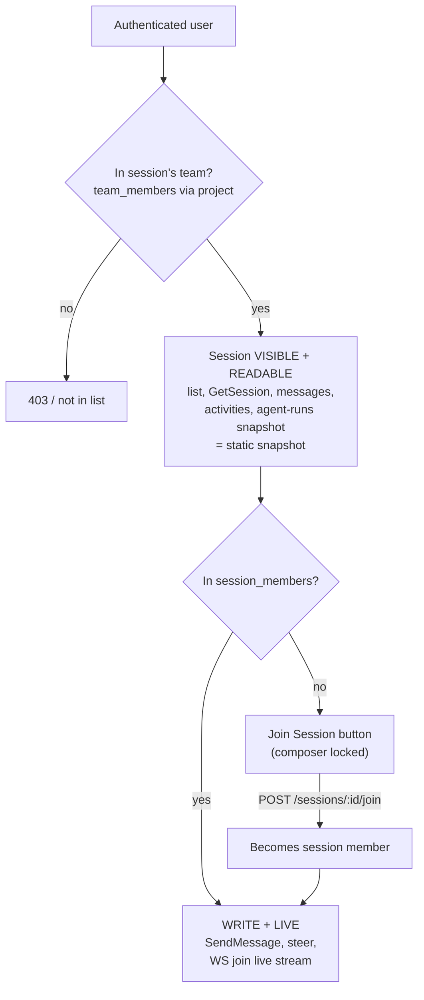
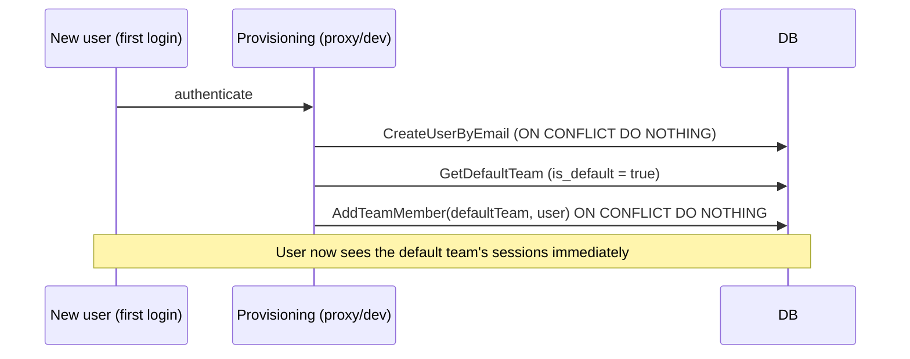

# feat: Team-scoped session visibility + Join-to-participate

## Summary

Today a session is invisible to anyone who is not in its `session_members` set: the list query JOINs membership, and the WebSocket `join` is gated on membership (KTD14). This plan inverts the model so that **all sessions within a user's teams are visible and readable**, while **`session_members` is demoted from a visibility gate to a write/participation gate**.

A user browsing a session they have not joined sees a **static (snapshot) read** of the chat — messages and activity loaded over REST, no live stream — and a **Join Session** button in the composer. Joining adds them to `session_members`, unlocks posting and agent steering, and starts the live WebSocket subscription.

Because visibility is **team-scoped** (not global), the plan also builds the minimum team-membership infrastructure to make that boundary usable: a **default team** that every newly provisioned user auto-joins, a **team-management UI** behind the existing (currently inert) Teams button, and **session grouping by team** in the sidebar.

---

## Problem Frame

**Current state.** Membership is a single overloaded gate. `ListSessionsForUser` (`server/internal/db/queries/sessions.sql:1`) returns only sessions the user is a member of; `client.go` rejects WS `join` for non-members (`server/internal/ws/client.go:85`); `e8a1072` added member-management so a teammate provisioned after creation could be granted access. The symptom that motivated this: a teammate who is not yet a member sees an **empty session list** and has no way to discover or peek at a session before being let in.

**Desired state.** Sessions behave like Slack channels scoped to a team: everyone on the team can *see and read* every session; *typing* requires joining. Membership becomes the write boundary, team membership becomes the read boundary.

**Two decisions resolved with the user during planning:**

1. **Read behavior for non-members = static snapshot.** A non-member viewing a session gets the REST snapshot of messages/activity, not a live stream. The WS `join` (live event subscription) stays membership-gated; it re-subscribes the moment they Join. (Chosen over live read-only to keep the WS gate simple.)
2. **Visibility boundary = team/project-scoped, not global.** A user sees every session whose project belongs to a team they are a member of — not literally every session on the server. This preserves a privacy boundary at the team level.

**Enabling consequence the user directed:** because team-scoping means a user with no team sees nothing, every newly provisioned user must land in a **default team**, and a **team-management UI** (the bottom-left Teams button) must let users browse/join/leave/create teams. Sessions in the sidebar group **by team**.

---

## Requirements

| ID | Requirement |
|----|-------------|
| R1 | `GET /api/sessions` returns every session whose project belongs to a team the caller is a member of, regardless of `session_members`. |
| R2 | Read endpoints (`GetSession`, `ListMessages`, `ListActivities`, agent-runs snapshot) authorize on **team** membership, returning 403 to users outside the session's team. |
| R3 | Write/live endpoints (`SendMessage`, WS `steer`, WS `join`) authorize on **session** membership; non-members receive 403 (REST) or a silent rejected-join (WS). |
| R4 | A non-member can self-join a session via a single action, provided they are in the session's team. Leaving is the existing self-remove path. |
| R5 | A non-member viewing a session sees readable history (static snapshot) and a **Join Session** affordance in place of the composer; after joining, the composer appears and live updates begin without a manual session switch. |
| R6 | Every newly provisioned user is added to a **default team** so they immediately see that team's sessions. |
| R7 | The bottom-left **Teams** button opens a team-management surface: browse all teams (with membership state), join, leave, and create a team; view a team's members. |
| R8 | The session sidebar groups sessions **by team** instead of by repository. |
| R9 | All current-member behavior (live chat, steering, unread counts, member management from `e8a1072`) is preserved unchanged for users who are session members. |

---

## High-Level Technical Design

### The two-gate model

The core architectural change is splitting one membership gate into two concentric rings. Team membership is the **read** ring; session membership is the **write/live** ring.



### Read vs write gate, per surface

| Surface | Today | After |
|---------|-------|-------|
| `GET /sessions` (list) | `session_members` JOIN | **team_members** JOIN (R1) |
| `GET /sessions/:id` | ungated | **team** gate (R2) |
| `GET .../messages`, `.../activities` | ungated | **team** gate (R2) |
| `GET .../agent-runs` snapshot | session gate (KTD14) | **team** gate (R2) — static cards |
| WS `join` (live events) | session gate | **session** gate, unchanged (R3) |
| `POST .../messages` (send) | **ungated (bug)** | **session** gate (R3) |
| WS `steer` | session gate | **session** gate, unchanged (R3) |
| `POST .../join` (self-join) | — | new; **team**-authorized (R4) |

### Team membership as the read boundary

The session→team chain already exists end-to-end; no new relational concept is needed, only new queries over it:

```
session.project_id ──▶ projects.team_id ──▶ team_members.user_id
```

### Default-team provisioning



---

## Key Technical Decisions

- **KTD1 — Two gates, not one.** Team membership gates *read*; session membership gates *write + live subscription*. This is the cleanest mental model that satisfies "see all, join to type" without a third concept. It directly supersedes KTD14's session-gate on the agent-runs snapshot read (the snapshot becomes team-gated; the *live* AgentRunEvent stream stays session-gated via WS `join`).
- **KTD2 — Static snapshot for non-members (user-chosen).** Non-members do not open a WS subscription. They get whatever REST returns at open time. This avoids splitting the WS event stream into read-only vs full tiers. Trade-off: a non-member watching an active session sees a frozen view until they Join. Accepted.
- **KTD3 — Self-join is a dedicated endpoint, team-authorized.** `POST /sessions/{id}/join` adds the *caller* with no prior session-membership precondition, but **requires team membership** so a user cannot join a session they cannot even see. This is distinct from the existing `AddSessionMember` (which requires the caller to already be a session member — that path stays for adding *others*).
- **KTD4 — Default team via an `is_default` flag.** A boolean column on `teams` (exactly one row true) is more robust than "oldest team wins." The migration backfills the flag and provisioning looks it up via `GetDefaultTeam`. Keeps "everyone in the default team" a single source of truth.
- **KTD5 — Reuse the session-member endpoint shapes for teams.** Team join/leave/create/browse mirror the `session_members` handler conventions (`memberResult`, `broadcastMembershipChange` pattern, idempotent `ON CONFLICT DO NOTHING`). Add/remove **other** team members is deferred (self-service join/leave is enough to unblock visibility).
- **KTD6 — Re-subscribe after join without a session switch.** The WS `join`/`mark_read` only fire on `activeSessionId` change (`use-websocket.ts:278`). Joining while already viewing won't re-fire it, so the hook registers a `resubscribe(sessionId)` callback into the store (same pattern as `setSteerSender`), which the Join action calls to start the live stream and reload messages.
- **KTD7 — Sidebar groups by team, replacing repo grouping.** R8 changes the grouping dimension established by the recent group-by-repo work (`2026-06-03-001-feat-group-sessions-by-repo-plan.md`). Team becomes the top-level group; repo grouping is dropped (not nested) to keep one grouping axis. Mapping is client-side: `session.projectId → project.teamId → team.name`.

---

## Output Structure

New files (everything else is edits to existing files):

```
server/internal/db/migrations/
  011_default_team.sql                 # is_default column + backfill (U5)
src/components/teams/
  TeamManagementDialog.tsx             # browse/join/leave/create teams (U12)
```

---

## Implementation Units

> Phased delivery. **Phase 1** (U1–U4) makes sessions visible+readable and demotes membership to a write gate — shippable on its own behind seeded team membership. **Phase 2** (U5–U7) adds default-team + team management so visibility is self-service. **Phase 3** (U8–U12) is the frontend.

### Phase 1 — Backend: team-scoped visibility + write gate

### U1. Team-scoped session list query

**Goal:** `GET /api/sessions` returns all sessions in the caller's teams, not just sessions they are a member of.
**Requirements:** R1, R9.
**Dependencies:** none.
**Files:**
- `server/internal/db/queries/sessions.sql` (rewrite `ListSessionsForUser`)
- `server/internal/db/sessions.sql.go` (regenerated via `make generate`)
- `server/internal/handler/sessions.go` (no logic change — `ListSessions` already calls `ListSessionsForUser`)
- `server/internal/handler/sessions_test.go` (add cases)

**Approach:** Replace the `session_members` JOIN with a join through `projects` and `team_members`:

```sql
-- name: ListSessionsForUser :many
SELECT s.* FROM sessions s
JOIN projects p ON p.id = s.project_id
JOIN team_members tm ON tm.team_id = p.team_id
WHERE tm.user_id = $1
ORDER BY s.last_activity_at DESC;
```

`team_members` PK is `(team_id, user_id)` and a project has exactly one team, so no duplicate rows; `DISTINCT` is unnecessary. `buildSessionResponse` still computes `unreadCount` via `GetUnreadCount` (session-member JOIN) — non-members get 0, which is correct (no unread tracking until joined).

**Patterns to follow:** mirror the existing query comment style in `sessions.sql`; regenerate, don't hand-edit `sessions.sql.go`.

**Test scenarios** (`sessions_test.go`, httptest + `X-User-ID`, following the `vscodeURIFixture` DB-seeded pattern):
- Happy path: user in team A, not a `session_members` row for session S (S's project ∈ team A) → `GET /sessions` includes S.
- Member parity: user who *is* a session member still sees the session (R9 regression guard).
- Isolation: user in team A only → `GET /sessions` excludes a session whose project ∈ team B.
- Empty: user in no team → `GET /sessions` returns `[]`, not an error.
- Ordering: two visible sessions returned by `last_activity_at DESC`.

### U2. Team-membership read gate

**Goal:** Read endpoints authorize on team membership so the team boundary is enforced on direct-by-ID access, not just the list.
**Requirements:** R2.
**Dependencies:** none (parallel with U1).
**Files:**
- `server/internal/db/queries/sessions.sql` (add `IsSessionTeamMember`)
- `server/internal/db/sessions.sql.go` (regenerated)
- `server/internal/handler/sessions.go` (gate `GetSession`)
- `server/internal/handler/messages.go` (gate `ListMessages`)
- `server/internal/handler/activities.go` (gate `ListActivities`)
- `server/internal/handler/agent_run.go` (change `AgentRunsSnapshot` from session→team gate)
- `server/internal/handler/session_members.go` or a shared helpers file (add `requireSessionTeamMember`)
- corresponding `_test.go` files

**Approach:** New query:

```sql
-- name: IsSessionTeamMember :one
SELECT EXISTS (
    SELECT 1
    FROM sessions s
    JOIN projects p ON p.id = s.project_id
    JOIN team_members tm ON tm.team_id = p.team_id
    WHERE s.id = $1 AND tm.user_id = $2
) AS is_member;
```

Add `requireSessionTeamMember(w, r, sessionID, userID) bool` mirroring `requireSessionMember` (`session_members.go:158`), writing 403 `FORBIDDEN` "not a team member". Apply at the top of each read handler after parsing IDs. For `AgentRunsSnapshot`, swap the existing `requireSessionMember`/`isSessionMember` check (KTD14) for the team variant.

**Patterns to follow:** `requireSessionMember` in `session_members.go`; the `IsSessionMember` query in `tasks.sql`.

**Test scenarios:**
- `GetSession`: team member non-session-member → 200; out-of-team user → 403; unknown session → 404 (parse/lookup order preserved).
- `ListMessages`: team member non-session-member → 200 snapshot with messages; out-of-team → 403.
- `ListActivities`: same two cases.
- `AgentRunsSnapshot`: team member → 200 (static cards); out-of-team → 403. Covers the KTD14→KTD1 gate change.
- Helper unit: `IsSessionTeamMember` returns true through project→team chain, false for foreign team.

### U3. Write gate on message send

**Goal:** Only session members can post. Closes the pre-existing gap where `SendMessage` had no membership check.
**Requirements:** R3, R9.
**Dependencies:** none.
**Files:**
- `server/internal/handler/messages.go` (`SendMessage`, add gate after user parse, before `CreateMessage`)
- `server/internal/handler/messages_test.go`

**Approach:** Insert `if !h.requireSessionMember(w, r, sessionID, userID) { return }` immediately after `userID` is parsed (`messages.go:131`). `steer` is already session-gated in `client.go:103` — note it in the unit, no change needed. Agent @mention routing stays downstream of the gate, so only members can trigger agents (correct — you must join to drive agents).

**Test scenarios:**
- Session member posts → 201, message persisted, broadcast fired.
- Team member, non-session-member posts → 403 `FORBIDDEN`, no row created.
- Out-of-team user posts → 403 (team gate would also reject; assert 403 either way).
- Empty content still → 400 `EMPTY_CONTENT` (gate doesn't mask validation order — decide gate-before-validation; assert membership checked first).
- `/stop` from a non-member → 403 (does not reach cancel path).

### U4. Self-serve session join endpoint

**Goal:** A team member can add themselves to a session in one call.
**Requirements:** R4, R5.
**Dependencies:** U2 (`IsSessionTeamMember`).
**Files:**
- `server/internal/handler/session_members.go` (add `JoinSession`)
- `server/internal/server/server.go` (route `POST /sessions/{sessionID}/join`)
- `server/internal/handler/session_members_test.go`

**Approach:** `JoinSession` parses `sessionID` + caller, calls `requireSessionTeamMember` (NOT `requireSessionMember` — the caller is by definition not yet a member), then `AddSessionMember(session, caller)` (idempotent `ON CONFLICT DO NOTHING`), then reuses `broadcastMembershipChange(w, r, sessionID, caller, caller)` to push `session_update` to the room and to the caller. Leaving reuses the existing `DELETE /sessions/{id}/members/{userID}` with the caller's own ID (already supported, `session_members.go:118`).

**Patterns to follow:** `AddSessionMember` / `broadcastMembershipChange` in the same file.

**Test scenarios:**
- Team member self-joins → 200, returns session with caller in `members`, `session_update` broadcast.
- Out-of-team user self-joins → 403 (cannot join an invisible session).
- Idempotent: joining twice → 200 both times, single membership row.
- Already a member self-joins → 200 no-op.

---

### Phase 2 — Backend: team membership infrastructure

### U5. Default-team migration + lookup query

**Goal:** Mark exactly one team as the default and expose a lookup.
**Requirements:** R6.
**Dependencies:** none.
**Files:**
- `server/internal/db/migrations/011_default_team.sql` (new)
- `server/internal/db/queries/teams.sql` (add `GetDefaultTeam`, `AddTeamMember`)
- `server/internal/db/teams.sql.go` (regenerated)
- `server/internal/db/migrate_test.go` (extend if it asserts migration count)

**Approach:** Migration adds `is_default BOOLEAN NOT NULL DEFAULT false`, a partial unique index enforcing at most one default (`CREATE UNIQUE INDEX ... ON teams (is_default) WHERE is_default`), and backfills: if no team is default, set the earliest-created team. Dev seed (`002`) data already has teams; the migration's backfill covers both fresh and seeded DBs. Queries:

```sql
-- name: GetDefaultTeam :one
SELECT * FROM teams WHERE is_default = true LIMIT 1;

-- name: AddTeamMember :exec
INSERT INTO team_members (team_id, user_id) VALUES ($1, $2)
ON CONFLICT DO NOTHING;
```

**Execution note:** Write the `+goose Down` to drop the index then the column. Verify `make migrate` applies cleanly against a seeded DB and re-run `make generate`.

**Test scenarios:**
- Migration up on a seeded DB → exactly one `is_default = true` team.
- `GetDefaultTeam` returns that team.
- Partial unique index rejects a second default (insert/update → error).

### U6. Auto-join provisioned users to the default team

**Goal:** Every newly created user lands in the default team.
**Requirements:** R6.
**Dependencies:** U5.
**Files:**
- `server/internal/auth/proxy.go` (after the `created` branch, `proxy.go:237`)
- `server/internal/auth/proxy_test.go`
- (verify dev path) `server/internal/auth/context.go` — dev middleware does not create users; the dev `DEUCE_USER_ID` is seeded into a team already, so no change. Document this.

**Approach:** In proxy provisioning, after a successful create (`created == true`), look up `GetDefaultTeam` and `AddTeamMember(defaultTeam.ID, user.ID)`. Non-fatal and idempotent: log on lookup/add failure but still admit the request (a user with no team simply sees no sessions — the existing degraded state, not a 500). Guard for "no default team configured" by logging a warning.

**Patterns to follow:** the existing `slog.Info("auth.proxy: provisioned user", ...)` block; keep the membership add inside the `created` guard so re-logins don't re-run it.

**Test scenarios:**
- New email through proxy → user created AND a `team_members` row for the default team.
- Returning user (no `created`) → no duplicate team-add attempt.
- Default team missing → user still admitted (200), warning logged, no 500.
- Race-loser path (`ErrNoRows` after conflict) → no team-add (only the winner provisions); assert no error.

### U7. Team-management endpoints

**Goal:** Back the team-management UI: browse all teams with membership state, create, join, leave, view members.
**Requirements:** R7.
**Dependencies:** U5 (`AddTeamMember`).
**Files:**
- `server/internal/db/queries/teams.sql` (add `ListAllTeamsWithCounts`, `CreateTeam`, `RemoveTeamMember`, `IsTeamMember`)
- `server/internal/db/teams.sql.go` (regenerated)
- `server/internal/handler/teams.go` (add `ListAllTeams`, `CreateTeam`, `JoinTeam`, `LeaveTeam`; `GetTeamMembers` optional — `ListTeamMembers` query already exists)
- `server/internal/server/server.go` (routes under `/teams`)
- `server/internal/handler/teams_test.go` (new)

**Approach:** Extend the `/teams` route group:

```
GET    /teams            -> ListTeams (existing: caller's teams)
GET    /teams/all        -> ListAllTeams (browse: every team + memberCount + isMember)
POST   /teams            -> CreateTeam (name -> slug; caller auto-joins)
POST   /teams/{teamID}/join          -> JoinTeam (self-add)
DELETE /teams/{teamID}/members/{userID} -> LeaveTeam (self-remove; remove-other deferred)
```

`ListAllTeams` returns a shape extending `teamResponse` with `memberCount int` and `isMember bool` (computed against the caller). `CreateTeam` slugifies the name (reuse/borrow the validation style in `sessions.go`; enforce `slug UNIQUE`, 409 on collision) and adds the creator via `AddTeamMember`. `JoinTeam`/`LeaveTeam` mirror the session join/leave semantics (idempotent). **Leave guard:** refuse to let a user leave the default team (it is their floor of visibility) — return 400 `CANNOT_LEAVE_DEFAULT`. Adding/removing *other* members is deferred (see Scope Boundaries).

**Patterns to follow:** `teams.go` `ListTeams` + `memberResult`; `session_members.go` idempotency and error codes.

**Test scenarios:**
- `ListAllTeams`: returns every team; `isMember` true for caller's teams, false otherwise; `memberCount` accurate.
- `CreateTeam`: 201, creator is a member, slug derived; duplicate slug → 409.
- `JoinTeam`: non-member joins → 200 then session list (U1) reflects that team's sessions; idempotent.
- `LeaveTeam`: member leaves a non-default team → 200, dropped from `team_members`; leaving the default team → 400 `CANNOT_LEAVE_DEFAULT`.
- Invalid team UUID → 400.

---

### Phase 3 — Frontend

### U8. API client, types, and store wiring

**Goal:** Expose the new endpoints and optimistic membership updates to the UI.
**Requirements:** R4, R5, R7.
**Dependencies:** U4, U7.
**Files:**
- `src/lib/api.ts` (add `joinSession`, `leaveSession`, `listAllTeams`, `createTeam`, `joinTeam`, `leaveTeam`)
- `src/types/index.ts` (add `TeamBrowseItem` = `Team & { memberCount: number; isMember: boolean }`)
- `src/stores/session-store.ts` (add `joinSessionLocal` optimistic helper; `currentUser` already present)

**Approach:** `joinSession(id)` → `POST /sessions/{id}/join`, returns `Session`. On success, `setSessions` with the server response (authoritative `members`) and call `resubscribe` (U9). Optimistic: immediately add `currentUser` to that session's `members` so the composer flips without waiting; reconcile/rollback on response. `leaveSession(id)` → `DELETE /sessions/{id}/members/{currentUser.id}`. Team calls map to U7 routes.

**Patterns to follow:** existing `addSessionMember`/`removeSessionMember` in `api.ts`; optimistic update + rollback in `SessionCard.commitEdit` (`SessionSidebar.tsx:79`).

**Test scenarios:** `Test expectation: none -- no frontend test runner (CLAUDE.md). Verify via `npx tsc --noEmit` and the manual flows in U10/U12.`

### U9. WebSocket re-subscribe after join

**Goal:** Live updates start the instant a user joins, without switching channels.
**Requirements:** R5.
**Dependencies:** U8.
**Files:**
- `src/hooks/use-websocket.ts` (register a `resubscribe(sessionId)` into the store)
- `src/stores/session-store.ts` (add `wsResubscribe` slot + setter, mirroring `steerSender`)

**Approach:** Add a `resubscribe` callback to the hook that sends `join` + `mark_read` and calls `fetchAgentRuns(sessionId)` — exactly the body of the `activeSessionId` effect (`use-websocket.ts:298-306`), extracted so both the effect and the Join action share it. Register it into the store via `setWsResubscribe` (same lifecycle as `setSteerSender`, cleared on unmount). The Join action (U10) calls `store.wsResubscribe(sessionId)` after a successful `joinSession`, and reloads messages (`api.listMessages`) to catch anything posted between the snapshot and the live subscription.

**Patterns to follow:** `setSteerSender`/`sendSteer` registration (`use-websocket.ts:314-331`).

**Test scenarios:** `Test expectation: none -- no frontend test runner. Verify manually: open a session as non-member (frozen), Join, confirm a message sent from another client now arrives live.`

### U10. Join-Session composer gate (ChatView)

**Goal:** Non-members see readable history + a Join button; members see the normal composer.
**Requirements:** R5, R9.
**Dependencies:** U8, U9.
**Files:**
- `src/components/chat/ChatView.tsx`

**Approach:** Derive `isMember = !!currentUser && session.members.some(m => m.id === currentUser.id)`. Add a `JoinSessionGate` composer mode. **Ordering** of the existing composer branches (`ChatView.tsx:494-523`) becomes:
1. `isReadOnly` (paused/archived) — unchanged, applies to everyone.
2. **`!isMember` → `JoinSessionGate`** (new) — primary CTA, takes precedence over workspace state (no point surfacing Start/Rebuild to someone who hasn't joined).
3. `!workspaceLive` → `WorkspaceComposerGate` — unchanged.
4. Normal composer.

`JoinSessionGate` renders a short "You're viewing #{name}. Join to send messages and run agents." line + a **Join Session** button that calls `store.joinSession(session.id)` with a pending spinner and error state (mirror `WorkspaceComposerGate`). The message list above stays fully readable (do not dim — dimming is reserved for the workspace-off state). On success the gate disappears (membership now true) and live updates flow via U9.

**Patterns to follow:** `WorkspaceComposerGate` (`ChatView.tsx:47`) for the pending/error button pattern.

**Test scenarios:** `Test expectation: none -- no frontend test runner. Manual: as a team member non-session-member, open a session → history readable, Join button shown, composer hidden; click Join → composer appears, message sends 201; reopen as member → no Join button.`

### U11. Sidebar: group sessions by team

**Goal:** Replace repo grouping with team grouping; mark joined vs view-only sessions.
**Requirements:** R8, R5.
**Dependencies:** U8.
**Files:**
- `src/components/layout/SessionSidebar.tsx`

**Approach:** Replace the `groupsByRepo` logic (`SessionSidebar.tsx:282-308`) and `RepoGroup` with a `TeamGroup`. Build `teamByProjectId` from `projects` (`project.teamId`) and a `teamNameById` from the store's `teams`; group `filteredSessions` by resolved team, ordered by most-recent activity, with a "No team" fallback bucket. On each `SessionCard`, add a subtle **view-only** marker (e.g., a muted outline-dot or "Viewing" pill) when `currentUser` is not in `session.members`, so users can tell at a glance which sessions they've joined. Unread badges already render only for joined sessions (server returns 0 for non-members).

**Patterns to follow:** the existing `RepoGroup` collapse/sort structure; `repo.ts` helpers are dropped from this view (leave the module — it may be used elsewhere).

**Test scenarios:** `Test expectation: none -- no frontend test runner. Manual: sessions cluster under their team headings; a not-yet-joined session shows the view-only marker; joining clears it.`

### U12. Team-management dialog (Teams button)

**Goal:** Wire the inert Teams button to a browse/join/leave/create surface.
**Requirements:** R7, R6.
**Dependencies:** U8.
**Files:**
- `src/components/teams/TeamManagementDialog.tsx` (new)
- `src/components/layout/SessionSidebar.tsx` (add `onClick` + dialog state to the Teams button, `SessionSidebar.tsx:377`)

**Approach:** A dialog (mirror `ManageMembersDialog.tsx`) listing all teams from `api.listAllTeams()`: each row shows name, member count, and a **Join**/**Leave** button driven by `isMember` (Leave disabled for the default team). A "Create team" input adds a team via `api.createTeam(name)` and optimistically appends it. On join/leave, refresh the teams list and the session list (`api.listSessions` → `setSessions`) so the sidebar regroups immediately. Show the caller's current teams at the top.

**Patterns to follow:** `ManageMembersDialog.tsx` (searchable list + per-row action + optimistic store update); `Dialog` usage and `SSHKeysDialog` wiring from the footer.

**Test scenarios:** `Test expectation: none -- no frontend test runner. Manual: click Teams → see all teams with correct Join/Leave state; join a team → its sessions appear in the sidebar; create a team → appears and caller is a member; Leave disabled on the default team.`

---

## Scope Boundaries

**In scope:** team-scoped session visibility (R1), team/session read-write gate split (R2, R3), self-serve session join (R4) + join-to-participate composer (R5), default-team auto-provision (R6), a browse/join/leave/create team-management dialog (R7), sidebar grouping by team (R8), preservation of existing member behavior (R9).

### Deferred to Follow-Up Work
- **Add/remove *other* team members** (team-level equivalent of `ManageMembersDialog`). Self-service join/leave is enough to unblock visibility; managing others is a separate surface.
- **Team roles / ownership** (admin vs member). Teams remain flat-trust like sessions.
- **Renaming or deleting teams.**
- **Live read-only for non-members** (the not-chosen fork). Could later split the WS stream into a read tier so non-members see live messages without joining.
- **Nested team→repo grouping.** This plan uses a single team axis; re-introducing repo as a sub-group is a later refinement.
- **Per-session unread for non-joined sessions.** Unread stays a member-only signal.

### Out of scope (not this product's shape right now)
- **Private/invite-only sessions within a team.** Team membership is the only privacy boundary; there is no per-session hiding.
- **Cross-team session sharing** (a session visible to multiple teams). A session belongs to one project → one team.

---

## Risks & Dependencies

- **R-A: Direct-by-ID read leak if a gate is missed.** The whole privacy boundary depends on U2 gating *every* read path. Mitigation: U2 enumerates `GetSession`, `ListMessages`, `ListActivities`, `AgentRunsSnapshot`; the test matrix asserts 403 for an out-of-team user on each. Audit `server.go` routes for any session-scoped GET not covered.
- **R-B: Default-team singleton.** If the migration leaves zero (or two) default teams, provisioning either no-ops (users see nothing) or is ambiguous. Mitigation: partial unique index + backfill in U5; U6 degrades gracefully (logs, still admits) rather than 500ing.
- **R-C: Snapshot/live seam on join.** A message posted between the static snapshot load and the post-join WS subscription could be missed. Mitigation: U9 reloads messages via REST immediately after the join subscribe; the store dedupes by ID (`addMessage`), so the reload + any live event converge without duplicates.
- **R-D: `make generate` drift.** U1/U2/U5/U7 all touch SQL. Forgetting `make generate` ships stale `*.sql.go`. Mitigation: each unit lists the regenerated file explicitly; CI/`tsc`/`go build` will fail on signature mismatch.
- **R-E: Existing tests asserting members-only list behavior.** `sessions_test.go` or others may encode the old visibility rule. Mitigation: U1 updates them as part of the change; treat any test asserting "non-member sees empty list" as intentionally inverted.

---

## Open Questions

- **OQ1 (resolved → assumption):** Which team is default? → The migration marks the earliest-created team (`Forge Utah` in dev seed) as default. For a fresh hosted deploy, the first team created becomes default via backfill; operators can re-point the flag with SQL. Revisit if multi-default orgs emerge.
- **OQ2:** Should `CreateTeam` be available to everyone or gated? This plan lets any authenticated user create a team (flat trust). If hosted deployments need to restrict this, add a role gate later (proxy `DEUCE_PROXY_REQUIRED_ROLE` is the natural hook).
- **OQ3:** Should the agent-runs snapshot really be team-readable (static cards for non-members), or stay session-gated? This plan chooses team-readable for read-consistency (KTD1). If leaking task/action detail to non-joined teammates is undesirable, keep that one endpoint session-gated — a one-line change in U2.

---

## Verification (feature-level)

- A user in the default team, not a member of session S, sees S in the sidebar under its team heading, opens it, reads history, sees a Join button, cannot post (`403` if forced via API), clicks Join, then posts successfully and receives live messages.
- A user in no shared team with session S never sees S and gets `403` on direct `GET /sessions/{S}` and `.../messages`.
- A brand-new provisioned user immediately sees the default team's sessions.
- The Teams button opens a dialog where the user can join another team and watch its sessions populate the sidebar.
- All existing session-member flows (chat, steer, member management, unread) behave exactly as before for members (`npx tsc --noEmit` clean; `go test ./...` green).
