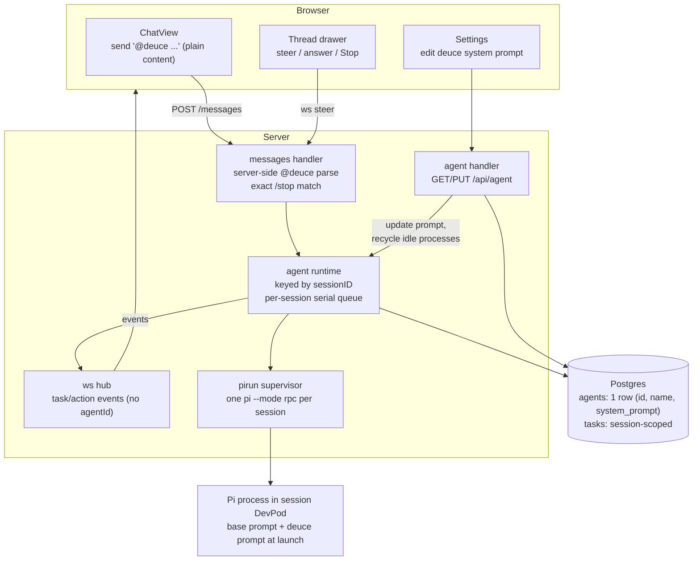
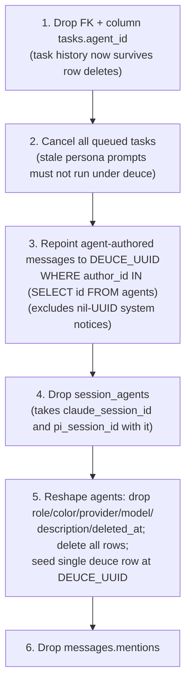

# refactor: Collapse multi-agent model into a single @deuce agent

## Summary

Remove every multi-agent feature — agent roles, role colors, per-session rosters, agent CRUD, multi-agent mention routing, per-(session, agent) Pi processes — and replace them with one built-in agent named **deuce**, implicitly present in every session. Destructive migration; no data preservation required. The legacy `claude -p` harness is deleted in the same pass since porting it to a single-agent shape would be wasted work.

---

## Problem Frame

Deuce today models five role agents (Coder, Reviewer, Planner, Tester, Designer) with per-session rosters, role colors, per-agent system prompts, and @mention routing by agent UUID. Under the Pi harness this is largely a UI fiction: an agent's `role` and `system_prompt` are fetched but never forwarded to Pi, which runs as one generic coding agent regardless of which row triggered it (validated in `docs/solutions/architecture-patterns/pi-loads-agent-skills-standard-in-rpc-mode.md`). The multi-agent model adds schema (`agents`, `session_agents`), runtime keying (`pirun.Key{SessionID, AgentID}`), WS payload fields, and UI surfaces that all maintain a distinction the execution layer ignores. Future specialization will ride skills/subagents on a single agent (see `docs/ideation/2026-06-08-single-deuce-agent-ideation.md`); this refactor clears the ground. Skills and subagents themselves are explicitly out of scope here.

---

## Requirements

**Agent model & data**

- R1. Exactly one agent, named `deuce`, exists. It is implicitly part of every session — no roster, no add/remove, no per-session agent state.
- R2. The `agents` table holds a single seeded row (fixed well-known UUID, `name`, `system_prompt` only); `session_agents` is dropped entirely.
- R3. Tasks are session-scoped: `tasks.agent_id` is gone, task queries key on `session_id` alone.
- R4. The legacy `claude -p` harness is fully removed: executor/queue/output code, `DEUCE_AGENT_HARNESS` config, `agent_status` / `typing_indicator` / `agent_output` WS events, and their frontend consumers.

**Backend behavior**

- R5. Deuce replies only when `@deuce` is mentioned. Mention detection moves server-side (word-boundary, case-insensitive); the client `mentions` request field and the `messages.mentions` column are removed. A message with no mention triggers nothing (unchanged behavior).
- R6. A running or queued task can be stopped from the UI (running task card and thread-drawer header) and via an exact `/stop` chat message, both routed to the Pi runtime's session cancel. The fuzzy `" stop"` suffix trigger is removed.
- R7. Deuce's system prompt is editable via `GET/PUT /api/agent`. On save, idle Pi processes are recycled so the next task launches with the new prompt; the editor states that sessions mid-task pick it up on their next process launch.
- R8. The thread-drawer steer path gates on workspace status with the same friendly system messages as chat mentions (no more instant "Agent process could not start." cards while a workspace is starting).
- R9. System notices (nil-UUID author sentinel) remain visible in chat; deuce's task replies remain hidden from the main chat list and surface on task cards / the thread drawer, exactly as today.

**Frontend**

- R10. All multi-agent UI is removed: agent picker in session creation, agent CRUD dialog, role color tokens, per-agent thread keying. A single frontend `DEUCE` constant carries id/name/color.
- R11. Deuce's status indicator (summary panel, drawer header) derives from task state in the `agentRuns` reducer (running/awaiting_input → working), not from deleted `agent_status` events.

**Migration & operability**

- R12. The migration is explicitly ordered so task history survives the agent-row deletion (FK/column drops before row deletes), queued tasks are cancelled (stale persona prompts must not auto-run under deuce later), and agent-authored messages are repointed to deuce's UUID with the nil-UUID system sentinel excluded.
- R13. The server boots clean post-migration: stuck-task recovery no longer references `session_agents` and does not panic.
- R14. `go build ./... && go test ./...` (server), `npx tsc --noEmit`, and `npm run lint` pass; CLAUDE.md and README reflect the single-agent model.

---

## Key Technical Decisions

- **Keep one seeded `agents` row rather than removing the table.** The row anchors message authorship (`author_type='agent'`, `author_id`), gives `system_prompt` a durable home for the settings editor, and minimizes churn in the message pipeline. Columns shrink to `id`, `name`, `system_prompt` — `role`, `color`, `color_muted`, `provider`, `model`, `description`, `deleted_at` go away (provider/model are already owned by `DEUCE_PI_PROVIDER`/`DEUCE_PI_MODEL` on the Pi path; color/name render from the frontend constant).
- **Fixed well-known UUID shared as a constant in Go and TS.** The visibility filter, message repointing, and authorship all pin to it. Implementer picks the value (a fresh deuce-specific constant is cleaner than reusing a role seed ID); it must not be the nil UUID, which stays reserved as the system-notice sentinel.
- **Delete the legacy claude harness now, don't port it.** Project memory pins Pi as the sole harness going forward; adapting the legacy executor to single-agent keying would be investment in dead code. Deleting it first removes roughly half the per-agent plumbing before the schema work starts.
- **Server-side mention parsing, dropping the `mentions` plumbing end to end.** With the name hardcoded, the server can parse `@deuce` from content directly (left-boundary regex so `clint@deuce.dev` doesn't trigger). This kills the client/server drift class (stale tabs, spoofable UUID arrays, near-miss silent no-ops on names) and deletes the request field, the `messages.mentions` column, and the ChatView parse code. Chat-side `@deuce` highlighting renders from text matching.
- **Mention-triggered, not always-listening.** Deuce still replies only to `@deuce`. "Agent responds to every message" is a separate product bet (flagged in the ideation doc's rejection list) and stays out.
- **`pirun` keying collapses to session ID.** One persistent Pi process per session; the per-key serial queue becomes a per-session queue. `pi_session_id` is dropped entirely rather than moved to `sessions` — it is dead code today (always launched with empty session path; resume-across-restart was deferred), and carrying a dead column through the collapse buys nothing. Re-add on `sessions` when resume is actually implemented.
- **Stop affordance relocates to the task surfaces.** The only current Stop button lives on the legacy typing indicator, which never renders on the Pi path and is being deleted. Stop moves to the running task card and the drawer header, calling the rewired cancel endpoint (still `requireSessionMember`-gated). The `" stop"` suffix match in chat is narrowed to exact `/stop` — "make the flicker stop" must not cancel a run.
- **Prompt edits recycle idle processes.** Pi applies the system prompt only at process launch and processes are reused across tasks, so a bare PUT would appear to do nothing for an unbounded window. On save: stop Pi processes for sessions with no running task; sessions mid-task pick the change up after their process is next reaped. The editor UI states this.
- **Stale browser tabs hard-reload at deploy.** The session JSON loses `agents`, WS payloads lose `agentId`, and old bundles will throw. Accepted for this pre-1.0 dogfood deployment; the steer handler tolerates (ignores) an `agentId` field from old tabs rather than rejecting the frame, and session-create tolerates an ignored `agentIds` body field.

---

## High-Level Technical Design

Target shape after the collapse:

Migration ordering (the FK cascade is the trap — `tasks.agent_id REFERENCES agents(id) ON DELETE CASCADE` means deleting agent rows first silently destroys all task history):

The goose Down restores the prior schema and the five role seed rows so a Down→Up cycle returns to a known dev state (precedent: `server/internal/db/migrations/007_drop_user_forge_id.sql`).

---

## Implementation Units

U2–U4 are one interdependent backend change-set: U2's query removals break compilation until U3/U4 land. Land them as a single PR (separate commits are fine; the tree need only be green at the U4 boundary). Likewise U5–U6 for the frontend.

### U1. Delete the legacy claude harness

- **Goal:** Remove the `claude -p` executor path and everything only it used, shrinking the multi-agent surface before the schema work.
- **Requirements:** R4
- **Dependencies:** none
- **Files:** `server/internal/agent/executor.go`, `server/internal/agent/queue.go`, `server/internal/agent/output.go` (delete); `server/internal/handler/messages.go` (`executeAgent`, `finishAgent`, `buildChatHistory`, legacy branch of mention loop, legacy `StopAgent` body); `server/internal/handler/handler.go` (executor/agentQueue fields); `server/internal/server/server.go` (legacy wiring, `ResetStaleAgentStatuses` boot call, harness branch); `server/internal/config/config.go` (`AgentHarness`); `server/internal/ws/events.go` (`agent_status`, `typing_indicator`, `agent_output` events); `server/internal/db/queries/agents.sql` (`UpdateClaudeSessionID`, `GetClaudeSessionID`, `ResetStaleAgentStatuses`); affected tests.
- **Approach:** Pure deletion. The Pi path becomes the only branch — `runtime` is constructed unconditionally. Leave `session_agents.claude_session_id` untouched — it is only read/written by the legacy executor code deleted in this unit, so the column becomes intentionally dead after U1 and U2's `session_agents` table drop cleans it up (no standalone column migration needed). Keep `postAgentReply`, `postSystemMessage`, the question backstop, and all Pi-path WS events untouched. Do not touch `PiSubagentsPackage`/`InstallPi` provisioning in `server/internal/workspace/manager.go` — `pi-subagents` is Pi-internal tooling, unrelated to Deuce's agents table.
- **Test scenarios:**
  - Happy path: `go build ./...` and `go test ./...` pass with the legacy files gone; a Pi-path mention still enqueues (existing runtime tests still green).
  - Edge: server boots with no `DEUCE_AGENT_HARNESS` env var set and with a stale value set (config no longer reads it; document removal in CLAUDE.md at U7).
  - Removal completeness: `grep` finds no remaining references to the three deleted WS event types or `claude_session_id` in `server/` Go code.
- **Verification:** Server builds, boots against the current (pre-migration) schema, and a `@Coder` mention still runs a Pi task — proving the legacy deletion is independent of the schema collapse.

### U2. Migration 013 and sqlc query rewrite

- **Goal:** Collapse the schema to a single seeded deuce row with session-scoped tasks, following the ordered steps in the migration diagram.
- **Requirements:** R2, R3, R12
- **Dependencies:** U1
- **Files:** `server/internal/db/migrations/013_single_deuce_agent.sql` (new); `server/internal/db/queries/agents.sql` (reduce to `GetDeuceAgent` / `UpdateDeuceSystemPrompt` against the single row); `server/internal/db/queries/sessions.sql` (remove `ListSessionAgents`, `AddSessionAgent`, `RemoveAllSessionAgents`, `UpdateSessionAgentStatus`); `server/internal/db/queries/tasks.sql` (drop `agent_id` params, delete `ListAgentTasks` — the existing `ListSessionTasks` already provides the session-scoped replacement — and delete `GetPiSessionID` / `UpdatePiSessionID` / `ClearStuckPiSessions`); `server/internal/db/queries/messages.sql` (drop mentions usage); `server/internal/db/queries/activities.sql` (drop `agent_id` param or leave nullable-unused — implementer's call, lean drop); regenerated `server/internal/db/*.go` via `make generate`; `server/internal/db/migrations/002_seed_data.sql` untouched (history), new seed lives in 013.
- **Approach:** Follow the six-step ordering in the HTD diagram exactly — the `ON DELETE CASCADE` from `tasks.agent_id` is the data-destroying trap, and the message repoint must use the `author_id IN (SELECT id FROM agents)` guard so nil-UUID system notices stay untouched. Cancel `queued` tasks in the migration (stuck-recovery at boot only fails `running`/`awaiting_input`). Down restores schema plus the five role seed rows per the 007 precedent.
- **Execution note:** Write the migration first and exercise `make migrate` / `make migrate-down` against a dev DB seeded with multi-agent data before touching queries.
- **Test scenarios:**
  - Happy path: on a dev DB with seeded sessions/tasks/messages, `make migrate` succeeds; task rows survive; agent-authored messages now carry DEUCE_UUID; the single deuce row exists.
  - Edge (sentinel): a system notice with nil-UUID author is NOT repointed and remains nil.
  - Edge (queued task): a task in `queued` state pre-migration is `cancelled` after.
  - Down/Up cycle: `make migrate-down && make migrate` returns to the post-013 state without error; Down alone restores the five role rows.
  - Fresh DB: `make migrate` from empty applies 001→013 cleanly.
- **Verification:** All migration scenarios above pass on a real Postgres; `make generate` produces compiling Go (full compile restores at U4).

### U3. Runtime collapse to per-session keying

- **Goal:** One Pi process and one serial task queue per session; the deuce system prompt actually reaches Pi.
- **Requirements:** R1, R7 (runtime half), R13
- **Dependencies:** U2
- **Files:** `server/internal/agent/pirun/supervisor.go` (`Key{SessionID, AgentID}` → session ID); `server/internal/agent/runtime.go` (maps, `EnqueueParams` drops `AgentID`, `DefaultBaseSystemPrompt` wording no longer says "other agents", prompt fetch via the single-row query); `server/internal/agent/store.go` + `dbstore.go` (interface drops agentID params); `server/internal/handler/agent_run.go` (`RecoverStuckTasks` simplifies — no `ClearStuckPiSessions`, just fail stuck `running`/`awaiting_input` tasks; must not panic post-migration); `server/internal/agent/runtime_test.go`, `system_prompt_test.go`.
- **Approach:** Mechanical de-keying — the per-key mutex, `running`/`workspace`/`consumers` maps, and promote logic all re-key on session ID. Launch-time prompt remains `joinSystemPrompts(base, deucePrompt)` with base from `DEUCE_AGENT_SYSTEM_PROMPT` (unchanged) and deucePrompt from the single row. Add a runtime method to stop idle sessions' processes (no running task), for U4's prompt-edit handler to call.
- **Test scenarios:**
  - Happy path: two enqueues in one session run serially on one process; enqueues in two sessions run on two processes.
  - Edge: cancel-session kills the running task and clears the queue for that session only.
  - Edge: recycle-idle stops the process for an idle session and leaves a session with a running task alone; the idle session's next task triggers a fresh launch (fresh prompt).
  - Error path: boot recovery against a DB with a stuck `running` task marks it failed and does not panic.
  - Integration: launched process receives base + deuce prompt joined (assert on the launcher's received system prompt, mirroring existing `system_prompt_test.go`).
- **Verification:** Runtime test suite green; manual: two sessions mention `@deuce` concurrently and get independent serial queues.

### U4. Handlers, routes, and WS contract

- **Goal:** Server-side mention parsing, single-agent settings endpoint, relocated stop, gated steer, and agentId-free WS payloads.
- **Requirements:** R5, R6, R7 (API half), R8, R9 (server half)
- **Dependencies:** U2, U3
- **Files:** `server/internal/handler/agents.go` (replace CRUD with `GetAgentSettings` / `UpdateAgentSettings`); `server/internal/server/server.go` (routes: `GET/PUT /api/agent`; delete `POST/PUT/DELETE /agents*`, `PUT /sessions/{id}/agents`; keep stop route gated `requireSessionMember`, rewired to runtime cancel); `server/internal/handler/messages.go` (server-side `(^|\W)@deuce\b` case-insensitive parse on content, drop `mentions` request field — the `messages.mentions` column drop happens in U2's migration step 6 — exact `/stop` match only); `server/internal/handler/sessions.go` (drop `agentResult`/`Agents` from session response, drop the create-time roster loop, tolerate-and-ignore `agentIds` in the request body); `server/internal/handler/websocket.go` (`handleSteer` ignores incoming `agentId`, adds the workspace-status three-way gate mirroring `SendMessage`); `server/internal/ws/events.go` (drop `AgentID` from task/action payloads and `ClientMessage`); `server/internal/handler/agent_run.go` (snapshot drops `agentId`); handler tests.
- **Approach:** On prompt PUT, call U3's recycle-idle-processes hook. Re-run the route-authorization audit from `docs/solutions/architecture-patterns/broadening-resource-visibility-requires-per-route-authorization-audit.md` over the final route table — the trap is a replacement route shipping ungated because no test fails. `PUT /api/agent` is authenticated-user gated (no finer role model exists); a change-audit trail is deferred.
- **Test scenarios:**
  - Mention parse: `@deuce do x` triggers; `@Deuce` (case) triggers; `clint@deuce.dev` does NOT; `@deucebot` does NOT; `hey @deuce!` triggers; message with no mention persists but enqueues nothing.
  - Stop: exact `/stop` cancels and posts the cancelled notice; `@deuce make the flicker stop` enqueues a task and cancels nothing; `POST .../stop` from a non-member returns 403 (gate before existence lookup); from a member, cancels.
  - Settings: `GET /api/agent` returns name + prompt; `PUT` round-trips and recycles idle processes (assert hook called); unauthenticated request rejected.
  - Steer gate: steer into a `starting` workspace posts the friendly system message instead of a failed card; steer into a `ready` workspace routes/enqueues as today; steer frame carrying a legacy `agentId` field is accepted and the field ignored.
  - Compat: session create with an `agentIds` array in the body succeeds and ignores it; session response JSON contains no `agents` key.
  - Visibility invariant: deuce's reply persists with `author_type='agent'`, `author_id=DEUCE_UUID`; system notices persist with nil UUID (existing `session_visibility_test.go` updated, not deleted).
- **Verification:** `go build ./... && go test ./...` green — the U2–U4 change-set compiles as a whole; route audit table updated in the PR description.

### U5. Frontend state layer

- **Goal:** Types, API client, store, and reducer reflect the single-agent contract.
- **Requirements:** R9 (client half), R10 (state half), R11
- **Dependencies:** U4 (contract shape)
- **Files:** `src/types/index.ts` (delete `Agent`, `AgentStatus`, `AgentRole`, `Session.agents`, `agentId` fields on task/action payloads and `ActivityItem`); new `src/lib/deuce.ts` (or similar) exporting the `DEUCE` constant (id matching the Go constant, name, color); `src/lib/api.ts` (drop `listAgents`/`createAgent`/`updateAgent`/`deleteAgent`/`updateSessionAgents`/`AgentMutation`/`agentIds`; add `getAgentSettings`/`updateAgentSettings`; keep `stopAgent` pointing at the rewired route); `src/stores/session-store.ts` (delete `thinkingAgents`, `agentOutput` and their actions; `openThread` drops `agentId`; `steer` drops agentId); `src/stores/agent-runs.ts` + `.test.ts` (de-key agentId; add a derived session-status selector: any task running/awaiting_input → working/waiting, else idle); `src/hooks/use-websocket.ts` (remove `agent_status`/`typing_indicator`/`agent_output` handlers; `sendSteer` drops agentId); `src/components/chat/message-visibility.ts` + `.test.ts` (filter pins to `DEUCE.id`; nil-author system notices stay visible); `src/mocks/data/seed.ts` (single deuce agent).
- **Approach:** Check how the frontend `.test.ts` files run (no test script is configured in `package.json`) — wire vitest or run the existing convention before relying on the tests; flag in the PR if a runner had to be added.
- **Test scenarios:**
  - Visibility: message with `authorType='agent'` + `DEUCE.id` is hidden from chat; nil-UUID system notice visible; human message visible; agent-authored message with an unknown legacy UUID — decide and pin behavior (post-migration these shouldn't exist; hiding all `authorType='agent'` except nil is the safe shape).
  - Reducer: task lifecycle events without `agentId` reduce correctly; queue positions key per session; status selector returns working during a running task, waiting during awaiting_input, idle when none.
  - Edge: WS reconnect snapshot (`fetchAgentRuns`) hydrates the de-keyed reducer.
- **Verification:** `npx tsc --noEmit` clean across the U5–U6 set; reducer and visibility test suites green.

### U6. Frontend UI surfaces

- **Goal:** Every multi-agent UI surface becomes the single-deuce equivalent; Stop gets its new home.
- **Requirements:** R6 (UI half), R7 (UI hint), R10, R11
- **Dependencies:** U5
- **Files:** `src/components/chat/ChatView.tsx` (delete mention-parse/`mentions` send, `TypingIndicator`/`AgentWorkingIndicator`, agent-colored borders keyed by roster; empty state pre-fills `@deuce `; running `AgentTaskCard` gains a Stop button); `src/components/super-threads/AgentTaskCard.tsx`, `AgentThreadDrawer.tsx` (single per-session thread, status from the U5 selector, Stop in header), `ThreadDrawerPanel.tsx`, `atoms.tsx` (color from `DEUCE`), `utils.ts`; `src/components/settings/AgentSettingsDialog.tsx` → single system-prompt editor with the "takes effect on the agent's next process launch" note; `src/components/layout/SessionSidebar.tsx` (settings entry point), `SummaryPanel.tsx` (one deuce row, status from selector, participant count = members + 1), `AppShell.tsx`; `src/components/session/CreateSessionDialog.tsx` (delete preset loading and roster checkboxes); `src/styles/globals.css` (delete `--color-agent-*` role tokens; keep/collapse the `--ac` plumbing to deuce's color).
- **Approach:** `@deuce` highlighting in rendered messages comes from text matching, not a mentions array. Keep the drawer's awaiting-input question context (`QuestionControls`) prominent — with one shared thread, two humans' drawer messages can collide on a pending question (accepted; see Scope Boundaries).
- **Test scenarios:**
  - Happy path (manual smoke): create session → empty state shows `@deuce` pre-fill → mention runs task → card shows queued/running with Stop → drawer opens, steer works → Stop cancels → settings dialog edits prompt and shows the staleness note.
  - Edge: session with pre-migration history renders without crashing (old hidden messages stay hidden; no roster lookups).
  - Test expectation: component-level — none beyond the U5 logic modules (no component test rig exists); the pure-logic-first pattern (`message-visibility.ts` precedent) keeps testable logic out of components.
- **Verification:** `npx tsc --noEmit` + `npm run lint` clean; manual smoke of the happy path above against a migrated dev DB.

### U7. Documentation

- **Goal:** Docs describe the single-agent model.
- **Requirements:** R14
- **Dependencies:** U1–U6
- **Files:** `CLAUDE.md` (remove `DEUCE_AGENT_HARNESS` and the legacy-harness paragraph from the env block, remove the role-color design-system bullet, fix the "Agent simulation" architecture line, mention `GET/PUT /api/agent`); `README.md` (any multi-agent framing).
- **Test scenarios:** Test expectation: none — documentation-only unit.
- **Verification:** `grep` for "Coder", "Reviewer", "DEUCE_AGENT_HARNESS", "session_agents" in CLAUDE.md/README returns nothing stale.

---

## Scope Boundaries

**In scope:** everything above — schema collapse, legacy harness deletion, runtime de-keying, contract simplification, UI collapse, docs.

**Out of scope (separate product bets):**

- Skills, plugins, and subagent dispatch (the ideation doc's main thread) — this refactor only clears the ground.
- "Deuce always listening" / ambient triggering — deuce stays mention-triggered.

### Deferred to Follow-Up Work

- A proper `system` author type replacing the nil-UUID sentinel hack (`postSystemMessage` writes `author_type='agent'` + nil UUID today; cleaner but touches rendering and is severable).
- `pi_session_id` resume-across-restart, re-added on `sessions` when actually implemented.
- Audit trail / announcement for system-prompt edits (global setting, per-session blast radius; today any authenticated user can edit silently).
- Unread badge incremented by hidden agent replies (preexisting oddity, now universal — every deuce reply is hidden).
- Multi-human drawer answer collisions on a pending `ask_user` question (existing semantics; the single shared thread makes them likelier — accepted for now, `QuestionControls` shows question context).
- Transitional `agents: []` compat field in session JSON (rejected — stale tabs hard-reload, acceptable pre-1.0).

---

## Risks & Dependencies

- **Deploy with in-flight tasks.** Running/awaiting tasks at deploy are failed by boot recovery (existing behavior); queued tasks are cancelled by the migration (R12). Users re-mention `@deuce`.
- **Frontend tests have no configured runner.** `package.json` has no test script despite `.test.ts` files existing — U5 must establish how they run before trusting them.
- **`pi-subagents` confusion hazard.** `PiSubagentsPackage` provisioning in `server/internal/workspace/manager.go` looks multi-agent but is Pi-internal tooling consumed inside the container — do not remove it.
- **Old bundles crash at deploy** (session JSON shape change). Accepted; hard reload recovers.
- **Route-gate regression.** Replacement routes (`GET/PUT /api/agent`, rewired stop) must carry explicit gates; the audit in `docs/solutions/architecture-patterns/broadening-resource-visibility-requires-per-route-authorization-audit.md` is the checklist, including routes outside the `/api/sessions/{id}` subtree.

---

## Sources

- `docs/ideation/2026-06-08-single-deuce-agent-ideation.md` — design source for the single-agent direction; documents that role/system_prompt never reach Pi.
- `docs/solutions/architecture-patterns/pi-loads-agent-skills-standard-in-rpc-mode.md` — validated Pi 0.74.2 mechanics: `--append-system-prompt` at launch is real; no mid-session prompt override; skills/extension provisioning seam.
- `docs/solutions/architecture-patterns/broadening-resource-visibility-requires-per-route-authorization-audit.md` — per-route gate audit method for the route changes in U4.
- `server/internal/db/migrations/007_drop_user_forge_id.sql` — precedent for destructive migrations whose Down restores schema + seed rows.
- Project memory: legacy `claude -p` harness is removal fodder (don't port it); `ask_user` requires a capable model (`DEUCE_PI_MODEL`) — unchanged by this refactor but relevant to the single agent's question flow.
