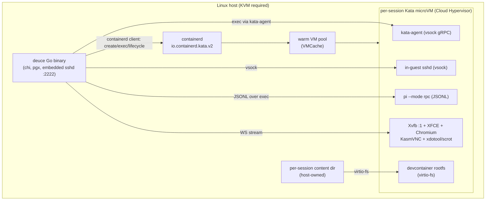
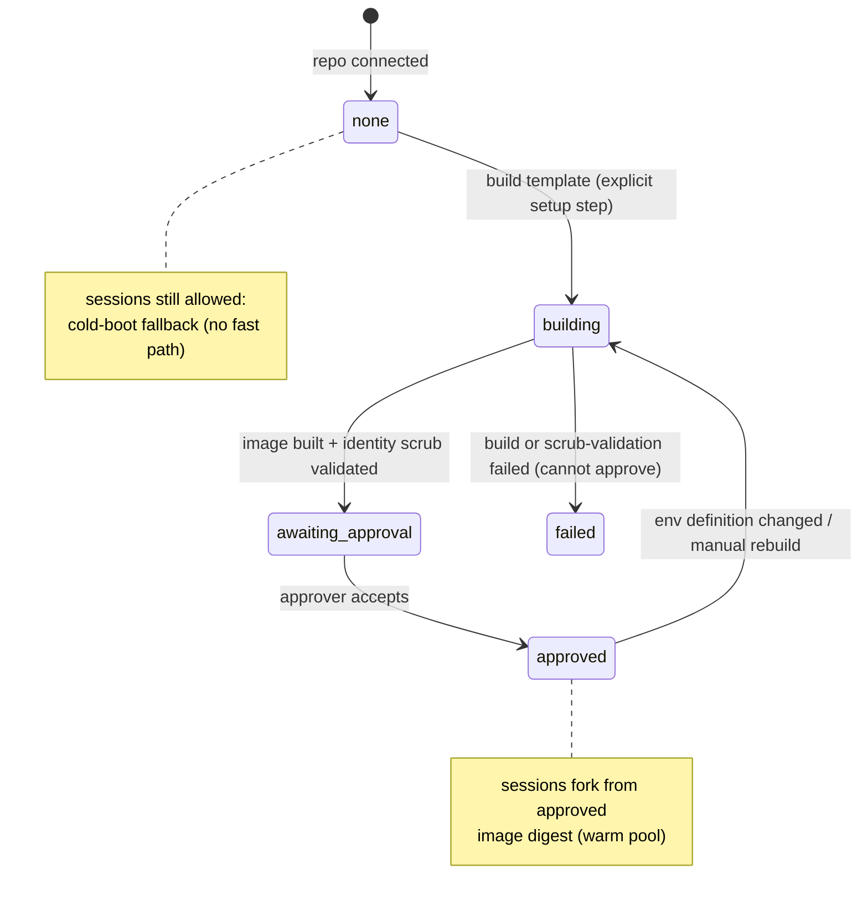
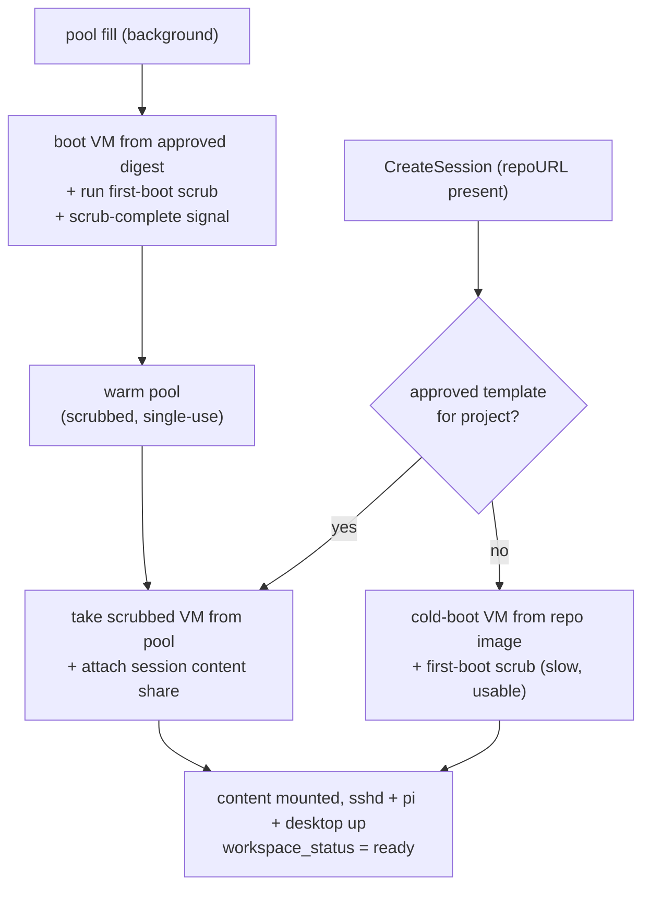

# feat: Migrate session workspaces from DevPod devcontainers to Kata microVMs

## Summary

Replace Deuce's DevPod/devcontainer (Docker) workspace runtime with per-session Kata microVMs running on Cloud Hypervisor, giving each session a real kernel-isolation boundary and a fast warm-pool start while keeping the existing OCI/devcontainer image as the unit of distribution. Add a per-repo "build a developer-environment template → approve it → fork sessions from it" lifecycle, with the approval gate enforcing the mandatory entropy/identity scrub. Bake a software-rendered, agent-callable desktop (Xvfb + XFCE + Chromium + KasmVNC) into the workspace image so humans and agents can see UI changes live. This is a direct cutover — DevPod is removed once the Kata backend reaches parity, not kept as a runtime-selectable option.

---

## Problem Frame

Today every session runs in a DevPod-managed devcontainer. Provisioning shells out to the `devpod` CLI from `server/internal/workspace/manager.go` (~613 lines, Go 1.25.7); the "Open in VS Code" SSH proxy opens channels via `docker exec`; the Files tab reads workspace content directly off the Docker bind-mount host path; one persistent `pi --mode rpc` process per session runs inside the container over a JSONL channel. The DevPod/Docker coupling is concentrated in four packages: `workspace/`, `sshproxy/`, `agent/pirun/`, and `reconcile/`.

Two pressures motivate the move (see origin: docs/brainstorms/2026-06-16-microvm-workspace-migration-requirements.md):

- **Isolation.** Sessions increasingly run agent-generated code. A shared-kernel container is a weaker boundary than wanted; the goal is a per-session kernel boundary so one session can't reach the host or another session via a container escape.
- **Cold-start latency.** Building a devcontainer from scratch is slow, and the delay is paid on the session-open path. The goal is to prepare an approved per-repo environment once and start subsequent sessions from that prepared state quickly.

Separately, `STRATEGY.md`'s "Coding & Preview" track calls for live UI previews as a first-class surface and makes agent-native parity a hard constraint — every collaborative surface must be agent-callable. The desktop preview therefore has to be drivable by the agent, not just viewable by a human.

---

## Key Technical Decisions

- **Cloud Hypervisor under Kata 3.x with virtio-fs, not Firecracker + Kata templating.** Kata's copy-on-write VM templating is mutually exclusive with virtio-fs, and virtio-fs is what mounts arbitrary OCI/devcontainer images and shares files with the host. Firecracker additionally has no virtio-fs (it would force a devmapper block-rootfs). Cloud Hypervisor supports virtio-fs, is the default for Kata's modern runtime-rs, and is self-hostable. Firecracker + snapshot/restore is the deferred density/speed fallback (see Scope Boundaries), not v1.

- **Fast start via a warm VM pool (VMCache), not CoW templating or snapshot/restore.** Because templating is off the table (virtio-fs conflict), v1 hides boot latency with a pre-booted warm pool of Cloud Hypervisor VMs handed out per session. The brainstorm's "warm templating" resolves to this. Snapshot/restore stays the deferred optimization. **Scope of the claim:** the warm pool hides *VMM/kernel boot* latency only. "Prepared environment" speed comes separately from the repo image being pre-built and pre-pulled (U3/U7); per-session cost still includes the virtio-fs mount and the first-boot scrub. The benchmark (Outstanding Questions) must measure the composite warm-path time (pool checkout + image mount + scrub → ready), not pool checkout alone.

- **Warm VMs are single-use: scrub runs exactly once per VM instance, and no VM is ever reused across sessions.** A pooled VM is consumed by at most one session for its lifetime and is destroyed on teardown, never returned to the pool. This is what makes the per-session identity guarantee hold under warm-pooling — the scrub runs at pool-fill (per fresh VM), and the no-reuse rule is what prevents two sessions from ever sharing one VM's regenerated identity. The host-side "ready"/pool-eligible signal gates on a guest→host scrub-complete readiness ping, not on mere containerd task liveness, so a VM whose scrub failed or is incomplete is never served and never enters the pool (fail closed).

- **"Approved template" = approved OCI image digest + passed identity scrub, pinned per session at fork time.** The per-repo template is the repo's devcontainer image at a pinned digest that has passed the entropy/identity scrub validation. Each session records the exact template **version** it forked from (`sessions.template_version_id`), so a rebuild that approves a newer version never retroactively affects live sessions. A template that has not been identity-scrubbed cannot be approved — enforced as a DB CHECK (`approved ⇒ scrub_passed`), not just application code.

- **Template approval is a higher-privilege action than ordinary workspace writes.** Approving a template makes that image the trusted base for *every future session any team member creates in the project* — a team-wide trust injection. Approval therefore requires a distinct authorization tier (project owner / team admin / dedicated approver), separate from and stricter than build. Build and approve routes are **project-scoped, not session-scoped**, so they need a new `requireProjectApprover`/`requireProjectTeamMember` helper — the existing session-keyed `requireSessionMember` helpers do not apply.

- **Talk to containerd via its Go client, not CLI shell-out.** Replace the `devpod`/`docker` `os/exec` shell-outs with the containerd Go client selecting the `io.containerd.kata.v2` runtime. This is strictly better than parsing CLI output and gives typed lifecycle, events, and exec. A `nerdctl --runtime io.containerd.kata.v2` shell-out is acceptable only as a transitional spike, not the landing state.

- **The provider exec surface is transport-neutral, not `*exec.Cmd`.** Today `ExecInWorkspace`/`SSHCommand` return `*exec.Cmd` because `devpod ssh` *is* a host subprocess. Kata exec is a containerd gRPC / vsock dial with no host `*exec.Cmd`. So `Provider.Exec`/`InteractiveShell` are defined in terms of a transport-neutral stdio handle (a small `ExecSession`: stdin writer, stdout reader, `Wait`), which both a DevPod `*exec.Cmd` wrapper and the Kata impl satisfy. Doing this in U1 (while DevPod is the only impl, so it's a pure refactor) avoids retrofitting the interface mid-transport-build.

- **One exec/transport layer for both the SSH proxy and the Pi channel; the proxy terminates SSH.** Use an in-guest `sshd` reached over **vsock** for the user-facing Terminal + Open-in-VS-Code paths (this also converges the two historically divergent exec paths documented in `CLAUDE.md` onto one mechanism and keeps SFTP working), and containerd-client exec via the kata-agent for programmatic/agent-driven runs. The Deuce proxy **terminates** the client SSH connection and re-originates to the guest sshd over vsock, so the *stable proxy host key* is what clients see — the per-session guest host key (deliberately regenerated per fork by the scrub) is never presented to clients, avoiding `known_hosts` churn and host-key-warning fatigue. The Postgres-backed auth model, `dc-<uuid>` username gate, proxy host-key persistence, env-var allowlist, `-it`/`-i` PTY-or-not invariant, and degraded-mode 503 all carry over unchanged. Convergence of the two exec paths is *forced by the migration* (both old backends are gone), not optional cleanup.

- **Content plane: re-home workspace content to a host directory shared into the VM via virtio-fs.** The Files-tab fast path currently reads the Docker bind-mount on the host. Keep that host-side read fast path by making the workspace content directory a host-owned directory that is virtio-fs-shared into the guest, rather than living behind the VM boundary. Re-apply the `filepath.EvalSymlinks` + prefix-recheck guard on the new surface.

- **Entropy/identity scrub is mandatory and security-critical.** Forking many sessions from one template is the default attack on the isolation this migration exists to provide. Pin a guest kernel ≥ 5.18 (≥ 6.10 on ARM) for VMGenID CSPRNG reseed, attach `virtio-rng`, and bake a first-boot systemd oneshot — running before sshd and before the agent — that regenerates SSH host keys, clears `/etc/machine-id` and `boot_id`, and wipes `random-seed`. **Two distinct moments, do not conflate:** (1) the *template build* removes any baked identity so the golden image ships clean (scrub-validation gate, U7); (2) each *VM boot* runs the first-boot oneshot to generate fresh per-VM identity. For warm-pool VMs that boot+scrub happens at **pool-fill** (before pool entry), so a pooled VM is already scrubbed at checkout — the no-reuse rule (below) is what keeps that per-session-unique. Cold-boot VMs scrub at session start.

- **Direct cutover, no backend toggle.** DevPod is removed as a runtime once Kata reaches parity. The provider *abstraction* is retained as a clean seam (for testing and the future Firecracker-snapshot fallback), but there is no `DEUCE_WORKSPACE_BACKEND` flag and no runtime fallback to DevPod.

- **Desktop is one Xvfb display with two consumers.** XFCE/openbox + Chromium run on `Xvfb :1`. KasmVNC serves `:1` to the browser for humans; the agent drives the same `:1` via `scrot`/`ffmpeg` (screenshot) and `xdotool` (input), exposed as agent tools alongside the existing `ask_user` extension. One display, two consumers — this is what satisfies agent-native parity.

- **Scope agent-runtime work to Pi only.** The legacy `claude -p` executor (`server/internal/agent/executor.go`) is slated for deletion; do not build a VM transport for it.

---

## High-Level Technical Design

### Target runtime topology

### Per-repo template lifecycle and the approval gate

### Session start: fast path vs fallback

---

## Requirements Traceability

| Origin requirement | Where addressed |
|---|---|
| R1 microVM kernel boundary per session | U2 |
| R2 keep OCI/devcontainer image pipeline | U2, U3 |
| R3 self-hostable, no managed-cloud dependency | KTD (Cloud Hypervisor), U2 |
| R4 fast start from prepared template | U2 (warm pool), U7 |
| R5–R8 per-repo template build/approve/reuse/rebuild | U7 |
| R9 rebuild trigger (env-definition change + manual) | U7 |
| R10 cold-boot fallback before approval | U7 |
| R11 per-session entropy/secret regeneration | U3 |
| R12–R14 software-rendered desktop, no GPU | U8 |
| R15 desktop is agent-callable | U8 |
| R16 rework `docker exec` SSH proxy | U4 |
| R17 Pi runtime rides new transport | U5 |

---

## Implementation Units

Grouped into four phases. U-IDs are stable and never renumbered.

### Phase 1 — Substrate

### U1. Extract the workspace `Provider` abstraction

- **Goal:** Introduce a `Provider` interface that the rest of the system depends on, with the current DevPod behavior as the initial concrete implementation. No behavior change to provisioning. This is the seam every later unit swaps against. Also settle the **workspace-identity** decision here (below), because every later unit keys on it.
- **Workspace-identity decision (do it here):** today workspace identity is `session.Name` — a free-text `TEXT` column with no `UNIQUE` constraint, validated only non-empty — and it's passed as the workspace key at ~11 call sites (`Create`, `ContainerName`, `deriveTruth`, `workspaceContentPath`, the `dc-<uuid>` proxy auth already uses the UUID). Two same-named sessions collide onto one container today; under Kata that means a **shared microVM + shared content dir + ambiguous `template_version_id`**, silently defeating the per-session boundary. Re-key workspace identity from `session.Name` to `session.ID` (UUID) across the provider, reconciler, content dir, and proxy so VM/content/template keys are unique by construction. The `wsID` in the interface below is the session UUID.
- **Requirements:** Enables R1, R16, R17 (decoupling precondition).
- **Dependencies:** none.
- **Files:**
  - `server/internal/workspace/provider.go` (new) — interface + shared types
  - `server/internal/workspace/manager.go` (refactor `Manager` to implement `Provider`; preserve `ErrContainerNotRunning`, `ErrInvalidContainerName`, `ContainerState`, `LogFunc`, and the `runner commandRunner` test seam)
  - `server/internal/server/server.go` (construction at ~line 123), `server/main.go` (~lines 103, 125), launcher wiring (~`server.go:159`)
- **Approach:** Define `Provider` with the lifecycle surface the research mapped: `Create(ctx, wsID, spec, LogFunc)`, `Stop`, `Delete`, `Status`, `Exists`, `Exec(ctx, wsID, cmd, env) (ExecSession, error)` (replacing `ExecInWorkspace`), `InteractiveShell(ctx, wsID) (ExecSession, error)` (replacing `SSHCommand`), `Resolve(ctx, wsID) (handle, error)` (replacing `ContainerName`), `BulkStatus(ctx) map[wsID]ContainerState` (replacing `BulkContainerStatus`). `ExecSession` is a transport-neutral stdio handle (stdin `io.WriteCloser`, stdout `io.ReadCloser`, `Wait() error`) — **not** `*exec.Cmd`, which is a DevPod-shaped signature the Kata impl can't satisfy (see KTD). The DevPod impl wraps its `*exec.Cmd` in `ExecSession`. **`Create` keeps DevPod's current behavior in U1 (no behavior change):** the `spec` carries `repoURL` exactly as today, and the DevPod impl uses it as it does now. U2's Kata impl additionally honors an optional approved-image-digest field on the same `spec` (the digest-vs-cold decision belongs to the caller, U7) — so the signature is source-neutral from the start rather than flipping from `repoURL` to `imageRef` between units. Keep all four construction sites building the same concrete impl for now. Pi-install methods stay *off* the interface (they're provisioning, not lifecycle) on the DevPod impl; their handler call sites are deleted in U5, not abstracted.
- **Reconciler seam decision (do it here):** the reconciler today depends on **two** DevPod seams — `ContainerLister.BulkContainerStatus` *and* `WorkspaceUIDReader.WorkspaceUID` (the `dev.containers.id` label from `workspace.json`, which has no Kata analog). Collapse these: have `BulkStatus` return `map[wsID]ContainerState` keyed directly by **workspace ID**, and delete the `WorkspaceUIDReader` seam entirely. This makes U2's `deriveTruth` rewrite a logic change only, not a hidden interface change.
- **Patterns to follow:** the existing `commandRunner` and `resolveContainerHook` injection seams in `manager.go`; the `reconcile/reconciler.go` `ContainerLister`/`WorkspaceUIDReader` seams being consolidated.
- **Test scenarios:**
  - Happy path: each `Provider` method delegates to the existing DevPod implementation and returns identical results to pre-refactor (characterization).
  - `ExecSession`: the DevPod `*exec.Cmd` wrapper exposes working stdin/stdout and `Wait` semantics identical to the prior direct-`*exec.Cmd` callers (Pi launcher + SSH proxy).
  - `Resolve` returns `ErrContainerNotRunning` when the workspace is absent (preserves the SSH-proxy pre-check contract).
  - `BulkStatus` is keyed by workspace ID and the reconciler derives identical truth to pre-refactor with `WorkspaceUIDReader` removed (characterization).
  - Error path: `Status` of a non-existent workspace returns the `NotFound` state, not an error escape.
  - `Test expectation:` table-driven characterization over the method surface using the `commandRunner` seam with canned outputs.
- **Execution note:** Add characterization coverage over the current `Manager` behavior before extracting the interface.
- **Verification:** existing terminal, VS Code, Pi, and reconciler flows behave identically with the interface in place; full suite green.

### U2. Kata/Cloud Hypervisor provider via the containerd Go client

- **Goal:** A `KataProvider` implementing `Provider`, creating per-session Cloud Hypervisor microVMs from OCI/devcontainer images over containerd with the `io.containerd.kata.v2` runtime, plus a warm VM pool for fast start. Rewrite reconciler truth-derivation against containerd/VM state. **The provider and pool are approval-agnostic** — `Create` takes the spec's image digest and the pool keys on it; the approved-vs-cold decision lives in U7's `CreateSession`, so the fast path is a Provider-internal capability the handler layer never names. (Note: the deferred Firecracker fallback is a clean swap at the *handler* layer but **not** content-plane-neutral — Firecracker has no virtio-fs, so adopting it would require re-homing U6's content plane off virtio-fs; see Scope Boundaries.)
- **Requirements:** R1, R2, R3, R4.
- **Dependencies:** U1.
- **Files:**
  - `server/internal/workspace/kata_provider.go` (new)
  - `server/internal/workspace/vmpool.go` (new — warm-pool manager)
  - `server/internal/reconcile/reconciler.go` (rewrite `deriveTruth`, ~line 217, to read containerd/VM state instead of `docker ps` labels)
  - `server/internal/config/config.go` (add `DEUCE_VM_*` fields: kata runtime handler, CH config path, guest kernel path, default mem/cpus, content-share root, warm-pool size; extend `Validate()`)
  - `server/main.go` / `server/internal/server/server.go` (startup substrate self-check: probe `/dev/kvm` + containerd Kata runtime, fail fast with a clear error rather than hanging on first session)
  - `server/go.mod` (new dependency `containerd/containerd/v2/client`, version-pinned against the targeted containerd/Kata-shim release)
  - `.env.example`, `CLAUDE.md` (env documentation)
  - deployment/runtime config: a `configuration.toml` for the Kata runtime class selecting Cloud Hypervisor + `virtio-fs` (committed under `deploy/` or documented)
- **Approach:** Use `containerd/containerd/v2/client` with `WithRuntime("io.containerd.kata.v2", opts)`. `Create(wsID, spec, …)` uses the spec's approved image digest (or cold repo image), and serves from the warm pool when a pooled VM matching that digest is available, else cold-boots. Pool entries are **keyed by image digest**; a VM is single-use (consumed by one session, destroyed on teardown, never recycled — see KTD). `Create` only returns the VM as ready once it receives the guest→host **scrub-complete readiness signal** — a vsock ping the U3 first-boot oneshot sends on success. The host listener for that ping must be **per-VM-bound** (accept only the source CID containerd assigned this VM, or verify a per-VM nonce issued at create), so one VM can't signal ready for another's pool slot; readiness never depends on mere task liveness. `Resolve` returns a containerd container/task handle (the new session→VM identity, replacing `dev.containers.id`). `BulkStatus` lists tasks via the containerd client keyed by workspace ID. Reconciler `deriveTruth` consumes `BulkStatus` (with `WorkspaceUIDReader` removed in U1). Consider nydus/EROFS lazy-pull only if image size hurts pool refill (deferred).
- **Two load-bearing facts to confirm before this unit (see Resolve-Before):** (1) **virtio-fs hotplug** — a pooled VM is booted before its session content dir is known, so the session's virtio-fs share must attach to a *running* CH VM at checkout. If CH + kata-agent can't hotplug a virtio-fs share, the pool can't be content-agnostic and the warm model collapses (fallback: boot against a placeholder share and bind-remount, or accept per-session create). (2) **repo checkout ownership** — `devpod up` used to clone `repoURL` into the working tree; removing DevPod removes that step. This unit (or a provisioning hook feeding U6's content dir) must own cloning `repoURL` into the host content dir before the VM mounts it — otherwise sessions boot with tooling but no source tree.
- **Patterns to follow:** the CAS state-machine in `server/internal/handler/workspace.go` (`runWorkspaceAction`, ~line 206) is unchanged — it calls `Provider`, not Docker.
- **Test scenarios:**
  - Happy path: `Create` boots a CH microVM from a known image, receives the scrub-complete signal, and reaches a ready task; `Status` reports running; `Delete` removes it.
  - Warm pool: with N pre-booted VMs for a digest, `Create` for that digest returns a pooled VM and the pool refills asynchronously with a *fresh* VM (fresh scrub); pool exhaustion falls back to cold boot without erroring.
  - No-reuse invariant: a VM handed to a session is never re-issued to another session; on teardown it is destroyed, not returned to the pool (guards the entropy-reuse hole).
  - Readiness gating: a VM whose scrub-complete signal never arrives (or arrives as failure) never reaches `ready` and never enters the warm pool (fail closed).
  - Reconciler: a VM killed out-of-band is detected by `deriveTruth` and the session `workspace_status` is CAS-written to `missing`/`failed` (mirrors current Docker-label behavior).
  - Error path: containerd unavailable surfaces a typed error that the action state machine records as `failed`, not a panic.
  - Integration: `Create` → `Resolve` → `Exec` round-trips a command inside the guest.
  - Content attach at checkout: the session content share attaches to the (already-booted) pooled VM at checkout, not at boot.
  - vsock binding: a scrub-complete ping from a different VM's CID does not mark the target VM ready.
  - Substrate self-check: startup fails fast with a clear error when `/dev/kvm` or the containerd Kata runtime is absent (no hang on first session).
  - `Covers AE1.` (fast vs cold path selection driven by U7's approval lookup; this unit only honors the image digest it is handed).
- **Verification:** a session boots into a CH microVM, shows `ready` only after scrub-complete, single-use VMs are never recycled, and the reconciler keeps DB truth in sync; KVM-backed Linux host required.

### U3. Golden image build + first-boot identity scrub + entropy hardening

- **Goal:** The workspace image (and its build) that all sessions run: devcontainer tooling + Pi preinstalled + entropy hardening + a first-boot scrub unit. This is what makes R11 true and is the security spine of the migration.
- **Requirements:** R2, R11.
- **Dependencies:** none (can proceed parallel to U1/U2; consumed by U2).
- **Files:**
  - `deploy/workspace-image/Dockerfile` (new — base image: devcontainer compatibility deps per `CLAUDE.md`, `openssh-server` + `openssh-sftp-server`, Pi, `virtio-rng` userspace as needed)
  - `deploy/workspace-image/firstboot.service` + `deploy/workspace-image/firstboot.sh` (new — systemd oneshot, ordered `Before=sshd.service` and before the agent)
  - `deploy/workspace-image/README.md` (kernel ≥ 5.18 / ≥ 6.10 ARM pin, build + scrub-validation instructions)
- **Approach:** Build the OCI image so Pi and tools are baked in (replacing today's base64-over-ssh install). The first-boot systemd oneshot (ordered `Before=sshd.service` and before the agent) regenerates `/etc/ssh/ssh_host_*`, truncates `/etc/machine-id` + `/var/lib/dbus/machine-id`, refreshes `boot_id` handling, deletes `/var/lib/systemd/random-seed`, and **blocks host-key generation until the CSPRNG is seeded** (`getrandom()` not falling back) so regenerated keys are unpredictable, not merely different. On success it sends the **scrub-complete readiness ping** over vsock that U2 gates `ready` on; on failure it **fails closed** (the VM never signals ready, never enters the pool, never serves). The image's sshd is hardened so the env allowlist is the only env path: `AcceptEnv` empty (or only the allowlist), `PermitUserEnvironment no`, clean `/etc/environment` (defeats `LD_PRELOAD` injection at the guest, since `docker exec`'s implicit env-stripping is gone). Attach `virtio-rng` at the VMM level (U2 config). Expose a scrub-validation predicate the approval gate (U7) calls. **Scrub-validation manifest is the full identity/secret set, not just the 3 OS files:** SSH host keys, machine-id, boot_id, random-seed *plus* baked application secrets — Pi state/cache dir, `~/.netrc`, `~/.gitconfig` credentials, `~/.config` token caches. Template builds must not bake per-anything secrets; the validation fails any image carrying them.
- **Patterns to follow:** the devcontainer compatibility requirements already documented in `CLAUDE.md` (bash/tar/curl, sftp-server, glibc base); the existing per-session secret discipline (ANTHROPIC key never persisted, U5).
- **Test scenarios:**
  - `Covers AE3.` Two sessions forked from the same approved image have **different** SSH host keys, `machine-id`, and `boot_id`.
  - No-reuse (the invariant AE3's key-difference test alone misses): a VM is consumed by exactly one session and destroyed on teardown — assert a VM instance is never re-issued (paired with U2's pool test).
  - CSPRNG ordering: host-key generation in first-boot blocks on the CSPRNG being seeded (keys drawn from seeded entropy, not the early-boot pool).
  - Ordering: first-boot scrub completes and signals ready before sshd accepts client connections (no window where a shared/low-entropy host key is presented).
  - Fail-closed: a runtime scrub failure (oneshot errors, `virtio-rng` absent) leaves the VM never-ready and out of the pool.
  - sshd hardening: an injected `LD_PRELOAD` is dropped when tested against the **real in-guest sshd** (not just the Go-side filter).
  - Scrub-validation: an image carrying a baked `machine-id`/host key, or a baked credential file in any known-secret location (Pi state dir, `~/.netrc`, `~/.gitconfig`, token caches), fails validation.
  - `Test expectation:` integration test booting two VMs from one image and diffing identity files; a unit test for the validation predicate over the full manifest.
- **Execution note:** Treat the scrub as security-critical — write the AE3 uniqueness + no-reuse + CSPRNG-ordering tests first and make non-scrubbed images fail validation by default.
- **Verification:** forked sessions never share cryptographic identity, keys come from seeded entropy, a non-scrubbed image cannot pass approval, and a failed scrub fails closed.

### Phase 2 — Transport

### U4. Exec/transport rebuild: in-guest sshd over vsock + containerd exec

- **Goal:** Replace the `docker exec` channel-open path so Open-in-VS-Code and the Terminal panel both ride one in-guest sshd over vsock, and programmatic execs go through the kata-agent. Converges the two divergent exec paths.
- **Requirements:** R16.
- **Dependencies:** U1, U2, U3 (sshd + scrub live in the image).
- **Files:**
  - `server/internal/sshproxy/docker.go` (replace `buildExecCmd`/`dockerArgs`/`buildTCPForwardCmd` with a vsock/kata exec backend; keep `filterEnv`/`envAllowed` allowlist verbatim)
  - `server/internal/sshproxy/session.go` (`resolveContainer`, ~lines 302–318 → resolve VM handle via `Provider.Resolve`)
  - `server/internal/sshproxy/auth.go` (reachability pre-check, ~lines 77–85 → `Provider.Resolve`)
  - `server/internal/sshproxy/tcpip.go` (port-forward path used by VS Code `direct-tcpip` and, later, the desktop port)
  - `server/internal/handler/terminal.go` (`HandleTerminalWebSocket` → `Provider.InteractiveShell`)
- **Approach:** Keep the entire channel/PTY/SFTP/env-allowlist machinery in `session.go` — it is backend-agnostic. Only the channel-open primitive changes. The proxy **terminates** the client SSH connection and presents the *stable proxy host key*; it re-originates to the in-guest sshd over vsock, so the per-session guest host key (regenerated per fork by U3) is never shown to clients (no `known_hosts` churn). Preserve the `-it` vs `-i` invariant (no `pty-req` ⇒ no PTY, or VS Code's install probe breaks with `BadLocalDownloadRequest`) and the `cmd.Process.Wait()` pipe-ordering fix (pumps must read before `Wait` closes pipes). Resolve the VM handle through `Provider.Resolve`. **`tcpip.go` is a rewrite, not a channel-open swap:** the current `direct-tcpip` forward is a bash `exec 3<>/dev/tcp/<host>/<port>` splice run via `docker exec` — a shell-shaped mechanism that doesn't port cleanly. Over the terminating proxy, re-originate `direct-tcpip` as a second vsock-sshd channel or in-guest TCP dial, and re-validate the loopback-destination constraint against the new mechanism. U8's desktop port reuses this path, so it must be solid here. **Sequence the work within the unit to de-risk:** (a) get the Terminal path working over in-guest sshd/vsock first (simpler — no SFTP, no install-probe subtlety) to prove the transport, then (b) move the VS Code path onto the same sshd with the full PTY/SFTP/probe suite. Convergence changes the terminal's shell semantics (the old `devpod ssh` non-login vs `docker exec -l` login divergence collapses), which is a user-visible change to document.
- **Patterns to follow:** the documented learnings in `docs/solutions/architecture-patterns/embedded-ssh-proxy-for-vscode-remote.md` (PTY invariant, pipe-ordering race, discovery rename).
- **Test scenarios:**
  - Happy path: VS Code Remote-SSH opens a shell channel and an interactive PTY session both succeed against a live VM.
  - PTY invariant: a `shell` channel **without** `pty-req` gets no PTY (install probe succeeds); one **with** `pty-req` gets a PTY.
  - SFTP: `openssh-sftp-server` subsystem opens and transfers a file.
  - Host key: clients see the stable proxy host key across many sessions (no per-session host-key change), despite each guest having a distinct regenerated key.
  - Terminal no-regression: the Terminal path's post-convergence shell semantics (login-shell, env, UID) are asserted explicitly — convergence must not silently change the terminal user's environment.
  - Env allowlist: only `VSCODE_*`, `LANG`, `LC_*`, `TERM`, `HOME`, `USER`, `SHELL` reach the guest; an injected `LD_PRELOAD` is dropped (tested against the real in-guest sshd per U3).
  - Auth: `dc-<sessionUUID>` username + matching user key authenticates; mismatched key and `ErrContainerNotRunning` both reject.
  - Race: rapid open/close of channels does not truncate output (pipe-ordering fix holds).
  - Integration: terminal WS and VS Code path resolve the same VM via `Provider.Resolve`.
- **Verification:** Terminal panel and Open-in-VS-Code both work against a microVM; auth, env allowlist, PTY, SFTP, and a stable client-facing host key all hold; the terminal path's shell semantics are unchanged or the change is documented.

### U5. Pi `KataLauncher` over the new transport

- **Goal:** A `KataLauncher` implementing `pirun.Launcher` that starts `pi --mode rpc` inside the microVM and exposes the JSONL stdio pair over the new exec path. Pi install moves into the image (U3).
- **Requirements:** R17.
- **Dependencies:** U2, U3. (Not U4 — Pi rides `Provider.Exec` over the kata-agent path from U2, not the in-guest sshd from U4, so U4 may proceed in parallel.)
- **Files:**
  - `server/internal/agent/pirun/kata_launcher.go` (new — implements `Launcher`)
  - `server/internal/agent/pirun/devpod_launcher.go` (remove once cutover lands)
  - `server/internal/server/server.go` (~line 159, construct `KataLauncher`)
  - `server/internal/workspace/manager.go` (delete `InstallPi*`, `piInstallScript`, `symlinkPi` and `provisionAgentTools` call in `handler/workspace.go:22` once install is image-baked)
- **Approach:** Mirror `DevpodLauncher.Launch` (build `bash -lc 'exec pi --mode rpc --provider … --model … --append-system-prompt "$DEUCE_SYSTEM_PROMPT"'`, system prompt via env to dodge quoting) but obtain stdin/stdout via `Provider.Exec` over the kata-agent/vsock path instead of `devpod ssh --command`. The supervisor, decoder, protocol, and runtime are transport-agnostic and unchanged. Three couplings the old launcher relied on that don't survive the transport swap, and must be respecified here:
  - **Stop/Steer termination.** The DevPod launcher kills the in-container Pi via host-side process-group signalling (`Setpgid` on the `devpod ssh` child). There is no host `*exec.Cmd` under Kata, so terminate the in-guest `pi` over the new transport instead (kata-agent kill by pid, a signal over the exec session, or a Pi RPC shutdown).
  - **Env contract (secret scope).** `Provider.Exec(ctx, wsID, cmd, env)` propagates whatever env the caller passes into the guest. The `KataLauncher` builds a **minimal explicit env**; callers MUST NOT pass `os.Environ()` or any env carrying `ANTHROPIC_API_KEY`/host secrets. Document this on `Provider.Exec` and assert no non-Pi exec sees the key — the key stays injected via env, never persisted to the guest fs.
  - **Readiness budget.** The supervisor's `defaultReadinessTimeout` (15s, sized for `docker exec`) now has to cover pool checkout + content attach + scrub-complete + sshd/agent startup + Pi launch + the `get_state` round-trip. Make the timeout `DEUCE_VM_*`-configurable and tie it to the benchmarked composite warm/cold path so a cold fallback doesn't spuriously read as a dead agent.
- **Patterns to follow:** `pirun/supervisor.go` `Ensure` readiness handshake (`get_state`) and `pump`; the existing `Launcher`/`Handle` interface.
- **Test scenarios:**
  - Happy path: `Launch` yields a live JSONL channel; a `Prompt` round-trips an event stream; `get_state` readiness handshake completes before `Ensure` returns.
  - Steer/stop: `Steer` mid-task and `Stop` terminate the in-guest Pi cleanly (guest-side kill) without leaking the process — host-side process-group signalling no longer applies.
  - Secret scope: a non-Pi `Provider.Exec` invocation does not see `ANTHROPIC_API_KEY` in the guest process environment.
  - Readiness budget: a cold-fallback boot still completes the `get_state` handshake within the configured timeout (no false dead-agent).
  - Error path: guest exec failure surfaces as a launch error the supervisor records, not a hang.
  - Integration: `ask_user` extension (image-baked) drives an interactive question end-to-end (note: requires a capable model — haiku won't call the tool; set `DEUCE_PI_MODEL`).
  - `Test expectation:` decoder/protocol unchanged — focus tests on the new launch/transport seam.
- **Verification:** `@deuce` runs a task in a microVM session with streaming events identical to the DevPod era.

### U6. Content-access plane (virtio-fs host sourcing)

- **Goal:** Preserve the Files-tab/`git status` host-read fast path under the VM model by re-homing workspace content to a host directory shared into the guest via virtio-fs. Re-apply the symlink-escape guard.
- **Requirements:** R2 (image/file workflow continuity); supports R12 preview of working changes.
- **Dependencies:** U2.
- **Files:**
  - `server/internal/handler/files.go` (`workspaceContentPath`, `ListFiles`, `GetFileContent` → point at the host-side virtio-fs source dir; replace check-then-open with a no-follow resolve; preserve the existing `pathDenied` deny-list `.env`/`id_rsa`/`.ssh`/`.pem`)
  - `server/internal/workspace/kata_provider.go` (mount the per-session content dir as the virtio-fs source on `Create`)
  - `server/internal/config/config.go` (content-share root path)
- **Approach:** Each session's content dir is host-owned (allocated at `<content-share-root>/<session-id>`, with `workspaceContentPath` deriving from the session UUID per U1's identity decision; the repo checkout into it is owned by U2's provisioning step) and exported into the guest via virtio-fs. The host continues to read it directly — no exec round-trip for file listing. Replaces the dead `~/.devpod/agent/.../content/` bind-mount path. **Threat-model shift to handle:** the guest is now an adversarial concurrent writer into a host dir the host process reads, so the old `EvalSymlinks`-then-`os.Open` check is a TOCTOU gap (the guest can swap a validated path for a symlink to a host file like `/etc/shadow` between check and open; a guest-created absolute symlink resolves against the *host* root). Replace check-then-open with a no-symlink-follow, resolve-beneath open (`openat2` with `RESOLVE_BENEATH|RESOLVE_NO_SYMLINKS`, or `O_NOFOLLOW` per path component) so resolution and open are atomic and never leave the content root. **This covers the directory walk too, not just file open:** `ListFiles` traverses via `filepath.WalkDir`/`os.ReadDir` (in `readDirTree`/`discoverRepoRoots`), which follow directory symlinks — a guest-planted directory symlink would let the walk enumerate host paths (and feed `loadGitStatus` arbitrary host dirs). Reject directory symlinks (or re-check each entry's resolved path against the content root before descending). Pick the **virtio-fs cache mode** as a Resolve-Before-U6 decision (it's a correctness contract for the Files tab and a TOCTOU amplifier, not just performance).
- **Patterns to follow:** `docs/solutions/architecture-patterns/devpod-docker-workspace-bind-mount-2026-05-13.md` (the bind-mount fast path and its symlink guard this unit replaces).
- **Test scenarios:**
  - Happy path: a file created inside the guest appears in `ListFiles` host-side; `GetFileContent` returns its bytes.
  - Security (static): a symlink in the content dir pointing outside the workspace root is not read host-side.
  - Security (guest-created absolute symlink): a guest-created symlink to a host path (e.g. `/etc/passwd`) is not followed host-side.
  - Security (directory walk): a guest-planted *directory* symlink pointing at `/etc` inside the content root is not descended by `ListFiles`.
  - Security (TOCTOU): a path swapped for a symlink between validation and open does not escape the content root.
  - Deny-list: `pathDenied` paths (`.env`, `id_rsa`, `.ssh`, `.pem`) remain blocked after the re-homing refactor.
  - Edge: large directory listing and binary file read behave correctly.
  - Consistency: guest-side write is visible host-side within the chosen cache mode's window.
  - `Test expectation:` integration test across the host/guest boundary; unit tests for the no-follow resolver and deny-list.
- **Verification:** Files tab and `git status` work against a microVM session with no regression, and no symlink/TOCTOU path escapes the content root.

### Phase 3 — Template lifecycle

### U7. Per-repo environment template + approval lifecycle

- **Goal:** The explicit build → approve → fork → rebuild lifecycle, with session start gated on an approved template and a cold-boot fallback when none exists. Approval requires a passed identity scrub and a higher-privilege approver. Build/approval lifecycle state lives on the template, not on the session.
- **Requirements:** R4, R5, R6, R7, R8, R9, R10, R11 (gate).
- **Dependencies:** U2, U3.
- **Files:**
  - `server/internal/db/migrations/014_repo_templates.sql` (new — table only, no `sessions` change)
  - `server/internal/db/migrations/015_sessions_template_version.sql` (new — add `sessions.template_version_id` nullable FK)
  - `server/internal/db/migrations/016_project_approver_role.sql` (new — the schema backing for the approver tier; shape resolved Before this unit, see Resolve-Before)
  - `server/internal/db/queries/templates.sql` (new — sqlc queries; run `make generate`)
  - `server/internal/handler/templates.go` (new — build/approve endpoints) and route registration in `server/internal/server/server.go`
  - `server/internal/handler/workspace.go` (new `buildTemplate`/`approveTemplate` actions)
  - `server/internal/handler/sessions.go` (`CreateSession` ~line 240 → resolve approved template version and pass its image digest to `Provider.Create`, else cold-boot)
  - `server/internal/server/server.go` (~line 139 area — extend startup reconciliation to sweep templates stuck in `building` → `failed`)
  - `server/internal/auth/` (new `requireProjectApprover` / `requireProjectTeamMember` middleware — project-scoped, not session-scoped)
  - `src/types/index.ts` (template types), `src/lib/api.ts` (wrappers), `src/components/workspace/` (build/approve UI)
- **Approach — data model.** Lifecycle state is **template state, not session `workspace_status`** (resolves the modeling ambiguity: the `sessions` CHECK from migration `009` is left untouched; `building`/`awaiting_approval`/`approved`/`failed`/`superseded` live on `repo_templates.status`). The table is a child of `projects` (1 repo → many immutable versions): `project_id UUID NOT NULL REFERENCES projects(id) ON DELETE CASCADE` (matches existing convention), image digest, `status`, `scrub_passed BOOL NOT NULL DEFAULT false`, `approved_by REFERENCES users(id) ON DELETE SET NULL`, `approved_at`. DB-level invariants (the security backstops — not just app code):
  - `CHECK (status <> 'approved' OR scrub_passed = true)` — an approved-but-unscrubbed row is impossible even via manual `UPDATE` (R11 backstop).
  - `CHECK (status <> 'approved' OR (approved_by IS NOT NULL AND approved_at IS NOT NULL))` — trustworthy audit trail.
  - partial unique index `(project_id) WHERE status = 'building'` — at most one in-flight build per project (guards concurrent build races).
  - partial unique index `(project_id) WHERE status = 'approved'` — at most one approved version per project, so the `CreateSession` lookup is deterministic; re-approval must demote-old + approve-new in **one transaction**.
  - `sessions.template_version_id` nullable FK `REFERENCES repo_templates(id) ON DELETE RESTRICT`, recorded at fork time — pins each session to the immutable version it booted, so a rebuild that approves a newer version never disrupts live sessions, and a version with live sessions cannot be hard-deleted (prefer marking superseded over deleting, to keep digest provenance for audit).
- **Approach — transitions.** Build action constructs the image (U3) and runs scrub-validation; success → `awaiting_approval` (with `scrub_passed=true`), failure → `failed`. Each transition is a **CAS on a specific version id + expected state** (mirror the existing `UpdateSessionWorkspaceStatusIfMatches` `:execrows` pattern), wrapped in one transaction, so approving a version superseded by a concurrent rebuild fails cleanly rather than promoting the wrong digest. Every new build row starts `scrub_passed=false` and can only flip true via its own scrub — never inherited from a prior version. `CreateSession` resolves the single approved version, records `template_version_id`, and passes that digest to `Provider.Create`; absence → cold boot (R10, never blocked). Re-approval invalidates warm-pool entries built from the now-stale digest (pool is digest-keyed, U2). Rebuild triggers: env-definition change flags stale + manual rebuild (R9); ordinary pushes do not.
- **Approach — migration safety.** Split into separate files (templates table / session-column / approver-role) since they have different blast radii. No `sessions` CHECK rewrite is needed (build states moved off the session), avoiding the `ACCESS EXCLUSIVE` lock entirely. Down-migrations follow the repo's forward-only convention: drop the additions, never coerce live rows. Startup reconciliation sweeps templates stuck in `building` after a crash → `failed` (analogous to `ResetStaleWorkspaceTransitions`). `scrubbing` is an operational sub-step of the build action, not a persisted status.
- **Approach — build execution bounds.** A devcontainer image build with the baked desktop (Xvfb/XFCE/Chromium/KasmVNC) is heavy, and on the single KVM host it competes with live-VM provisioning. Bound it: a per-build timeout (feeds the stuck→`failed` sweep), a global concurrent-build cap (beyond the per-project one-build index), and isolation of build CPU/IO from live-VM provisioning.
- **Approach — authorization.** Build/approve are **project-scoped** routes outside the `/api/sessions/{id}` subtree, so the session-keyed helpers do not apply — add `requireProjectTeamMember` (build) and `requireProjectApprover` (approve). **Approval is a distinct higher tier** (owner/admin/approver), separate from build, because an approved template is the trusted base for every team member's future sessions (KTD). The tier needs schema backing (a role on `team_members`, a `project_approvers` table, or similar) — its shape is a **Resolve-Before** decision so migration `016` lands with a committed shape rather than an undocumented mid-unit schema change; collapsing approver into plain team-member would void the build/approve separation. Gates run **before** any resource lookup and return 403 (not 404), per the route-authorization-audit lesson.
- **Patterns to follow:** the "Adding a New API Endpoint" convention in `CLAUDE.md`; the `UpdateSessionWorkspaceStatusIfMatches` `:execrows` CAS pattern in `sessions.sql`; the `ResetStaleWorkspaceTransitions` startup-reset pattern; `docs/solutions/architecture-patterns/broadening-resource-visibility-requires-per-route-authorization-audit.md`.
- **Test scenarios:**
  - `Covers AE1.` First session on a fresh repo cold-boots and is fully usable; after a template is built and approved, subsequent sessions take the fast path and record `template_version_id`.
  - `Covers AE2.` Changing the env definition flags the template stale and prompts rebuild; the existing approved template keeps serving until the rebuild is approved; an ordinary code push does **not** trigger a rebuild.
  - Live-session pin: a session forked from version N keeps serving after N+1 is approved; its `template_version_id` still points at N (R7/R8 as an enforced invariant, not a hope).
  - Approval gate (app + DB): the API rejects approving an unscrubbed template, **and** a direct `UPDATE status='approved'` with `scrub_passed=false` is rejected by the CHECK constraint (R11 backstop).
  - Concurrency: a second concurrent build for one project is rejected/coalesced (partial unique index); approving a version superseded by a concurrent rebuild fails the CAS.
  - Single approved version: two `approved` rows for one project are impossible; re-approval atomically demotes the prior version.
  - Authorization: a non-approver team member is rejected (403) from the approve route; build and approve are separately gated (a builder cannot self-approve unless also an approver); gates fire before lookup.
  - Per-version scrub: a rebuilt version starts `scrub_passed=false` and cannot be approved until its own scrub passes.
  - Referential integrity: project delete cascades to its templates; a version with live sessions pinned cannot be hard-deleted.
  - Migration: `014`/`015` up/down apply cleanly, including a down with a session holding a non-null `template_version_id` and a template mid-`building` (not just on an empty DB); crash-mid-build templates are swept to `failed` on startup.
- **Execution note:** Start with failing tests for the two DB-level backstops (`approved ⇒ scrub_passed`; single-approved-version) and the live-session version-pin invariant.
- **Verification:** the full build/approve/fast-fork/rebuild loop works; cold-boot fallback never blocks a session; non-scrubbed templates cannot be approved at app *or* DB level; live sessions are unaffected by rebuilds; only an approver can approve.

### Phase 4 — Desktop preview

### U8. Software-rendered, agent-callable desktop surface

- **Goal:** A no-GPU desktop with a browser inside the workspace, viewable by humans in a new session tab and drivable by the agent through screenshot + input tools.
- **Requirements:** R12, R13, R14, R15.
- **Dependencies:** U3 (image), U4 (port/stream transport).
- **Files:**
  - `deploy/workspace-image/Dockerfile` (add `Xvfb`, XFCE/openbox, Chromium, KasmVNC, `xdotool`, `scrot`/`ffmpeg`; baked so a forked session has the desktop immediately — R13)
  - `deploy/workspace-image/` (the desktop agent-tool extensions — screenshot via `scrot`/`ffmpeg` of `:1`, input via `xdotool` — are **image-baked** here, *not* in the Go `pirun/extension/` embed package, since U5 deletes the `InstallPiExtension` copy-over-ssh path and Pi is image-baked)
  - `server/internal/handler/desktop.go` (new — WS endpoint bridging to the in-VM KasmVNC/desktop port) + route in `server/internal/server/server.go`
  - `src/types/index.ts` (`TabType` add `"desktop"`), `src/components/layout/CenterPanel.tsx` (tabs array + render branch, `requiresLiveWorkspace: true`), `src/components/desktop/DesktopView.tsx` (new — noVNC/KasmVNC client or forwarded-port view), `src/lib/api.ts`
- **Approach:** XFCE/openbox + Chromium on `Xvfb :1`. KasmVNC serves `:1` to the browser (CPU-only, single unified server — simplest robust baseline). The agent operates the **same** `:1` display via `xdotool`/`scrot` exposed as Pi tools, so a human watching and the agent acting share one display (R15). Desktop port reached over the U4 `direct-tcpip`/vsock bridge (reuses the `dc-<uuid>` auth + loopback validation) or a dedicated WS endpoint — the choice has a security dimension (a dedicated endpoint bypasses the proxy auth and needs its own gate), not just transport. The desktop WS is a **live session surface = `requireSessionMember` (write/live) gate**, the same class as the terminal WS — *not* the team read gate — because it streams into a running desktop where the agent may be logged into the user's accounts; the gate runs before the WS upgrade and before VM lookup, returning 403 not 404. **Guest network egress is default-deny**: the in-VM browser/agent must not reach the host LAN, the cloud metadata endpoint (`169.254.169.254`), the containerd socket, the deuce host listeners, or sibling VMs — the kernel boundary stops *escape* but not *reachability*, so egress policy is a separate, explicit control. **`xdotool`/`scrot` are driven by agent (model-generated, ultimately untrusted) input** — an accepted confused-deputy risk where a prompt-injected agent could drive an authenticated browser; the VM boundary plus default-deny egress is what contains the blast radius, which is why C-level entropy/isolation correctness must hold. If any HTTP/WS-reachable VM-exec endpoint is introduced it is a live shell (highest-sensitivity gate); otherwise the plan's position is that exec is internal-only (reachable only from the Go process via the kata-agent), not an HTTP route. **KasmVNC's own listener must be authenticated**, not just the Deuce proxy in front of it: configure a per-session token/password injected at session start and verified by the proxy, or bind KasmVNC to a vsock/Unix socket reachable only through the proxy — otherwise a process inside the guest (agent-generated, prompt-injected) can read or inject into the display directly, and any egress misconfiguration turns the unauthenticated port into an exfiltration channel.
- **Patterns to follow:** `/ws/terminal/{sessionID}` (`handler/terminal.go` + `server.go`) for the WS bridge and its session-member gate; the `files`/`terminal` tab pattern in `CenterPanel.tsx` (`requiresLiveWorkspace` gating + force-switch effect); the `ask_user` extension for agent-tool shape.
- **Test scenarios:**
  - `Covers AE4.` A human opens the desktop tab and sees the live UI; the agent screenshots the same display and injects a click via `xdotool`, both against `:1`.
  - No-GPU: the desktop renders via `Xvfb` software path with no GPU/virtio-gpu device present (R14).
  - Availability: a forked session exposes the desktop immediately with no per-session desktop setup (R13).
  - Authorization: the desktop WS endpoint enforces the session-member/live gate before upgrade and before lookup; a non-member is rejected with 403; a team-read-only member without live access is rejected.
  - Egress: from inside the guest, the metadata endpoint, host LAN, and sibling VMs are unreachable (default-deny).
  - KasmVNC auth: a process inside the guest cannot connect to KasmVNC without the Deuce-issued credential.
  - Agent tools: screenshot returns a PNG of `:1`; `xdotool` input is reflected in a subsequent screenshot.
  - Gating: the desktop tab shows `RecoveryCard` when the workspace is not live (`requiresLiveWorkspace`).
- **Verification:** humans and `@deuce` can both see and drive the in-session desktop; no GPU required; the desktop WS gate and guest egress default-deny both hold.

---

## System-Wide Impact

- **Host requirement (hard):** Linux with KVM. Cloud Hypervisor, Firecracker, and Kata all require `/dev/kvm`. This changes deployment and contributor onboarding — see Dependencies / Assumptions.
- **Authorization surface:** new route families take a session or **project** ID. Per `docs/solutions/architecture-patterns/broadening-resource-visibility-requires-per-route-authorization-audit.md`, routes outside the `/api/sessions/{id}` subtree are the ones that get missed. Classification: desktop WS = session-member/live (U8); template build = project-team-member, template approve = **project-approver/owner** (U7, a new higher tier and new project-scoped middleware); no HTTP-reachable VM-exec endpoint (exec is internal-only via the kata-agent). Each gate fires before resource lookup and returns 403, not 404.
- **Network egress:** the kernel boundary stops escape but not reachability. Guest VMs run **default-deny egress** — no host LAN, cloud metadata endpoint, containerd socket, deuce host listeners, or sibling-VM access (U8). This is a new, explicit control the container model didn't force.
- **Readiness semantics:** "task running" in containerd ≠ "safe to serve." `workspace_status = ready` and warm-pool eligibility gate on a guest→host scrub-complete signal (U2/U3), not on task liveness — otherwise a pre-scrub VM with a not-yet-regenerated host key could be served.
- **Security posture:** isolation strengthens (kernel boundary), but the entropy/identity scrub (U3) is load-bearing — getting it wrong silently defeats the migration's purpose, and the warm-pool single-use/no-reuse rule is what keeps it holding. `pi-subagents` forking a child Pi now stays inside the VM boundary (a plus), though attribution remains a Deuce concern.
- **Removed surface:** DevPod, the `devpod` CLI dependency, the Docker provider, and the Pi base64-over-ssh install path all go away. `DEVPOD_BIN`/`DEVPOD_PROVIDER` config is removed.

---

## Scope Boundaries

### Deferred for later

- **Firecracker + snapshot/restore** as the fast-start mechanism (block-rootfs via devmapper, UFFD page-in). Adopt only if warm-pool cold-start or density becomes the bottleneck; revisit after benchmarking (see Outstanding Questions). Not a content-plane-neutral swap: Firecracker has no virtio-fs, so it would require re-homing U6's content plane (Files-tab fast path, TOCTOU guard, cache-mode contract) onto a block rootfs — budget that alongside any future adoption. It also reintroduces the VMGenID reseed race (see Risks), making the kernel-pin a hard precondition.
- **nydus / EROFS lazy image pull** — add only if image size hurts warm-pool refill.
- Per-user `~/.vscode-server` named-volume caching (pre-existing v2 follow-up).

### Outside this product's identity

- **GPU-accelerated desktops / virtio-gpu / passthrough** — the preview is software-rendered by design.
- **Managed cloud VMs as a required runtime** (e.g. Fly.io Machines) — would undercut Deuce's self-hostable, open-source positioning. Possible optional provider far later, never the default.

### Deferred to Follow-Up Work

- Deleting the legacy `claude -p` executor (`server/internal/agent/executor.go`) — already slated for removal; out of scope here beyond not building a VM transport for it.
- Capturing the new Kata/microVM provisioning pattern in `docs/solutions/` via `/ce-compound` after this lands (no microVM institutional knowledge exists yet).

---

## Dependencies / Assumptions

- **Linux + KVM is mandatory.** Dev, test, and CI must run on a Linux/KVM host (bare metal, a Linux workstation, or a cloud instance that permits nested virtualization — GCP nested virt, AWS `.metal`, Azure Dv3/Ev3+). macOS cannot run this natively: Kata/CH/Firecracker have no macOS Hypervisor.framework backend. Local Mac testing is only viable on M3/M4 Apple Silicon + macOS 15+ nested virtualization (bleeding-edge, aarch64), and the current OrbStack dev VM does not reliably expose nested KVM. Mac contributors will need a remote Linux/KVM target for workspace-runtime work, though the rest of Deuce still builds and runs locally.
- Guest kernel ≥ 5.18 (≥ 6.10 on ARM) for VMGenID CSPRNG reseed on fork.
- containerd with the Kata shim (`io.containerd.kata.v2`) and Cloud Hypervisor installed and configured on the host; `virtiofsd` available per VM.
- `ask_user` requires a model that calls the tool — haiku does not; `DEUCE_PI_MODEL` must be a capable model for interactive prompts (existing constraint, not introduced here).
- Warm-pool start latency is assumed acceptable for v1; to be confirmed against the Firecracker-snapshot fallback by benchmarking.

---

## Risk Analysis & Mitigation

- **Entropy/identity reuse across forks (critical).** The warm pool is the sharpest edge: a pre-booted VM scrubs at pool-fill, so the guarantee depends on the **single-use/no-reuse rule** (a VM serves one session, then is destroyed). Mitigation: U3 first-boot scrub ordered before sshd/agent with CSPRNG-seeded keygen, kernel pin, `virtio-rng`, scrub-complete readiness gate (fail closed), the full secret manifest in scrub-validation, and U2's no-reuse pool invariant. AE3 uniqueness **plus** the no-reuse test are the guards.
- **Snapshot/restore inherits a latent race.** The deferred Firecracker-snapshot fallback reintroduces the VMGenID-vs-vCPU-resume reseed window that warm-pool fresh-boot sidesteps. Mitigation: record that kernel-pin + VMGenID-reseed-before-userspace is a **hard precondition** for ever shipping snapshot/restore — not general hardening.
- **Approval is a team-wide trust injection.** A malicious or careless approval makes a backdoored base image trusted for every team member's sessions. Mitigation: U7 approval requires a distinct approver tier separate from build, enforced by project-scoped middleware; `approved ⇒ scrub_passed` is a DB CHECK, not just app code.
- **virtio-fs vs templating architectural trap.** Already resolved in KTD by choosing Cloud Hypervisor + virtio-fs + warm pool over CoW templating; documented so it isn't re-litigated mid-build.
- **Content-plane regression + TOCTOU (Files tab).** Highest-risk porting item; the guest is now an adversarial concurrent writer. Mitigation: U6 re-homes content host-side via virtio-fs and replaces check-then-open with no-follow resolve-beneath; preserve the deny-list; decide cache mode before building.
- **Template-state vs migration safety.** Mitigation: build/approval state lives on `repo_templates` (no `sessions` CHECK rewrite, no `ACCESS EXCLUSIVE` lock); per-session `template_version_id` pin guarantees live sessions survive rebuilds; DB constraints (single approved version, approved⇒scrub_passed) are the backstops; startup sweep clears crash-stranded `building` rows.
- **Exec-path behavioral regressions** (PTY invariant, pipe-ordering race, SFTP, host-key churn, terminal-shell-semantics change from convergence). Mitigation: U4 terminates SSH at the proxy (stable client host key), preserves the documented invariants, sequences Terminal-first, and asserts terminal-side no-regression.
- **Host environment friction for contributors.** Mitigation: document the Linux/KVM requirement and a remote-dev path; pick the CI host early (Outstanding Questions).

---

## Outstanding Questions

### Resolve Before Planning

- Substrate direction is pinned (Cloud Hypervisor + virtio-fs + warm pool, direct cutover, no toggle). These items block the units that depend on them:
  - **virtio-fs share hotplug into a running VM** (blocks U2, highest-risk) — the warm-pool model assumes a pooled VM can have its session content share attached *after* boot. Confirm Cloud Hypervisor + kata-agent support this before building U2; if not, the pool can't be content-agnostic and needs a fallback (placeholder-share + bind-remount, or per-session create). This single fact determines whether the warm-pool architecture is viable as designed.
  - **Approver-tier schema shape** (blocks U7) — does the project-approver tier map to an existing team-owner/admin concept or need a new role/table? Decide before U7 so migration `016` lands with a committed shape, not a mid-unit schema scramble.
  - **Dev/CI Linux+KVM host** (local Linux box vs nested-virt cloud instance) — blocks U2 integration tests; pick before U2.
  - **virtio-fs cache mode** for U6 — it's a Files-tab correctness contract and a TOCTOU factor, not just performance; settle before U6.

### Deferred to Implementation / Planning Follow-Up

- Exact warm-pool sizing and refill policy (`DEUCE_VM_*` defaults) — tune against real boot times. Includes the **per-digest allocation** tradeoff: pool memory scales with (distinct approved digests × pool depth), so a global LRU pool starves rarely-used projects of warm hits while a per-digest pool costs idle RAM — pick the policy against the expected distinct-approved-template count.
- Benchmark the **composite** warm-path time (pool checkout + image mount + scrub → ready) vs a Firecracker-snapshot spike, to confirm the snapshot fallback stays deferred. (Warm pool only hides kernel boot; this measures the real fast-start.)
- Whether the project-approver tier maps to an existing team-owner/admin concept or needs a new role — confirm against the current team/membership model during U7.
- Desktop port transport: reuse the U4 `direct-tcpip`/vsock bridge vs a dedicated WS endpoint (security dimension, see U8) — decide during U8.

---

## Sources / Research

- Origin: `docs/brainstorms/2026-06-16-microvm-workspace-migration-requirements.md` (R1–R17, AE1–AE4, key decisions).
- `server/internal/workspace/manager.go` — current `devpod` shell-out surface and the `Provider` interface candidate (lifecycle methods, error sentinels, test seams).
- `server/internal/sshproxy/` (`docker.go`, `session.go`, `auth.go`, `tcpip.go`) — `docker exec` channel transport, env allowlist, `dc-<uuid>` auth, PTY invariant.
- `server/internal/agent/pirun/devpod_launcher.go` + `supervisor.go` — the single Pi/container coupling and the transport-agnostic supervisor/decoder/protocol.
- `server/internal/reconcile/reconciler.go` — Docker-label truth derivation to rewrite.
- `server/internal/db/` (`models.go`, migrations `009`, `001`/`003`) — sessions/projects schema, `workspace_status` CHECK; new template table home.
- `src/components/layout/CenterPanel.tsx`, `src/types/index.ts`, `src/components/terminal/TerminalView.tsx` — session-surface tabs and the new desktop tab attach point.
- `docs/solutions/architecture-patterns/devpod-docker-workspace-bind-mount-2026-05-13.md`, `embedded-ssh-proxy-for-vscode-remote.md`, `pi-loads-agent-skills-standard-in-rpc-mode.md` — load-bearing constraints the migration must honor.
- Kata Containers 3.x containerd integration, VM templating vs VMCache, and Cloud Hypervisor vs Firecracker trade-offs (official Kata/Firecracker/Cloud Hypervisor docs, 2025–2026).
- Firecracker `random-for-clones` / `entropy` / `snapshot-support` docs and arXiv 2102.12892 ("Restoring Uniqueness in MicroVM Snapshots") — the entropy-scrub mitigations.
- KasmVNC (and TigerVNC+noVNC / Selkies) for the no-GPU browser desktop; `xdotool`/`scrot` against `Xvfb :1` for agent-callable control.
