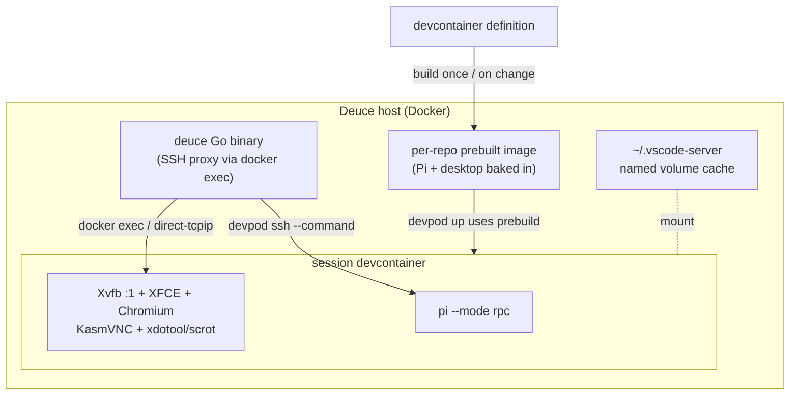
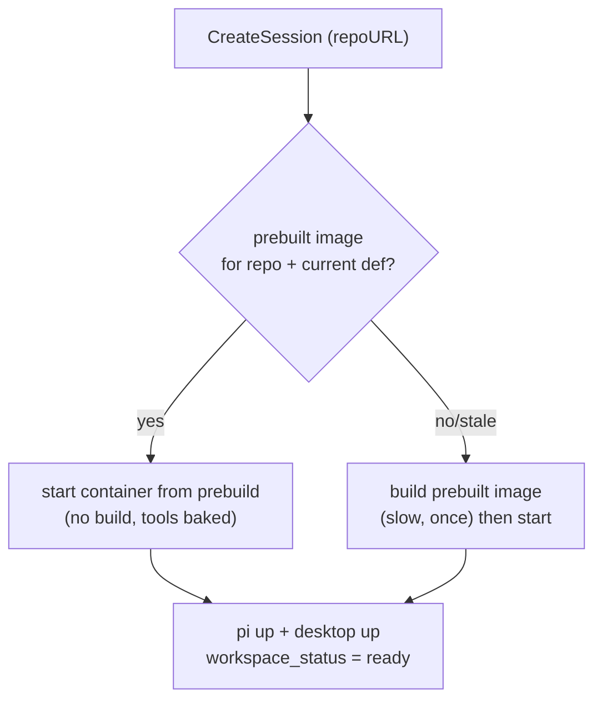

# feat: Fast devcontainer init + in-container GUI (Docker-native alternate)

## Summary

Keep the existing DevPod/Docker devcontainer runtime and attack the two surface wants directly: make session start fast by building each repo's devcontainer image **once** (a per-repo prebuilt image with Pi and tooling baked in), optionally serving sessions from a warm container pool and caching `~/.vscode-server`; and add a software-rendered, agent-callable desktop (Xvfb + XFCE + Chromium + KasmVNC) baked into the same image, surfaced as a new in-app tab over the existing `docker exec` transport. No provider rewrite, no SSH/exec rewrite, no kernel-isolation change.

This is the **alternate** to the Kata microVM migration ([2026-06-16-002](docs/plans/2026-06-16-002-feat-microvm-workspace-migration-plan.md)). It is far smaller and lower-risk, but it deliberately does **not** deliver the per-session kernel boundary that plan exists to provide — see Scope Boundaries.

---

## Problem Frame

Two pains motivate the work (see origin: docs/brainstorms/2026-06-16-microvm-workspace-migration-requirements.md):

- **Slow session start.** Today `Create` runs `devpod up <repoURL>` (`server/internal/workspace/manager.go`), which clones the repo, **builds the devcontainer image from scratch**, starts the container, and then Deuce installs Pi over `devpod ssh` (base64-pushed `InstallPi`/`InstallPiExtension`). On top of that, VS Code Remote re-downloads `~/.vscode-server` (~120MB) on every container recreate (noted in `CLAUDE.md`). The from-scratch build and per-recreate downloads dominate cold-start.
- **No GUI.** There is no way for a human or the agent to *see* UI changes — `STRATEGY.md`'s "Coding & Preview" track wants live UI preview as a first-class, agent-callable surface.

The microVM plan addresses these plus a third driver (isolation). This plan intentionally scopes to **only** the two above, trading away the isolation upgrade for a much cheaper, lower-risk change that reuses nearly all existing plumbing.

---

## Key Technical Decisions

- **Per-repo prebuilt image, not from-scratch builds.** Build each repo's devcontainer image once (on first connect and whenever the devcontainer definition changes), tag it, and start sessions from that prebuilt image instead of rebuilding per session. DevPod supports this natively (`devpod build` → prebuild image, consumed by `devpod up`), so it's low-risk. This is the single biggest cold-start win and the Docker analogue of the microVM plan's "template," **minus the approval gate** — there's no new trust boundary here (containers already are the boundary), so the prebuilt image is a pure cache, rebuilt on config change, not an approved artifact.

- **Bake Pi + tooling + desktop into the prebuilt image.** Move Pi install out of the post-create `devpod ssh` path (`InstallPi`/`InstallPiPackage`/`InstallPiExtension`/`symlinkPi` in `manager.go`, called via `provisionAgentTools` in `handler/workspace.go`) and into the image build. This removes the base64-over-ssh install round-trips from the session-open path. The Pi *launcher* (`pirun/devpod_launcher.go`) is unchanged — it still launches `pi --mode rpc` over `devpod ssh --command`.

- **Cache `~/.vscode-server` in a per-user named volume.** Mount a persistent named volume at `~/.vscode-server` so the ~120MB VS Code Remote payload survives container recreates instead of re-downloading each time. This is the v2 follow-up `CLAUDE.md` already names.

- **No warm container pool (out of scope for this first step).** Prebuilt-image + baked-tools + vscode-server cache are expected to capture enough of the cold-start win on their own. A pool is explicitly deferred — revisit only if start latency is still a problem after this lands.

- **The GUI is a pure image addition + a WS bridge — no transport rewrite.** Xvfb + XFCE/openbox + Chromium + KasmVNC bake into the image; the desktop reaches the browser through the **existing** `docker exec` TCP-forward path (`buildTCPForwardCmd` in `server/internal/sshproxy/docker.go`, already used for VS Code `direct-tcpip`). Because the transport stays `docker exec`, none of the SSH-proxy / Pi-launcher / reconciler rework the microVM plan needs applies here.

- **The desktop is one Xvfb display, two consumers.** XFCE/Chromium run on `Xvfb :1`; KasmVNC serves `:1` to the browser for humans, and the agent drives the same `:1` via `scrot`/`xdotool` exposed as Pi tools — satisfying `STRATEGY.md`'s agent-native-parity constraint.

- **Do not bake per-anything secrets into the prebuilt image.** The prebuilt image is shared by every session for that repo, so anything baked in (credentials, tokens, SSH keys) is shared across sessions. Keep the existing posture: the `ANTHROPIC` key is injected via env at Pi launch and never persisted; the prebuilt image carries tooling only. (This is the one entropy concern that carries over from the microVM plan, in a much milder form because containers don't run their own sshd — the SSH proxy terminates `docker exec` on the Deuce host.)

---

## High-Level Technical Design

---

## Requirements Traceability

| Origin requirement | Addressed here? |
|---|---|
| R4 fast start from prepared state | Yes — U1/U3 (warm pool dropped) |
| R12–R14 software-rendered desktop, no GPU | Yes — U4 |
| R15 desktop is agent-callable | Yes — U4 |
| R5–R9 per-repo template build/approve lifecycle | Partial — prebuilt-image rebuild on config change (U1), **no approval gate** (no trust boundary) |
| R1–R3 per-session kernel isolation | **No — out of scope** (see Scope Boundaries; this is the deliberate tradeoff vs the microVM plan) |
| R11 per-session entropy/secret regen | N/A — containers don't run their own sshd; no baked secrets (KTD) |
| R16/R17 exec-transport rework | N/A — `docker exec` / `devpod ssh` transport unchanged |

---

## Implementation Units

### Phase 1 — Fast init

### U1. Per-repo prebuilt image with Pi + tooling baked in

- **Goal:** Build each repo's devcontainer image once (and on devcontainer-definition change), tag it, and start sessions from it; move Pi/tool install from post-create ssh into the image build.
- **Requirements:** R4; partial R5–R9 (rebuild-on-change, no approval gate).
- **Dependencies:** none.
- **Files:**
  - `server/internal/workspace/manager.go` (add a prebuild step — `devpod build` or equivalent — and have `Create` consume the prebuilt image tag; delete/skip `InstallPi*`/`piInstallScript`/`symlinkPi` once baked)
  - `server/internal/handler/workspace.go` (`provisionAgentTools` ~line 22 becomes a no-op / removed; add a rebuild trigger on devcontainer-definition change)
  - `deploy/workspace-image/` (the baked layer added on top of the repo's devcontainer: Pi, the `ask_user` extension, tools)
  - `server/internal/config/config.go` (prebuild image tag/registry settings)
- **Approach:** Use DevPod's prebuild flow: produce a prebuild image per repo, keyed by the repo's devcontainer definition hash, and have `devpod up` consume it (`--prebuild-repository` or a local tag). Bake Pi + the `ask_user` extension into the image instead of pushing them over `devpod ssh`. A repo's prebuilt image is rebuilt when its devcontainer definition changes (hash mismatch) or on a manual "rebuild environment" action; ordinary code pushes reuse the cached image. No approval gate — the image is a cache, not a trust artifact.
- **Patterns to follow:** the existing `Create`/`InstallPi` flow in `manager.go`; the "Adding a New API Endpoint" convention in `CLAUDE.md` for the rebuild trigger.
- **Test scenarios:**
  - Happy path: first session for a repo builds the prebuilt image (slow); a second session starts from the cached image with no rebuild and no over-ssh Pi install.
  - Staleness: changing the devcontainer definition invalidates the cached image and triggers a rebuild; an ordinary code push does not.
  - Baked Pi: `pi --mode rpc` launches from the image with no `InstallPi` step; the `ask_user` extension is present.
  - Verification that `provisionAgentTools` is no longer on the session-open path.
- **Verification:** second-and-later sessions for a repo skip the image build and the Pi install entirely; cold start drops to container start + boot.

### U3. Cache `~/.vscode-server` in a per-user named volume

- **Goal:** Stop the ~120MB VS Code Remote re-download on every container recreate.
- **Requirements:** R4.
- **Dependencies:** none (independent of U1/U2).
- **Files:**
  - `server/internal/workspace/manager.go` (mount a per-user/per-repo named volume at `~/.vscode-server` when creating the container)
  - `server/internal/config/config.go` (volume naming/root config)
- **Approach:** Allocate a Docker named volume scoped per user (or per user+repo) and mount it at the container's `~/.vscode-server`. The VS Code server payload then persists across recreates. Confirm permissions/UID match the container's `remoteUser` so the mounted volume is writable.
- **Patterns to follow:** the existing bind-mount handling documented in `docs/solutions/architecture-patterns/devpod-docker-workspace-bind-mount-2026-05-13.md`.
- **Test scenarios:**
  - Happy path: first VS Code connect populates the volume; recreating the container reuses it with no re-download.
  - Permissions: the mounted volume is writable by the container `remoteUser` (no permission-denied on server install).
  - Isolation: one user's volume is not mounted into another user's container.
- **Verification:** "Open in VS Code" on a recreated container does not re-download `~/.vscode-server`.

### Phase 2 — In-container GUI

### U4. Software-rendered, agent-callable desktop in the image

- **Goal:** A no-GPU desktop with a browser inside the container, viewable in a new session tab and drivable by the agent.
- **Requirements:** R12, R13, R14, R15.
- **Dependencies:** U1 (baked into the prebuilt image).
- **Files:**
  - `deploy/workspace-image/` (add `Xvfb`, XFCE/openbox, Chromium, KasmVNC, `xdotool`, `scrot`/`ffmpeg` to the baked layer; start them via the container's init so a session has the desktop immediately — R13)
  - `server/internal/handler/desktop.go` (new — WS endpoint bridging the browser to the in-container KasmVNC port)
  - `server/internal/server/server.go` (register the desktop WS route with the same session-member/live gate as `/ws/terminal/{sessionID}`)
  - `server/internal/agent/pirun/extension/` or the baked layer (agent desktop tools: screenshot via `scrot`/`ffmpeg` of `:1`, input via `xdotool`)
  - `src/types/index.ts` (`TabType` add `"desktop"`), `src/components/layout/CenterPanel.tsx` (tabs array + render branch, `requiresLiveWorkspace: true`), `src/components/desktop/DesktopView.tsx` (new — KasmVNC/noVNC client), `src/lib/api.ts`
- **Approach:** XFCE/openbox + Chromium on `Xvfb :1`; KasmVNC serves `:1` (CPU-only, single unified server). The desktop WS handler reaches the in-container KasmVNC port using the existing `docker exec` TCP-forward (`buildTCPForwardCmd` in `sshproxy/docker.go`) — no new transport. The agent drives the same `:1` via `scrot`/`xdotool` exposed as Pi tools (alongside `ask_user`), so human and agent share one display (R15). The new tab follows the existing `files`/`terminal` pattern with `requiresLiveWorkspace` gating. The desktop WS route inherits the same session-member/live authorization gate as the terminal WS. Configure KasmVNC with a per-session credential (or bind it so it's only reachable through the proxy path) so a process inside the container can't read the display unauthenticated.
- **Patterns to follow:** `server/internal/handler/terminal.go` + `server.go` for the WS bridge and its gate; `buildTCPForwardCmd` in `sshproxy/docker.go` for the in-container port forward; the `files`/`terminal` tab pattern in `CenterPanel.tsx`; the `ask_user` extension for agent-tool shape.
- **Test scenarios:**
  - `Covers AE4.` A human opens the desktop tab and sees the live UI; the agent screenshots the same display and injects a click via `xdotool`, both against `:1`.
  - No-GPU: the desktop renders via `Xvfb` software path with no GPU device.
  - Availability: a session from the prebuilt image exposes the desktop immediately, no per-session desktop setup.
  - Authorization: the desktop WS enforces the session-member/live gate before the bridge opens; a non-member is rejected.
  - KasmVNC auth: a process inside the container cannot reach the desktop stream without the Deuce-issued credential.
  - Gating: the desktop tab shows `RecoveryCard` when the workspace is not live (`requiresLiveWorkspace`).
- **Verification:** humans and `@deuce` can both see and drive the in-container desktop over the existing `docker exec` transport; no GPU required; the authorization gate holds.

---

## System-Wide Impact

- **No isolation change.** The container remains the security boundary; this plan does not add a kernel boundary. If untrusted agent-generated code is the real concern, this plan does not address it — the microVM plan does.
- **Authorization surface:** one new route (the desktop WS) takes a session ID. Per `docs/solutions/architecture-patterns/broadening-resource-visibility-requires-per-route-authorization-audit.md`, gate it explicitly with the session-member/live tier, the same as the terminal WS.
- **Reduced surface:** the post-create Pi base64-over-ssh install path is removed (baked into the image); the per-recreate `~/.vscode-server` download is eliminated.
- **Storage:** prebuilt images and per-user `~/.vscode-server` volumes consume disk; add a GC/retention policy for stale prebuilt images and orphaned volumes.

---

## Scope Boundaries

### Deferred for later

- Warm container pool — dropped from this first step by decision; revisit only if prebuilt-image + vscode-server cache don't make start fast enough.
- Container checkpoint/restore (CRIU `docker checkpoint`) for sub-second resume — experimental and finicky; not needed if the above suffices.
- Lazy image pulling (eStargz/SOCI) — only if prebuilt-image pull time becomes the bottleneck.

### Outside this plan's identity

- **Per-session kernel isolation.** This is the defining difference from the microVM plan ([2026-06-16-002](docs/plans/2026-06-16-002-feat-microvm-workspace-migration-plan.md)). If isolation of untrusted code is a hard requirement, that plan is the answer, not this one. This plan optimizes the existing trust model; it does not change it.
- **GPU acceleration / virtio-gpu** — the desktop is software-rendered by design.
- **An approval gate on the prebuilt image** — omitted deliberately; there's no new trust boundary, so the image is a cache, not an approved artifact.

---

## Dependencies / Assumptions

- The existing DevPod/Docker stack and `docker exec` transport stay in place; no Linux/KVM requirement (this runs anywhere Docker does, including macOS/OrbStack — a notable advantage over the microVM plan for local dev).
- DevPod's prebuild flow (`devpod build` + prebuild-repository consumption) works for the target provider; verify against the configured `DEVPOD_PROVIDER`.
- `ask_user` requires a capable model — haiku won't call the tool; `DEUCE_PI_MODEL` must be capable for interactive prompts (existing constraint).
- KasmVNC runs CPU-only and is reachable from the Deuce host via the in-container port forward.

---

## Comparison to the microVM plan

| Dimension | This plan (Docker-native) | microVM plan (2026-06-16-002) |
|---|---|---|
| Isolation | Container boundary (unchanged) | Per-session kernel boundary |
| Fast start | Prebuilt image + vscode-server cache | Warm VM pool from approved digest |
| GUI | Same desktop, over `docker exec` | Same desktop, over vsock/sshd |
| Transport rework | None (`docker exec`/`devpod ssh` kept) | Full SSH-proxy + Pi-launcher + reconciler rewrite |
| Host requirement | Any Docker host (macOS OK) | Linux + KVM only |
| Rough size | ~3–5 units, low risk | 8 units, high risk, security-critical |
| Leaves on the table | No isolation upgrade | — |

---

## Outstanding Questions

### Resolve before planning

- Is per-session **kernel isolation** actually required? If yes, this plan is insufficient on its own and the microVM plan is the real answer — this becomes a stopgap. If no (container boundary is acceptable), this plan fully addresses the stated wants.

### Deferred to implementation

- DevPod prebuild mechanics against the configured provider (local tag vs prebuild-repository registry).
- `~/.vscode-server` volume scoping (per-user vs per-user+repo) and UID/permission handling.
- Desktop WS transport detail: reuse `buildTCPForwardCmd` vs a dedicated forward; KasmVNC credential injection mechanism.
- Retention/GC policy for stale prebuilt images and orphaned vscode-server volumes.

---

## Sources / Research

- Origin: `docs/brainstorms/2026-06-16-microvm-workspace-migration-requirements.md`.
- Companion: `docs/plans/2026-06-16-002-feat-microvm-workspace-migration-plan.md` (the isolation-bearing alternative this plan trades against).
- `server/internal/workspace/manager.go` — `Create` (`devpod up`), `InstallPi*` post-create install moved into the image.
- `server/internal/handler/workspace.go` — `provisionAgentTools` (~line 22) removed from the session-open path.
- `server/internal/sshproxy/docker.go` — `buildTCPForwardCmd` reused for the in-container desktop port.
- `server/internal/handler/terminal.go` + `server/internal/server/server.go` — WS bridge + session-member gate pattern for the new desktop route.
- `src/components/layout/CenterPanel.tsx`, `src/types/index.ts` — session-surface tabs and the new desktop tab attach point.
- `CLAUDE.md` — the `~/.vscode-server` ~120MB per-recreate download (the per-user-volume-cache v2 follow-up) and devcontainer compatibility requirements.
- `docs/solutions/architecture-patterns/devpod-docker-workspace-bind-mount-2026-05-13.md` — bind-mount/volume handling.
