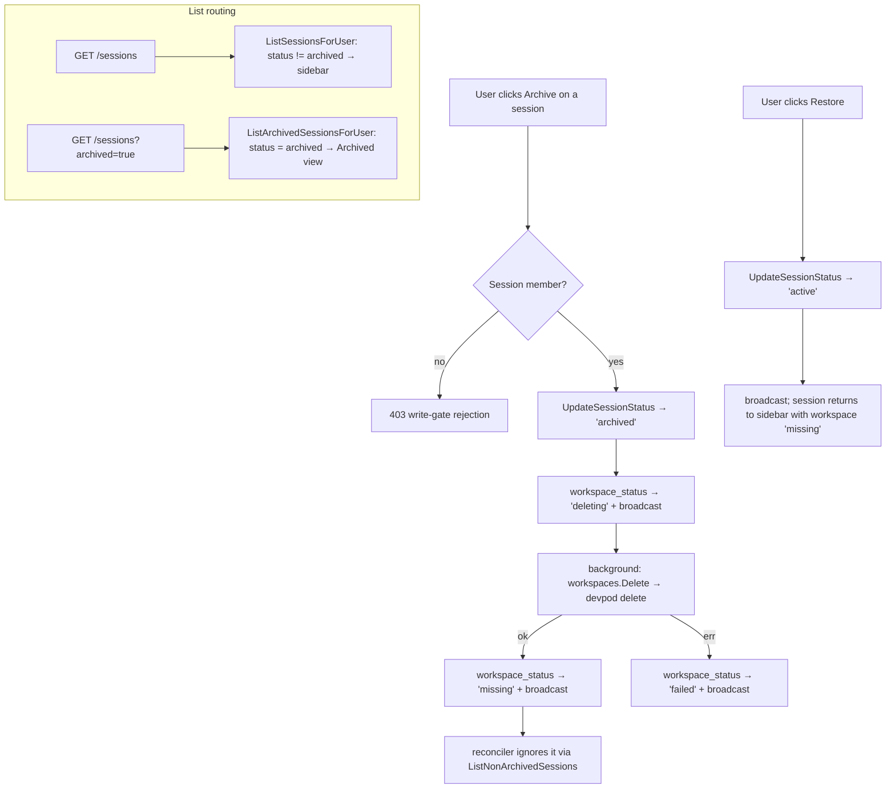

# feat: Archive sessions (preserve history, hide from sidebar, tear down container)

## Summary

Give users a first-class way to **retire a session** without losing its history. Archiving flips a session's `status` to `archived` (preserving all messages, activities, and plan content in the DB), tears down its DevPod workspace/container to free CPU and disk, removes it from the normal sidebar, and surfaces it instead in a separate **Archived** view that can be restored later.

This is the user-facing answer to "I can't delete workspaces" — today there is no session-delete or session-retire action at all (only a *workspace* delete that destroys the container but strands the session row in the DB). Archive intentionally replaces hard-delete: nothing is permanently destroyed except the live container, which is reproducible from the repo on restore.

The good news from research: most of the substrate already exists. The `sessions.status` column already accepts `'archived'`, the frontend `SessionStatus` type already includes it, the `PATCH /api/sessions/{id}` write-gate + `session_update` broadcast already work, and the reconciler already excludes archived sessions via `ListNonArchivedSessions`. The remaining work is (1) wiring container teardown into the archive transition, (2) filtering archived sessions out of the default list and exposing them on demand, and (3) the UI to archive, view-archived, and restore.

---

## Problem Frame

A session in Deuce is a Slack-like channel backed by an isolated DevPod workspace. Sessions accumulate indefinitely: there is no supported way to retire one. The only adjacent action, `POST /api/sessions/{id}/workspace/delete`, destroys the DevPod container but leaves the session row with `workspace_status = 'missing'`, so the channel keeps cluttering the sidebar forever and its container resources may linger until then.

Users want to:
- Stop an old session from cluttering the sidebar.
- Free the CPU/disk its container holds.
- Keep the conversation/plan history reachable for reference.
- Bring a session back if needed.

"Delete" is the wrong primitive — it implies data loss. "Archive" captures the real intent: hide + reclaim resources, but preserve history and allow restore.

---

## Requirements

- R1. A session member can archive a session, flipping `status` to `archived`.
- R2. Archiving tears down the session's DevPod workspace (`devpod delete`), freeing container resources. The DB session row and all child rows (messages, activities, plan) are preserved.
- R3. Archived sessions do not appear in the normal sidebar lists (My Sessions / team groups).
- R4. Archived sessions remain reachable through a separate Archived view/filter, where their full history can be opened and read.
- R5. A session member can restore (un-archive) a session, flipping `status` back to `active`. The session reappears in the normal sidebar; its container is gone and is recreated through the existing workspace-start path on demand.
- R6. Archive and restore are gated on **session membership** (write gate), consistent with the documented two-gate authorization model — not merely team-read visibility.
- R7. Archive/restore propagate to connected clients so the sidebar updates without a manual refresh.

---

## Key Technical Decisions

- KTD1. Reuse `status = 'archived'`; no DB migration. The column, its `'archived'` value, the frontend `SessionStatus` union, and the existing `UpdateSessionStatus` query all already exist. Adding a migration would be redundant. (Confirmed in `server/internal/db/migrations/001_initial_schema.sql` and `src/types/index.ts`.)
- KTD2. Dedicated archive/unarchive endpoints rather than overloading `PATCH /sessions/{id}`. Archive is a compound, side-effecting operation (status flip + container teardown + broadcast), not a plain field write. A dedicated `POST /sessions/{id}/archive` + `POST /sessions/{id}/unarchive` mirrors the existing `/workspace/{start,stop,rebuild,delete}` action pattern, keeps the generic `PATCH` free of surprising side effects, and is independently testable. The existing `UpdateSession` PATCH path is left as-is.
- KTD3. Flip status to `archived` **before** tearing down the container. The reconciler keys off `ListNonArchivedSessions`; flipping first removes the session from its view so it cannot race to restart the container mid-teardown. This ordering mirrors the safe sequence already used for workspace lifecycle.
- KTD4. Filter archived at the query layer, fetch them on demand. `ListSessionsForUser` (the sidebar query) gains `AND s.status != 'archived'`; a new `ListArchivedSessionsForUser` returns archived-only. The `ListSessions` handler selects between them via an `?archived=true` query param. This keeps the default sidebar payload lean and only loads archived rows when the user opens the Archived view. The reconciler's separate `ListNonArchivedSessions` is unaffected.
- KTD5. Restore does not recreate the container. Un-archiving only flips status back to `active`; `workspace_status` remains `'missing'` from teardown, so the session reappears with the existing "start workspace" affordance. This avoids surprise resource consumption on restore and reuses the established start/rebuild path.
- KTD6. Reuse the existing `session_update` broadcast for propagation (R7). The client already refetches the (now archived-filtered) list on `session_update`, and `setSessions` already clears `activeSessionId` when the active session disappears — so archiving the active session degrades gracefully with no new event type.

---

## High-Level Technical Design

Archive lifecycle and the resulting list routing:

---

## Implementation Units

### U1. List filtering: exclude archived from the sidebar, expose archived on demand

**Goal:** The default session list stops returning archived sessions; a new query and query-param path returns archived-only.

**Requirements:** R3, R4

**Dependencies:** none

**Files:**
- `server/internal/db/queries/sessions.sql` — add `AND s.status != 'archived'` to `ListSessionsForUser`; add a new `ListArchivedSessionsForUser` (same team-scoped join, `AND s.status = 'archived'`, `ORDER BY s.last_activity_at DESC`).
- `server/internal/db/sessions.sql.go` — regenerated via `make generate` (do not hand-edit).
- `server/internal/handler/sessions.go` — `ListSessions` reads `r.URL.Query().Get("archived")`; when truthy, calls `ListArchivedSessionsForUser`, else the existing query.
- `server/internal/handler/sessions_test.go` (or existing handler test file) — coverage below.

**Approach:** Mirror the existing `ListSessionsForUser` query exactly (the team-scoped JOIN chain through `projects`/`team_members`), changing only the status predicate. The handler change is a single branch on the query param; both branches reuse `buildSessionResponse`. Note the reconciler's `ListNonArchivedSessions` is a separate query and must not be touched.

**Patterns to follow:** The team-read visibility join already documented in `ListSessionsForUser`; the existing handler shape in `ListSessions` (`server/internal/handler/sessions.go`).

**Test scenarios:**
- Covers R3. `GET /sessions` (no param) for a user with a mix of active and archived sessions returns only the non-archived ones.
- Covers R4. `GET /sessions?archived=true` returns only the archived sessions, ordered by `last_activity_at` desc.
- A user with zero archived sessions gets an empty array (not null/error) from `?archived=true`.
- Team-scope is preserved: archived sessions belonging to a team the user is **not** a member of are not returned by either path.

**Verification:** Both endpoints return the correct partition of a seeded mixed-status dataset; the reconciler still sees non-archived sessions unchanged.

### U2. Archive/unarchive endpoints with container teardown

**Goal:** Add `POST /sessions/{id}/archive` (status flip + container teardown + broadcast) and `POST /sessions/{id}/unarchive` (status flip + broadcast), both write-gated.

**Requirements:** R1, R2, R5, R6, R7

**Dependencies:** none (can land alongside U1)

**Files:**
- `server/internal/server/server.go` — register `r.Post("/archive", h.ArchiveSession)` and `r.Post("/unarchive", h.UnarchiveSession)` inside the existing `/{sessionID}` route group.
- `server/internal/handler/sessions.go` — `ArchiveSession` / `UnarchiveSession` handlers.
- `server/internal/handler/sessions_test.go` — coverage below.

**Approach:**
- `ArchiveSession`: parse `sessionID` + `userID`; enforce `requireSessionMember` (write gate, R6); `UpdateSessionStatus(... 'archived')` **first** (KTD3); set `workspace_status` to `'deleting'` and broadcast; then tear down the container in the background reusing the existing workspace teardown path (`h.workspaces.Delete` + the `'missing'`/`'failed'` transitions used by `DeleteWorkspace` in `server/internal/handler/workspace.go`), broadcasting the terminal `workspace_status`. Guard on `h.workspaces != nil && h.workspaces.Available()` so archive still succeeds (status-only) when DevPod is unavailable.
- `UnarchiveSession`: same parse + write gate; `UpdateSessionStatus(... 'active')`; build response and broadcast `session_update`. No container work (KTD5).
- Both build the response via `buildSessionResponse` and broadcast `TypeSessionUpdate`, mirroring `UpdateSession`.

**Patterns to follow:** `UpdateSession` (write gate + `UpdateSessionStatus` + `session_update` broadcast) and `handleWorkspaceAction`'s `actionDelete` branch (`server/internal/handler/workspace.go`) for the teardown + status-transition sequence.

**Test scenarios:**
- Covers R1/R6. A session member POSTing `/archive` gets 200 and the session row status becomes `archived`.
- Covers R6. A non-member (team-read only) POSTing `/archive` is rejected by the write gate; status is unchanged.
- Covers R2. Archiving invokes the workspace teardown path (assert via a stub/fake workspace manager that `Delete` was called with the session's workspace id) and lands `workspace_status` at `'missing'` on success.
- Teardown failure path: when the workspace manager returns an error, status stays `archived` and `workspace_status` becomes `'failed'` (archive is not rolled back).
- DevPod-unavailable path: with no/unavailable workspace manager, `/archive` still flips status to `archived` and returns 200 without erroring.
- Covers R5. `/unarchive` on an archived session flips status back to `active` and does **not** call the workspace manager.
- Covers R7. Both actions broadcast a `session_update` for the session.
- Invalid `sessionID` returns 400; unknown session returns 404.

**Verification:** Archiving a real session removes it from `GET /sessions`, makes it appear in `GET /sessions?archived=true`, and the container is gone (`devpod list` no longer shows it); unarchive returns it to the default list.

### U3. Frontend API client + types

**Goal:** Add typed API wrappers for listing archived sessions and for archive/unarchive.

**Requirements:** R1, R4, R5

**Dependencies:** U1, U2 (contract)

**Files:**
- `src/lib/api.ts` — add `listArchivedSessions: () => request<Session[]>("/sessions?archived=true")`, `archiveSession: (id) => request<Session>(\`/sessions/${id}/archive\`, { method: "POST" })`, `unarchiveSession: (id) => request<Session>(\`/sessions/${id}/unarchive\`, { method: "POST" })`.
- `src/types/index.ts` — no change expected (`SessionStatus` already includes `'archived'`); confirm during implementation.

**Approach:** Mirror existing wrappers (`listSessions`, `updateSession`, `deleteWorkspace`) exactly — same `request<T>` helper, same path style.

**Patterns to follow:** Existing `api` object members in `src/lib/api.ts`.

**Test scenarios:** Test expectation: none — thin typed wrappers over the shared `request` helper, exercised through U4's store tests and manual verification. No independent behavior to assert.

**Verification:** `npx tsc -b --noEmit` passes; the new wrappers compile against the existing `Session` type.

### U4. Frontend store: archived state + archive/restore actions

**Goal:** Hold archived sessions separately and provide actions to load them, archive a session (optimistically removing it from the sidebar list), and restore one.

**Requirements:** R3, R4, R5, R7

**Dependencies:** U3

**Files:**
- `src/stores/session-store.ts` — add `archivedSessions: Session[]` state; add actions `loadArchivedSessions()`, `archiveSession(sessionId)`, `restoreSession(sessionId)`. `archiveSession` calls `api.archiveSession`, removes the session from `sessions` (and clears `activeSessionId` if it pointed there). `restoreSession` calls `api.unarchiveSession`, removes from `archivedSessions`, and lets the subsequent `session_update`/list refetch repopulate `sessions`.
- `src/stores/session-store.test.ts` (or the existing reducer/visibility test file) — coverage below.

**Approach:** Follow the existing `setSessions`/`updateWorkspaceStatus` reducer patterns. Keep `archivedSessions` independent of `sessions` so the `session_update` refetch path (which replaces `sessions` with the non-archived list) never clobbers the archived view. The existing `setSessions` already clears a dangling `activeSessionId`; `archiveSession` should do the same when removing the active session optimistically.

**Patterns to follow:** Existing Zustand action style in `src/stores/session-store.ts`; the pure-logic vitest suites referenced in `npm test`.

**Test scenarios:**
- Covers R3. `archiveSession(id)` removes the session from `sessions`.
- `archiveSession(id)` on the active session also clears `activeSessionId`.
- Covers R5. `restoreSession(id)` removes the session from `archivedSessions`.
- Covers R4. `loadArchivedSessions()` populates `archivedSessions` from the API result (mock the api module).
- Archiving a session not present in `sessions` is a no-op on `sessions` (idempotent / race-safe), consistent with the store's existing dedupe discipline.

**Verification:** `npm test` passes; store transitions match the scenarios above.

### U5. Frontend UI: archive action, Archived view, restore

**Goal:** Let a member archive a session from the sidebar (with a confirm warning that the container is destroyed), browse archived sessions in a separate Archived view/toggle, open their history, and restore them.

**Requirements:** R1, R3, R4, R5

**Dependencies:** U4

**Files:**
- `src/components/layout/SessionSidebar.tsx` — add a hover action (member-only) on `SessionCard` to archive; add an Archived entry/toggle at the bottom of the sidebar that calls `loadArchivedSessions()` and renders archived sessions (reusing `SessionCard`, whose `opacity-40` archived styling already exists) with a Restore action; archived cards open normally so history (messages/activities/plan) is readable.

**Approach:** Add an Archive icon button alongside the existing inline edit-description button in `SessionCard` (same hover-reveal treatment, gated on membership / not `viewOnly`). Archiving prompts a confirm dialog noting the workspace container will be deleted (history preserved). The Archived view can be a collapsible group rendered only when it has loaded entries, or a filter toggle on the sidebar header — either way it is populated lazily via `loadArchivedSessions()` and is visually separate from the active sidebar groups (satisfies the chosen "separate view / filter toggle" direction). Restore is a per-card action in that view.

**Patterns to follow:** The existing hover-action icon button pattern in `SessionCard` (`src/components/layout/SessionSidebar.tsx` lines ~157-166) and the `SessionGroup` collapsible group component (lines ~223-264).

**Test scenarios:**
- Covers R1. Clicking Archive on a member session triggers the confirm flow and, on confirm, calls `archiveSession` — the card leaves the active groups.
- Covers R4. Opening the Archived view loads and lists archived sessions; selecting one opens its message/activity/plan history.
- Covers R5. Clicking Restore in the Archived view calls `restoreSession` and the session returns to the normal groups.
- The Archive action is not offered (or is disabled) for `viewOnly` (non-member) sessions, consistent with the write gate.

**Verification:** Manual run (`npm run dev` + backend): archive a session → it disappears from the sidebar and the container is torn down; open Archived → its history is intact and readable; restore → it returns to the sidebar showing a stopped/`missing` workspace that can be started again.

---

## Scope Boundaries

In scope:
- Archive / view-archived / restore for sessions, with container teardown on archive.
- Backend filtering + endpoints, frontend API/store/UI wiring.

Out of scope (true non-goals):
- Hard delete of a session and its history. Archive deliberately preserves all DB rows; permanent deletion is a separate, higher-risk concern.
- Auto-archiving by inactivity policy / retention rules.
- Bulk archive/restore.

### Deferred to Follow-Up Work
- Per-user named-volume caching of `~/.vscode-server` so restore + container rebuild is cheaper (already tracked as a general v2 follow-up).
- Real-time propagation of archive to non-subscribed teammates: the `session_update` broadcast uses `BroadcastToSession`, so a teammate who has the sidebar open but is not subscribed to that session won't see it vanish until their next list refetch. This matches current behavior for other session mutations; broadening it (e.g., a team-scoped broadcast) is out of scope here.

---

## Risks & Dependencies

- Reconciler behavior on restore. After restore, `status` is `active` again while `workspace_status` is `'missing'`. Confirm the reconciler treats `'missing'` as "leave alone until the user starts it" rather than auto-recreating the container (`server/internal/reconcile/reconciler.go`). If it would auto-recreate, restore must set a status the reconciler ignores, or the recreate must be intentionally allowed. Verify during U2/U5.
- Teardown/flip atomicity. Status is flipped before teardown (KTD3); if teardown fails, the session stays archived with `workspace_status = 'failed'`. This is the intended end-state (archive succeeded, container cleanup needs a retry), but the Archived view should not imply the container is still consuming resources — surface `failed` honestly.
- Authorization regression surface. Archive/unarchive are new session-mutation routes; they must use `requireSessionMember` exactly like `UpdateSession`. The documented learning `docs/solutions/architecture-patterns/broadening-resource-visibility-requires-per-route-authorization-audit.md` is directly relevant — the write gate must run before any existence-dependent behavior.
