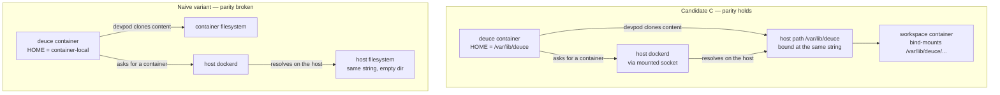
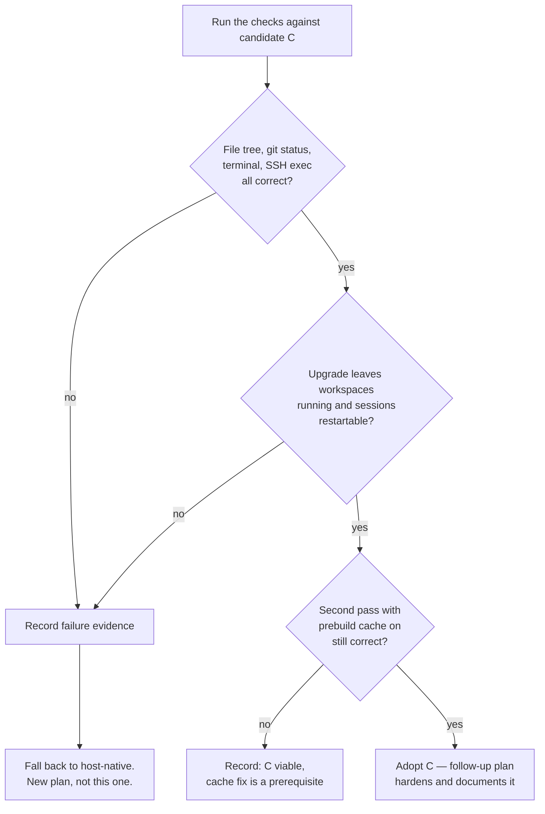

# VM Deploy Topology Spike — Validate Socket-Mount With Path Parity

## Summary

Build the socket-mount-with-path-parity deployment candidate to a genuinely testable state — a runtime image carrying the binaries the server shells out to, and a deployment wired so Deuce and the host Docker daemon resolve DevPod paths identically — then run it on a real VM against the origin's checks and record the decision. A pass leaves most of a working deployment behind; a fail stops at the recorded decision rather than pivoting to the fallback in the same pass.

---

## Problem Frame

Nothing about Deuce's deployment has been run. The published image is `gcr.io/distroless/static-debian12` holding one file, so it boots, migrates, serves the SPA, and then fails on the first session create because `devpod`, `docker`, and `git` are not present. The only validated runtime configuration is the local devcontainer, which uses a genuine nested daemon.

The constraint that makes topology choice consequential is that Deuce reads workspace files off its own filesystem rather than through DevPod (see origin). Research confirms this reaches further than the files tab: `readWorkspaceUID` in `server/internal/workspace/manager.go` parses `$HOME/.devpod/contexts/default/workspaces/<id>/workspace.json` to get the container label the reconciler matches on, and `workspaceContentPath` in `server/internal/handler/files.go` resolves `$HOME/.devpod/agent/contexts/default/workspaces/<id>/content`. Both hang off `os.UserHomeDir()`. So the whole question — files tab, git status, reconciler truth, SSH proxy container lookup — reduces to whether Deuce's `$HOME` and the host daemon's view of that same path string are the same directory.

That is testable, and it is worth testing before committing, because the failure mode is quiet. A misconfigured deployment shows an empty file tree and sessions that read as `missing` while the agent works normally in a directory nobody is looking at.

---

## Requirements

Origin requirements this spike advances. The origin's remaining requirements are deferred (see Scope Boundaries).

**Validated by this spike**

- R1. Confirm Deuce and the Docker daemon it drives resolve DevPod content paths to the same directory (origin R5).
- R2. Produce a runtime image carrying `devpod`, `docker`, and `git` on `PATH`, pinned to known versions (origin R6).
- R3. Produce a deployment definition standing up Deuce plus Postgres with database data on a named volume, naming an explicit image tag (origin R2, R4).
- R4. Confirm an upgrade leaves sessions restartable — surviving sessions report `stopped`, not `missing` (origin R9).
- R5. Confirm the persistence surface actually covers what must survive an upgrade: database data, DevPod agent state and workspace content, and the SSH host key (origin R8).

**Produced as a decision artifact**

- R6. A written decision naming the chosen topology and the evidence that settled it, so the shape does not get re-litigated from scratch (origin success criteria).

---

## Key Technical Decisions

- **Replace the distroless runtime stage rather than adding a second image.** There is no working use case for the current published artifact — it cannot run the product's core feature. Maintaining both variants would mean continuing to publish an image that looks deployable and isn't, and inviting someone to deploy the wrong one. The Go build stage is unchanged; only the runtime base and its contents change.

- **Path parity is achieved through `HOME`, not through per-directory mounts.** Both DevPod state trees and the SSH host key derive from `os.UserHomeDir()`. Binding a single host directory at an identical absolute path inside the container and pointing `HOME` at it gives parity for all of them at once, and leaves one obvious thing to get right instead of four. The existing `DEVPOD_AGENT_CONTENT_DIR` override stays available as an escape hatch if a DevPod release moves its layout.

- **Pin the CLI versions the way the devcontainer already does.** `.devcontainer/tool-versions.env` pins `DEVPOD_VERSION`; the runtime image should draw from the same pinning discipline rather than tracking latest, so a rebuild is not a silent DevPod upgrade. The devcontainer installs DevPod as a downloaded release binary, which is a pattern to mirror rather than invent around.

- **The spike runs in dev auth mode on a private VM.** What is under test is topology, not exposure. Introducing proxy auth, a bind-address setting, and the dev-mode startup guard at the same time would mean debugging two unrelated classes of failure at once. This is a deliberate, temporary posture — the follow-up plan hardens it before anything is documented for adopters.

- **First validation pass runs with the devcontainer prebuild cache disabled.** The cache has a known staleness defect (the bake is skipped when the definition hash is unchanged, regardless of whether Deuce's baked layer inputs moved). Leaving it on during the upgrade check would confuse a topology result with a caching result. Cache-on is a second pass once the topology reads clean.

- **A failing spike stops at the recorded decision.** If parity proves fragile, the fallback is the host-native topology — the same architecture with the container removed — but building it belongs in its own plan with its own units. Pivoting mid-spike would produce a half-tested version of both.

---

## High-Level Technical Design

### What path parity means concretely

The candidate topology's whole claim is that one path string resolves to one directory on both sides of the container boundary. The failing variant is identical except that the state directory is container-local.

The failing variant produces no error. DevPod succeeds, the container starts, and the bind mount silently resolves to an empty host directory — which is why this gets tested before it gets committed to.

### Decision rule

The spike's output is a routing decision, not a preference.

---

## Implementation Units

### U1. Runtime image carrying the tooling the server shells out to

**Goal:** Produce an image that can actually run a workspace operation, replacing a runtime stage that cannot.

**Requirements:** R2

**Dependencies:** none

**Files:**
- `Dockerfile` — replace the runtime stage; leave the Go build stage as-is
- `.dockerignore` — revisit only if the new stage needs context it currently excludes
- `.devcontainer/tool-versions.env` — read for the DevPod pin; extend only if the pin needs to be shared rather than duplicated

**Approach:** Swap `gcr.io/distroless/static-debian12:nonroot` for a slim Debian base. Install `git` and CA certificates from the package manager; install the Docker CLI (client only — no daemon, no containerd) and DevPod as pinned release binaries, mirroring how `.devcontainer/post-create.sh` already provisions DevPod. Run as a fixed non-root UID whose home directory is the path parity will later bind, so the image does not assume it owns its own `$HOME` contents. Keep the `VERSION` ldflag wiring and the exposed ports unchanged.

**Patterns to follow:** `.devcontainer/post-create.sh` for the pinned-release-binary install shape and its arch detection; `.devcontainer/Dockerfile` for the package set a Debian base actually needs.

**Test scenarios:**
- All three binaries (`devpod`, `docker`, `git`) resolve on `PATH` inside a container started from the image.
- The container starts as the intended non-root UID, not root.
- The SPA is served at the root path and the version endpoint reports the injected build version rather than `dev`.
- A request for a missing hashed asset still returns a 404 rather than the SPA shell, confirming the embedded-frontend behavior survived the base change.

**Verification:** A container from the image serves the SPA and reports its version, and each of the three binaries is present and executable. The image builds through the existing release path without changes to the frontend or Go build stages.

---

### U2. Deployment definition wired for path parity

**Goal:** Express the candidate topology as a runnable deployment, with parity as the property that is hard to get wrong rather than easy to get wrong.

**Requirements:** R1, R3, R5

**Dependencies:** U1

**Files:**
- `deploy/docker-compose.yml` — new
- `deploy/.env.example` — new; distinct from the dev-oriented `.env.example` at the repo root

**Approach:** Two services. Deuce runs from an explicitly pinned image tag, with the host Docker socket mounted, a single host state directory bound at an identical absolute path inside the container, and `HOME` pointed at that path so both DevPod trees and the SSH host key land inside it. Membership in the host's Docker group is supplied through configuration rather than assumed. HTTP and the SSH proxy port are published. Postgres runs alongside with its data on a named volume. The env template carries the values an operator must set and defaults the rest, with dev auth mode flagged in a comment as temporary spike posture rather than presented as a normal setting.

**Patterns to follow:** `docker-compose.yml` at the repo root for the Postgres service shape and credentials; `.env.example` for variable naming and the comment style that explains why a setting exists rather than restating it.

**Test scenarios:**
- Bringing the stack up on a clean host runs migrations before the listener binds, and a deliberately broken migration prevents serving rather than producing a partially-migrated running instance.
- After a session is created, the DevPod state directory is visible on the host at the same absolute path the container writes to.
- Restarting only the Deuce service leaves the Postgres volume and the host state directory intact.
- Bringing the stack up twice in a row is idempotent — the second run does not re-clone or re-key.

**Verification:** The stack starts on a clean host, serves the SPA, and the host state directory is populated at the parity path. `Test expectation: none` does not apply — these are observable integration behaviors, exercised in U4 rather than by automated tests, because the property under test is a deployment topology.

---

### U3. Provision the spike VM and bring the stack up

**Goal:** Get a real VM running the candidate, and capture what it actually took, since the prerequisite list is currently guesswork.

**Requirements:** R1

**Dependencies:** U1, U2

**Files:** none — this unit's output is recorded findings that feed U5, not committed code.

**Approach:** Provision a VM, install Docker, place the deployment and its env file, resolve the host Docker group id, create the state directory with the ownership the container's UID expects, and bring the stack up. Record every step that was not obvious and every place the deployment needed adjusting — that record is the raw material the follow-up documentation plan consumes.

Two prerequisites are easy to discover the hard way. The image built in U1 has to reach the VM: pushing a prerelease tag exercises the real release path and publishes to the registry without claiming the floating latest tag, which is the closer analogue to how an adopter would get it. And session creation clones a repository inside the container, so the VM needs credentials for whatever repo the checks use — see the private-repo clone-auth solutions doc for the failure shape when it doesn't.

**Execution note:** Expect ownership and group-id friction on first run. Resolve it by adjusting the deployment rather than by hand-patching the VM, so the fix lands in the artifact instead of in a VM nobody else can see.

**Test scenarios:** `Test expectation: none — provisioning unit with no committed behavior. Validated by U4.`

**Verification:** The stack is reachable on the VM and a session can be created. Prerequisites and friction points are written down.

---

### U4. Run the validation checks

**Goal:** Determine whether the candidate topology actually holds, against the checks the origin named.

**Requirements:** R1, R4, R5

**Dependencies:** U3

**Files:** none — this unit's output is recorded evidence.

**Approach:** Create a session against a real repository and work through each check in turn, recording the observed result rather than a pass/fail impression. Then perform an upgrade and re-observe. Then repeat the session-start and upgrade checks with the prebuild cache enabled, treating a divergence there as a caching result rather than a topology result.

**Test scenarios:**
- Covers the origin's files-tab acceptance case. The file tree lists the repository's real contents and git status reflects the same working tree the agent sees. An empty or partial tree means parity is broken and the topology is wrong.
- The terminal attaches to the workspace container and runs an interactive shell.
- Opening in VS Code over the SSH proxy lands in the workspace as the devcontainer's `remoteUser`, not as root — the ownership symptom to watch for is git refusing the workspace as dubious.
- Covers the origin's upgrade acceptance case. After changing the image tag and restarting, workspace containers are still running, sessions report `stopped` where on-disk state survived rather than `missing`, and restarting a session returns the same workspace content instead of a fresh clone.
- With the prebuild cache enabled, a session starts from the baked image; after upgrading Deuce, whether the baked layer is rebuilt is recorded as evidence for the separately-planned cache-key fix rather than treated as a spike failure.

**Verification:** Every check has a recorded observed result. Any failure carries enough detail — what was expected, what appeared, where the paths diverged — to route the decision in U5 without re-running the spike.

---

### U5. Record the decision and route the follow-up

**Goal:** Turn the spike's evidence into a durable decision, so the next person to question the topology reads a page instead of re-running the experiment.

**Requirements:** R6

**Dependencies:** U4

**Files:**
- `docs/solutions/architecture-patterns/<topology-decision>.md` — new, following the existing frontmatter and section conventions in that directory
- `docs/brainstorms/2026-07-30-vm-deploy-and-upgrade-requirements.md` — resolve the topology item under Resolve Before Planning
- `docs/plans/2026-05-23-001-feat-exe-dev-dogfood-deploy-plan.md` — mark superseded; it is still `status: active` and its deploy-side units are now obsolete

**Approach:** Write the decision as a solutions doc rather than plan prose, because the audience is a future reader hitting the same question, not an implementer executing this plan. Name the topology chosen, the evidence, and — importantly — the symptom that would indicate parity has been broken later, since that is the knowledge most likely to be needed and least likely to be re-derived. If the candidate failed, the doc records why and the follow-up is a host-native plan rather than a documentation plan.

**Patterns to follow:** `docs/solutions/architecture-patterns/devpod-docker-workspace-bind-mount-2026-05-13.md` — the closest analogue in subject and shape, and the doc this one extends.

**Test scenarios:** `Test expectation: none — documentation unit.`

**Verification:** The decision doc states the outcome and its evidence. The origin's blocking item is resolved. The superseded plan no longer reads as active work.

---

## Scope Boundaries

- No auth hardening. Dev mode on a private VM is the spike posture; proxy mode, the Tailscale default, the bind-address setting, and the dev-mode startup guard are all follow-up work.
- No deploy documentation for adopters. U3 records prerequisites as raw material; turning that into a deploy guide is the follow-up plan's job.
- No arm64 image. The spike runs on whatever the spike VM is.
- No prebuild cache-key fix. Its behavior is observed and recorded here; fixing it is separate work the origin already scopes.
- No backups, zero-downtime deploys, multi-node topology, or continuous deployment — carried forward from the origin.
- No building the host-native or nested-daemon topologies. They are the documented fallbacks; constructing one is a new plan.

### Deferred to Follow-Up Work

- Deploy artifacts hardening and documentation, gated on this spike passing: proxy auth defaults, the bind-address setting and dev-mode guard, the adopter-facing deploy guide, and rollback instructions.
- The prebuild cache-key fix, so that upgrading Deuce rebuilds the baked agent-tooling layer.
- arm64 in the release workflow.
- Correcting the README's claim that the devcontainer mounts the host Docker socket — it runs a nested daemon.

---

## Risks & Dependencies

- **Parity may hold for content but break for something subtler.** DevPod may record absolute paths in its own state that behave differently than the clone path. The checks in U4 are chosen to surface this — the reconciler's `stopped`-versus-`missing` distinction is a second, independent probe of the same property, since it reads a different tree under the same `$HOME`.
- **Docker group id is host-specific.** The container's access to the mounted socket depends on a gid that varies between hosts. This is the most likely first-run failure and the most likely thing to get hand-patched on the VM instead of fixed in the artifact.
- **File ownership across the boundary.** DevPod writes into the shared directory as the container's UID; anything on the host touching those files sees that UID. Ownership mismatches here can look like parity failures without being one.
- **In-flight agent runs do not survive the upgrade.** Pi runs inside workspace containers driven over a per-session channel, and agent session continuity across server restarts is unbuilt. This is expected, not a spike failure, and should not be mistaken for one during U4.
- **A spike VM is a real cost surface.** It needs to exist for the duration and be reachable from wherever the VS Code check runs.

---

## Open Questions

### Deferred to Implementation

- Which slim Debian base and whether the Docker CLI comes from Docker's apt repository or a pinned static binary. Both work; the choice follows from what keeps the image small and the pin honest.
- Whether the DevPod version pin is shared with `.devcontainer/tool-versions.env` or duplicated in the image. Sharing is cleaner but couples the release image to a devcontainer file; decide when the Dockerfile is in front of you.
- The exact parity path. It needs to be absolute, stable, and unlikely to collide with anything else on a host, but nothing in the design depends on the specific string.
- Whether the deployment resolves the host Docker group id automatically or requires the operator to supply it. Automatic is friendlier; explicit is more predictable. Decide after seeing the first-run friction in U3.
- Whether Postgres readiness needs explicit ordering in the deployment, or whether the existing database-wait in the server's startup path already covers it.
- Whether the spike image reaches the VM via a published prerelease tag or a local build on the VM. Prerelease is recommended in U3 because it exercises the real path, but a local build is faster to iterate on if the first passes need several image rebuilds.

---

## Sources & Research

- `docs/brainstorms/2026-07-30-vm-deploy-and-upgrade-requirements.md` — origin. Carries the constraint, the three candidate topologies, the decision rule, and the requirements this spike advances.
- `server/internal/handler/files.go` — `workspaceContentPath` resolves content under `os.UserHomeDir()` with a `DEVPOD_AGENT_CONTENT_DIR` override.
- `server/internal/workspace/manager.go` — `readWorkspaceUID` parses DevPod's CLI-side workspace record under the same home; `ContainerName` and `BulkContainerStatus` locate containers by the `dev.containers.id` label through the Docker CLI.
- `server/internal/reconcile/reconciler.go` — the `stopped`-versus-`missing` derivation that makes the upgrade check meaningful.
- `server/internal/sshproxy/docker.go` — the exec shapes the VS Code check exercises, including the `--user` flag that makes the `remoteUser` symptom visible.
- `server/internal/web/web.go` — embedded SPA serving with the assets-404 behavior that U1 must not regress.
- `.devcontainer/post-create.sh` and `.devcontainer/tool-versions.env` — the existing pinned-binary install pattern for DevPod.
- `.devcontainer/docker-compose.yml` — the nested-daemon configuration that currently works, and the source of the path-mismatch rationale.
- `docs/solutions/architecture-patterns/devpod-docker-workspace-bind-mount-2026-05-13.md` — establishes host-filesystem reads as the workspace data plane.
- `docs/solutions/integration-issues/devpod-private-repo-clone-auth.md` — the clone-auth failure shape the spike VM will hit if repository credentials aren't in place before the checks.
- `.github/workflows/release.yml` — semver-tag publish path, including prerelease handling, which is how the spike image reaches the VM.
