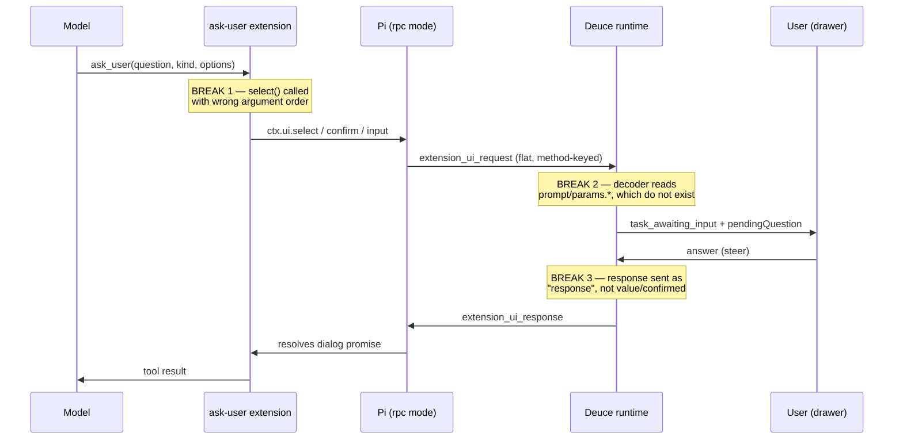

# Ask-User Question Protocol Correction - Plan

## Goal Capsule

**Objective.** Make `@deuce`'s questions answerable from the agent thread drawer. Correct Deuce's `ask_user` implementation against Pi's published RPC contract so a question reaches the drawer as an answerable prompt and the user's answer reaches the agent intact, for all three question styles. Fix the horizontal overflow in the agent thread. The main chat composer remains a non-answering surface — see Scope Boundaries for the consequence that carries.

**Authority hierarchy.** Pi's published types in `@earendil-works/pi-coding-agent` are the protocol authority — where this plan and those types disagree, the types win and the disagreement is a finding worth reporting. Within that constraint, R-IDs govern product behavior and KTD-IDs govern mechanism.

**Execution profile.** Contract-first. The wire shapes in this plan were read from Pi 0.84.0's own `.d.ts` declarations and RPC implementation, not inferred. Re-verify against the version actually installed in the container before changing decoding logic; the shape is stable across 0.74.0–0.84.0, but the check is cheap and the last round of guessing is what produced this bug.

**Stop conditions.** Stop and report if the installed Pi's `RpcExtensionUIRequest` / `RpcExtensionUIResponse` unions differ from those recorded in Sources & Research — the plan's decoding decisions rest on them. Stop if correcting the response shape requires changing how the drawer sends answers; that would widen scope into the frontend answer path this plan holds fixed.

**Tail ownership.** Standalone run owns commit and PR.

---

## Product Contract

### Summary

Repair the `ask_user` round trip end to end: the Pi extension's dialog calls, the Go decoding of Pi's UI-request events, and the shape of the answer Deuce sends back. Cover all three question styles rather than only the one that hangs. Separately, contain long rows in the agent thread so a question no longer scrolls the panel sideways.

### Problem Frame

When `@deuce` asks a question, the user cannot answer it and the run dies on a timeout.

Deuce gives Pi a blocking `ask_user` tool through a hand-rolled extension. The agent calls it, Pi emits an `extension_ui_request` on the RPC stream, and Deuce is meant to turn that into an `awaiting_input` task the user answers from the agent thread drawer. The state machine, the WebSocket event family, the store reducer, and the drawer's answer controls are all correctly built and wired.

The wire format between them was never verified. `server/internal/agent/pirun/decoder.go` carries the admission in its own source: *"The exact extension_ui_request shape is pinned when the ask-user extension lands; decode best-effort by id + common prompt/kind keys."* The originating plan flagged the same gap as an accepted risk (`docs/plans/2026-06-08-001-feat-interactive-agent-questions-plan.md`, "Rich choices depend on verifying the live Pi `ctx.ui` API"). The tests then closed the loop on the assumption rather than on reality — `server/internal/agent/pirun/decoder_test.go` feeds the decoder the exact shape the decoder guesses, under a comment noting the event is absent from the captured golden stream.

Reading Pi's published types shows the guess is wrong in three independent ways, and each question style fails differently:

- **Pick-one hangs.** The extension calls Pi's `select` with the question in the argument slot that expects the options array. Pi emits `options` as a string. Go unmarshals it into `[]string`, gets a type error, and drops the entire line. No `awaiting_input` ever fires, so the active-work timeout is never suspended and kills the task after ten minutes. This is the reported symptom.
- **Free text arrives blank.** Pi carries the prompt in `title` / `placeholder`. Go reads `prompt` and `params.prompt`, which do not exist in Pi's protocol, so the question text is empty.
- **Yes/no always answers "no", and asks blankly.** Pi expects `confirmed` as a boolean; Deuce sends `response` as a string, so Pi's parser finds no `confirmed` key and falls back to `false`, discarding what the user clicked. The request side is broken too: Pi puts the question in a top-level `message` while Go reads only the nested `params.message`, so the prompt is empty as well.

The same discarding applies to the other styles: Pi's response union has no `response` field at all, so even a correctly decoded question would be answered with an empty value.

Two adjacent defects share the surface. Deuce treats every `extension_ui_request` as a blocking question, but five of Pi's nine UI methods are fire-and-forget notifications and status updates — `npm:pi-subagents` is installed in every workspace and any such call would wedge a task in "needs your input". And the drawer's action log rows do not constrain their width, so a prose-length question makes the whole thread scroll sideways.

### Requirements

**Question delivery**

- R1. A question the agent asks reaches the user as an answerable prompt, for free-text, pick-one, and yes/no styles.
- R2. The prompt carries the agent's question text. An empty question is a failure, not a degraded pass.
- R3. A Pi UI call that is not a question never moves a task to `awaiting_input`.
- R4. While a question is pending, the active-work timeout stays suspended and the unanswered-question ceiling applies instead.

**Answer delivery**

- R5. A free-text or pick-one answer reaches the agent as the text the user typed or the option they chose.
- R6. A yes/no answer reaches the agent as the boolean the user picked.
- R7. Typed free text answers a pick-one question unchanged, preserving the existing "or type another answer below" path.

**Robustness and observability**

- R8. A UI-request line Deuce cannot decode is reported with enough context to identify it, never silently dropped.
- R9. Extension failures Pi reports are surfaced in the server log.
- R10. A dialog Deuce never answers is released by Pi's own timeout, so a lost response cannot block the agent process indefinitely. Pi's timer is a backstop behind Deuce's ceiling, never ahead of it — see KTD7.
- R13. A dialog that times out or is cancelled returns an explicit "no answer received" result to the agent, never a substantive value. Pi resolves an expired confirm to `false` and an expired select or input to `undefined`; delivered raw, those are indistinguishable from a real answer.

**Presentation**

- R11. Long question text does not scroll the agent thread horizontally.
- R12. A long tool argument truncates within its row rather than widening it.

### Acceptance Examples

- AE1. **Covers R1, R5.** Given the agent asks a pick-one question with three options, when the user opens the drawer and clicks the second option, then the agent receives that option's label as the tool result.
- AE2. **Covers R2.** Given the agent asks a free-text question, when the drawer renders the pending prompt, then the prompt shows the question text rather than an empty line.
- AE3. **Covers R6.** Given the agent asks a yes/no question, when the user clicks No, then the agent receives `false`; when the user clicks Yes, then the agent receives `true`.
- AE4. **Covers R3.** Given an installed extension emits a progress notification, when Deuce decodes it, then the task stays `running` and no pending question appears.
- AE5. **Covers R4.** Given a question has been pending for longer than the active-work timeout, when the ceiling has not yet elapsed, then the task is still `awaiting_input` and answerable.
- AE6. **Covers R11, R12.** Given an action-log row holds a 400-character question, when the drawer renders it, then the thread scrolls vertically only and the row truncates.
- AE7. **Covers R13.** Given a question's dialog times out or is cancelled, when the tool returns to the agent, then the result says no answer was received rather than delivering `false` or an empty string.
- AE8. **Covers R6.** Given a yes/no question is pending, when the user types free text into the drawer composer instead of clicking a button, then an affirmative reply reaches the agent as `true` and a reply matching neither token set is logged and delivered as `false`.
- AE9. **Covers R11.** Given a pending question contains a long unbroken token such as a file path, when the drawer renders the prompt block and its option buttons, then the text wraps and the thread does not scroll horizontally.

### Scope Boundaries

- Answering stays in the agent thread drawer. The main chat composer continues to post a message rather than answer a pending question.

  **Known consequence, accepted for this change.** An `@deuce` message sent while a question is pending is enqueued *behind* the blocked task — the running-task lookup counts `awaiting_input` as busy, so promotion is refused until the question resolves or the ceiling fires. The queued message then runs as a fresh prompt with no question context. A user who answers in the composer therefore still experiences "no way to answer," which is the originally reported symptom. This is a real user-visible failure, not a missing convenience; it is accepted here because the fix belongs to the chat surface rather than the protocol. Mitigation deferred below.
- The frontend answer path is held fixed. `QuestionControls` keeps sending `"yes"` / `"no"` strings; the mapping to Pi's boolean happens server-side.
- The existing narrated-question backstop in `server/internal/agent/question_backstop.go` stays as is. It handles a different failure — the model writing the call into its reply text instead of invoking the tool.

#### Deferred to Follow-Up Work

- Letting the main chat composer answer a pending question. A real gap in the answering surface, and the more likely place a user reaches first, but a product decision about the chat surface rather than a protocol correction.
- A cheaper interim mitigation for the queue jam above: post a session system notice when an `@deuce` message arrives while a question is pending, pointing the user at the drawer instead of silently queueing. Uses the existing system-notice path and does not require deciding the composer's answering semantics.
- Adopting `npm:pi-subagents`' companion `npm:pi-ask-user` in place of the hand-rolled extension. Revisit if maintaining the extension against Pi's contract proves costly.
- Sending `cancelled: true` when a run is stopped while a question is pending. Today the stop path tears the process down, so Pi's dialog dies with it.
- Tuning the ten-minute active and thirty-minute await timeouts. Their values were never the bug.

---

## Planning Contract

### Key Technical Decisions

- KTD1. **Repair the hand-rolled extension rather than adopting Pi's published `pi-ask-user`.** (session-settled: user-approved — chosen over adopting `npm:pi-ask-user`: Deuce needs control over the `kind`/`options` surface the drawer renders and over the tool description that steers the model toward asking rather than guessing.) Governs R1, R5, R6.

- KTD2. **Decode `extension_ui_request` against Pi's published union rather than probing for plausible keys.** Pi's request type is a flat nine-arm discriminated union keyed on `method`, with no nesting anywhere. The current `params.*` fallbacks are dead code against every arm. Replacing key-probing with the real arms removes the class of bug rather than the instance — the empty-prompt failure and the dropped-line failure both trace to guessing.

- KTD3. **Make the response method-aware in Go, and map yes/no to a boolean server-side.** Pi's response is a three-arm union: `value` for select, input, and editor; `confirmed` for confirm; `cancelled` for any. Choosing the arm requires knowing the method that opened the dialog, so the runtime's pending-request tracking must carry the method alongside the request id. Mapping `"yes"` / `"no"` to a boolean in Go keeps the drawer's answer path untouched and keeps the protocol knowledge on the side of the wire that owns it.

- KTD4. **Classify Pi's fire-and-forget UI methods as ignorable at the decoder, not downstream.** Four blocking methods are questions; five are notifications, status, widget, title, and editor-text updates that carry an id but must never be answered. Deciding this at the decoder keeps the runtime's `KindAwaitingInput` branch meaning exactly one thing.

- KTD5. **Truncate on the flex item itself, not on the inline span inside it.** `overflow` and `text-overflow` do not apply to a non-replaced inline box, so the existing declarations on `.q-act .arg` are inert and adding `min-width: 0` alone would not produce an ellipsis — the nowrap text would simply spill out of the shrunken wrapper and keep contributing scrollable overflow. The `.tc-q .info` precedent does not transfer: there the ellipsis sits on a block-level `.l2`. The fix is therefore box-type-driven — move truncation onto whichever element is a flex item. In the action log that means classing the wrapper span; on the task card `.tc-live .arg` is already a direct flex child and gets blockified, so `min-width: 0` is sufficient there. Prose-bearing surfaces (the pending-question block, choice buttons) wrap instead of truncating, because a question the user must read to answer cannot be clipped.

- KTD6. **Derive the test fixtures from Pi's published types and vendor a contract fixture.** The current fixtures assert the decoder's own assumption, so they pass while the product fails — a rewrite that keeps that pattern would ship the same class of bug again. Fixtures must be traceable to the published union, and the arms Deuce depends on belong in a checked-in fixture that a Pi upgrade can be diffed against.

- KTD7. **Pass Pi a dialog timeout above Deuce's ceiling, plus the tool's abort signal — as defense in depth, not as the primary release.** Deuce's 30-minute ceiling already reclaims the process: `failTaskAsync` finalizes with teardown, which stops the supervisor's Pi process (SIGTERM then SIGKILL). The Pi-side timer matters only when that path does not run. Its value is therefore constrained rather than free: **Pi's dialog timeout must never fire before Deuce's awaiting-input ceiling.** If it fires first, Pi resolves the dialog with its own default — `false` for confirm, `undefined` for select and input — and the model receives a fabricated answer while the drawer still shows the question as answerable. R13 covers what the tool returns in that case; this decision covers the ordering that makes it rare.

### High-Level Technical Design

The round trip, with the three break points marked:

Pi's request arms and the response each requires. The four blocking methods are questions; the rest are not.

| `method` | Blocking | Prompt text lives in | Response arm |
|---|---|---|---|
| `select` | yes | `title` (+ `options[]`) | `value` — the chosen label, not an index |
| `confirm` | yes | `title` + `message` | `confirmed` — boolean |
| `input` | yes | `title` (+ `placeholder`) | `value` |
| `editor` | yes | `title` (+ `prefill`) | `value` |
| `notify` | no | — | none — never answer |
| `setStatus` | no | — | none |
| `setWidget` | no | — | none |
| `setTitle` | no | — | none |
| `set_editor_text` | no | — | none |

Pi's select dialog has no separate body field, so a question rendered through `select` carries its text in `title`. Cancellation resolves to `undefined` for the value arms and `false` for confirm.

### System-Wide Impact

The decoder is the single funnel for every Pi event, so three of these changes reach past the question path.

- **Every installed extension shares the UI-request path.** `npm:pi-subagents` is installed in each workspace alongside ask-user. Any UI call it makes today would raise a pending question and wedge the task; after U2 only its blocking dialogs can, and its notifications and status updates pass through. This is a behavior change for subagent runs, not only for `ask_user`.
- **Decoding `extension_error` introduces a new event kind.** The runtime's consumer switch must handle it or leave it to the default branch. U4 adds the kind; confirm the runtime does not treat an unhandled kind as a task-affecting event.
- **Extension and server version skew is reachable during rollout.** The extension is embedded in the Go binary and pushed into the container, but the prebuild image bakes its own copy keyed on the devcontainer hash. A workspace started from a stale image runs the old extension against the new decoder. U2's tolerant options decoding is the rollout guard, and it must recover the question *text*, not merely the line — see U2 step 5 for the derivation and why deriving from `title` would violate R2.
- **The overflow fix reaches every action-log row and task card**, for all tools. That is the intended scope (R12), not a side effect of the question fix.

The answer-routing lock, the seq-ordered event family, and the task state machine are unchanged. No migration, no auth surface, and no persisted-data change.

### Risks & Dependencies

- **Pi version drift.** The plan rests on the request and response unions in Pi 0.84.0. They are unchanged across 0.74.0–0.84.0, so drift is unlikely, but the containers pull Pi at build time and the prebuild cache can hold an older image. U6's fixture is the guard: a diff against it localizes a future break to the protocol rather than to the product.
- **`select` prompt length.** Routing the question into `title` is what Pi's contract allows. A long question may render awkwardly in a Pi-native TUI client; Deuce renders the question from its own state, so its drawer is unaffected.
- **The prebuild cache carries the old extension.** `DEUCE_PREBUILD_REPOSITORY` bakes the extension into a tagged image keyed on the devcontainer hash, not on Deuce's own source. Verifying the fix in a live session may require a workspace rebuild rather than a restart.
- **Editor method is unused today.** The extension never opens an editor dialog. Decoding its arm costs little and avoids an unhandled question style if the extension later grows one.

### Sources & Research

Read from the published package, unpacked from `https://registry.npmjs.org/@earendil-works/pi-coding-agent/-/pi-coding-agent-0.84.0.tgz`. Paths below are inside that package.

- `dist/modes/rpc/rpc-types.d.ts` — `RpcExtensionUIRequest` (nine arms) and `RpcExtensionUIResponse` (three arms). The definitive contract for U2 and U3.
- `dist/core/extensions/types.d.ts` — `ExtensionUIContext` signatures: `select(title, options, opts)`, `confirm(title, message, opts)`, `input(title, placeholder?, opts)`, `editor(title, prefill?)`. There is no `(title, prompt)` form; this is the argument-order defect U1 fixes.
- `dist/modes/rpc/rpc-mode.js` — request emission spreads the payload flat after `type` and `id`; per-method response parsers show select returns the label, confirm falls back to `false`, and the stdin dispatcher correlates on `type` + `id` only, so an unrecognized payload key resolves to the fallback rather than erroring.
- `dist/core/extensions/runner.js` — `hasUI()` is true in rpc mode; all four blocking dialog methods exist there. The extension's `typeof ui.select === "function"` probe is therefore always true and its `input` fallback is unreachable.
- `docs/rpc.md` — extension UI protocol, `extension_error` shape, and the strict LF-only JSONL framing rule (Go's `bufio.Scanner` is compliant).
- `docs/extensions.md` — mode/`hasUI` table; tool `execute` errors surface as `tool_execution_end` with `isError: true`, not as `extension_error`.

Repo context:

- `docs/plans/2026-06-08-001-feat-interactive-agent-questions-plan.md` — the originating plan, including the KTD that recorded the `ctx.ui` shape as unverified.
- `docs/solutions/architecture-patterns/pi-loads-agent-skills-standard-in-rpc-mode.md` — establishes that Pi vendors its own docs inside the npm package, which is how the contract above was recovered.

No matching issues exist in `github.com/earendil-works/pi` for the extension UI protocol. The failure is entirely on the Deuce side.

---

## Implementation Units

### U1. Correct the extension's dialog calls

**Goal.** Make the extension call Pi's dialog methods with the signatures Pi publishes, so Pi emits well-formed requests for every question style.

**Requirements:** R1, R2, R10, R13. Implements KTD1, KTD7.

**Dependencies:** U6 (assert against its fixture rather than inventing literals).

**Files:**
- `server/internal/agent/pirun/extension/ask-user.ts`
- `server/internal/agent/pirun/extension/ask-user.test.ts` (new) — see step 8
- `server/internal/agent/pirun/extension/embed_test.go` (if it asserts on file content)
- `tsconfig.extension.json` (new), `tsconfig.json`, `package.json` — see step 6
- `vite.config.ts` — only if the Vitest include path must widen to reach the new suite
- `server/internal/agent/runtime.go` — the reciprocal timeout comment in step 5

**Approach:**

1. Fix the `select` call to `select(title, options, opts)`. The question moves into the title argument; the options array moves out of the third slot. This is the call that produces a string-valued `options` field and gets the line dropped — the only request-side argument-order defect.
2. Pass the question as `confirm`'s **title** and an empty string as its message. The argument *order* was never wrong — the confirm break is response-side only (KTD3) — but leaving the question in `message` behind the constant title makes U2's title-plus-message join render every yes/no prompt as "A question for you" followed by the question, while pick-one and free-text show the bare question. Moving it to the title makes all three styles carry the question in the same field.
3. Fix the `input` call so the question is not passed as a placeholder. Pi's second argument is placeholder text, not prompt body, so the question must move into the title.
4. Remove the `typeof ui.select === "function"` and `typeof ui.confirm === "function"` probes. Both are always true in rpc mode, so the enumerated-options fallback path is dead. Keep the `ctx.hasUI` guard, which is the documented feature-detection contract and is already correct.
5. Pass `opts.timeout` and `opts.signal` on each dialog call. Per KTD7 the timeout must be strictly greater than the runtime's `defaultAwaitTimeout` (30 minutes), so Deuce's ceiling always fires first. Comment the literal with the name of the Go constant it must stay above, and add the reciprocal comment at that constant — the invariant spans two languages with nothing else tying the values together, and timeout tuning is open follow-up work.
6. Give the extension a real type-check. It currently sits outside every tsconfig project and its imports resolve nowhere locally. Add a `tsconfig.extension.json` covering the extension directory, reference it from the root `tsconfig.json`, and add `@earendil-works/pi-coding-agent` and `typebox` as devDependencies. Mirror the existing projects' `skipLibCheck` setting so the gate does not fail on an unrelated upstream declaration error.
7. Own the no-answer deadline in the extension rather than inferring it from Pi's resolved value (R13). Pi resolves a timed-out or aborted `confirm` to `false` — the same value a real "No" produces — so the resolved value alone cannot distinguish them. Drive an abort controller from a timer set just under the value passed as Pi's `timeout`, combine it with the tool's own abort signal, and set a no-answer flag when either fires. Return the explicit "no answer received — do not assume yes or no" text on that flag. Select and input would be distinguishable by `undefined`, but keeping one mechanism for all three styles avoids a per-style rule.
8. Give the extension its own test suite asserting the emitted dialog calls. An argument-order defect is precisely what a mocked-`ExtensionAPI` unit test catches and what a type-check cannot, and U1 is the unit that carried the original bug. The suite may require extending the Vitest include path, which today covers only the frontend's pure-logic suites.

**Patterns to follow:** the existing `ctx.hasUI` early return already models the right guard shape — keep its behavior and its comment intact, including its proceed-on-best-judgment result.

**Test scenarios:**
- A pick-one question with three options produces a request whose options field is an array of those three labels and whose title carries the question text.
- A pick-one question with `kind` omitted but options supplied still infers the pick-one style, preserving today's inference.
- A yes/no question produces a request carrying the question text in its message field.
- A free-text question produces a request carrying the question text in its title, not only in a placeholder.
- A yes/no question carries the question in its title, so the prompt renders without the boilerplate prefix.
- Every dialog call carries a timeout greater than the 30-minute awaiting ceiling, and an abort signal.
- Covers AE7. A cancelled or timed-out dialog returns the explicit no-answer text rather than an empty string or a negative.
- A yes/no dialog that times out is distinguished from a real "No" — both resolve to `false`, so the assertion must prove the no-answer flag drives the result, not the resolved value.
- With no UI channel available, the tool still returns the proceed-on-best-judgment result without opening a dialog.

**Verification:** `npx tsc -b --force` type-checks the extension (it does not today), and each question style produces a request satisfying the corresponding arm of Pi's published request union as recorded in U6's fixture.

---

### U2. Decode the request against Pi's published union

**Goal.** Replace best-effort key probing with decoding against Pi's real nine-arm union, so every question style yields a populated prompt and non-questions are ignored.

**Requirements:** R1, R2, R3, R4, R8. Implements KTD2, KTD4.

**Dependencies:** U6 (assert against its fixture). Pairs with U1; neither delivers a working question alone.

**Files:**
- `server/internal/agent/pirun/decoder.go`
- `server/internal/agent/pirun/decoder_test.go`
- `server/internal/agent/runtime_test.go` — the AE5 scenario; timeout suspension is asserted at the runtime layer
- `src/types/index.ts` — read-only reference. The `QuestionKind` union is deliberately left unchanged (see step 3)

**Approach:**

1. Rewrite `decodeUIRequest` to read the flat fields Pi actually emits: `id`, `method`, `title`, `message`, `placeholder`, `options`, `timeout`. Delete the `prompt`, `kind`, and `params.*` probes — no arm of Pi's union contains any of them.
2. Derive the prompt per method, following the table in the High-Level Technical Design: title for select and input, title plus message for confirm, title for editor.
3. Map `method` to the event's request kind so the drawer keeps rendering the right controls. The store's existing `input` / `select` / `confirm` vocabulary already matches Pi's method names for the three styles Deuce uses. Map `editor` to the existing `input` kind so the drawer composer serves as its control — the frontend `QuestionKind` union has no `editor` member, and emitting one would put an undeclared value on the wire.
4. Route the five fire-and-forget methods to `KindIgnore` (KTD4). Only the blocking methods may produce `KindAwaitingInput`.
5. Decode `options` tolerantly, recovering the question text rather than only the line. When `options` arrives as a bare string instead of an array, that string *is* the question — it is where the pre-fix extension put it — so use it as the prompt and degrade the request to free text. Deriving the prompt from `title` in that case yields the constant "A question for you" with the question discarded, which R2 rejects. Losing the whole event is what turned a mistyped argument into a ten-minute hang; a decoder for a contract that may drift should fail soft on payload and loud on classification.

**Patterns to follow:** the schema-drift tolerance already established in `Decode` — unknown event types are returned rather than treated as fatal. Extend that posture to unexpected payload shapes within a known type.

**Test scenarios:**
- A pick-one request decodes to a pending question with the question text and its option labels.
- A yes/no request decodes to a pending question with the question text, combining title and message.
- Covers AE2. A free-text request decodes to a pending question with the question text.
- An editor request decodes to a pending question carrying the `input` kind, not an unknown event and not an undeclared `editor` kind.
- A notification request decodes to ignore, not to a pending question.
- A status, widget, title, or editor-text request decodes to ignore.
- Covers AE4. A notification arriving mid-stream leaves the task `running` and does not interrupt the surrounding events.
- A request whose options field is a bare string decodes to a free-text question whose prompt is that string, not the generic title.
- A request with an unrecognized method does not produce a pending question.
- Each blocking request carries its originating request id through to the event.
- Covers AE5. A decoded blocking request suspends the active-work timeout and starts the awaiting ceiling, so the task stays `awaiting_input` and answerable past the active budget.

**Verification:** `cd server && go test ./internal/agent/pirun/...` passes, and every arm of Pi's published union has a decode outcome asserted against it.

---

### U3. Deliver answers in Pi's response shape

**Goal.** Send Pi the response arm its dialog expects, so the user's answer reaches the agent instead of resolving to empty or false.

**Requirements:** R5, R6, R7. Implements KTD3.

**Dependencies:** U2 (the method must be decoded before it can be tracked).

**Files:**
- `server/internal/agent/pirun/protocol.go`
- `server/internal/agent/runtime.go`
- `server/internal/agent/runtime_test.go`

**Approach:**

1. Replace `ExtensionUIResponse`'s single `Response any` field with the three arms Pi publishes: a string value, a boolean confirmed, or cancelled. The current single-field shape cannot express the distinction, and Pi silently accepts and discards it.
2. Carry the request's method alongside its id in the runtime's pending-request tracking. `pendingReq` maps task to request id today; it needs the method so the answer path can pick the arm.
3. In the answer path in `RouteOrEnqueue`, build the response from the tracked method: the answer text as the value for select, input, and editor; the answer mapped to a boolean for confirm.
4. Map the answer to a boolean by leading token, case-insensitively: affirmative (`yes`, `y`, `yeah`, `ok`, `sure`) to `true`, negative (`no`, `n`, `nope`) to `false`. **An answer matching neither set defaults to `false`, logged at warn.** Defaulting to the negative means an unparsed reply can never read as approval — "not sure" must not authorize a force-push — and it matches Pi's own confirm fallback, so a mis-decoded case degrades identically on both sides of the wire. The drawer composer stays live alongside the Yes/No buttons, so free text here is reachable by design; treating everything but the literal `"yes"` as negative would deliver `false` for "yes, go ahead" and reproduce this plan's own bug from another input.
5. Leave the drawer's `QuestionControls` untouched. It keeps sending `"yes"` / `"no"`, per the Scope Boundaries.

**Patterns to follow:** the existing pending-state teardown in the answer path already clears pending state and the awaiting ceiling before resolving in the store — preserve that ordering, including its comment about surviving a failed store resolve.

**Test scenarios:**
- Answering a pick-one question sends the chosen label as the response value.
- Typing free text in answer to a pick-one question sends that text unchanged as the value.
- Covers AE3. Answering a yes/no question with Yes sends a true boolean; answering with No sends false.
- Covers AE8. Typing "yes, go ahead" on a pending yes/no question sends `true`, not `false`.
- Answering a yes/no question with unrecognized free text ("not sure") logs at warn and sends `false`, never `true` and never a raw string.
- Answering a free-text question sends the typed text as the value.
- The response carries the request id of the question that opened the dialog.
- A steer sent while the task is running, with no question pending, still routes as a steer and not as a dialog response.
- Answering clears the pending request record so a later steer cannot be mistaken for a second answer.
- With a task marked awaiting but no tracked method, the answer falls through to the existing steer path rather than emitting a response with no arm. Boot recovery fails every `awaiting_input` task before the scheduler starts, so this cannot arise from a restart; it is the defensive case for a tracking gap.

**Verification:** `cd server && go test ./internal/agent/...` passes, and each response the runtime emits satisfies one arm of Pi's published response union.

---

### U4. Surface decode failures and extension errors

**Goal.** Make this class of failure visible in the logs, so a future protocol break is diagnosable from a running server rather than by reading source.

**Requirements:** R8, R9.

**Dependencies:** U2 — step 4 acts on the per-method classification U2 introduces, and both units edit the same two files. Steps 1-3 are independent.

**Files:**
- `server/internal/agent/pirun/decoder.go`
- `server/internal/agent/pirun/decoder_test.go`

**Approach:**

1. Remove `extension_error` from the ignored-event list and decode it. It carries the extension path, the event that failed, and the error text, and it is the only visibility into extension load and handler failures. Ignoring it is why a broken extension is currently invisible.
2. Log the decoded extension error inside `DecodeStream` — an explicit case that reports extension path, failing event, and error text at warn, then continues — rather than forwarding it to the runtime. The runtime's event translation returns early when the key has no current task, so a load-time extension error forwarded downstream would be dropped and R9 would go unmet. Keeping the log in the decoder also keeps this unit's file list self-contained.
3. Include the event type in the malformed-line warning so a dropped line names what it was. The current warning reports only that a line failed to parse.
4. Log an unknown UI method at warn. No such log exists before U2 — today every method collapses to a single branch — so this is a new log site, not a level change.

**Test scenarios:**
- An extension error event decodes to a distinct outcome rather than being ignored, and is logged rather than forwarded to the runtime.
- A malformed line is skipped without aborting the stream, and the stream continues to deliver subsequent events.
- A malformed-line warning names the event type it failed to decode.
- An unrecognized top-level event type is still tolerated and non-fatal.

**Verification:** `cd server && go test ./internal/agent/pirun/...` passes; the golden-stream decode still completes with no behavior change for events that already decoded.

---

### U5. Contain long rows in the agent thread

**Goal.** Stop long text in an action-log row from scrolling the agent thread sideways.

**Requirements:** R11, R12. Implements KTD5.

**Dependencies:** none to implement. Verifying step 4 and the AE9 scenario requires U1–U3 landed — the pending-question block and choice buttons do not render until `awaiting_input` fires.

**Files:**
- `src/styles/globals.css`
- `src/components/super-threads/atoms.tsx`

**Approach:**

The thread body sets `overflow-y: auto`, which computes `overflow-x` to `auto` — so any child that exceeds the width produces a horizontal scrollbar. Inside it, the action row is a flex container whose text-bearing element is an **unclassed** wrapper span, and the argument sits as a plain inline span within it. Nothing in the chain constrains width, so the row takes its intrinsic width and the thread scrolls.

1. Class the action row's wrapper span in `atoms.tsx` and put the truncation on it: `min-width: 0`, `overflow: hidden`, `text-overflow: ellipsis`, `white-space: nowrap`. The whole tool-plus-argument run then truncates as one line. Do **not** simply add `min-width: 0` and rely on the existing declarations on `.q-act .arg` — that span is a non-replaced inline box, so its `overflow`/`text-overflow` are inert (KTD5) and the nowrap text would spill out of the shrunken wrapper and keep scrolling the thread. Those inert declarations should come off `.q-act .arg`. Apply the class on every branch of the action row so the think row is covered too.
2. Add `min-width: 0` to the task card's live row argument. That span *is* a direct flex child and gets blockified, so its existing ellipsis declarations do apply once it can shrink. Today the card's `overflow: hidden` masks the defect as clipping mid-character rather than scroll.
3. Carry the full text on the truncated action-log span as a `title` attribute. The store clears the pending question when the task completes, leaving this row as the only record of what was asked — without it, an answered question becomes permanently unreadable.
4. Wrap, do not truncate, the surfaces the user reads to answer: add `overflow-wrap: anywhere` to the pending-question text block and to the choice buttons, mirroring the existing rule on rendered markdown. A question carrying a long unbroken token (a file path, a URL) otherwise overflows, and a long option label widens its row. These controls have never rendered in production because `awaiting_input` never fires today, so this plan makes them reachable for the first time.
5. Leave the completed-output blocks alone. They already wrap and scroll within their own bounds.

This is a general containment fix — every long tool argument benefits, not only questions. Questions made it visible because they are prose-length.

**Patterns to follow:** the task card's awaiting-input row already carries `min-width: 0` on a block-level child for this reason — it is the shape to mirror for step 2, but not for step 1, where the truncating element is an inline span rather than a block. The rendered-markdown rule already establishes `overflow-wrap: anywhere` for step 4.

**Test scenarios:**

Verified by observation rather than automated test — the repo has no visual regression harness, and asserting computed layout in jsdom would test the assertion, not the rendering.

- Covers AE6. An action-log row holding a 400-character question truncates with an ellipsis and the thread scrolls vertically only.
- An action-log row holding a long shell command truncates the same way.
- A think row with long interpolated text truncates rather than widening the row.
- A task card's live row truncates with a visible ellipsis rather than clipping mid-character.
- Hovering a truncated action-log row reveals the full question text.
- Covers AE9. A pending question containing a long unbroken file path wraps inside its prompt block, and a long option label wraps inside its button, with no horizontal scroll.
- Short rows are unchanged, and the status icon stays right-aligned.

**Verification:** with the drawer open on a task whose action log holds a long question, the thread has no horizontal scrollbar at a narrow panel width, and the pending-question block wraps rather than truncating.

---

### U6. Pin the protocol with contract-derived fixtures

**Goal.** Replace the self-confirming fixtures with ones traceable to Pi's published union, so the tests can fail when the product does.

**Requirements:** R1, R2, R3, R5, R6. Implements KTD6.

**Dependencies:** none. **U6 is written first but lands together with U1–U3 as a single change.** Its assertions are red by construction until those units exist, and CI runs the Go suite on every push — so committing U6 alone would ship a knowingly-failing build. Write the fixture and the red assertions first *within* that change: U1, U2, and U3 then assert against the fixture rather than against literals written beside the code they test, which is what KTD6 identifies as the reason this bug shipped green.

**Files:**
- `server/internal/agent/pirun/testdata/` (new fixture)
- `server/internal/agent/pirun/decoder_test.go`
- `server/internal/agent/runtime_test.go`

**Approach:**

1. Add a checked-in fixture holding one line per arm of Pi's request union, transcribed from the published types, alongside the response arms Deuce emits. Note the Pi version it was taken from so a future upgrade can be diffed against it.
2. Point the decoder and runtime tests at the fixture instead of at inline literals invented alongside the decoder. The inline literals are what let a wrong decoder pass a green suite.
3. Add a round-trip test covering the full question path for each style: request in, pending question raised, answer routed, response emitted in the correct arm. The existing runtime tests exercise the awaiting-input transition but assert the wrong response shape.
4. Remove or rewrite the fixtures asserting the old `prompt` / `params.*` request shape and the `response` reply field. Leaving them would keep the disproven contract encoded in the suite.

**Execution note:** write the fixture and the round-trip assertions first and watch them fail against the current code. The bug reproduces cleanly as a red test, and a red test derived from the published contract is the proof this plan's diagnosis is right — it is also the only check that the later units fixed the real defect rather than the assumed one. The closing "reverting any of U1–U3 turns the suite red" verification runs once those units land.

**Test scenarios:**
- Every arm of Pi's request union has an asserted decode outcome, and the assertion set is complete against the fixture.
- Covers AE1. A pick-one question round-trips from request through pending question to a response carrying the chosen label.
- A yes/no question round-trips to a response carrying a boolean.
- A free-text question round-trips to a response carrying the typed text.
- A notification in the same stream does not raise a pending question and does not interrupt the surrounding events.
- The fixture records the Pi version it was derived from.

**Verification:** the fixture-derived tests are red against the current code before U1–U3 are written — that red result is the proof the diagnosis is right. Within the same change, once U1–U3 land, `cd server && go test ./internal/agent/...` passes, and reverting any one of U1–U3 turns the suite red again. No commit in between leaves the suite failing.

---

## Verification Contract

| Gate | Command | Applies to |
|---|---|---|
| Go tests | `cd server && go test ./...` | U2, U3, U4, U6 (U6's assertions are red until U1–U3 land in the same change — see its Verification) |
| Go build | `cd server && make build` | U2, U3, U4 |
| Frontend tests | `npm test` | U1 (extension dialog-call suite), U5 (regression only) |
| Type check | `npx tsc -b --force` | U1 (only after U1 step 6 adds the extension project), U5 |
| Lint | `npm run lint` | U1, U5 |

Bare `tsc --noEmit` checks nothing in this repo's solution-style config — use the `-b --force` form.

**No gate reaches the extension today.** `tsconfig.app.json` includes only `src` and `tsconfig.node.json` only `vite.config.ts`, so `npx tsc -b --force` never reads the extension source; and `@earendil-works/pi-coding-agent` and `typebox` are absent from `package.json`, so its imports resolve nowhere locally. `npm run lint` does reach the file and currently passes, but without type resolution it cannot catch an argument-order error — which is exactly how this bug shipped. Two U1 steps close this: step 6 restores type resolution, step 8 adds the behavioral suite that actually asserts what each dialog call emits. Type-checking alone would not have caught the original defect.

**Pre-fix confirmation (do this before changing code).** A timeout symptom alone does not implicate the question path — the active-work budget is a fixed budget from task launch, not an idle timer, so any task doing more than ten minutes of legitimate tool work dies the same way. Search the reported failing session's server log for `pirun: skipping malformed event line` and record the result. Its presence confirms the diagnosed select path; its absence means the symptom has another cause and the plan should be revisited before implementation.

**Live verification (required — the unit tests cannot prove this fix).** The bug is a wire-contract mismatch between two processes, so a green suite proves only that Deuce agrees with the fixture. Confirm against a real Pi:

1. Rebuild the workspace rather than restarting it. The extension is baked into the prebuild image when `DEUCE_PREBUILD_REPOSITORY` is set, and the image tag is keyed on the devcontainer hash, not on Deuce's source — a restart can reuse the old extension.
2. In a live session, prompt `@deuce` so it asks a pick-one question. Confirm the task enters "needs your input", the drawer shows the question text with its option buttons, and clicking one resumes the run with the chosen value.
3. Repeat for a yes/no question and confirm that clicking No is received as a negative — this is the failure a passing suite most easily hides. Then answer one with free text ("yes, go ahead") and confirm it is received as affirmative.
4. Repeat for a free-text question and confirm the prompt is not blank.
5. Confirm the server log holds no `skipping malformed event line` warnings for the session. Their presence means a request arm is still undecodable.

---

## Definition of Done

**Global**

- All three question styles are answerable end to end against a real Pi, verified live per the Verification Contract.
- Every gate in the Verification Contract passes.
- No Pi UI method that is not a question can move a task to `awaiting_input`.
- The agent thread does not scroll horizontally on a long question at a narrow panel width.
- Test fixtures are traceable to Pi's published union, and no fixture asserts the disproven request or response shape.
- Exploratory code from diagnosing the wire format is removed. The unpacked Pi package is a scratch artifact and is not committed.
- The decoder's stale comment about the shape being unpinned is gone, replaced by a citation to the version the fixture records.

**Per unit**

| Unit | Done when |
|---|---|
| U1 | Each question style produces a request satisfying its arm of Pi's request union, asserted by the new extension suite; every dialog call carries an abort signal and a timeout greater than the 30-minute awaiting ceiling, commented at both ends of the cross-language invariant; a cancelled or timed-out dialog returns the explicit no-answer result via the extension's own flag rather than Pi's resolved value; and `npx tsc -b --force` type-checks the extension. |
| U2 | Every arm of the request union decodes to an asserted outcome; the five non-blocking methods decode to ignore; a bare-string `options` yields a prompt carrying the question text. |
| U3 | Each emitted response satisfies one arm of Pi's response union, chosen from the tracked method, and free-text affirmatives on a yes/no question reach the agent as `true`. |
| U4 | Extension errors are decoded and logged from the decoder; a dropped line names its event type; an unrecognized UI method logs at warn. |
| U5 | Long rows truncate with an ellipsis and carry their full text on hover; the pending-question block and choice buttons wrap; the thread scrolls vertically only. |
| U6 | Reverting any of U1–U3 turns the suite red. |

**Carry forward.** This bug's shape — a protocol assumed rather than read, then locked in by fixtures asserting the assumption — is worth a `docs/solutions/` entry once the fix lands. Pi vendors its own docs and type declarations inside the npm package, which is how the contract was recovered; that is the reusable lesson.
